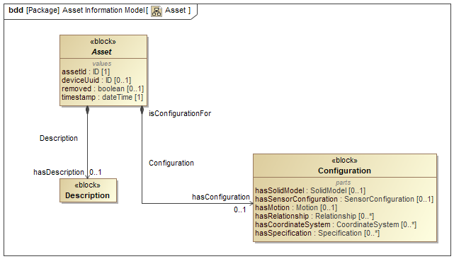
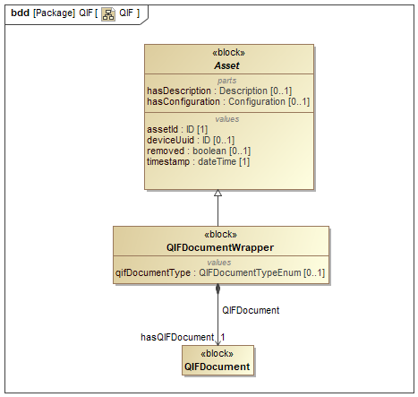

# MTConnect Specification and Material Statement

{{term(AMT)}} owns the copyright in this MTConnect Specification or Material. {{term(AMT)}} grants to you a non-exclusive, non-transferable, revocable, non-sublicensable, fully-paid-up copyright license to reproduce, copy and redistribute this MTConnect Specification or Material, provided that you may only copy or redistribute the MTConnect Specification or Material in the form in which you received it, without modifications, and with all copyright notices and other notices and disclaimers contained in the MTConnect Specification or Material.

If you intend to adopt or implement an MTConnect Specification or Material in a product, whether hardware, software or firmware, which complies with an MTConnect Specification, you shall agree to the MTConnect Specification Implementer License Agreement ("Implementer License") or to the MTConnect Intellectual Property Policy and Agreement ("IP Policy"'). The Implementer License and IP Policy each sets forth the license terms and other terms of use for MTConnect Implementers to adopt or implement the MTConnect Specifications, including certain license rights covering necessary patent claims for that purpose. These materials can be found at {{url(www.MTConnect.org)}}, or or by contacting {{url(mailto:info@MTConnect.org)}}. 

MTConnect Institute and {{term(AMT)}} have no responsibility to identify patents, patent claims or patent applications which may relate to or be required to implement a Specification, or to determine the legal validity or scope of any such patent claims brought to their attention. Each MTConnect Implementer is responsible for securing its own licenses or rights to any patent or other intellectual property rights that may be necessary for such use, and neither {{term(AMT)}} nor MTConnect Institute have any obligation to secure any such rights.

This Material and all MTConnect Specifications and Materials are provided "as is" and MTConnect Institute and {{term(AMT)}}, and each of their respective members, officers, affiliates, sponsors and agents, make no representation or warranty of any kind relating to these materials or to any implementation of the MTConnect Specifications or Materials in any product, including, without limitation, any expressed or implied warranty of noninfringement, merchantability, or fitness for particular purpose, or of the accuracy, reliability, or completeness of information contained herein. In no event shall MTConnect Institute or {{term(AMT)}} be liable to any user or implementer of MTConnect Specifications or Materials for the cost of procuring substitute goods or services, lost profits, loss of use, loss of data or any incidental, consequential, indirect, special or punitive damages or other direct damages, whether under contract, tort, warranty or otherwise, arising in any way out of access, use or inability to use the MTConnect Specification or other MTConnect Materials, whether or not they had advance notice of the possibility of such damage.

# Purpose of This Document

This document, {{citetitle(MTCPart4)}} of the MTConnect Standard, details information that is common to all types of {{termplural(Asset)}}.  Part 4.0 of the MTConnect Standard provide semantic models for entities that are used in the manufacturing process, but are not considered to be a piece of equipment.  These entities are defined as {{termplural(Asset)}}.  These {{termplural(asset)}} may be removed from a piece of equipment without detriment to the function of the equipment and can be associated with other pieces of equipment during their lifecycle.  The data associated with these {{termplural(asset)}} may be retrieved from multiple sources that are each responsible for providing their knowledge of the {{term(asset)}}.

# Terminology and Conventions

Refer to Section 3 of {{citetitle(MTCPart1)}} for a dictionary of terms, reserved language, and document conventions used in the MTConnect Standard.

{{printglossary[title=General Terms, type=general]()}}
{{printglossary[title=Information Model Terms, type=informationmodel]()}}
{{printglossary[title=Protocol Terms, type=protocol]()}}
{{printglossary[title=HTTP Terms, type=http]()}}
{{printglossary[title=XML Terms, type=xml]()}}
{{printglossary[title=MTConnect Terms, type=conceptmodel]()}}

{{printacronyms()}}

{{printbibliography[title=MTConnect References,keyword=MTC]()}}

{{printbibliography[title=Other References,notkeyword=MTC]()}}

{{glsaddall()}}

# Assets Information Model

The MTConnect Standard supports a simple distributed storage mechanism that allows applications and equipment to share and exchange complex information models in a similar way to a distributed data store.  The {{term(Asset Information Model)}} associates each {{block(MTConnectAssets)}} entity with a unique identifier and allows for some predefined mechanisms to find, create, request, updated, and delete these electronic documents in a way that provides for consistency across multiple pieces of equipment.

The protocol provides a limited mechanism of accessing {{termplural(Asset)}} using the following properties: {{property(assetId)}}, {{term(asset)}} type (element name of {{term(asset)}} root), and the piece of equipment associated with the {{term(asset)}}.  These access strategies will provide the following services and answer the following questions: What {{termplural(asset)}} are from a particular piece of equipment?  What are the {{termplural(asset)}} of a particular type? What {{termplural(asset)}} is stored for a given {{property(assetId)}}?

Although these mechanisms are provided, an {{term(agent)}} should not be considered a data store or a system of reference.  The {{term(agent)}} is providing an ephemeral storage capability that will temporarily manage the data for applications wishing to communicate and manage data as need-ed by the various processes.  An application cannot rely on an {{term(agent)}} for long term persistence or durability since the {{term(agent)}} is only required to temporarily store the {{term(asset)}} data and may require an-other system to provide the source data upon initialization.  An {{term(agent)}} is always providing the best-known equipment centric view of the data given the limitations of that piece of equipment.

## MTConnectAssets

This section provides semantic information for the {{block(MTConnectAssets)}} entity.

### Header

provides information from an {{term(agent)}} defining version information, storage capacity, and parameters associated with the data management within the {{term(agent)}}.

#### Value Properties of Header

{{tbl(value-properties-of-header)}} lists the Value Properties of {{block(Header)}}.

|Value Property name|Value Property type|Multiplicity|
|-|-|:-:|
|{{property(assetBufferSize)}}|`uInt32`|1|
|{{property(assetCount)}}|`uInt32`|1|
|{{property(deviceModelChangeTime)}}|`dateTime`|1|
|{{property(version)}}|`version`|1|
|{{property(testIndicator)}}|`boolean`|0..1|
|{{property(sender)}}|`string`|1|
|{{property(instanceId)}}|`uInt64`|1|
|{{property(creationTime)}}|`dateTime`|1|
{: caption="Value Properties of Header"}

Descriptions for Value Properties of {{block(Header)}}:

* {{property(assetBufferSize)}} 

    maximum number of {{block(Asset)}} types that can be stored in the {{term(agent)}} that published the {{term(response document)}}.  
    
    > Note: The implementer is responsible for allocating the appropriate amount of storage capacity required to accommodate the {{property(assetBufferSize)}}.
    

* {{property(assetCount)}} 

    current number of {{block(Asset)}} that are currently stored in the {{term(agent)}} as of the {{property(creationTime)}} that the {{term(agent)}} published the {{term(response document)}}.
    
    {{property(assetCount)}} **MUST NOT** be larger than the value reported for {{property(assetBufferSize)}}.
    

* {{property(deviceModelChangeTime)}} 

    timestamp of the last update of the {{block(Device)}} information for any device.

* {{property(version)}} 

    {{term(major)}}, {{term(minor)}}, and {{term(revision)}} number of the MTConnect Standard that defines the {{term(semantic data model)}} that represents the content of the {{term(response document)}}. It also includes the revision number of the {{term(schema)}} associated with that specific {{term(semantic data model)}}.
    
    As an example, the value reported for {{property(version)}} for a {{term(response document)}} that was structured based on {{term(schema)}} revision 10 associated with Version 1.4.0 of the MTConnect Standard would be:  1.4.0.10

* {{property(testIndicator)}} 

    indicates whether the {{term(agent)}} that published the {{term(response document)}} is operating in a test mode.
    
    If {{property(testIndicator)}} is not specified, the value for {{property(testIndicator)}} **MUST** be interpreted to be `false`.

* {{property(sender)}} 

    identification defining where the {{term(agent)}} that published the {{term(response document)}} is installed or hosted.
    
    {{property(sender)}} **MUST** be either an IP Address or Hostname describing where the {{term(agent)}} is installed or the URL of the {{term(agent)}}; e.g., `http://<address>[:port]/`. 
    
    > Note:  The port number need not be specified if it is the default HTTP port 80.

* {{property(instanceId)}} 

    identifier for a specific instantiation of the {{term(buffer)}} associated with the {{term(agent)}} that published the {{term(response document)}}.  
         
    {{property(instanceId)}} **MUST** be changed to a different unique number each time the {{term(buffer)}} is cleared and a new set of data begins to be collected.

* {{property(creationTime)}} 

    timestamp that an {{term(agent)}} published the {{term(response document)}}. 

### MTConnectAssets

root entity of an {{term(MTConnectAssets Response Document)}} that contains the {{term(Asset Information Model)}} of {{block(Asset)}} types.

> Note: Additional properties of {{block(MTConnectAssets)}} **MAY** be defined for schema and namespace declaration. See {{citetitle(MTCPart1)}}.

#### Reference Properties of MTConnectAssets

{{tbl(reference-properties-of-mtconnectassets)}} lists the Reference Properties of {{block(MTConnectAssets)}}.

|Reference Property name|Multiplicity|
|:-|:-:|
|{{block(Header)}}|1|
|{{block(Asset)}} (organized by {{block(Assets)}})|0..*|
{: caption="Reference Properties of MTConnectAssets"}

Descriptions for Reference Properties of {{block(MTConnectAssets)}}:

* {{block(Header)}} 

    provides information from an {{term(agent)}} defining version information, storage capacity, and parameters associated with the data management within the {{term(agent)}}.

* {{block(Asset)}} 

    abstract {{term(Asset)}}. 
    
    It is used in the manufacturing process, but is not permanently associated with a single piece of equipment. It can be removed from the piece of equipment without compromising its function, and can be associated with other pieces of equipment during its lifecycle.

    {{block(Assets)}} groups one or more {{block(Asset)}} types. See {{sect(Assets)}} for more details.

## Assets

This section provides semantic information for the {{block(Asset)}} model.

{: width="0.8"}

> Note: See {{sect(Assets Schema Diagrams)}} for XML schema.

MTConnect Standard has two data item types to support change notification when an {{term(Asset)}} is added, updated or removed. {{block(AssetChanged)}} states the {{property(assetId)}} of the {{term(Asset)}} that has been added or updated. {{block(AssetRemoved)}} states the {{property(assetId)}} of the {{term(Asset)}} that has been removed. See {{citetitle(MTCPart3)}} for more details.

### Asset

abstract {{term(Asset)}}. 

It is used in the manufacturing process, but is not permanently associated with a single piece of equipment. It can be removed from the piece of equipment without compromising its function, and can be associated with other pieces of equipment during its lifecycle.

#### Value Properties of Asset

{{tbl(value-properties-of-asset)}} lists the Value Properties of {{block(Asset)}}.

|Value Property name|Value Property type|Multiplicity|
|-|-|:-:|
|{{property(assetId)}}|`ID`|1|
|{{property(deviceUuid)}}|`ID`|0..1|
|{{property(removed)}}|`boolean`|0..1|
|{{property(timestamp)}}|`dateTime`|1|
{: caption="Value Properties of Asset"}

Descriptions for Value Properties of {{block(Asset)}}:

* {{property(assetId)}} 

    unique identifier for an {{block(Asset)}}.

* {{property(deviceUuid)}} 

    associated piece of equipment's {{term(UUID)}} that supplied the {{block(Asset)}}'s data.
    
    It references to the {{property(uuid)}} property of the {{block(Device)}} defined in {{citetitle(MTCPart2)}}.

* {{property(removed)}} 

    indicator that the {{block(Asset)}} has been removed from the piece of equipment.

* {{property(timestamp)}} 

    time the {{block(Asset)}} data was last modified.

#### Reference Properties of Asset

{{tbl(reference-properties-of-asset)}} lists the Reference Properties of {{block(Asset)}}.

|Reference Property name|Multiplicity|
|:-|:-:|
|{{block(Description)}}|0..1|
{: caption="Reference Properties of Asset"}

Descriptions for Reference Properties of {{block(Asset)}}:

* {{block(Description)}} 

    descriptive content.

    This can contain configuration information and manufacturer specific details.

#### Part Properties of Asset

{{tbl(part-properties-of-asset)}} lists the Part Properties of {{block(Asset)}}.

|Part Property name|Multiplicity|
|:-|:-:|
|{{block(Configuration)}}|0..1|
{: caption="Part Properties of Asset"}

Descriptions for Part Properties of {{block(Asset)}}:

* {{block(Configuration)}} 

    technical information about an entity describing its physical layout, functional characteristics, and relationships with other entities.

    See *Section 7 - Configurations Model* of {{citetitle(MTCPart2)}}.

# Cutting Tool Asset Information Model

There are two {{termplural(information model)}} used to represent a cutting tool, {{block(CuttingToolArchetype)}} and {{block(CuttingTool)}}. The {{block(CuttingToolArchetype)}} represents the static cutting tool geometries and nominal values as one would expect from a tool catalog and the {{block(CuttingTool)}} represents the use or application of the tool on the shop floor with actual measured values and process data. In Version 1.3.0 of the MTConnect Standard it was decided to separate out these two concerns since not all pieces of equipment will have access to both sets of information. In this way, a generic definition of the cutting tool can coexist with a specific assembly {{term(information model)}} with minimal redundancy of data.

MTConnect Standard will adopt the ISO 13399 structure when formulating the vocabulary for Cutting Tool geometries and structure to be represented in the {{block(CuttingToolArchetype)}}. The nominal values provided in the {{block(CuttingToolLifeCycle)}} section are only concerned with two aspects of the Cutting Tool; the Cutting Tool and the cutting item. The tool item, Adaptive Item, and Assembly Item will only be covered in the {{block(CuttingToolDefinition)}} section of this document since this section contains the full ISO 13399 information about a Cutting Tool.

{: width="0.8"}

The {{fig(Cutting Tool Parts)}} illustrates the parts of a Cutting Tool. The Cutting Tool is the aggregate of all the components and the cutting item is the part of the tool that removes the material from the workpiece. These are the primary focus of the MTConnect Standard.

{: width="0.8"}

{{fig(Cutting Tool Composition)}} provides another view of the composition of a Cutting Tool. The Adaptive Items and tool items will be used for measurements, but will not be modeled as separate entities. When we are referencing the Cutting Tool we are referring to the entirety of the assembly and when we provide data regarding the cutting item we are referencing each individual item as illustrated on the left of the previous diagram.

{: width="0.8"}

{: width="0.8"}

{{fig(Cutting Tool, Tool Item, and Cutting Item)}} and {{fig(Cutting Tool, Tool Item, and Cutting Item 2)}} further illustrates the components of the Cutting Tool. As we compose the tool item, cutting item, Adaptive Item, we get a Cutting Tool. The tool item, Adaptive Item, and Assembly Item will only be in the {{block(CuttingToolDefinition)}} section that will contain the full ISO 13399 information. These figures also use the ISO 13399 codes for each of the measurements. These codes will be translated into the MTConnect Standard vocabulary as illustrated below. The measurements will have a maximum, minimum, and nominal value representing the tolerance of allowable values for this dimension.

The MTConnect Standard will not define the entire geometry of the Cutting Tool, but will provide the information necessary to use the tool in the manufacturing process. Additional information can be added to the definition of the Cutting Tool by means of schema extensions.

Additional diagrams will reference these dimensions by their codes that will be defined in the measurement tables. The codes are consistent with the codes used in ISO 13399 and have been standardized. MTConnect Standard will use the full text name for clarity in the {{termplural(response document)}}.

## Cutting Tool

This section provides semantic information for the {{block(CuttingTool)}} and {{block(CuttingToolArchetype)}} models.

{: width="0.8"}

> Note: See {{sect(CuttingTool Schema Diagrams)}} for XML schema.

### CuttingTool

{{block(Asset)}} that physically removes the material from the workpiece by shear deformation.

#### Value Properties of CuttingTool

{{tbl(value-properties-of-cuttingtool)}} lists the Value Properties of {{block(CuttingTool)}}.

|Value Property name|Value Property type|Multiplicity|
|-|-|:-:|
|{{property(manufacturers)}}|`string`|0..*|
|{{property(serialNumber)}}|`string`|1|
|{{property(toolId)}}|`string`|1|
{: caption="Value Properties of CuttingTool"}

Descriptions for Value Properties of {{block(CuttingTool)}}:

* {{property(manufacturers)}} 

    manufacturers of the cutting tool.
    
    This will reference the tool item and adaptive items specifically. The cutting items
    manufacturers’ will be a property of {{block(CuttingItem)}}.
    
    > Note: In {{term(XML)}}, the representation **MUST** be a comma(,) delimited list of manufacturer names. See {{fig(CuttingTool Schema)}}.

* {{property(serialNumber)}} 

    unique identifier for this assembly.

* {{property(toolId)}} 

    identifier for a class of cutting tools.

#### Reference Properties of CuttingTool

{{tbl(reference-properties-of-cuttingtool)}} lists the Reference Properties of {{block(CuttingTool)}}.

|Reference Property name|Multiplicity|
|:-|:-:|
|{{block(CuttingToolLifeCycle)}}|0..1|
|{{block(CuttingToolArchetypeReference)}}|0..1|
|`<<deprecated>>`{{block(CuttingToolDefinition)}}|0..1|
{: caption="Reference Properties of CuttingTool"}

Descriptions for Reference Properties of {{block(CuttingTool)}}:

* {{block(CuttingToolLifeCycle)}} 

    data regarding the application or use of the tool.
    
    This data is provided by various pieces of equipment (i.e. machine tool, presetter) and statistical process control applications. Life cycle data will not remain static, but will change periodically when a tool is used or measured.

    See {{sect(CuttingToolLifeCycle)}}.

* {{block(CuttingToolArchetypeReference)}} 

    reference information about the {{property(assetId)}} and/or the URL of the data source of {{block(CuttingToolArchetype)}}.

* `<<deprecated>>`{{block(CuttingToolDefinition)}} 

    detailed structure of the cutting tool which is static during its lifecycle. {{cite(ISO 13399)}}.

    **DEPRECATED** in *Version 1.3.0* for {{block(CuttingTool)}}.

### CuttingToolArchetype

{{block(Asset)}} that describes the static cutting tool geometries and nominal values as one would expect from a tool catalog.

#### Value Properties of CuttingToolArchetype

{{tbl(value-properties-of-cuttingtoolarchetype)}} lists the Value Properties of {{block(CuttingToolArchetype)}}.

|Value Property name|Value Property type|Multiplicity|
|-|-|:-:|
|{{property(manufacturers)}}|`string`|0..*|
|{{property(serialNumber)}}|`string`|1|
|{{property(toolId)}}|`string`|1|
{: caption="Value Properties of CuttingToolArchetype"}

Descriptions for Value Properties of {{block(CuttingToolArchetype)}}:

* {{property(manufacturers)}} 

    manufacturers of the cutting tool.
    
    This will reference the tool item and adaptive items specifically. The cutting items
    manufacturers’ will be a property of {{block(CuttingItem)}}.
    
    > Note: In {{term(XML)}}, the representation will be a comma(,) delimited list of manufacturer names. See {{fig(CuttingTool Schema)}}.

* {{property(serialNumber)}} 

    unique identifier for this assembly.

* {{property(toolId)}} 

    identifier for a class of cutting tools.

#### Reference Properties of CuttingToolArchetype

{{tbl(reference-properties-of-cuttingtoolarchetype)}} lists the Reference Properties of {{block(CuttingToolArchetype)}}.

|Reference Property name|Multiplicity|
|:-|:-:|
|{{block(CuttingToolDefinition)}}|0..1|
|{{block(CuttingToolLifeCycle)}}|0..1|
{: caption="Reference Properties of CuttingToolArchetype"}

Descriptions for Reference Properties of {{block(CuttingToolArchetype)}}:

* {{block(CuttingToolDefinition)}} 

    detailed structure of the cutting tool which is static during its lifecycle. {{cite(ISO 13399)}}.

    See {{sect(CuttingToolDefinition)}}.

* {{block(CuttingToolLifeCycle)}} 

    data regarding the application or use of the tool.
    
    This data is provided by various pieces of equipment (i.e. machine tool, presetter) and statistical process control applications. Life cycle data will not remain static, but will change periodically when a tool is used or measured.

    See {{sect(CuttingToolLifeCycle)}}.

### CuttingToolArchetypeReference

reference information about the {{property(assetId)}} and/or the URL of the data source of {{block(CuttingToolArchetype)}}.

The value of {{property(CuttingToolArchetypeReference)}} **MUST** be `IDREF`. See {{sect(IDREF)}}.

#### Value Properties of CuttingToolArchetypeReference

{{tbl(value-properties-of-cuttingtoolarchetypereference)}} lists the Value Properties of {{block(CuttingToolArchetypeReference)}}.

|Value Property name|Value Property type|Multiplicity|
|-|-|:-:|
|{{property(source)}}|`string`|0..1|
{: caption="Value Properties of CuttingToolArchetypeReference"}

Descriptions for Value Properties of {{block(CuttingToolArchetypeReference)}}:

* {{property(source)}} 

    {{term(URL)}} of the {{block(CuttingToolArchetype)}} {{term(information model)}}.

### CuttingToolDefinition

detailed structure of the cutting tool which is static during its lifecycle. {{cite(ISO 13399)}}.

The value of {{property(CuttingToolDefinition)}} **MUST** be a list of `string` of size `0..*`.

#### Value Properties of CuttingToolDefinition

{{tbl(value-properties-of-cuttingtooldefinition)}} lists the Value Properties of {{block(CuttingToolDefinition)}}.

|Value Property name|Value Property type|Multiplicity|
|-|-|:-:|
|{{property(format)}}|`FormatTypeEnum`|0..1|
{: caption="Value Properties of CuttingToolDefinition"}

Descriptions for Value Properties of {{block(CuttingToolDefinition)}}:

* {{property(format)}} 

    identifies the expected representation of the enclosed data.

    The value of {{property(format)}} **MUST** be one of the `FormatTypeEnum` enumeration. 

    `FormatTypeEnum` Enumeration:

    * `EXPRESS` 

        document will confirm to the ISO 10303 Part 21 standard.

    * `TEXT` 

        document will be a text representation of the tool data.

    * `UNDEFINED` 

        document will be provided in an undefined format.

    * `XML` 

        default value for the definition. The content will be an {{term(XML)}} document.

## Cutting Tool Life Cycle

This section provides semantic information for the {{block(CuttingToolLifeCycle)}} model.

{: width="0.8"}

> Note: See {{sect(CuttingToolLifeCycle Schema Diagrams)}} for XML schema.

### CuttingToolLifeCycle

data regarding the application or use of the tool.

This data is provided by various pieces of equipment (i.e. machine tool, presetter) and statistical process control applications. Life cycle data will not remain static, but will change periodically when a tool is used or measured.

#### Value Properties of CuttingToolLifeCycle

{{tbl(value-properties-of-cuttingtoollifecycle)}} lists the Value Properties of {{block(CuttingToolLifeCycle)}}.

|Value Property name|Value Property type|Multiplicity|
|-|-|:-:|
|{{property(ConnectionCodeMachineSide)}}|`string`|0..1|
|{{property(ProgramToolGroup)}}|`string`|0..1|
|{{property(ProgramToolNumber)}}|`string`|0..1|
{: caption="Value Properties of CuttingToolLifeCycle"}

Descriptions for Value Properties of {{block(CuttingToolLifeCycle)}}:

* {{property(ConnectionCodeMachineSide)}} 

    identifier for the capability to connect any component of the cutting tool together, except Assembly Items, on the machine side. Code: `CCMS`

* {{property(ProgramToolGroup)}} 

    tool group this tool is assigned in the part program.

* {{property(ProgramToolNumber)}} 

    number of the tool as referenced in the part program.

#### Reference Properties of CuttingToolLifeCycle

{{tbl(reference-properties-of-cuttingtoollifecycle)}} lists the Reference Properties of {{block(CuttingToolLifeCycle)}}.

|Reference Property name|Multiplicity|
|:-|:-:|
|{{block(ProcessFeedRate)}}|0..1|
|{{block(ToolLife)}}|0..3|
|{{block(ProcessSpindleSpeed)}}|0..1|
|{{block(Status)}} (organized by {{block(CutterStatus)}})|1..*|
|{{block(Measurement)}} (organized by {{block(Measurements)}})|0..*|
|{{block(ReconditionCount)}}|0..1|
|{{block(Location)}}|0..1|
{: caption="Reference Properties of CuttingToolLifeCycle"}

Descriptions for Reference Properties of {{block(CuttingToolLifeCycle)}}:

* {{block(ProcessFeedRate)}} 

    constrained process feed rate for the tool in mm/s.
    
    The {{property(value)}} **MAY** contain the nominal process target feed rate if available. If {{block(ProcessFeedRate)}} is provided, at least one value of {{property(maximum)}}, {{property(nominal)}}, or {{property(minimum)}} **MUST** be specified.

    See {{sect(ProcessFeedRate)}}.

* {{block(ToolLife)}} 

    cutting tool life as related to the assembly.

    See {{sect(ToolLife)}}.

* {{block(ProcessSpindleSpeed)}} 

    constrained process spindle speed for the tool in revolutions/minute.
    
    The {{property(value)}} **MAY** contain the nominal process target spindle speed if available. If {{block(ProcessSpindleSpeed)}} is provided, at least one value of {{property(maximum)}}, {{property(nominal)}}, or {{property(minimum)}} **MUST** be specified.

    See {{sect(ProcessSpindleSpeed)}}.

* {{block(Status)}} 

    status of the cutting tool.

    {{block(CutterStatus)}} provides the status of the assembly and {{term(organize)}} one or more {{block(Status)}} entities. See {{sect(Status)}}.
    
    The following combinations of {{block(Status)}} entities **MUST NOT** occur for a {{block(CutterStatus)}}:
    
    * `NEW` **MUST NOT** be used with `USED`, `RECONDITIONED`, or `EXPIRED`.
    
    * `UNKNOWN` **MUST NOT** be used with any other status.
    
    * `ALLOCATED` and `UNALLOCATED` **MUST NOT** be used together.
    
    * `AVAILABLE` and `UNAVAILABLE` **MUST NOT** be used together.
    
    * If the tool is `EXPIRED`, `BROKEN`, or `NOT_REGISTERED` it **MUST NOT** be `AVAILABLE`.

* {{block(Measurement)}} 

    constrained scalar value associated with a cutting tool.

    {{block(Measurements)}} groups one or more {{block(Measurement)}} subtypes. See {{sect(Measurement)}}.

* {{block(ReconditionCount)}} 

    number of times the cutter has been reconditioned.

    See {{sect(ReconditionCount)}}.

* {{block(Location)}} 

    location of the pot or spindle the cutting tool currently resides in.
    
    If {{property(negativeOverlap)}} or {{property(positiveOverlap)}} is provided, the tool reserves additional locations on either side, otherwise if they are not given, no additional locations are required for this tool.
    
    If the pot occupies the first or last location, a rollover to the beginning or the end of the indexable values may occur. For example, if there are 64 pots and the tool is in pot 64 with a {{property(positiveOverlap)}} of 1, the first pot **MAY** be occupied as well.

    See {{sect(Location)}} for more detail.

### ToolLife

cutting tool life as related to the assembly.

{{block(ToolLife)}} **MUST** be defined only for the {{block(CuttingToolLifeCycle)}} of {{block(CuttingTool)}} and **MUST NOT** be defined for the {{block(CuttingToolLifeCycle)}} of {{block(CuttingToolArchetype)}}.

The value of {{property(ToolLife)}} **MUST** be `float`.

#### Value Properties of ToolLife

{{tbl(value-properties-of-toollife)}} lists the Value Properties of {{block(ToolLife)}}.

|Value Property name|Value Property type|Multiplicity|
|-|-|:-:|
|{{property(countDirection)}}|`CountDirectionTypeEnum`|1|
|{{property(initial)}}|`float`|0..1|
|{{property(limit)}}|`float`|0..1|
|{{property(type)}}|`ToolLifeEnum`|1|
|{{property(warning)}}|`float`|0..1|
{: caption="Value Properties of ToolLife"}

Descriptions for Value Properties of {{block(ToolLife)}}:

* {{property(countDirection)}} 

    indicates if the tool life counts from zero to maximum or maximum to zero.

    The value of {{property(countDirection)}} **MUST** be one of the `CountDirectionTypeEnum` enumeration. 

    `CountDirectionTypeEnum` Enumeration:

    * `UP` 

        tool life counts up from zero to the maximum.

    * `DOWN` 

        tool life counts down from the maximum to zero.

* {{property(initial)}} 

    initial life of the tool when it is new.

* {{property(limit)}} 

    end of life limit for the tool.

* {{property(type)}} 

    type of tool life being accumulated.

    The value of {{property(type)}} **MUST** be one of the `ToolLifeEnum` enumeration. 

    `ToolLifeEnum` Enumeration:

    * `MINUTES` 

        tool life measured in minutes. 
        
        All units for minimum, maximum, and nominal **MUST** be provided in minutes.

    * `PART_COUNT` 

        tool life measured in parts. 
        
        All units for minimum, maximum, and nominal **MUST** be provided as the number of parts.

    * `WEAR` 

        tool life measured in tool wear. 
        
        Wear **MUST** be provided in millimeters as an offset to nominal. All units for minimum, maximum, and nominal **MUST** be given as millimeter offsets as
        well. The standard will only consider dimensional wear at this time.

* {{property(warning)}} 

    point at which a tool life warning will be raised.

### Location

location of the pot or spindle the cutting tool currently resides in.

If {{property(negativeOverlap)}} or {{property(positiveOverlap)}} is provided, the tool reserves additional locations on either side, otherwise if they are not given, no additional locations are required for this tool.

If the pot occupies the first or last location, a rollover to the beginning or the end of the indexable values may occur. For example, if there are 64 pots and the tool is in pot 64 with a {{property(positiveOverlap)}} of 1, the first pot **MAY** be occupied as well.

{{block(Location)}} **MUST** be defined only for the {{block(CuttingToolLifeCycle)}} of {{block(CuttingTool)}} and **MUST NOT** be defined for the {{block(CuttingToolLifeCycle)}} of {{block(CuttingToolArchetype)}}.

The value of {{property(Location)}} **MUST** be `string`.

#### Value Properties of Location

{{tbl(value-properties-of-location)}} lists the Value Properties of {{block(Location)}}.

|Value Property name|Value Property type|Multiplicity|
|-|-|:-:|
|{{property(negativeOverlap)}}|`integer`|0..1|
|{{property(positiveOverlap)}}|`integer`|0..1|
|{{property(type)}}|`LocationTypeEnum`|1|
|{{property(turret)}}|`string`|0..1|
|{{property(toolMagazine)}}|`string`|0..1|
|{{property(toolBar)}}|`string`|0..1|
|{{property(toolRack)}}|`string`|0..1|
|{{property(automaticToolChanger)}}|`string`|0..1|
{: caption="Value Properties of Location"}

Descriptions for Value Properties of {{block(Location)}}:

* {{property(negativeOverlap)}} 

    number of locations at lower index values from this location.

* {{property(positiveOverlap)}} 

    number of locations at higher index value from this location.

* {{property(type)}} 

    type of location being identified. 
    
    When a `POT` or `STATION` type is used, {{property(value)}} of {{block(Location)}} **MUST** be a numeric value.

    The value of {{property(type)}} **MUST** be one of the `LocationTypeEnum` enumeration. 

    `LocationTypeEnum` Enumeration:

    * `POT` 

        number of the pot in the tool handling system.

    * `STATION` 

        tool location in a horizontal turning machine.

    * `CRIB` 

        location with regard to a tool crib.

    * `SPINDLE` 

        location associated with a {{term(spindle)}}.

    * `TRANSFER_POT` 

        location for a tool awaiting transfer from a tool magazine to spindle or a turret.

    * `RETURN_POT` 

        location for a tool removed from a {{term(spindle)}} or turret and awaiting return to a tool magazine.

    * `STAGING_POT` 

        location for a tool awaiting transfer to a tool magazine or turret from outside of the piece of equipment.

    * `REMOVAL_POT` 

        location for a tool removed from a tool magazine or turret awaiting transfer to a location outside of the piece of equipment.

    * `EXPIRED_POT` 

        location for a tool that is no longer usable and is awaiting removal from a tool magazine or turret.

    * `END_EFFECTOR` 

        location associated with an end effector.

* {{property(turret)}} 

    turret associated with a tool.

* {{property(toolMagazine)}} 

    tool magazine associated with a tool.

* {{property(toolBar)}} 

    tool bar associated with a tool.

* {{property(toolRack)}} 

    tool rack associated with a tool.

* {{property(automaticToolChanger)}} 

    automatic tool changer associated with a tool.

### ReconditionCount

number of times the cutter has been reconditioned.

{{block(ReconditionCount)}} **MUST** be defined only for the {{block(CuttingToolLifeCycle)}} of {{block(CuttingTool)}} and **MUST NOT** be defined for the {{block(CuttingToolLifeCycle)}} of {{block(CuttingToolArchetype)}}.

The value of {{property(ReconditionCount)}} **MUST** be `integer`.

#### Value Properties of ReconditionCount

{{tbl(value-properties-of-reconditioncount)}} lists the Value Properties of {{block(ReconditionCount)}}.

|Value Property name|Value Property type|Multiplicity|
|-|-|:-:|
|{{property(maximumCount)}}|`integer`|0..1|
{: caption="Value Properties of ReconditionCount"}

Descriptions for Value Properties of {{block(ReconditionCount)}}:

* {{property(maximumCount)}} 

    maximum number of times the tool may be reconditioned.

### ProcessSpindleSpeed

constrained process spindle speed for the tool in revolutions/minute.

The {{property(value)}} **MAY** contain the nominal process target spindle speed if available. If {{block(ProcessSpindleSpeed)}} is provided, at least one value of {{property(maximum)}}, {{property(nominal)}}, or {{property(minimum)}} **MUST** be specified.

The value of {{property(ProcessSpindleSpeed)}} **MUST** be `float`.

#### Value Properties of ProcessSpindleSpeed

{{tbl(value-properties-of-processspindlespeed)}} lists the Value Properties of {{block(ProcessSpindleSpeed)}}.

|Value Property name|Value Property type|Multiplicity|
|-|-|:-:|
|{{property(maximum)}}|`float`|0..1|
|{{property(minimum)}}|`float`|0..1|
|{{property(nominal)}}|`float`|0..1|
{: caption="Value Properties of ProcessSpindleSpeed"}

Descriptions for Value Properties of {{block(ProcessSpindleSpeed)}}:

* {{property(maximum)}} 

    upper bound for the tool’s target spindle speed.

* {{property(minimum)}} 

    lower bound for the tools spindle speed.

* {{property(nominal)}} 

    nominal speed the tool is designed to operate at.

### ProcessFeedRate

constrained process feed rate for the tool in mm/s.

The {{property(value)}} **MAY** contain the nominal process target feed rate if available. If {{block(ProcessFeedRate)}} is provided, at least one value of {{property(maximum)}}, {{property(nominal)}}, or {{property(minimum)}} **MUST** be specified.

The value of {{property(ProcessFeedRate)}} **MUST** be `string`.

#### Value Properties of ProcessFeedRate

{{tbl(value-properties-of-processfeedrate)}} lists the Value Properties of {{block(ProcessFeedRate)}}.

|Value Property name|Value Property type|Multiplicity|
|-|-|:-:|
|{{property(maximum)}}|`float`|0..1|
|{{property(minimum)}}|`float`|0..1|
|{{property(nominal)}}|`float`|0..1|
{: caption="Value Properties of ProcessFeedRate"}

Descriptions for Value Properties of {{block(ProcessFeedRate)}}:

* {{property(maximum)}} 

    upper bound for the tool’s process target feedrate.

* {{property(minimum)}} 

    lower bound for the tool's feedrate.

* {{property(nominal)}} 

    nominal feedrate the tool is designed to operate at.

### Status

status of the cutting tool.

The value of {{property(Status)}} **MUST** be one of the `CutterStatusTypeEnum` enumeration. 

`CutterStatusTypeEnum` Enumeration:

* `NEW` 

    new tool that has not been used or first use. 
    
    Marks the start of the tool history.

* `AVAILABLE` 

    tool is available for use. 
    
    If this is not present, the tool is currently not ready to be used.

* `UNAVAILABLE` 

    tool is unavailable for use in metal removal. 

* `ALLOCATED` 

    tool is has been committed to a piece of equipment for use and is not available for use in any other piece of equipment.

* `UNALLOCATED` 

    tool has not been committed to a process and can be allocated.

* `MEASURED` 

    tool has been measured.

* `RECONDITIONED` 

    tool has been reconditioned.

* `USED` 

    tool is in process and has remaining tool life.

* `EXPIRED` 

    tool has reached the end of its useful life.

* `BROKEN` 

    premature tool failure.

* `NOT_REGISTERED` 

    tool cannot be used until it is entered into the system.

* `UNKNOWN` 

    tool is an indeterminate state. This is the default value.

### Measurement

constrained scalar value associated with a cutting tool.

A {{block(Measurement)}} is specific to the tool management policy at a particular shop. The tool zero reference point or gauge line will be different depending on the particular implementation and will be assumed to be consistent within the shop. MTConnect Standard does not standardize the manufacturing process or the definition of the zero point.

The value of {{property(Measurement)}} **MUST** be `float`.

#### Value Properties of Measurement

{{tbl(value-properties-of-measurement)}} lists the Value Properties of {{block(Measurement)}}.

|Value Property name|Value Property type|Multiplicity|
|-|-|:-:|
|{{property(code)}}|`CodeEnum`|0..1|
|{{property(maximum)}}|`float`|0..1|
|{{property(minimum)}}|`float`|0..1|
|{{property(nativeUnits)}}|`NativeUnitEnum`|0..1|
|{{property(nominal)}}|`float`|0..1|
|{{property(significantDigits)}}|`integer`|0..1|
|{{property(units)}}|`UnitEnum`|0..1|
{: caption="Value Properties of Measurement"}

Descriptions for Value Properties of {{block(Measurement)}}:

* {{property(code)}} 

    shop specific code for the measurement. 
    
    ISO 13399 codes **MAY** be used for these codes as well. 
    
    See {{sect(Cutting Tool Measurement Subtypes)}} and {{sect(Cutting Item Measurement Subtypes)}} for details on {{block(Measurement)}} types and their respective {{property(code)}} values.

    The {{property(code)}} of {{property(code)}} **MUST** be ``.

* {{property(maximum)}} 

    maximum value for the measurement. 

* {{property(minimum)}} 

    minimum value for the measurement. 

* {{property(nativeUnits)}} 

    units the measurement was originally recorded in. See {{citetitle(MTCPart2)}} for the complete list of {{property(nativeUnits)}}.

    The value of {{property(nativeUnits)}} **MUST** be one of the `NativeUnitEnum` enumeration. 

* {{property(nominal)}} 

    as advertised value for the measurement.

* {{property(significantDigits)}} 

    number of significant digits in the reported value. 

* {{property(units)}} 

    units for the measurements. See {{citetitle(MTCPart2)}} for the complete list of {{property(units)}}.

    The value of {{property(units)}} **MUST** be one of the `UnitEnum` enumeration. 

## Cutting Item

A {{block(CuttingItem)}} is the portion of the tool that physically removes the material from the workpiece by shear deformation. The cutting item can be either a single piece of material attached to the {{block(CuttingTool)}} or it can be one or more separate pieces of material attached to the {{block(CuttingTool)}} using a permanent or removable attachment.  A {{block(CuttingItem)}} can be comprised of one or more cutting edges. Cutting items include: replaceable inserts, brazed tips and the cutting portions of solid {{block(CuttingTools)}}.

MTConnect Standard considers {{block(CuttingItems)}} as part of the {{block(CuttingTool)}}.  A {{block(CuttingItems)}} **MUST NOT** exist in MTConnect unless it is attached to a {{block(CuttingTool)}}.  Some of the measurements, such as {{block(FunctionalLength)}}, **MUST** be made with reference to the entire {{block(CuttingTool)}} to be meaningful.

{: width="0.8"}

> Note: See {{sect(CuttingItem Schema Diagrams)}} for XML schema.

### CuttingItem

part of of the tool that physically removes the material from the workpiece by shear deformation.

#### Value Properties of CuttingItem

{{tbl(value-properties-of-cuttingitem)}} lists the Value Properties of {{block(CuttingItem)}}.

|Value Property name|Value Property type|Multiplicity|
|-|-|:-:|
|{{property(Description)}}|`string`|0..1|
|{{property(grade)}}|`string`|0..1|
|{{property(indices)}}|`string`|1..*|
|{{property(itemId)}}|`ID`|0..1|
|{{property(Locus)}}|`string`|0..1|
|{{property(manufacturers)}}|`string`|0..*|
|{{property(ProgramToolGroup)}}|`string`|0..1|
{: caption="Value Properties of CuttingItem"}

Descriptions for Value Properties of {{block(CuttingItem)}}:

* {{property(Description)}} 

    free-form description of the cutting item.

* {{property(grade)}} 

    material composition for this cutting item.

* {{property(indices)}} 

    number or numbers representing the individual cutting item or items on the tool.
    
    Indices **SHOULD** start numbering with the inserts or {{block(CuttingItem)}} furthest from the gauge line and increasing in value as the items get closer to the gauge line. Items at the same distance **MAY** be arbitrarily numbered.
    
    > Note: In {{term(XML)}}, the representation **MUST** be a single number ("1") or a comma separated set of individual elements ("1,2,3,4"), or as a inclusive range of values as in ("1-10") or any combination of ranges and numbers as in "1-4,6-10,22". There **MUST NOT** be spaces or non-integer values in the text representation.

* {{property(itemId)}} 

    manufacturer identifier of this cutting item.

* {{property(Locus)}} 

    free form description of the location on the cutting tool.
    
    For clarity, the words `FLUTE`, `INSERT`, and `CARTRIDGE` **SHOULD** be used to assist in noting the location of a {{block(CuttingItem)}}. {{property(Locus)}} **MAY** be any free form string, but **SHOULD** adhere to the following rules:
    
    * The location numbering **SHOULD** start at the furthest {{block(CuttingItem)}} and work it’s way back to the {{block(CuttingItem)}} closest to the gauge line.
    
    * Flutes **SHOULD** be identified as such using the word `FLUTE`:. For example: `FLUTE`: 1, `INSERT`: 2 - would indicate the first flute and the second furthest insert from the end of the tool on that flute.
    
    * Other designations such as `CARTRIDGE` **MAY** be included, but should be identified using upper case and followed by a colon (:).

* {{property(manufacturers)}} 

    manufacturers of the cutting item.
    
    This will reference the tool item and adaptive items specifically. The cutting items
    manufacturers’ will be a property of {{block(CuttingItem)}}.
    
    > Note: In {{term(XML)}}, the representation **MUST** be a comma(,) delimited list of manufacturer names. See {{fig(CuttingItem Schema)}}.

* {{property(ProgramToolGroup)}} 

    tool group this item is assigned in the part program.

#### Reference Properties of CuttingItem

{{tbl(reference-properties-of-cuttingitem)}} lists the Reference Properties of {{block(CuttingItem)}}.

|Reference Property name|Multiplicity|
|:-|:-:|
|{{block(Status)}} (organized by {{block(CutterStatus)}})|1..*|
|{{block(ItemLife)}}|0..3|
|{{block(Measurement)}} (organized by {{block(Measurements)}})|0..*|
{: caption="Reference Properties of CuttingItem"}

Descriptions for Reference Properties of {{block(CuttingItem)}}:

* {{block(Status)}} 

    status of the cutting tool.

    {{block(CutterStatus)}} provides the status of the assembly and {{term(organize)}} one or more {{block(Status)}} entities. See {{sect(Status)}}.
    
    The following combinations of {{block(Status)}} entities **MUST NOT** occur for a {{block(CutterStatus)}}:
    
    * `NEW` **MUST NOT** be used with `USED`, `RECONDITIONED`, or `EXPIRED`.
    
    * `UNKNOWN` **MUST NOT** be used with any other status.
    
    * `ALLOCATED` and `UNALLOCATED` **MUST NOT** be used together.
    
    * `AVAILABLE` and `UNAVAILABLE` **MUST NOT** be used together.
    
    * If the tool is `EXPIRED`, `BROKEN`, or `NOT_REGISTERED` it **MUST NOT** be `AVAILABLE`.
    
    {{block(CutterStatus)}} **MUST** be defined only for the {{block(CuttingToolLifeCycle)}} of {{block(CuttingTool)}} and **MUST NOT** be defined for the {{block(CuttingToolLifeCycle)}} of {{block(CuttingToolArchetype)}}.

* {{block(ItemLife)}} 

    life of a {{block(CuttingItem)}}.

    See {{sect(ItemLife)}}.

* {{block(Measurement)}} 

    constrained scalar value associated with a cutting tool.

    {{block(Measurements)}} groups one or more {{block(Measurement)}} subtypes. See {{sect(Measurement)}}.

### CuttingItems

{{block(CuttingItems)}} groups one or more {{block(CuttingItem)}} entities. See {{sect(CuttingItem)}} and {{sect(CuttingItems)}} for more detail.

#### Value Properties of CuttingItems

{{tbl(value-properties-of-cuttingitems)}} lists the Value Properties of {{block(CuttingItems)}}.

|Value Property name|Value Property type|Multiplicity|
|-|-|:-:|
|{{property(count)}}|`integer`|1|
{: caption="Value Properties of CuttingItems"}

Descriptions for Value Properties of {{block(CuttingItems)}}:

* {{property(count)}} 

    number of {{block(CuttingItem)}} organized by {{block(CuttingItems)}}.

### ItemLife

life of a {{block(CuttingItem)}}.

The value of {{property(ItemLife)}} **MUST** be `float`.

#### Value Properties of ItemLife

{{tbl(value-properties-of-itemlife)}} lists the Value Properties of {{block(ItemLife)}}.

|Value Property name|Value Property type|Multiplicity|
|-|-|:-:|
|{{property(countDirection)}}|`CountDirectionTypeEnum`|1|
|{{property(initial)}}|`float`|0..1|
|{{property(limit)}}|`float`|0..1|
|{{property(type)}}|`ToolLifeEnum`|1|
|{{property(warning)}}|`float`|0..1|
{: caption="Value Properties of ItemLife"}

Descriptions for Value Properties of {{block(ItemLife)}}:

* {{property(countDirection)}} 

    indicates if the item life counts from zero to maximum or maximum to zero.

    The value of {{property(countDirection)}} **MUST** be one of the `CountDirectionTypeEnum` enumeration. 

* {{property(initial)}} 

    initial life of the item when it is new.

* {{property(limit)}} 

    end of life limit for this item.

* {{property(type)}} 

    type of item life being accumulated.

    The value of {{property(type)}} **MUST** be one of the `ToolLifeEnum` enumeration. 

* {{property(warning)}} 

    point at which a item life warning will be raised.

## Cutting Tool Measurement Subtypes

This section lists the {{block(Measurement)}} subtypes for {{block(CuttingTool)}}.

These {{block(Measurement)}} subtypes for {{block(CuttingTool)}} are specific to the entire assembly and **MUST NOT** be used for the {{block(Measurement)}} pertaining to a {{block(CuttingItem)}}. {{fig(Cutting Tool Measurement 1)}} and {{fig(Cutting Tool Measurement 2)}} will be used to reference the assembly specific {{block(Measurement)}} subtypes.

{: width="0.8"}

{: width="0.8"}

### BodyDiameterMax

largest diameter of the body of a tool item.

The {{property(code)}} of {{property(BodyDiameterMax)}} **MUST** be `BDX`.

The {{property(units)}} of {{property(BodyDiameterMax)}} **MUST** be `MILLIMETER`.

### BodyLengthMax

distance measured along the X axis from that point of the item closest to the workpiece, including the cutting item for a tool item but excluding a protruding locking mechanism for an adaptive item, to either the front of the flange on a flanged body or the beginning of the connection interface feature on the machine side for cylindrical or prismatic shanks.

The {{property(code)}} of {{property(BodyLengthMax)}} **MUST** be `LBX`.

The {{property(units)}} of {{property(BodyLengthMax)}} **MUST** be `MILLIMETER`.

### DepthOfCutMax

maximum engagement of the cutting edge or edges with the workpiece measured perpendicular to the feed motion.

The {{property(code)}} of {{property(DepthOfCutMax)}} **MUST** be `APMX`.

The {{property(units)}} of {{property(DepthOfCutMax)}} **MUST** be `MILLIMETER`.

### CuttingDiameterMax

maximum diameter of a circle on which the defined point Pk of each of the master inserts is located on a tool item. 

The normal of the machined peripheral surface points towards the axis of the cutting tool.

The {{property(code)}} of {{property(CuttingDiameterMax)}} **MUST** be `DC`.

The {{property(units)}} of {{property(CuttingDiameterMax)}} **MUST** be `MILLIMETER`.

### FlangeDiameterMax

dimension between two parallel tangents on the outside edge of a flange.

The {{property(code)}} of {{property(FlangeDiameterMax)}} **MUST** be `DF`.

The {{property(units)}} of {{property(FlangeDiameterMax)}} **MUST** be `MILLIMETER`.

### OverallToolLength

largest length dimension of the cutting tool including the master insert where applicable.

The {{property(code)}} of {{property(OverallToolLength)}} **MUST** be `OAL`.

The {{property(units)}} of {{property(OverallToolLength)}} **MUST** be `MILLIMETER`.

### ShankDiameter

dimension of the diameter of a cylindrical portion of a tool item or an adaptive item that can participate in a connection.

The {{property(code)}} of {{property(ShankDiameter)}} **MUST** be `DMM`.

The {{property(units)}} of {{property(ShankDiameter)}} **MUST** be `MILLIMETER`.

### ShankHeight

dimension of the height of the shank.

The {{property(code)}} of {{property(ShankHeight)}} **MUST** be `H`.

The {{property(units)}} of {{property(ShankHeight)}} **MUST** be `MILLIMETER`.

### ShankLength

dimension of the length of the shank.

The {{property(code)}} of {{property(ShankLength)}} **MUST** be `LS`.

The {{property(units)}} of {{property(ShankLength)}} **MUST** be `MILLIMETER`.

### UsableLengthMax

maximum length of a cutting tool that can be used in a particular cutting operation including the non-cutting portions of the tool.

The {{property(code)}} of {{property(UsableLengthMax)}} **MUST** be `LUX`.

The {{property(units)}} of {{property(UsableLengthMax)}} **MUST** be `MILLIMETER`.

### ProtrudingLength

dimension from the yz-plane to the furthest point of the tool item or adaptive item measured in the -X direction.

The {{property(code)}} of {{property(ProtrudingLength)}} **MUST** be `LPR`.

The {{property(units)}} of {{property(ProtrudingLength)}} **MUST** be `MILLIMETER`.

### FunctionalLength

distance from the gauge plane or from the end of the shank to the furthest point on the tool, if a gauge plane does not exist, to the cutting reference point determined by the main function of the tool.

The {{block(CuttingTool)}} functional length will be the length of the entire tool, not a single cutting item. Each {{block(CuttingItem)}} can have an independent {{block(FunctionalLength)}} represented in its measurements. 

The {{property(code)}} of {{property(FunctionalLength)}} **MUST** be `LF`.

The {{property(units)}} of {{property(FunctionalLength)}} **MUST** be `MILLIMETER`.

### Weight

total weight of the cutting tool in grams. 

The force exerted by the mass of the cutting tool.

The {{property(code)}} of {{property(Weight)}} **MUST** be `WT`.

The {{property(units)}} of {{property(Weight)}} **MUST** be `GRAM`.

## Cutting Item Measurement Subtypes

This section lists the {{block(Measurement)}} subtypes for {{block(CuttingItem)}}.

These {{block(Measurement)}} subtypes for {{block(CuttingItem)}} are specific to an individual {{block(CuttingItem)}} and **MUST NOT** be used for the {{block(Measurement)}} pertaining to an assembly. Figures below will be used to for reference for the {{block(CuttingItem)}} specific {{block(Measurement)}} types.

{: width="0.8"}

{: width="0.8"}

{: width="0.8"}

{: width="0.8"}

### FunctionalLength

distance from the gauge plane or from the end of the shank of the cutting tool, if a gauge plane does not exist, to the cutting reference point determined by the main function of the tool. 

This measurement will be with reference to the cutting tool and **MUST NOT** exist without a cutting tool.

The {{property(code)}} of {{property(FunctionalLength)}} **MUST** be `LFx`.

The {{property(units)}} of {{property(FunctionalLength)}} **MUST** be `MILLIMETER`.

### CuttingReferencePoint

theoretical sharp point of the cutting tool from which the major functional dimensions are taken.

The {{property(code)}} of {{property(CuttingReferencePoint)}} **MUST** be `CRP`.

The {{property(units)}} of {{property(CuttingReferencePoint)}} **MUST** be `MILLIMETER`.

### CuttingEdgeLength

theoretical length of the cutting edge of a cutting item over sharp corners.

The {{property(code)}} of {{property(CuttingEdgeLength)}} **MUST** be `L`.

The {{property(units)}} of {{property(CuttingEdgeLength)}} **MUST** be `MILLIMETER`.

### DriveAngle

angle between the driving mechanism locator on a tool item and the main cutting edge.

The {{property(code)}} of {{property(DriveAngle)}} **MUST** be `DRVA`.

The {{property(units)}} of {{property(DriveAngle)}} **MUST** be `DEGREE`.

### FlangeDiameter

dimension between two parallel tangents on the outside edge of a flange.

The {{property(code)}} of {{property(FlangeDiameter)}} **MUST** be `DF`.

The {{property(units)}} of {{property(FlangeDiameter)}} **MUST** be `MILLIMETER`.

### FunctionalWidth

distance between the cutting reference point and the rear backing surface of a turning tool or the axis of a boring bar.

The {{property(code)}} of {{property(FunctionalWidth)}} **MUST** be `WF`.

The {{property(units)}} of {{property(FunctionalWidth)}} **MUST** be `MILLIMETER`.

### IncribedCircleDiameter

diameter of a circle to which all edges of a equilateral and round regular insert are tangential.

The {{property(code)}} of {{property(IncribedCircleDiameter)}} **MUST** be `IC`.

The {{property(units)}} of {{property(IncribedCircleDiameter)}} **MUST** be `MILLIMETER`.

### PointAngle

angle between the major cutting edge and the same cutting edge rotated by 180 degrees about the tool axis.

The {{property(code)}} of {{property(PointAngle)}} **MUST** be `SIG`.

The {{property(units)}} of {{property(PointAngle)}} **MUST** be `DEGREE`.

### ToolCuttingEdgeAngle

angle between the tool cutting edge plane and the tool feed plane measured in a plane parallel the xy-plane.

The {{property(code)}} of {{property(ToolCuttingEdgeAngle)}} **MUST** be `KAPR`.

The {{property(units)}} of {{property(ToolCuttingEdgeAngle)}} **MUST** be `DEGREE`.

### ToolLeadAngle

angle between the tool cutting edge plane and a plane perpendicular to the tool feed plane measured in a plane parallel the xy-plane.

The {{property(code)}} of {{property(ToolLeadAngle)}} **MUST** be `PSIR`.

The {{property(units)}} of {{property(ToolLeadAngle)}} **MUST** be `DEGREE`.

### ToolOrientation

angle of the tool with respect to the workpiece for a given process. 

The value is application specific.

The {{property(code)}} is `N/A` for {{property(ToolOrientation)}}.

The {{property(units)}} of {{property(ToolOrientation)}} **MUST** be `DEGREE`.

### StepDiameterLength

length of a portion of a stepped tool that is related to a corresponding cutting diameter measured from the cutting reference point of that cutting diameter to the point on the next cutting edge at which the diameter starts to change.

The {{property(code)}} of {{property(StepDiameterLength)}} **MUST** be `SDLx`.

The {{property(units)}} of {{property(StepDiameterLength)}} **MUST** be `MILLIMETER`.

### StepIncludedAngle

angle between a major edge on a step of a stepped tool and the same cutting edge rotated 180 degrees about its tool axis.

The {{property(code)}} of {{property(StepIncludedAngle)}} **MUST** be `STAx`.

The {{property(units)}} of {{property(StepIncludedAngle)}} **MUST** be `DEGREE`.

### WiperEdgeLength

measure of the length of a wiper edge of a cutting item.

The {{property(code)}} of {{property(WiperEdgeLength)}} **MUST** be `BS`.

The {{property(units)}} of {{property(WiperEdgeLength)}} **MUST** be `MILLIMETER`.

### CuttingDiameter

diameter of a circle on which the defined point Pk located on this cutting tool. 

The normal of the machined peripheral surface points towards the axis of the cutting tool.

The {{property(code)}} of {{property(CuttingDiameter)}} **MUST** be `DCx`.

The {{property(units)}} of {{property(CuttingDiameter)}} **MUST** be `MILLIMETER`.

### CuttingHeight

distance from the basal plane of the tool item to the cutting point.

The {{property(code)}} of {{property(CuttingHeight)}} **MUST** be `HF`.

The {{property(units)}} of {{property(CuttingHeight)}} **MUST** be `MILLIMETER`.

### CornerRadius

nominal radius of a rounded corner measured in the X Y-plane.

The {{property(code)}} of {{property(CornerRadius)}} **MUST** be `RE`.

The {{property(units)}} of {{property(CornerRadius)}} **MUST** be `MILLIMETER`.

### Weight

total weight of the cutting tool in grams. 

The force exerted by the mass of the cutting tool.

The {{property(code)}} of {{property(Weight)}} **MUST** be `WT`.

The {{property(units)}} of {{property(Weight)}} **MUST** be `GRAM`.

### ChamferFlatLength

flat length of a chamfer.

The {{property(code)}} of {{property(ChamferFlatLength)}} **MUST** be `BCH`.

The {{property(units)}} of {{property(ChamferFlatLength)}} **MUST** be `MILLIMETER`.

### ChamferWidth

width of the chamfer.

The {{property(code)}} of {{property(ChamferWidth)}} **MUST** be `CHW`.

The {{property(units)}} of {{property(ChamferWidth)}} **MUST** be `MILLIMETER`.

### InsertWidth

W1 is used for the insert width when an inscribed circle diameter is not practical.

The {{property(code)}} of {{property(InsertWidth)}} **MUST** be `W1`.

The {{property(units)}} of {{property(InsertWidth)}} **MUST** be `MILLIMETER`.

# Files Asset Information Model

Manufacturing processes require various documents, programs, setup sheets, and digital media available at the device for a given process. The {{block(File)}} and {{block(FileArchetype)}} {{block(Asset)}}s provide a mechanism to communicate specific "Files" that are relevant to a process where the media is located on a server and represented by a Universal Resource Locator (URL).

The {{block(FileArchetype)}} contains metadata common to all {{block(File)}} {{block(Asset)}}s for a certain purpose. The {{block(File)}} {{block(Asset)}} references the file specific to a given device or set of devices. The {{block(File)}} {{block(Asset)}} does not hold the contents of the file, it contains a reference to the location (URL) used to access the information. The metadata associated with the {{block(File)}} provides semantic information about the representation (mime-type) and the application associated with the {{block(File)}}. The application of the file is an extensible controlled vocabulary with common manufacturing uses provided.

## Files

This section provides semantic information for the {{block(File)}} model.

{: width="0.8"}

> Note: See {{sect(File Schema Diagrams)}} for XML schema.

### AbstractFile

abstract {{block(Asset)}} that contains the common properties of the {{block(File)}} and {{block(FileArchetype)}} types.

#### Value Properties of AbstractFile

{{tbl(value-properties-of-abstractfile)}} lists the Value Properties of {{block(AbstractFile)}}.

|Value Property name|Value Property type|Multiplicity|
|-|-|:-:|
|{{property(name)}}|`string`|1|
|{{property(mediaType)}}|`string`|1|
|{{property(applicationCategory)}}|`ApplicationCategoryEnum`|1|
|{{property(applicationType)}}|`ApplicationTypeEnum`|1|
{: caption="Value Properties of AbstractFile"}

Descriptions for Value Properties of {{block(AbstractFile)}}:

* {{property(name)}} 

    name of the file.

* {{property(mediaType)}} 

    mime type of the file.

* {{property(applicationCategory)}} 

    category of application that will use this file.

    The value of {{property(applicationCategory)}} **MUST** be one of the `ApplicationCategoryEnum` enumeration. 

    `ApplicationCategoryEnum` Enumeration:

    * `ASSEMBLY` 

        files regarding the fully assembled product.

    * `DEVICE` 

        device related files.

    * `HANDLING` 

        files relating to the handling of material.

    * `MAINTENANCE` 

        files relating to equipment maintenance.

    * `PART` 

        files relating to a part.

    * `PROCESS` 

        files related to the manufacturing process.

    * `INSPECTION` 

        files related to the quality inspection.

    * `SETUP` 

        files related to the setup of a process.

* {{property(applicationType)}} 

    type of application that will use this file.

    The value of {{property(applicationType)}} **MUST** be one of the `ApplicationTypeEnum` enumeration. 

    `ApplicationTypeEnum` Enumeration:

    * `DESIGN` 

        computer aided design files or drawings.

    * `DATA` 

        generic data.

    * `DOCUMENTATION` 

        documentation regarding a category of file.

    * `INSTRUCTIONS` 

        user instructions regarding the execution of a task.

    * `LOG` 

        data related to the history of a machine or process.

    * `PRODUCTION_PROGRAM` 

        machine instructions to perform a process.

#### Part Properties of AbstractFile

{{tbl(part-properties-of-abstractfile)}} lists the Part Properties of {{block(AbstractFile)}}.

|Part Property name|Multiplicity|
|:-|:-:|
|{{block(FileProperty)}} (organized by {{block(FileProperties)}})|0..*|
|{{block(FileComment)}} (organized by {{block(FileComments)}})|0..*|
{: caption="Part Properties of AbstractFile"}

Descriptions for Part Properties of {{block(AbstractFile)}}:

* {{block(FileProperty)}} 

    key-value pair providing additional metadata about a {{block(File)}}.

    {{block(FileProperties)}} groups one or more {{block(FileProperty)}} entities for a {{block(File)}}.
 See {{sect(FileProperty)}}.

* {{block(FileComment)}} 

    remark or interpretation for human interpretation associated with a {{block(File)}} or {{block(FileArchetype)}}.

    {{block(FileComments)}} groups one or more {{block(FileComment)}} entities for a {{block(File)}}.
 See {{sect(FileComment)}}.

### File

{{block(AbstractFile)}} type that provides information about the {{block(File)}} instance and its {{term(URL)}}.

#### Value Properties of File

{{tbl(value-properties-of-file)}} lists the Value Properties of {{block(File)}}.

|Value Property name|Value Property type|Multiplicity|
|-|-|:-:|
|{{property(size)}}|`integer`|1|
|{{property(versionId)}}|`string`|1|
|{{property(state)}}|`FileStateEnum`|1|
|{{property(Signature)}}|`x509`|0..1|
|{{property(PublicKey)}}|`x509`|0..1|
|{{property(CreationTime)}}|`dateTime`|1|
|{{property(ModificationTime)}}|`dateTime`|0..1|
{: caption="Value Properties of File"}

Descriptions for Value Properties of {{block(File)}}:

* {{property(size)}} 

    size of the file in bytes.

* {{property(versionId)}} 

    version identifier of the file.

* {{property(state)}} 

    state of the file. 

    The value of {{property(state)}} **MUST** be one of the `FileStateEnum` enumeration. 

    `FileStateEnum` Enumeration:

    * `EXPERIMENTAL` 

        used for processes other than production or otherwise defined.

    * `PRODUCTION` 

        used for production processes.

    * `REVISION` 

        content is modified from `PRODUCTION` or `EXPERIMENTAL`.

* {{property(Signature)}} 

    secure hash of the file.

* {{property(PublicKey)}} 

    public key used to verify the signature.

* {{property(CreationTime)}} 

    time the file was created.

* {{property(ModificationTime)}} 

    time the file was modified.

#### Part Properties of File

{{tbl(part-properties-of-file)}} lists the Part Properties of {{block(File)}}.

|Part Property name|Multiplicity|
|:-|:-:|
|{{block(FileLocation)}}|1|
|{{block(Destination)}} (organized by {{block(Destinations)}})|0..*|
{: caption="Part Properties of File"}

Descriptions for Part Properties of {{block(File)}}:

* {{block(FileLocation)}} 

    {{term(URL)}} reference to the file location. 

    See {{sect(FileLocation)}}.

* {{block(Destination)}} 

    reference to the target {{block(Device)}} for this {{block(File)}}.

    {{block(Destinations)}} groups one or more {{block(Destination)}} entities. See {{sect(Destination)}}.

### FileArchetype

{{block(AbstractFile)}} type that provides information common to all versions of a file.

### FileProperty

key-value pair providing additional metadata about a {{block(File)}}.

The value of {{property(FileProperty)}} **MUST** be `string`.

#### Value Properties of FileProperty

{{tbl(value-properties-of-fileproperty)}} lists the Value Properties of {{block(FileProperty)}}.

|Value Property name|Value Property type|Multiplicity|
|-|-|:-:|
|{{property(name)}}|`string`|1|
{: caption="Value Properties of FileProperty"}

Descriptions for Value Properties of {{block(FileProperty)}}:

* {{property(name)}} 

    name of the {{block(FileProperty)}}.

### FileComment

remark or interpretation for human interpretation associated with a {{block(File)}} or {{block(FileArchetype)}}.

The value of {{property(FileComment)}} **MUST** be `string`.

#### Value Properties of FileComment

{{tbl(value-properties-of-filecomment)}} lists the Value Properties of {{block(FileComment)}}.

|Value Property name|Value Property type|Multiplicity|
|-|-|:-:|
|{{property(timestamp)}}|`dateTime`|1|
{: caption="Value Properties of FileComment"}

Descriptions for Value Properties of {{block(FileComment)}}:

* {{property(timestamp)}} 

    time the comment was made.

### FileLocation

{{term(URL)}} reference to the file location. 

#### Value Properties of FileLocation

{{tbl(value-properties-of-filelocation)}} lists the Value Properties of {{block(FileLocation)}}.

|Value Property name|Value Property type|Multiplicity|
|-|-|:-:|
|{{property(href)}}|`xlinkhref`|1|
|{{property(xlink:type)}}|`xlinktype`|0..1|
{: caption="Value Properties of FileLocation"}

Descriptions for Value Properties of {{block(FileLocation)}}:

* {{property(href)}} 

    {{term(URL)}} reference to the file.
    
    `href` is of type `xlink:href` from the W3C XLink specification.

* {{property(xlink:type)}} 

    type of href for the xlink href type. 
    
    **MUST** be `locator` referring to a {{term(URL)}}
.

### Destination

reference to the target {{block(Device)}} for this {{block(File)}}.

#### Value Properties of Destination

{{tbl(value-properties-of-destination)}} lists the Value Properties of {{block(Destination)}}.

|Value Property name|Value Property type|Multiplicity|
|-|-|:-:|
|{{property(deviceUuid)}}|`ID`|1|
{: caption="Value Properties of Destination"}

Descriptions for Value Properties of {{block(Destination)}}:

* {{property(deviceUuid)}} 

    `uuid` of the target device or application.

# Raw Material Asset Information Model

Raw material represents the source of material for immediate use and sources of material that may or may not be used during the manufacturing process.

The {{block(RawMaterial)}} {{block(Asset)}} holds the references to the content stored in the actual {{block(RawMaterial)}} container or derived about the {{block(RawMaterial)}} by the system during operation.

## Raw Material

This section provides semantic information for the {{block(RawMaterial)}} model.

{: width="0.8"}

> Note: See {{sect(RawMaterial Schema Diagrams)}} for XML schema.

### RawMaterial

{{block(Asset)}} that represents {{term(raw material)}}.

#### Value Properties of RawMaterial

{{tbl(value-properties-of-rawmaterial)}} lists the Value Properties of {{block(RawMaterial)}}.

|Value Property name|Value Property type|Multiplicity|
|-|-|:-:|
|{{property(name)}}|`string`|0..1|
|{{property(containerType)}}|`string`|0..1|
|{{property(processKind)}}|`string`|0..1|
|{{property(serialNumber)}}|`string`|0..1|
|{{property(HasMaterial)}}|`boolean`|0..1|
|{{property(Form)}}|`FormEnum`|1|
|{{property(ManufacturingDate)}}|`dateTime`|0..1|
|{{property(FirstUseDate)}}|`dateTime`|0..1|
|{{property(LastUseDate)}}|`dateTime`|0..1|
|{{property(InitialVolume)}}|`CUBIC_MILLIMETER`|0..1|
|{{property(InitialDimension)}}|`MILLIMETER`|0..3|
|{{property(InitialQuantity)}}|`integer`|0..1|
|{{property(CurrentVolume)}}|`CUBIC_MILLIMETER`|0..1|
|{{property(CurrentDimension)}}|`MILLIMETER`|0..3|
|{{property(CurrentQuantity)}}|`integer`|0..1|
{: caption="Value Properties of RawMaterial"}

Descriptions for Value Properties of {{block(RawMaterial)}}:

* {{property(name)}} 

    name of the {{term(raw material)}}.
    
    Examples: `Container1` and `AcrylicContainer`.

* {{property(containerType)}} 

    type of container holding the {{term(raw material)}}. 
    
    Examples: `Pallet`, `Canister`, `Cartridge`, `Tank`, `Bin`, `Roll`, and `Spool`.

* {{property(processKind)}} 

    ISO process type supported by this {{term(raw material)}}. 
    
    Examples include: `VAT_POLYMERIZATION`, `BINDER_JETTING`, `MATERIAL_EXTRUSION`, `MATERIAL_JETTING`, `SHEET_LAMINATION`, `POWDER_BED_FUSION` and `DIRECTED_ENERGY_DEPOSITION`.

* {{property(serialNumber)}} 

    serial number of the {{term(raw material)}}.

* {{property(HasMaterial)}} 

    {{block(Material)}} has existing usable volume.

* {{property(Form)}} 

    form of the {{term(raw material)}}.

    The value of {{property(Form)}} **MUST** be one of the `FormEnum` enumeration. 

    `FormEnum` Enumeration:

    * `BAR` 

        

    * `SHEET` 

        

    * `BLOCK` 

        

    * `CASTING` 

        

    * `POWDER` 

        

    * `LIQUID` 

        

    * `GEL` 

        

    * `FILAMENT` 

        

    * `GAS` 

        

* {{property(ManufacturingDate)}} 

    date the {{term(raw material)}} was created.

* {{property(FirstUseDate)}} 

    date {{term(raw material)}} was first used.

* {{property(LastUseDate)}} 

    date {{term(raw material)}} was last used.

* {{property(InitialVolume)}} 

    amount of material initially placed in {{term(raw material)}} when manufactured.

* {{property(InitialDimension)}} 

    dimension of material initially placed in {{term(raw material)}} when manufactured.

* {{property(InitialQuantity)}} 

    quantity of material initially placed in {{term(raw material)}} when manufactured.

* {{property(CurrentVolume)}} 

    amount of material currently in {{term(raw material)}}.

* {{property(CurrentDimension)}} 

    dimension of material currently in {{term(raw material)}}.

* {{property(CurrentQuantity)}} 

    quantity of material currently in {{term(raw material)}}.

#### Part Properties of RawMaterial

{{tbl(part-properties-of-rawmaterial)}} lists the Part Properties of {{block(RawMaterial)}}.

|Part Property name|Multiplicity|
|:-|:-:|
|{{block(Material)}}|0..1|
{: caption="Part Properties of RawMaterial"}

Descriptions for Part Properties of {{block(RawMaterial)}}:

* {{block(Material)}} 

    material used as the {{block(RawMaterial)}}.

    See {{sect(Material)}}.

### Material

material used as the {{block(RawMaterial)}}.

#### Value Properties of Material

{{tbl(value-properties-of-material)}} lists the Value Properties of {{block(Material)}}.

|Value Property name|Value Property type|Multiplicity|
|-|-|:-:|
|{{property(id)}}|`ID`|0..1|
|{{property(name)}}|`string`|0..1|
|{{property(type)}}|`string`|1|
|{{property(Lot)}}|`string`|0..1|
|{{property(Manufacturer)}}|`string`|0..1|
|{{property(ManufacturingDate)}}|`dateTime`|0..1|
|{{property(ManufacturingCode)}}|`string`|0..1|
|{{property(MaterialCode)}}|`string`|0..1|
{: caption="Value Properties of Material"}

Descriptions for Value Properties of {{block(Material)}}:

* {{property(id)}} 

    unique identifier for the material.

* {{property(name)}} 

    name of the material. 
    
    Examples: `ULTM9085`, `ABS`, `4140`.

* {{property(type)}} 

    type of material. 
    
    Examples: `Metal`, `Polymer`, `Wood`, `4140`, `Recycled`, `Prestine` and `Used`.

* {{property(Lot)}} 

    manufacturer's lot code of the material.

* {{property(Manufacturer)}} 

    name of the material manufacturer.

* {{property(ManufacturingDate)}} 

    manufacturing date of the material from the material manufacturer.

* {{property(ManufacturingCode)}} 

    lot code of the raw feed stock for the material, from the feed stock manufacturer.

* {{property(MaterialCode)}} 

    {{term(ASTM)}} standard code that the material complies with.

# QIF Asset Information Model

The {{term(QIF)}} is an American National Standards Institute (ANSI) accredited standard developed by the Digital Metrology Standards Consortium (DMCS) standards development organization and an A-liaison to the International Standards Organization (ISO) Technical Committee (TC) 184. {{term(QIF)}} addresses the needs of the metrology community to have a semantic information model for the exchange of metrology data throughout the verification lifecycle from product design to execution, analysis, and reporting.

The MTConnect {{term(QIF)}} {{term(Asset Information Model)}} provides a wrapper around the {{term(QIF)}} Information model in its native XML representation utilizing the {{term(QIF)}} {{term(XSD)}} Language references in the wrapper to validate the document. The MTConnect standard does not alter or extend the {{term(QIF)}} standard and regards the {{term(QIF)}} standard as a passthrough.

Information about the {{term(QIF)}} standards is at the following location: https://qifstandards.org

## QIF

This section provides semantic information for the {{block(QIFDocumentWrapper)}} model.

{: width="0.8"}

> Note: See {{sect(QIFDocumentWrapper Schema Diagrams)}} for XML schema.

### QIFDocument

QIF Document as given by the {{term(QIF)}} standard.

### QIFDocumentWrapper

{{block(Asset)}} that carries the QIF Document.

#### Value Properties of QIFDocumentWrapper

{{tbl(value-properties-of-qifdocumentwrapper)}} lists the Value Properties of {{block(QIFDocumentWrapper)}}.

|Value Property name|Value Property type|Multiplicity|
|-|-|:-:|
|{{property(qifDocumentType)}}|`QIFDocumentTypeEnum`|0..1|
{: caption="Value Properties of QIFDocumentWrapper"}

Descriptions for Value Properties of {{block(QIFDocumentWrapper)}}:

* {{property(qifDocumentType)}} 

    contained QIF Document type as defined in the {{term(QIF)}} Standard.

    The value of {{property(qifDocumentType)}} **MUST** be one of the `QIFDocumentTypeEnum` enumeration. 

    `QIFDocumentTypeEnum` Enumeration:

    * `MEASUREMENT_RESOURCE` 

        

    * `PLAN` 

        

    * `PRODUCT` 

        

    * `RESULTS` 

        

    * `RULES` 

        

    * `STATISTICS` 

        

#### Part Properties of QIFDocumentWrapper

{{tbl(part-properties-of-qifdocumentwrapper)}} lists the Part Properties of {{block(QIFDocumentWrapper)}}.

|Part Property name|Multiplicity|
|:-|:-:|
|{{block(QIFDocument)}}|1|
{: caption="Part Properties of QIFDocumentWrapper"}

Descriptions for Part Properties of {{block(QIFDocumentWrapper)}}:

* {{block(QIFDocument)}} 

    QIF Document as given by the {{term(QIF)}} standard.

# MTConnect Profile

MTConnect Profile is a {{term(profile)}} that extends the {{term(SysML)}} metamodel for the MTConnect domain using additional data types and {{termplural(stereotype)}}.

## Data Types

### boolean

primitive type.

### ID

string that represents an {{term(ID)}}.

### string

primitive type.

### float

primitive type.

### dateTime

string that represents timestamp in ISO 8601 format.

### integer

primitive type.

### xlinktype

string that represents the type of an XLink element. See {{url(https://www.w3.org/TR/xlink11/)}}.

### xslang

string that represents a language tag. See {{url(http://www.ietf.org/rfc/rfc4646.txt)}}.

### IDREF

string that represents a reference to an `ID`.

### xlinkhref

string that represents the locator attribute of an XLink element. See {{url(https://www.w3.org/TR/xlink11/)}}.

### x509

string that represents an `x509` data block. {{cite(ISO/IEC 9594-8:2020)}}.

### int32

32-bit integer.

### int64

64-bit integer.

### version

series of four numeric values, separated by a decimal point, representing a {{term(major)}}, {{term(minor)}}, and {{term(revision)}} number of the MTConnect Standard and the revision number of a specific {{term(schema)}}.

### uInt32

32-bit unsigned integer.

### uInt64

64-bit unsigned integer.

## Stereotypes

### deprecated

element that has been deprecated.

### extensible

enumeration that can be extended.

### organizer

element that {{termplural(organize)}} other elements of a type.

{{appendix()}}
{{section*{Appendices}()}}
{{addcontentsline{toc}{section}{Appendices}()}}
{{renewcommand{\thesubsection}{\Alph{subsection}}()}}

## Bibliography

Engineering Industries Association. EIA Standard - EIA-274-D, Interchangeable Variable, Block Data Format for Positioning, Contouring, and Contouring/Positioning Numerically Controlled Machines. Washington, D.C. 1979.

ISO TC 184/SC4/WG3 N1089. ISO/DIS 10303-238: Industrial automation systems and integration  Product data representation and exchange  Part 238: Application Protocols: Application interpreted model for computerized numerical controllers. Geneva, Switzerland, 2004.

International Organization for Standardization. ISO 14649: Industrial automation systems and integration – Physical device control – Data model for computerized numerical controllers – Part 10: General process data. Geneva, Switzerland, 2004.

International Organization for Standardization. ISO 14649: Industrial automation systems and integration – Physical device control – Data model for computerized numerical controllers – Part 11: Process data for milling. Geneva, Switzerland, 2000.

International Organization for Standardization. ISO 6983/1 – Numerical Control of machines – Program format and definition of address words – Part 1: Data format for positioning, line and contouring control systems. Geneva, Switzerland, 1982.

Electronic Industries Association. ANSI/EIA-494-B-1992, 32 Bit Binary CL (BCL) and 7 Bit ASCII CL (ACL) Exchange Input Format for Numerically Controlled Machines. Washington, D.C. 1992.

National Aerospace Standard. Uniform Cutting Tests - NAS Series: Metal Cutting Equipment Specifications. Washington, D.C. 1969.

International Organization for Standardization. ISO 10303-11: 1994, Industrial automation systems and integration  Product data representation and exchange  Part 11: Description methods: The EXPRESS language reference manual. Geneva, Switzerland, 1994.

International Organization for Standardization. ISO 10303-21: 1996, Industrial automation systems and integration -- Product data representation and exchange -- Part 21: Implementation methods: Clear text encoding of the exchange structure. Geneva, Switzerland, 1996.

H.L. Horton, F.D. Jones, and E. Oberg. Machinery's Handbook. Industrial Press, Inc. New York, 1984.

International Organization for Standardization. ISO 841-2001: Industrial automation systems and integration - Numerical control of machines - Coordinate systems and motion nomenclature. Geneva, Switzerland, 2001.

ASME B5.57: Methods for Performance Evaluation of Computer Numerically Controlled Lathes and Turning Centers, 1998.

ASME/ANSI B5.54: Methods for Performance Evaluation of Computer Numerically Controlled Machining Centers. 2005.

OPC Foundation. OPC Unified Architecture Specification, Part 1: Concepts Version 1.00. July 28, 2006.

IEEE STD 1451.0-2007, Standard for a Smart Transducer Interface for Sensors and Actuators – Common Functions, Communication Protocols, and Transducer Electronic Data Sheet (TEDS) Formats, IEEE Instrumentation and Measurement Society, TC-9, The Institute of Electrical and Electronics Engineers, Inc., New York, N.Y. 10016, SH99684, October 5, 2007.

IEEE STD 1451.4-1994, Standard for a Smart Transducer Interface for Sensors and Actuators – Mixed-Mode Communication Protocols and Transducer Electronic Data Sheet (TEDS) Formats, IEEE Instrumentation and Measurement Society, TC-9, The Institute of Electrical and Electronics Engineers, Inc., New York, N.Y. 10016, SH95225, December 15, 2004. {{newpage()}}

## XML Schema Diagrams

### Assets Schema Diagrams

{: width="0.8"}

{: width="0.8"}

### CuttingTool Schema Diagrams

{: width="0.8"}

{: width="0.8"}

{: width="0.8"}

### CuttingToolLifeCycle Schema Diagrams

{: width="0.8"}

{: width="0.8"}

{: width="0.8"}

{: width="0.8"}

{: width="0.8"}

{: width="0.8"}

{: width="0.8"}

{: width="0.8"}

### CuttingItem Schema Diagrams

{: width="0.8"}

{: width="0.8"}

{: width="0.8"}

### ISO 13399 Diagrams

#### Measurement Diagrams

{: width="0.8"}

{: width="0.8"}

{: width="0.8"}

{: width="0.8"}

{: width="0.8"}

{: width="0.8"}

### Cutting Tool Examples

#### Shell Mill

{: width="0.8"}

{: width="0.8"}

~~~~xml
<?xml version="1.0" encoding="UTF-8"?>
<MTConnectAssets 
xmlns:m="urn:mtconnect.org:MTConnectAssets:1.2" 
xmlns="urn:mtconnect.org:MTConnectAssets:1.2" 
xmlns:xsi="http://www.w3.org/2001/XMLSchema-instance" 
xsi:schemaLocation="urn:mtconnect.org:MTConnectAssets:1.2
http://mtconnect.org/schemas/MTConnectAssets\_1.2.xsd">
  <Header creationTime="2011-05-11T13:55:22" 
  assetBufferSize="1024" sender="localhost"
  assetCount="2" version="1.2" instanceId="1234"/>
  <Assets>
  <CuttingTool serialNumber="1" toolId="KSSP300R4SD43L240" 
  timestamp="2011-05-11T13:55:22" assetId="KSSP300R4SD43L240.1" 
  manufacturers="KMT,Parlec">
    <CuttingToolLifeCycle>
    <CutterStatus><Status>NEW</Status></CutterStatus>
    <ProcessSpindleSpeed maximum="13300" 
    nominal="605">10000</ProcessSpindleSpeed>
    <ProcessFeedRate
    nominal="9.22">9.22</ProcessSpindleSpeed>
    <ConnectionCodeMachineSide>CV50
    </ConnectionCodeMachineSide>
    <Measurements>
      <BodyDiameterMax code="BDX">73.25
      </BodyDiameterMax>
      <OverallToolLength nominal="222.25" 
        minimum="221.996" maximum="222.504" 
        code="OAL">222.25</OverallToolLength>
      <UsableLengthMax code="LUX" nominal="82.55">82.55
      </UsableLengthMax>
      <CuttingDiameterMax code="DC" nominal="76.2" 
        maximum="76.213" minimum="76.187">76.2
      </CuttingDiameterMax>
      <BodyLengthMax code="LF" nominal="120.65" 
        maximum="120.904" minimum="120.404">120.65
      </BodyLengthMax>
      <DepthOfCutMax code="APMX" 
      nominal="60.96">60.95</DepthOfCutMax>
      <FlangeDiameterMax code="DF" 
        nominal="98.425">98.425</FlangeDiameterMax>
    </Measurements>
    <CuttingItems count="24">
      <CuttingItem indices="1-24" itemId="SDET43PDER8GB" 
        manufacturers="KMT" grade="KC725M">
        <Measurements>
          <CuttingEdgeLength code="L" nominal="12.7" 
            minimum="12.675" maximum="12.725">12.7
          </CuttingEdgeLength>
        <WiperEdgeLength code="BS" nominal=
          "2.56">2.56</WiperEdgeLength>
        <IncribedCircleDiameter code="IC"
          nominal="12.7">12.7
        </IncribedCircleDiameter>
        <CornerRadius code="RE" nominal="0.8">
          0.8</CornerRadius>
      </Measurements>
      </CuttingItem>
    </CuttingItems>
    </CuttingToolLifeCycle>
    </CuttingTool>
  </Assets>
</MTConnectAssets>
~~~~
{: caption="Example for Indexable Insert Measurements"}

{{pagebreak()}}

#### Step Drill

{: width="0.8"}

~~~~xml
<?xml version="1.0" encoding="UTF-8"?>
<MTConnectAssets xmlns:m="urn:mtconnect.org:MTConnectAssets:1.2" 
xmlns="urn:mtconnect.org:MTConnectAssets:1.2" 
xmlns:xsi="http://www.w3.org/2001/XMLSchema-instance" 
xsi:schemaLocation="urn:mtconnect.org:MTConnectAssets:1.2 
http://mtconnect.org/schemas/MTConnectAssets\_1.2.xsd">
  <Header creationTime="2011-05-
  11T13:55:22" assetBufferSize="1024" 
  sender="localhost" assetCount="2" version="1.2" instanceId="1234"/>
  <Assets>
    <CuttingTool serialNumber="1 " toolId="B732A08500HP" 
    timestamp="2011-05-11T13:55:22" assetId="B732A08500HP " 
    manufacturers="KMT,Parlec">
      <Description>
        Step Drill - KMT, B732A08500HP Grade KC7315
        Adapter - Parlec, C50-M12SF300-6
      </Description>
      <CuttingToolLifeCycle>
        <CutterStatus><Status>NEW</Status></CutterStatus>
        <ProcessSpindleSpeed nominal="5893">5893</ProcessSpindleSpeed>
        <ProcessFeedRate nominal="2.5">2.5</ProcessFeedRate>
        <ConnectionCodeMachineSide>CV50 Taper</ConnectionCodeMachineSide>
        <Measurements>
          <BodyDiameterMax code="BDX">31.8</BodyDiameterMax>
          <BodyLengthMax code="LBX" nominal="120.825" maximum="126.325" 
          minimum="115.325">120.825</BodyLengthMax>
          <ProtrudingLength code="LPR" nominal="155.75" maximum="161.25" 
          minimum="150.26">155.75</ProtrudingLength>
          <FlangeDiameterMax code="DF" 
          nominal="98.425">98.425</FlangeDiameterMax>
          <OverallToolLength nominal="257.35" minimum="251.85" 
          maximum="262.85" code="OAL">257.35</OverallToolLength>
        </Measurements>
        <CuttingItems count="2">
          <CuttingItem indices="1" manufacturers="KMT" grade="KC7315">>
            <Measurements>
              <CuttingDiameter code="DC1" nominal="8.5" maximum="8.521" 
              minimum="8.506">8.5135</CuttingDiameter>
              <StepIncludedAngle code="STA1" nominal="90" maximum="91" 
              minimum="89">90</StepIncludedAngle>
              <FunctionalLength code="LF1" nominal="154.286" 
              minimum="148.786" 
              maximum="159.786">154.286</FunctionalLength>
              <StepDiameterLength code="SDL1" 
              nominal="9">9</StepDiameterLength>
              <PointAngle code="SIG" nominal="135" minimum="133" 
              maximum="137">135</PointAngle>
            </Measurements>
          </CuttingItem>
          <CuttingItem indices="2" manufacturers="KMT" grade="KC7315">>
            <Measurements>
              <CuttingDiameter code="DC2" nominal="12" maximum="12.011" 
              minimum="12">12</CuttingDiameter>
              <FunctionalLength code="LF2" nominal="122.493" 
              maximum="127.993" 
              minimum="116.993">122.493</FunctionalLength>
              <StepDiameterLength code="SDL2" 
              nominal="9">9</StepDiameterLength>
            </Measurements>
          </CuttingItem>
        </CuttingItems>
      </CuttingToolLifeCycle>
    </CuttingTool>
  </Assets>
</MTConnectAssets>
~~~~
{: caption="Example for Step Mill Side View"}

{{pagebreak()}}

#### Shell Mill with Individual Loci

{: width="0.8"}

~~~~xml
<?xml version="1.0" encoding="UTF-8"?>
<MTConnectAssets xmlns:m="urn:mtconnect.org:MTConnectAssets:1.2" 
xmlns="urn:mtconnect.org:MTConnectAssets:1.2" 
xmlns:xsi="http://www.w3.org/2001/XMLSchema-instance" 
xsi:schemaLocation="urn:mtconnect.org:MTConnectAssets:1.2 
http://mtconnect.org/schemas/MTConnectAssets\_1.2.xsd">
  <Header creationTime="2011-05-11T13:55:22" assetBufferSize="1024" 
  sender="localhost" assetCount="2" version="1.2" instanceId="1234"/>
  <Assets>
    <CuttingTool serialNumber="1" toolId="KSSP300R4SD43L240" 
    timestamp="2011-05-11T13:55:22" assetId="KSSP300R4SD43L240.1" 
    manufacturers="KMT,Parlec">
      <Description>Keyway: 55 degrees</Description>
      <CuttingToolLifeCycle>
        <CutterStatus><Status>NEW</Status></CutterStatus>
        <Measurements>
          <UsableLengthMax code="LUX" 
          nominal="82.55">82.55</UsableLengthMax>
          <CuttingDiameterMax code="DC" nominal="76.2" maximum="76.213" 
          minimum="76.187">76.2</CuttingDiameterMax>
          <DepthOfCutMax code="APMX" nominal="60.96">60.95</DepthOfCutMax>
        </Measurements>
        <CuttingItems count="24">
          <CuttingItem indices="1" itemId="SDET43PDER8GB" 
          manufacturers="KMT">
            <Locus>FLUTE: 1, ROW: 1</Locus>
            <Measurements>
             <DriveAngle code="DRVA" nominal="55">55</DriveAngle>
           </Measurements>
          </CuttingItem>
          <CuttingItem indices="2-24" itemId="SDET43PDER8GB" 
          manufacturers="KMT">
            <Locus>FLUTE: 2-4, ROW: 1; FLUTE: 1-4, ROW 2-6</Locus>
          </CuttingItem>
        </CuttingItems>
      </CuttingToolLifeCycle>
    </CuttingTool>
  </Assets>
</MTConnectAssets>
~~~~
{: caption="Example for Shell Mill with Explicate Loci"}

{{pagebreak()}}

#### Drill with Individual Loci

{: width="0.8"}

~~~~xml
<?xml version="1.0" encoding="UTF-8"?>
<MTConnectAssets xmlns:m="urn:mtconnect.org:MTConnectAssets:1.2" 
xmlns="urn:mtconnect.org:MTConnectAssets:1.2" 
xmlns:xsi="http://www.w3.org/2001/XMLSchema-instance" 
xsi:schemaLocation="urn:mtconnect.org:MTConnectAssets:1.2 
http://mtconnect.org/schemas/MTConnectAssets\_1.2.xsd">
  <Header creationTime="2011-05-11T13:55:22" assetBufferSize="1024" 
  sender="localhost" assetCount="2" version="1.2" instanceId="1234"/>
  <Assets>
    <CuttingTool serialNumber="1" toolId="KSEM0781LD" 
    timestamp="2011-05-11T13:55:22" assetId="KSEM0781LD.1" manufacturers="KMT">
      <CuttingToolLifeCycle>
        <CutterStatus><Status>NEW</Status></CutterStatus>
        <ConnectionCodeMachineSide>HSK63A</ConnectionCodeMachineSide>
        <Measurements>
          <BodyDiameterMax code="BDX">52.75</BodyDiameterMax>
          <OverallToolLength nominal="172.29" 
          code="OAL">172.29</OverallToolLength>
          <UsableLengthMax code="LUX" nominal="49">49</UsableLengthMax>
          <FlangeDiameterMax code="DF" 
          nominal="62.94">62.94</FlangeDiameterMax>
        </Measurements>
        <CuttingItems count="3">
          <CuttingItem indices="1" itemId="KSEM0781LD" manufacturers="KMT" 
          grade="KC7015">
            <Locus>FLUTE: 1, ROW: 1</Locus>
            <Measurements>
         <FunctionalLength code="LF1" nominal="154.42">154.42</FunctionalLength>
         <CuttingDiameter code="DC1" nominal="19.844">19.844</CuttingDiameter>
         <PointAngle code="SIG" nominal="140">140</PointAngle>
         <ToolCuttingEdgeAngle code="KAPR1" nominal="45">45</ToolCuttingEdgeAngle>
         <StepDiameterLength code="SLD1" nominal="39.8">39.8</StepDiameterLength>
            </Measurements>
          </CuttingItem>
          <CuttingItem indices="2-3" itemId="TPMT-21.52-FP" 
          manufacturers="KMT" grade="KCM15">
            <Locus>FLUTE: 1-2, ROW: 2</Locus>
            <Measurements>
         <FunctionalLength code="LF2" nominal="112.9">119.2</FunctionalLength>
         <CuttingDiameter code="DC2" nominal="31">31</CuttingDiameter>
            </Measurements>
          </CuttingItem>
        </CuttingItems>
      </CuttingToolLifeCycle>
    </CuttingTool>
  </Assets>
</MTConnectAssets>
~~~~
{: caption="Example for Step Drill with Explicate Loci"}

{{pagebreak()}}

#### Shell Mill with Different Inserts on First Row

{: width="0.8"}

~~~~xml
<?xml version="1.0" encoding="UTF-8"?>
<MTConnectAssets xmlns:m="urn:mtconnect.org:MTConnectAssets:1.2" 
xmlns="urn:mtconnect.org:MTConnectAssets:1.2" 
xmlns:xsi="http://www.w3.org/2001/XMLSchema-instance" 
xsi:schemaLocation="urn:mtconnect.org:MTConnectAssets:1.2 
http://mtconnect.org/schemas/MTConnectAssets\_1.2.xsd">
  <Header creationTime="2011-05-11T13:55:22" assetBufferSize="1024" 
  sender="localhost" assetCount="2" version="1.2" instanceId="1234"/>
  <Assets>
    <CuttingTool serialNumber="1" toolId="XXX" timestamp="2011-05-11T13:55:22" 
    assetId="XXX.1" manufacturers="KMT">
      <CuttingToolLifeCycle>
        <CutterStatus><Status>NEW</Status></CutterStatus>
        <Measurements>
          <DepthOfCutMax code="APMX" nominal="47.8">47.8</DepthOfCutMax>
          <CuttingDiameterMax code="DC" 
          nominal="50.8">50.8</CuttingDiameterMax>
          <UsableLengthMax code="LUX" 
          nominal="78.74">78.74</UsableLengthMax>
        </Measurements>
        <CuttingItems count="9">
          <CuttingItem indices="1-3" itemId="EDPT180564PDER-LD" 
          manufacturers="KMT">
            <Locus>FLUTE: 1-3, ROW: 1</Locus>
            <Measurements>
              <CornerRadius code="RE" nominal="6.25">6.35</CornerRadius>
            </Measurements>
          </CuttingItem>
          <CuttingItem indices="4-9" itemId="EDPT180508PDER-LD" 
          manufacturers="KMT">
            <Locus>FLANGE: 1-4, ROW: 2-3</Locus>
          </CuttingItem>
        </CuttingItems>
      </CuttingToolLifeCycle>
    </CuttingTool>
  </Assets>
</MTConnectAssets>
~~~~
{: caption="Example for Shell Mill with Different Inserts on First Row"}

### File Schema Diagrams

{: width="0.8"}

{: width="0.8"}

### RawMaterial Schema Diagrams

{: width="0.8"}

### QIFDocumentWrapper Schema Diagrams

{: width="0.8"}