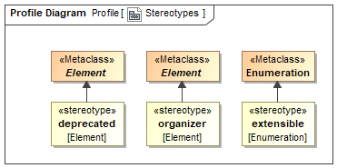

# Profile

MTConnect Profile is a {{term(profile)}} that extends the {{term(SysML)}} metamodel for the MTConnect domain using additional data types and {{termplural(stereotype)}}.

## DataTypes

### boolean

primitive type.

### ID

string that represents an {{term(ID)}}.

### string

primitive type.

### float

primitive type.

### datetime

string that represents timestamp in ISO 8601 format.

### integer

primitive type.

### xlinktype

string that represents the type of an XLink element. See {{url(https://www.w3.org/TR/xlink11/)}}.

### xslang

string that represents a language tag. See {{url(http://www.ietf.org/rfc/rfc4646.txt)}}.

### SECOND

float that represents time in seconds.

### IDREF

string that represents a reference to an `ID`.

### xlinkhref

string that represents the locator attribute of an XLink element. See {{url(https://www.w3.org/TR/xlink11/)}}.

### x509

string that represents an `x509` data block. {{cite(ISO/IEC 9594-8:2020)}}.

### int32

32-bit integer.

### int64

64-bit integer.

### version

series of four numeric values, separated by a decimal point, representing a {{term(major)}}, {{term(minor)}}, and {{term(revision)}} number of the MTConnect Standard and the revision number of a specific {{term(schema)}}.

### uint32

32-bit unsigned integer.

### uint64

64-bit unsigned integer.

## Stereotypes

### organizer

element that {{termplural(organize)}} other elements of a type.

### deprecated

element that has been deprecated.

### extensible

enumeration that can be extended.

### informative

element that is descriptive and non-normative.

### valueType

extends SysML `<<ValueType>>` to include `Class` as a value type.

### normative

element that has been added to the standard.

### observes

association in which a {{term(Component)}} makes {{termplural(Observation)}} about an observable {{term(DataItem)}}.

