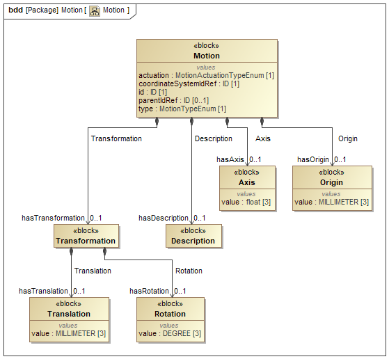
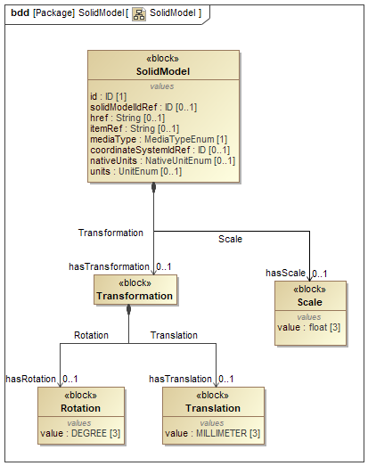

# MTConnect Specification and Material Statement

{{term(AMT)}} owns the copyright in this MTConnect Specification or Material. {{term(AMT)}} grants to you a non-exclusive, non-transferable, revocable, non-sublicensable, fully-paid-up copyright license to reproduce, copy and redistribute this MTConnect Specification or Material, provided that you may only copy or redistribute the MTConnect Specification or Material in the form in which you received it, without modifications, and with all copyright notices and other notices and disclaimers contained in the MTConnect Specification or Material.

If you intend to adopt or implement an MTConnect Specification or Material in a product, whether hardware, software or firmware, which complies with an MTConnect Specification, you shall agree to the MTConnect Specification Implementer License Agreement ("Implementer License") or to the MTConnect Intellectual Property Policy and Agreement ("IP Policy"'). The Implementer License and IP Policy each sets forth the license terms and other terms of use for MTConnect Implementers to adopt or implement the MTConnect Specifications, including certain license rights covering necessary patent claims for that purpose. These materials can be found at {{url(www.MTConnect.org)}}, or or by contacting {{url(mailto:info@MTConnect.org)}}. 

MTConnect Institute and {{term(AMT)}} have no responsibility to identify patents, patent claims or patent applications which may relate to or be required to implement a Specification, or to determine the legal validity or scope of any such patent claims brought to their attention. Each MTConnect Implementer is responsible for securing its own licenses or rights to any patent or other intellectual property rights that may be necessary for such use, and neither {{term(AMT)}} nor MTConnect Institute have any obligation to secure any such rights.

This Material and all MTConnect Specifications and Materials are provided "as is" and MTConnect Institute and {{term(AMT)}}, and each of their respective members, officers, affiliates, sponsors and agents, make no representation or warranty of any kind relating to these materials or to any implementation of the MTConnect Specifications or Materials in any product, including, without limitation, any expressed or implied warranty of noninfringement, merchantability, or fitness for particular purpose, or of the accuracy, reliability, or completeness of information contained herein. In no event shall MTConnect Institute or {{term(AMT)}} be liable to any user or implementer of MTConnect Specifications or Materials for the cost of procuring substitute goods or services, lost profits, loss of use, loss of data or any incidental, consequential, indirect, special or punitive damages or other direct damages, whether under contract, tort, warranty or otherwise, arising in any way out of access, use or inability to use the MTConnect Specification or other MTConnect Materials, whether or not they had advance notice of the possibility of such damage.

# Purpose of This Document

This document, {{citetitle(MTCPart2)}} of the MTConnect Standard, establishes the rules and terminology to be used by designers to describe the function and operation of a piece of equipment and to define the data that is provided by an {{term(agent)}} from the equipment.  The {{term(Device Information Model)}}  also defines the structure for the {{term(response document)}} that is returned from an {{term(agent)}} in response to a {{term(probe request)}}. 

In the MTConnect Standard, equipment represents any tangible property that is used in the operations of a manufacturing facility.  Examples of equipment are machine tools, ovens, sensor units, workstations, software applications, and bar feeders. 

> Note: See {{citetitle(MTCPart3)}} of the MTConnect Standard for details on the {{term(response document)}} that are returned from an {{term(agent)}} in response to a {{term(sample request)}} or {{term(current request)}}.

# Terminology and Conventions

Refer to Section 3 of {{citetitle(MTCPart1)}} for a dictionary of terms, reserved language, and document conventions used in the MTConnect Standard.

{{printglossary[title=General Terms, type=general]()}}
{{printglossary[title=Information Model Terms, type=informationmodel]()}}
{{printglossary[title=Protocol Terms, type=protocol]()}}
{{printglossary[title=HTTP Terms, type=http]()}}
{{printglossary[title=XML Terms, type=xml]()}}
{{printglossary[title=MTConnect Terms, type=conceptmodel]()}}

{{printacronyms()}}

{{printbibliography[title=MTConnect References,keyword=MTC]()}}

{{printbibliography[title=Other References,notkeyword=MTC]()}}

{{glsaddall()}}

# Devices Information Model

The {{term(Device Information Model)}} provides a representation of the physical and logical configuration for a piece of equipment used for a manufacturing process or for any other purpose.  It also provides the definition of data that may be reported by that equipment. 

Using information defined in the {{term(Device Information Model)}}, a software application can determine the configuration and reporting capabilities of a piece of equipment.  To do this, the software application issues a {{term(probe request)}} (defined in {{citetitle(MTCPart1)}} to an {{term(agent)}} associated with a piece of equipment. An {{term(agent)}} responds to the {{term(probe request)}} with an {{term(MTConnectDevices Response Document)}} that contains information describing both the physical and logical structure of the piece of equipment and a detailed description of each {{term(Observation)}} that can be reported by the {{term(agent)}} associated with the piece of equipment. This information allows the client software application to interpret the document and to extract the data with the same meaning, value, and context that it had at its original source.  

The {{term(MTConnectDevices Response Document)}} is comprised of two sections: {{block(Header)}} and {{block(Devices)}}.

The {{block(Header)}} section contains protocol related information as defined in {{citetitle(MTCPart1)}} {{cite(Section 6.5.1)}}.

The {{block(Devices)}} section of the {{term(MTConnectDevices Response Document)}} contains a {{block(Device)}} entity for each piece of equipment described in the document.  Each {{block(Device)}} is comprised of two primary types of entities - {{termplural(Component)}} and {{termplural(DataItem)}}.  

{{termplural(Component)}} organize information that represents the physical and logical parts and sub-parts of a piece of equipment (See {{sect(Components Model)}} for more details).  

{{termplural(DataItem)}} describe data that can be reported by a piece of equipment.  In the {{term(Device Information Model)}}, {{termplural(DataItem)}} are defined as {{block(DataItem)}} entities (See {{sect(DataItem Types)}} and {{sect(DataItem SubTypes)}}).

The {{termplural(Component)}} and {{termplural(DataItem)}} in the {{term(MTConnectDevices Response Document)}} provide information representing the physical and logical structure for a piece of equipment and the types of data that the piece of equipment can report relative to that structure.   The {{term(MTConnectDevices Response Document)}} does not contain values for the data types reported by the piece of equipment.  The {{term(MTConnectStreams Response Document)}} defined in {{citetitle(MTCPart3)}} provides the data values that are reported by the piece of equipment.

> Note:  The MTConnect Standard also defines the information model for {{termplural(asset)}}.  An {{term(asset)}} is something that is used in the manufacturing process, but is not permanently associated with a single piece of equipment, can be removed from the piece of equipment without compromising its function, and can be associated with other pieces of equipment during its lifecycle.  See {{citetitle(MTCPart4)}} for more details on {{termplural(asset)}}.

## MTConnectDevices

This section provides semantic information for the {{block(MTConnectDevices)}} entity.

### Header

provides information from an {{term(agent)}} defining version information, storage capacity, and parameters associated with the data management within the {{term(agent)}}.

#### Value Properties of Header

{{tbl(value-properties-of-header)}} lists the Value Properties of {{block(Header)}}.

|Value Property name|Value Property type|Multiplicity|
|-|-|:-:|
|{{property(assetBufferSize)}}|`uInt32`|1|
|{{property(assetCount)}}|`uInt32`|1|
|{{property(deviceModelChangeTime)}}|`dateTime`|1|
|{{property(version)}}|`version`|1|
|{{property(testIndicator)}}|`boolean`|0..1|
|{{property(sender)}}|`string`|1|
|{{property(instanceId)}}|`uInt64`|1|
|{{property(creationTime)}}|`dateTime`|1|
|{{property(bufferSize)}}|`uInt32`|1|
{: caption="Value Properties of Header"}

Descriptions for Value Properties of {{block(Header)}}:

* {{property(assetBufferSize)}} 

    maximum number of {{block(Asset)}} types that can be stored in the {{term(agent)}} that published the {{term(response document)}}.  
    
    > Note: The implementer is responsible for allocating the appropriate amount of storage capacity required to accommodate the {{property(assetBufferSize)}}.
    

* {{property(assetCount)}} 

    current number of {{block(Asset)}} that are currently stored in the {{term(agent)}} as of the {{property(creationTime)}} that the {{term(agent)}} published the {{term(response document)}}.
    
    {{property(assetCount)}} **MUST NOT** be larger than the value reported for {{property(assetBufferSize)}}.
    

* {{property(deviceModelChangeTime)}} 

    timestamp of the last update of the {{block(Device)}} information for any device.

* {{property(version)}} 

    {{term(major)}}, {{term(minor)}}, and {{term(revision)}} number of the MTConnect Standard that defines the {{term(semantic data model)}} that represents the content of the {{term(response document)}}. It also includes the revision number of the {{term(schema)}} associated with that specific {{term(semantic data model)}}.
    
    As an example, the value reported for {{property(version)}} for a {{term(response document)}} that was structured based on {{term(schema)}} revision 10 associated with Version 1.4.0 of the MTConnect Standard would be:  1.4.0.10

* {{property(testIndicator)}} 

    indicates whether the {{term(agent)}} that published the {{term(response document)}} is operating in a test mode.
    
    If {{property(testIndicator)}} is not specified, the value for {{property(testIndicator)}} **MUST** be interpreted to be `false`.

* {{property(sender)}} 

    identification defining where the {{term(agent)}} that published the {{term(response document)}} is installed or hosted.
    
    {{property(sender)}} **MUST** be either an IP Address or Hostname describing where the {{term(agent)}} is installed or the URL of the {{term(agent)}}; e.g., `http://<address>[:port]/`. 
    
    > Note:  The port number need not be specified if it is the default HTTP port 80.

* {{property(instanceId)}} 

    identifier for a specific instantiation of the {{term(buffer)}} associated with the {{term(agent)}} that published the {{term(response document)}}.  
         
    {{property(instanceId)}} **MUST** be changed to a different unique number each time the {{term(buffer)}} is cleared and a new set of data begins to be collected.

* {{property(creationTime)}} 

    timestamp that an {{term(agent)}} published the {{term(response document)}}. 

* {{property(bufferSize)}} 

    maximum number of {{termplural(DataItem)}} that **MAY** be retained in the {{term(agent)}} that published the {{term(response document)}} at any point in time.
    
    > Note 1 to entry:  {{property(bufferSize)}} represents the maximum number of sequence numbers that **MAY** be stored in the {{term(agent)}}. 
    
    > Note 2 to entry: The implementer is responsible for allocating the appropriate amount of storage capacity required to accommodate the {{property(bufferSize)}}.
    

### MTConnectDevices

root entity of an {{term(MTConnectDevices Response Document)}} that contains the {{term(Device Information Model)}} of one or more {{block(Device)}} entities.

> Note: Additional properties of {{block(MTConnectDevices)}} **MAY** be defined for schema and namespace declaration. See {{citetitle(MTCPart1)}}.

#### Part Properties of MTConnectDevices

{{tbl(part-properties-of-mtconnectdevices)}} lists the Part Properties of {{block(MTConnectDevices)}}.

|Part Property name|Multiplicity|
|:-|:-:|
|{{block(Header)}}|1|
|{{block(Device)}} (organized by {{block(Devices)}})|1..*|
{: caption="Part Properties of MTConnectDevices"}

Descriptions for Part Properties of {{block(MTConnectDevices)}}:

* {{block(Header)}} 

    provides information from an {{term(agent)}} defining version information, storage capacity, and parameters associated with the data management within the {{term(agent)}}.

* {{block(Device)}} 

    {{block(Component)}} composed of a piece of equipment that produces {{termplural(observation)}} about itself.

    {{block(Devices)}} groups one or more {{block(Device)}} entities. See {{sect(Devices)}} and {{sect(Components Model)}} for more detail.

# Components Model

{{block(MTConnectDevices)}} provides the physical and logical architecture of a piece of equipment. {{fig(Device Entity Hierarchy Example)}} provides an overview of the entities used in an example of an {{block(MTConnectDevices)}} entity.

{: width="0.8"}

> Note 1 to entry: See {{lst(device-entity-hierarchy-example)}} for the {{term(XML)}} representation of the same example.

> Note 2 to entry: Example above only shows the {{block(Component)}} and {{block(Composition)}} level hierarchy. For a complete semantics on each kind see {{sect(Component)}} and {{sect(Composition)}}.

A variety of entities are defined to describe a piece of equipment.  Some of these entities **MUST** always be defined for a {{block(MTConnectDevices)}} entity, while others are optional and **MAY** be used, as required, to provide additional structure.

The first, or highest level, entity defined for an {{block(MTConnectDevices)}} entity is {{block(Devices)}}. {{block(Devices)}} is used to group one or more pieces of equipment into a single document.  {{block(Devices)}} **MUST** always be defined for an {{block(MTConnectDevices)}} entity.

{{block(Device)}} is the next entity defined for the {{block(MTConnectDevices)}} entity. A separate {{block(Device)}} entity is used to identify each piece of equipment for an {{block(MTConnectDevices)}} entity. Each {{block(Device)}} provides information on the physical and logical structure of the piece of equipment and the data associated with that equipment. {{block(Device)}} can also represent any logical grouping of pieces of equipment that function as a unit or any other data source that provides data through an {{term(agent)}}.

One or more {{block(Device)}} entities **MUST** always be defined for an {{block(MTConnectDevices)}} entity.

{{block(Components)}} is the next entity defined for the {{block(MTConnectDevices)}} entity. {{block(Components)}} is used to group information describing lower level physical parts or logical functions of a piece of equipment.

{{block(Component)}} is the next level of entity defined for the {{block(MTConnectDevices)}} entity. {{block(Component)}} is both an abstract type entity and an {{term(organizer)}} type entity. 

As an abstract entity, {{block(Component)}} will always be realized by a specific {{block(Component)}} type defined in {{sect(Component Types)}}. Each {{block(Component)}} can also be used to organize information describing {{term(lower level)}} entities or {{termplural(DataItem)}} associated with the {{block(Component)}}.

If {{term(lower level)}} entities are described, these entities are by definition child {{block(Component)}} entities of a parent {{block(Component)}}. At this next level, the {{term(lower level)}} child {{block(Component)}} entities are grouped by {{block(Components)}}.

A {{block(Component)}} **MAY** be further decomposed into {{block(Composition)}} entities that are grouped by {{block(Compositions)}}. These describe the lowest level basic structural or functional building blocks contained within a {{block(Component)}}. Data provided for a {{block(Component)}} provides more specific meaning when it is associated with one of the {{block(Composition)}} entities of the {{block(Component)}}. The different {{block(Component)}} types that **MAY** be defined for the {{block(MTConnectDevices)}} entity are defined in {{sect(Compositions Model)}}.

This parent-child relationship can continue to any depth required to fully define a piece of equipment.

> Note: See {{fig(Device Entity Hierarchy Example)}} for an example.

## Components

This section provides semantic information for the {{block(Component)}} entity. {{fig(Components)}} shows the {{block(Component)}} model. 

{: width="0.8"}

> Note: See {{sect(Components Schema Diagrams)}} for XML schema.

### Component

logical or physical entity that provides a capability.

{{block(Component)}} is an abstract entity and will be realized by specific {{block(Component)}} types for an {{block(MTConnectDevices)}} entity. See {{sect(Component Types)}} for more details on the {{block(Component)}} types.

{{block(Component)}} also provides structure for describing the {{term(lower level)}} entities associated with it.

At least one of {{block(Component)}}, {{block(DataItem)}}, or {{block(Reference)}} entities **MUST** be provided for a {{block(Component)}}.

{: width="0.8"}

> Note: See {{lst(component-example)}} for the {{term(XML)}} representation of the same example.

#### Value Properties of Component

{{tbl(value-properties-of-component)}} lists the Value Properties of {{block(Component)}}.

|Value Property name|Value Property type|Multiplicity|
|-|-|:-:|
|{{property(id)}}|`ID`|1|
|{{property(name)}}|`string`|0..1|
|{{property(nativeName)}}|`string`|0..1|
|{{property(sampleInterval)}}|`float`|0..1|
|`<<deprecated>>`{{property(sampleRate)}}|`float`|0..1|
|{{property(uuid)}}|`ID`|0..1|
|{{property(coordinateSystemIdRef)}}|`ID`|0..1|
{: caption="Value Properties of Component"}

Descriptions for Value Properties of {{block(Component)}}:

* {{property(id)}} 

    unique identifier for the {{block(Component)}}.

* {{property(name)}} 

    name of the {{block(Component)}}.
    
    When provided, {{property(name)}} **MUST** be unique for all child {{block(Component)}} entities of a parent {{block(Component)}}.

* {{property(nativeName)}} 

    common name associated with {{block(Component)}}.

* {{property(sampleInterval)}} 

    interval in milliseconds between the completion of the reading of the data associated with the {{block(Component)}} until the beginning of the next sampling of that data.
    
    This information may be used by client software applications to understand how often information from a {{block(Component)}} is expected to be refreshed.
    
    The refresh rate for data from all child {{block(Component)}} entities will be the
    same as for the parent {{block(Component)}} element unless specifically overridden by another {{property(sampleInterval)}} provided for the child
    {{block(Component)}}.

* `<<deprecated>>`{{property(sampleRate)}} 

    **DEPRECATED** in *MTConnect Version 1.2*. Replaced by {{property(sampleInterval,Component)}}.

* {{property(uuid)}} 

    universally unique identifier for the {{block(Component)}}.

* {{property(coordinateSystemIdRef)}} 

    specifies the {{block(CoordinateSystem)}} for this {{block(Component)}} and its children.

#### Reference Properties of Component

{{tbl(reference-properties-of-component)}} lists the Reference Properties of {{block(Component)}}.

|Reference Property name|Multiplicity|
|:-|:-:|
|{{block(ComponentStream)}}|0..1|
{: caption="Reference Properties of Component"}

Descriptions for Reference Properties of {{block(Component)}}:

* {{block(ComponentStream)}} 

    organizes the data associated with each {{block(Component)}} entity defined for a {{block(Device)}} in the associated {{term(MTConnectDevices Response Document)}}.

    {{block(ComponentStream)}} {{termplural(organize)}} the {{block(Observation)}} entities associated with the {{block(Component)}}.
    
    See {{citetitle(MTCPart3)}} for the {{block(ComponentStream)}} model.
    
    > Note 1 to entry: In the {{term(XML)}} representation, {{block(ComponentStream)}} entities **MUST NOT** appear in the {{term(MTConnectDevices Response Document)}}.
    
    > Note 2 to entry: In the {{term(XML)}} representation, {{block(ComponentStream)}} entities **MUST** appear only in the {{term(MTConnectStreams Response Document)}}.

#### Part Properties of Component

{{tbl(part-properties-of-component)}} lists the Part Properties of {{block(Component)}}.

|Part Property name|Multiplicity|
|:-|:-:|
|{{block(Description)}}|0..1|
|{{block(Composition)}} (organized by {{block(Compositions)}})|0..*|
|{{block(Component)}} (organized by {{block(Components)}})|0..*|
|{{block(Configuration)}}|0..1|
|{{block(DataItem)}} (organized by {{block(DataItems)}})|0..*|
|{{block(Observation)}} (organized by {{block(Observations)}})|0..*|
|{{block(Reference)}} (organized by {{block(References)}})|0..*|
{: caption="Part Properties of Component"}

Descriptions for Part Properties of {{block(Component)}}:

* {{block(Description)}} 

    descriptive content.

    See {{sect(Description)}}.

* {{block(Composition)}} 

    functional part of a piece of equipment contained within a {{block(Component)}}.
    

    {{block(Compositions)}} groups one or more {{block(Composition)}} entities. See {{sect(Compositions Model)}}.

* {{block(Component)}} 

    logical or physical entity that provides a capability.

    {{block(Components)}} groups one or more {{block(Component)}} entities.

* {{block(Configuration)}} 

    technical information about a piece of equipment describing its physical layout, functional characteristics, and relationships with other pieces of equipment.

    See {{sect(Configurations Model)}}.

* {{block(DataItem)}} 

    information reported about a piece of equipment.

    {{block(DataItems)}} groups one or more {{block(DataItem)}} entities. See {{sect(DataItems)}}.

* {{block(Observation)}} 

    abstract entity that provides telemetry data for a {{block(DataItem)}} at a point in time.

    {{block(Observations)}} groups one or more {{block(Observation)}} entities made by the {{block(Component)}} entity. 
    
    {{block(Component)}} {{termplural(observe)}} {{block(DataItem)}} entities to create {{block(Observation)}} entities for the {{block(DataItem)}} entities.
    
    See {{citetitle(MTCPart3)}} for the {{block(Observation)}} model.
    
    > Note 1 to entry: In the {{term(XML)}} representation, {{block(Observation)}} entities **MUST NOT** appear in the {{term(MTConnectDevices Response Document)}}.
    
    > Note 2 to entry: In the {{term(XML)}} representation, {{block(Observation)}} entities **MUST** appear only in the {{term(MTConnectStreams Response Document)}}.

* {{block(Reference)}} 

    pointer to information that is associated with another entity defined elsewhere in the {{block(MTConnectDevices)}} entity for a piece of equipment.

    {{block(References)}} groups one or more {{block(Reference)}} entities associated with the {{block(Component)}}. See {{sect(References Model)}}.

### ComponentOrganizer

{{block(Component)}} that {{termplural(organize)}} one or more {{block(Component)}} of the same type.

### Description

descriptive content.

> Note 1 to entry: See {{fig(Component Example)}} for an example.

> Note 2 to entry: See {{lst(component-example)}} for the {{term(XML)}} representation of the same example.

The value of {{property(Description)}} **MUST** be `string`.

#### Value Properties of Description

{{tbl(value-properties-of-description)}} lists the Value Properties of {{block(Description)}}.

|Value Property name|Value Property type|Multiplicity|
|-|-|:-:|
|{{property(manufacturer)}}|`string`|0..1|
|{{property(model)}}|`string`|0..1|
|{{property(serialNumber)}}|`string`|0..1|
|{{property(station)}}|`string`|0..1|
{: caption="Value Properties of Description"}

Descriptions for Value Properties of {{block(Description)}}:

* {{property(manufacturer)}} 

    name of the manufacturer of the physical or logical part of a piece of equipment represented by this element.

* {{property(model)}} 

    model description of the physical part or logical function of a piece of equipment represented by this element.

* {{property(serialNumber)}} 

    serial number associated with a piece of equipment.

* {{property(station)}} 

    station where the physical part or logical function of a piece of equipment is located when it is part of a manufacturing unit or cell with multiple stations.

## Devices

This section provides semantic information for the {{block(Device)}} entity and its types.

### Device

{{block(Component)}} composed of a piece of equipment that produces {{termplural(observation)}} about itself.

A {{block(Device)}} {{termplural(organize)}} its parts as {{block(Component)}} entities.

A {{block(Device)}} **MUST** have a {{property(name)}} and {{property(uuid)}} attribute to identify itself. 

A {{block(Device)}} **MUST** have the following {{block(DataItems)}}: {{block(Availability)}}, {{block(AssetChanged)}}, and {{block(AssetRemoved)}}.

See {{sect(Component)}} for details on the {{block(Device)}} model. 

#### Value Properties of Device

{{tbl(value-properties-of-device)}} lists the Value Properties of {{block(Device)}}.

|Value Property name|Value Property type|Multiplicity|
|-|-|:-:|
|`<<deprecated>>`{{property(iso841Class)}}|`string`|0..1|
|{{property(uuid)}}|`ID`|1|
|{{property(mtconnectVersion)}}|`string`|0..1|
|{{property(name)}}|`string`|1|
{: caption="Value Properties of Device"}

Descriptions for Value Properties of {{block(Device)}}:

* `<<deprecated>>`{{property(iso841Class)}} 

    **DEPRECATED** in *MTConnect Version 1.1*.

* {{property(mtconnectVersion)}} 

    MTConnect version of the {{term(Device Information Model)}} used to configure the information to be published for a piece of equipment in an {{term(MTConnect Response Document)}}.

### Agent

{{block(Device)}} composed of an {{term(MTConnect Agent)}} and all its connected data sources.

An {{block(Agent)}} **MUST** be provided by all {{term(MTConnect Agent)}} implementations.

An {{block(Agent)}} **MUST** provide notifications when devices are added or changed.

An {{block(Agent)}} **MUST** provide connection information for each data source currently supplying data to the {{term(MTConnect Agent)}}.

An {{block(Agent)}} **MAY** provide information about telemetry relating to data sources.

An {{block(Agent)}} **MAY** provide information about the {{term(MTConnect Agent)}} resource utilization.

## Component Types

This section provides semantic information for the types of {{block(Component)}}. 

{{block(Component)}} entities are defined into two major categories:

* {{term(top level)}} {{block(Component)}} entities that {{termplural(organize)}} the most significant physical or logical functions of a piece of equipment.  They **MAY** also be used as {{term(lower level)}} {{block(Component)}} entities; as required. See {{sect(ComponentOrganizer Types)}}.

* {{term(lower level)}} {{block(Component)}} entities composed of the sub-parts of the parent {{block(Component)}} to provide more clarity and granularity to the physical or logical structure of the {{term(top level)}} {{block(Component)}} entities.

This section provides guidance for the most common relationships between {{block(Component)}} types.  However, all {{block(Component)}} types **MAY** be used in any configuration, as required, to fully describe a piece of equipment.

As described in {{sect(Components Model)}}, {{block(Component)}} is an abstract entity and will be always realized by a specific {{block(Component)}} type.

### Actuator

{{block(Component)}} composed of a physical apparatus that moves or controls a mechanism or system. 

It takes energy usually provided by air, electric current, or liquid and converts the energy into some kind of motion.

### Adapter

{{block(Component)}} that provides information about the data source for an {{term(MTConnect Agent)}}.

It **MAY** contain connectivity state of the data source and additional telemetry about the data source and source-specific information.

### Auxiliary

abstract {{block(Component)}} composed of removable part(s) of a piece of equipment that provides supplementary or extended functionality.

#### Deposition

{{block(Auxiliary)}} that manages the addition of material or state change of material being performed in an additive manufacturing process.

For example, this could describe the portion of a piece of equipment that manages a material extrusion process or a vat polymerization process.

#### Environmental

{{block(Auxiliary)}} that monitors, manages, or conditions the environment around or within a piece of equipment.

##### Heating

{{block(System)}} that delivers controlled amounts of heat to achieve a target temperature at a specified heating rate.

> Note: As an example, Energy Delivery Method can be either through Electric heaters or Gas burners.

##### Vacuum

{{block(System)}} that evacuates gases and liquids from an enclosed and sealed space to a controlled negative pressure or a molecular density below the prevailing atmospheric level.

##### Cooling

{{block(System)}} that extracts controlled amounts of heat to achieve a target temperature at a specified cooling rate.

> Note: As an example, Energy Extraction Method can be via cooling water pipes running through the chamber.

##### Pressure

{{block(System)}} that delivers compressed gas or fluid and controls the pressure and rate of pressure change to a desired target set-point.

> Note: For example, Delivery Method can be a Compressed Air or N2 tank that is piped via an inlet valve to the chamber.

#### Loader

{{block(Auxiliary)}} that provides movement and distribution of materials, parts, tooling, and other items to or from a piece of equipment.

##### BarFeeder

{{block(Loader)}} that delivers bar stock to a piece of equipment.

#### ToolingDelivery

{{block(Auxiliary)}} that manages, positions, stores, and delivers tooling within a piece of equipment.

##### GangToolBar

{{block(ToolingDelivery)}} composed of a tool mounting mechanism that holds any number of tools. 

Tools are located in {{block(Station)}} entities. Tools are positioned for use in the manufacturing process by linearly positioning the {{block(GangToolBar)}}.

##### AutomaticToolChanger

{{block(ToolingDelivery)}} composed of a tool delivery mechanism that moves tools between a {{block(ToolMagazine)}} and a {{term(spindle)}} a {{block(Turret)}}.

{{block(AutomaticToolChanger)}} may also transfer tools between a location outside of a piece of equipment and a {{block(ToolMagazine)}} or {{block(Turret)}}.

##### ToolMagazine

{{block(ToolingDelivery)}} composed of a tool storage mechanism that holds any number of tools. 

Tools are located in {{block(Pot)}}s. {{block(Pot)}}s are moved into position to transfer tools into or out of the {{block(ToolMagazine)}} by an {{block(AutomaticToolChanger)}}.

##### ToolRack

{{block(ToolingDelivery)}} composed of a linear or matrixed tool storage mechanism that holds any number of tools.

Tools are located in {{block(Station)}} entities.

##### Turret

{{block(ToolingDelivery)}} composed of a tool mounting mechanism that holds any number of tools.

Tools are positioned for use in the manufacturing process by rotating the {{block(Turret)}}.

#### WasteDisposal

{{block(Auxiliary)}} that removes manufacturing byproducts from a piece of equipment.

### Axis

abstract {{block(Component)}} composed of a motion system that provides linear or rotational motion for a piece of equipment.

In robotics, the term *Axis* is synonymous with *Joint*. A *Joint* is the connection between two parts of the structure that move in relation to each other.

{{block(Linear)}} and {{block(Rotary)}} components **MUST** have a {{property(name)}} attribute that **MUST** follow the conventions described below. Use the {{property(nativeName)}} attribute for the manufacturer's name of the axis if it differs from the assigned {{property(name)}}.

MTConnect has two high-level classes for automation equipment as follows: (1) Equipment that controls cartesian coordinate axes and (2) Equipment that controls articulated axes. There are ambiguous cases where some machines exhibit both characteristics; when this occurs, the primary control system's configuration determines the classification.

Examples of cartesian coordinate equipment are CNC Machine Tools, Coordinate measurement machines, as specified in ISO 841, and 3D Printers. Examples of articulated automation equipment are Robotic systems as specified in ISO 8373.

The following sections define the designation of names for the axes and additional guidance when selecting the correct scheme to use for a given piece of equipment.

#### Cartesian Coordinate Naming Conventions

A Three-Dimensional Cartesian Coordinate control system organizes its axes orthogonally relative to a machine coordinate system where the manufacturer of the equipment specifies the origin. 

{{block(Axes)}} {{property(name)}} **SHOULD** comply with ISO 841, if possible.

##### Linear Motion

A piece of equipment **MUST** represent prismatic motion using a {{block(Linear)}} axis {{block(Component)}} and assign its {{property(name)}} using the designations `X`, `Y`, and `Z`. A {{block(Linear)}} axis {{property(name)}} **MUST** append a monotonically increasing suffix when there are more than one parallel axes; for example, `X2`, `X3`, and `X4`. 

##### Rotary Motion

MTConnect **MUST** assign the {{property(name)}} to {{block(Rotary)}} axes exhibiting rotary motion using `A`, `B`, and `C`. A {{block(Rotary)}} axis {{property(name)}} **MUST** append a monotonically increasing suffix when more than one {{block(Rotary)}} axis rotates around the same {{block(Linear)}} axis; for example, `A2`, `A3`, and `A4`. 

#### Articulated Machine Control Systems

An articulated control system's axes represent the connecting linkages between two adjacent rigid members of an assembly. The {{block(Linear)}} axis represents prismatic motion, and the {{block(Rotary)}} axis represents the rotational motion of the two related members. The control organizes the axes in a kinematic chain from the mounting surface (base) to the end-effector or tooling.

#### Articulated Machine Axis Names

The axes of articulated machines represent forward kinematic relationships between mechanical linkages. Each axis is a connection between linkages, also referred to as joints, and **MUST** be named using a `J` followed by a monotonically increasing number; for example, `J1`, `J2`, `J3`.  The numbering starts at the base axis connected or closest to the mounting surface, `J1`, incrementing to the mechanical interface, `Jn`, where `n` is the number of the last axis. The chain forms a parent-child relationship with the parent being the axis closest to the base.

A machine having an axis with more than one child **MUST** number each branch using its numeric designation followed by a branch number and a monotonically increasing number. For example, if `J2` has two children, the first child branch **MUST** be named `J2.1.1` and the second child branch `J2.2.1`. A child of the first branch **MUST** be named `J2.1.2`, incrementing to `J2.1.n`, where `J2.1.n` is the number of the last axis in that branch.

#### Linear

{{block(Axis)}} that provides prismatic motion along a fixed axis.

#### Rotary

{{block(Axis)}} that provides rotation about a fixed axis.

### Door

{{block(Component)}} composed of a mechanical mechanism or closure that can cover a physical access portal into a piece of equipment allowing or restricting access to other parts of the equipment.

The closure can be opened or closed to allow or restrict access to other parts of the equipment.

{{block(Door)}} **MUST** have {{block(DoorState)}} data item to indicate if the door is `OPEN`, `CLOSED`, or `UNLATCHED`. A {{block(Component)}} **MAY** contain multiple {{block(Door)}} entities.

### Lock

{{block(Component)}} that physically prohibits a {{block(Device)}} or {{block(Component)}} from opening or operating.

### Part

abstract {{block(Component)}} composed of a {{term(part)}} being processed by a piece of equipment.

#### PartOccurrence

{{block(Part)}} that exists at a specific place and time, such as a specific instance of a bracket at a specific timestamp.

{{block(PartId)}} **MUST** be defined for {{block(PartOccurrence)}}.

Suggested data item types for {{block(PartOccurrence)}} are: {{block(PartUniqueId)}}, {{block(PartGroupId)}}, {{block(PartKindId)}}, {{block(PartCount)}}, {{block(PartStatus)}}, {{block(ProcessTime)}}, and {{block(ProcessOccurrenceId)}}, and {{block(User)}}.

### Path

{{block(Component)}} that organizes an independent operation or function within a {{block(Controller)}}.

For many types of equipment, {{block(Path)}} organizes a set of {{block(Axes)}}, one or more Program elements, and the data associated with the motion of a control point as it moves through space. However, it **MAY** also represent any independent function within a {{block(Controller)}} that has unique data associated with that function.
 
{{block(Path)}} **SHOULD** provide an {{block(Execution)}} data item to define the operational state of the {{block(Controller)}} of the piece of equipment.

If the {{block(Controller)}} is capable of performing more than one independent operation or function simultaneously, a separate {{block(Path)}} **MUST** be used to organize the data associated with each independent operation or function.

### Power

{{block(Power)}} was **DEPRECATED** in *MTConnect Version 1.1* and was replaced by {{block(Availability)}} data item type.

### Process

abstract {{block(Component)}} composed of a manufacturing process being executed on a piece of equipment.

#### ProcessOccurrence

{{block(Process)}} that takes place at a specific place and time, such as a specific instance of part-milling occurring at a specific timestamp.

{{block(ProcessOccurrenceId)}} **MUST** be defined for {{block(ProcessOccurrence)}}.

Suggested data item types for {{block(ProcessOccurrence)}} are: {{block(ProcessAggregateId)}}, {{block(ProcessKindId)}}, {{block(ProcessTime)}}, {{block(User)}}, {{block(Program)}}, and {{block(PartUniqueId)}}.

### Resource

abstract {{block(Component)}} composed of material or personnel involved in a manufacturing process.

#### Material

{{block(Resource)}} composed of material that is consumed or used by the piece of equipment for production of parts, materials, or other types of goods.

##### Stock

{{block(Material)}} that is used in a manufacturing process and to which work is applied in a machine or piece of equipment to produce parts.

{{block(Stock)}} may be either a continuous piece of material from which multiple parts may be produced or it may be a discrete piece of material that will be made into a part or a set of parts.

#### Personnel

{{block(Resource)}} composed of an individual or individuals who either control, support, or otherwise interface with a piece of equipment.

### Sensor

{{block(Component)}} that responds to a physical stimulus and transmits a resulting impulse or value from a sensing unit.

If modeling individual sensors, then sensor should be associated with the {{block(Component)}} that the measured value is most closely associated.

When modeled as an {{block(Auxiliary)}}, sensor **SHOULD** represent an integrated {{term(sensor unit)}} system that provides signal processing, conversion, and communications. A {{term(sensor unit)}} may have multiple {{termplural(sensing element)}}.

See {{block(SensorConfiguration)}} for more details on the use and configuration of a {{block(Sensor)}.

### Structure

{{block(Component)}} composed of part(s) comprising the rigid bodies of the piece of equipment.

#### Link

{{block(Structure)}} that provides a connection between {{block(Component)}} entities.

### System

abstract {{block(Component)}} that is permanently integrated into the piece of equipment.

#### Controller

{{block(System)}} that provides regulation or management of a system or component. {{cite(ISO 16484-5:2017)}}

Typical types of controllers for a piece of equipment include CNC (Computer Numerical Control), PAC (Programmable Automation Control), IPC (Industrialized Computer), or IC (Imbedded Computer).

#### Coolant

{{block(System)}} that provides distribution and management of fluids that remove heat from a piece of equipment.

#### Dielectric

{{block(System)}} that manages a chemical mixture used in a manufacturing process being performed at that piece of equipment.

For example, this could describe the dielectric system for an EDM process or the chemical bath used in a plating process.

#### Electric

{{block(System)}} composed of the main power supply for the piece of equipment that provides distribution of that power throughout the equipment.

The electric system will provide all the data with regard to electric current, voltage, frequency, etc. that applies to the piece of equipment as a functional unit. Data regarding electric power that is specific to a {{block(Component)}} will be reported for that specific {{block(Component)}.

#### Enclosure

{{block(System)}} composed of a structure that is used to contain or isolate a piece of equipment or area.

{{block(Enclosure)}} may provide information regarding access to the internal components of a piece of equipment or the conditions within the enclosure. For example, {{block(Door)}} may be defined as a {{term(lower level)}} {{block(Component)}} or {{block(Composition)}} entity of the {{block(Enclosure)}}.

#### EndEffector

{{block(System)}} composed of functions that form the last link segment of a piece of equipment.

It is the part of a piece of equipment that interacts with the manufacturing process.

#### Feeder

{{block(System)}} that manages the delivery of materials within a piece of equipment.

For example, this could describe the wire delivery system for an EDM or welding process; conveying system or pump and valve system distributing material to a blending station; or a fuel delivery system feeding a furnace.

#### Hydraulic

{{block(System)}} that provides movement and distribution of pressurized liquid throughout the piece of equipment.

#### Lubrication

{{block(System)}} that provides distribution and management of fluids used to lubricate portions of the piece of equipment.

#### Pneumatic

{{block(System)}} that uses compressed gasses to actuate components or do work within the piece of equipment.

> Note: Actuation is usually performed using a cylinder.

#### ProcessPower

{{block(System)}} composed of a power source associated with a piece of equipment that supplies energy to the manufacturing process separate from the {{block(Electric)}} system.

For example, this could be the power source for an EDM machining process, an electroplating line, or a welding system.

#### Protective

{{block(System)}} that provides functions used to detect or prevent harm or damage to equipment or personnel.

{{block(Protective)}} does not include the information relating to the {{block(Enclosure)}}.

#### WorkEnvelope

{{block(System)}} composed of the physical process execution space within a piece of equipment.

{{block(WorkEnvelope)}} **MAY** provide information regarding the physical workspace and the conditions within that workspace.

## ComponentOrganizer Types

This section provides semantic information for the types of {{block(Component)}} that are used to {{term(organize)}} other {{block(Component)}} types. 

### Adapters

{{block(Adapters)}} {{termplural(organize)}} {{block(Adapter)}} types. 

### Auxiliaries

{{block(Auxiliaries)}} {{termplural(organize)}} {{block(Auxiliary)}} types. 

### Axes

{{block(Axes)}} {{termplural(organize)}} {{block(Axis)}} types. 

### Interfaces

{{block(Interfaces)}} {{termplural(organize)}} {{block(Interface)}} types. 

### Parts

{{block(Parts)}} {{termplural(organize)}} {{block(Part)}} types.

### Processes

{{block(Processes)}} {{termplural(organize)}} {{block(Process)}} types. 

### Resources

{{block(Resources)}} {{termplural(organize)}} {{block(Resource)}} types. 

#### Materials

{{block(Materials)}} {{termplural(organize)}} {{block(Material)}} types.

### Structures

{{block(Structures)}} {{termplural(organize)}} {{block(Structure)}} types. 

### Systems

{{block(Systems)}} {{termplural(organize)}} {{block(System)}} types. 

# Compositions Model

{{block(Composition)}} entities are used to describe the lowest level physical building blocks of a piece of equipment contained within a {{block(Component)}}. By referencing a specific {{block(Composition)}} entity, further clarification and meaning to data associated with a specific {{block(Component)}} can be achieved.

Both {{block(Component)}} and {{block(Composition)}} entities are {{term(lower level)}} entities representing the sub-parts of the parent {{block(Component)}}.  However, there are distinct differences between {{block(Component)}} and {{block(Composition)}} type entities.

{{block(Component)}} entities may be further defined with {{term(lower level)}} {{block(Component)}} entities and may have associated {{termplural(DataItem)}}.

{{block(Composition)}} entities represent the lowest level physical part of a piece of equipment.  They **MUST NOT** be further defined with {{term(lower level)}} {{block(Component)}} entities and they **MUST NOT** have {{termplural(DataItem)}} directly associated with them.   They do provide additional information that can be used to enhance the specificity of {{termplural(DataItem)}} associated with the parent {{block(Component)}}.

## Compositions

This section provides semantic information for the {{block(Composition)}} entity.

See {{fig(Components)}} for the {{block(Composition)}} model diagram.

{: width="0.8"}

> Note: See {{lst(component-with-compositions-example)}} for the {{term(XML)}} representation of the same example.

### Composition

functional part of a piece of equipment contained within a {{block(Component)}}.

{{block(Composition)}} **MUST NOT** have child {{block(Component)}}, {{block(Composition)}}, or {{block(DataItems)}} elements.

#### Value Properties of Composition

{{tbl(value-properties-of-composition)}} lists the Value Properties of {{block(Composition)}}.

|Value Property name|Value Property type|Multiplicity|
|-|-|:-:|
|{{property(type)}}|`CompositionTypeEnum`|1|
|{{property(id)}}|`ID`|1|
|{{property(name)}}|`string`|0..1|
|{{property(uuid)}}|`ID`|0..1|
{: caption="Value Properties of Composition"}

Descriptions for Value Properties of {{block(Composition)}}:

* {{property(type)}} 

    type of {{block(Composition)}} element. See {{sect(Composition Types)}}.

    The value of {{property(type)}} **MUST** be one of the `CompositionTypeEnum` enumeration. 

* {{property(id)}} 

    unique identifier for the {{block(Composition)}} element.

* {{property(name)}} 

    name of the {{block(Composition)}} element.

* {{property(uuid)}} 

    universally unique identifier for the {{block(Composition)}}.

#### Part Properties of Composition

{{tbl(part-properties-of-composition)}} lists the Part Properties of {{block(Composition)}}.

|Part Property name|Multiplicity|
|:-|:-:|
|{{block(Description)}}|0..1|
|{{block(Configuration)}}|0..1|
{: caption="Part Properties of Composition"}

Descriptions for Part Properties of {{block(Composition)}}:

* {{block(Description)}} 

    descriptive content.

    See {{sect(Description)}}.

* {{block(Configuration)}} 

    technical information about a piece of equipment describing its physical layout, functional characteristics, and relationships with other pieces of equipment.

    See {{sect(Configurations Model)}}.

## Composition Types

This section provides semantic information for the types of {{block(Composition)}} that are currently available to describe sub-parts of a {{block(Component)}}.

### Actuator

{{block(Composition)}} that moves or controls a mechanism or system.

It takes energy usually provided by air, electric current, or liquid and converts the energy into some kind of motion. 

### Amplifier

{{block(Composition)}} composed of an electronic component or circuit that amplifies power, electric current, or voltage.

### Ballscrew

{{block(Composition)}} composed of a mechanical structure that transforms rotary motion into linear motion.

### Belt

{{block(Composition)}} composed of an endless flexible band that transmits motion for a piece of equipment or conveys materials and objects.

### Brake

{{block(Composition)}} that slows or stops a moving object by the absorption or transfer of the energy of momentum, usually by means of friction, electrical force, or magnetic force.

### Chain

{{block(Composition)}} composed of interconnected series of objects that band together and are used to transmit motion for a piece of equipment or to convey materials and objects.

### Chopper

{{block(Composition)}} that breaks material into smaller pieces.

### Chuck

{{block(Composition)}} that holds a part, stock material, or any other item in place.

### Chute

{{block(Composition)}} composed of an inclined channel that conveys material.

### CircuitBreaker

{{block(Composition)}} that interrupts an electric circuit.

### Clamp

{{block(Composition)}} that strengthens, support, or fastens objects in place.

### Compressor

{{block(Composition)}} composed of a pump or other mechanism that reduces volume and increases pressure of gases in order to condense the gases to drive pneumatically powered pieces of equipment.

### CoolingTower

{{block(Composition)}} composed of a heat exchange system that uses a fluid to transfer heat to the atmosphere.

### Door

{{block(Composition)}} that can cover a physical access portal into a piece of equipment allowing or restricting access to other parts of the equipment.

### Drain

{{block(Composition)}} that allows material to flow for the purpose of drainage from, for example, a vessel or tank.

### Encoder

{{block(Composition)}} that measures position.

### ExpiredPot

{{block(Pot)}} for a tool that is no longer usable for removal from a {{block(ToolMagazine)}} or {{block(Turret)}}.

### ExposureUnit

{{block(Composition)}} that emits a type of radiation.

### ExtrusionUnit

{{block(Composition)}} that dispenses liquid or powered materials.

### Fan

{{block(Composition)}} that produces a current of air.

### Filter

{{block(Composition)}} through which liquids or gases are passed to remove suspended impurities or to recover solids.

### Galvanomotor

{{block(Composition)}} composed of an electromechanical actuator that produces deflection of a beam of light or energy in response to electric current through its coil in a magnetic field.

### Gripper

{{block(Composition)}} that holds a part, stock material, or any other item in place.

### Hopper

{{block(Composition)}} composed of a chamber or bin in which materials are stored temporarily, typically being filled through the top and dispensed through the bottom.

### LinearPositionFeedback

{{block(Composition)}} that measures linear motion or position.

**DEPRECATION WARNING** : May be deprecated in the future. Recommend using {{block(Encoder)}}.

### Motor

{{block(Composition)}} that converts electrical, pneumatic, or hydraulic energy into mechanical energy.

### Oil

{{block(Composition)}} composed of a viscous liquid.

### Pot

{{block(Composition)}} composed of a tool storage location associated with a {{block(ToolMagazine)}} or {{block(AutomaticToolChanger)}}.

### PowerSupply

{{block(Composition)}} that provides power to electric mechanisms.

### Pulley

{{block(Composition)}} composed of a mechanism or wheel that turns in a frame or block and serves to change the direction of or to transmit force.

### Pump

{{block(Composition)}} that raises, drives, exhausts, or compresses fluids or gases by means of a piston, plunger, or set of rotating vanes.

### Reel

{{block(Composition)}} composed of a rotary storage unit for material.

### RemovalPot

{{block(Pot)}} for a tool that has to be removed from a {{block(ToolMagazine)}} or {{block(Turret)}} to a location outside of the piece of equipment.

### ReturnPot

{{block(Pot)}} for a tool that has been removed from {{term(spindle)}} or {{block(Turret)}} and awaiting for return to a {{block(ToolMagazine)}}.

### SensingElement

{{block(Composition)}} that provides a signal or measured value.

### Spreader

{{block(Composition)}} that flattens or spreading materials.

### StagingPot

{{block(Pot)}} for a tool that is awaiting transfer to a {{block(ToolMagazine)}} or {{block(Turret)}} from outside of the piece of equipment.

### Station

{{block(Composition)}} composed of a storage or mounting location for a tool associated with a {{block(Turret)}}, {{block(GangToolBar)}}, or {{block(ToolRack)}}.

### StorageBattery

{{block(Composition)}} composed of one or more cells in which chemical energy is converted into electricity and used as a source of power. 

### Switch

{{block(Composition)}} that turns on or off an electric current or makes or breaks a circuit.

### Table

{{block(Composition)}} composed of a surface for holding an object or material.

### Tank

{{block(Composition)}} composed of a receptacle or container that holds material.

### Tensioner

{{block(Composition)}} that provides or applies a stretch or strain to another mechanism.

### TransferArm

{{block(Composition)}} that physically moves a tool from one location to another.

### TransferPot

{{block(Pot)}} for a tool that is awaiting transfer from a {{block(ToolMagazine)}} to {{term(spindle)}} or {{block(Turret)}}.

### Transformer

{{block(Composition)}} that transforms electric energy from a source to a secondary circuit.

### Valve

{{block(Composition)}} that halts or controls the flow of a liquid, gas, or other material through a passage, pipe, inlet, or outlet.

### Vat

{{block(Composition)}} composed of a container that holds liquid or powdered materials.

### Water

{{block(Composition)}} composed of a fluid.

### Wire

{{block(Composition)}} composed of a string like piece or filament of relatively rigid or flexible material provided in a variety of diameters.

### Workpiece

{{block(Composition)}} composed of an object or material on which a form of work is performed.

# DataItems Model

For an {{block(MTConnectDevices)}} entity, {{termplural(DataItem)}} describe data that can be reported by a piece of equipment and are associated with {{block(Device)}} and {{block(Component)}} entities. While the {{termplural(DataItem)}} describe the data that can be reported by a piece of equipment as an {{block(MTConnectDevices)}} entity, the actual data values are provided by the {{block(MTConnectStreams)}} entity in the {{term(MTConnectStreams Response Document)}}. See {{citetitle(MTCPart3)}} for detail on the reported values.

Each {{term(DataItem)}} **SHOULD** be modeled for the {{block(MTConnectDevices)}} entity such that it is associated with the entity that the reported data directly applies.

{{block(DataItem)}} describes specific types of {{termplural(DataItem)}} that represent a numeric value, a functioning state, or a health status reported by a piece of equipment. {{block(DataItem)}} provides a detailed description for each {{term(DataItem)}} that is reported; it defines the type of data being reported and an array of optional attributes that further describe that data. The different types of {{block(DataItem)}} elements are defined in {{sect(DataItem Types)}}.

## DataItems

This section provides semantic information for the {{block(DataItem)}} entity. {{fig(DataItems)}} shows the {{block(DataItem)}} model. 

{: width="0.8"}

> Note: See {{fig(DataItems Schema)}} for XML schema.

### DataItem

information reported about a piece of equipment.

#### Value Properties of DataItem

{{tbl(value-properties-of-dataitem)}} lists the Value Properties of {{block(DataItem)}}.

|Value Property name|Value Property type|Multiplicity|
|-|-|:-:|
|{{property(category)}}|`CategoryEnum`|1|
|{{property(compositionId)}}|`ID`|0..1|
|{{property(coordinateSystem)}}|`CoordinateSystemEnum`|0..1|
|{{property(discrete)}}|`boolean`|0..1|
|{{property(id)}}|`ID`|1|
|{{property(name)}}|`string`|0..1|
|{{property(nativeScale)}}|`integer`|0..1|
|{{property(nativeUnits)}}|`NativeUnitEnum`|0..1|
|{{property(sampleRate)}}|`float`|0..1|
|{{property(significantDigits)}}|`integer`|0..1|
|{{property(statistic)}}|`StatisticEnum`|0..1|
|{{property(subType)}}|`DataItemSubTypeEnum`|0..1|
|{{property(type)}}|`DataItemTypeEnum`|1|
|{{property(units)}}|`UnitEnum`|0..1|
|{{property(representation)}}|`RepresentationEnum`|0..1|
|{{property(coordinateSystemIdRef)}}|`ID`|0..1|
{: caption="Value Properties of DataItem"}

Descriptions for Value Properties of {{block(DataItem)}}:

* {{property(category)}} 

    specifies the kind of information provided by a data item.

    The value of {{property(category)}} **MUST** be one of the `CategoryEnum` enumeration. 

    `CategoryEnum` Enumeration:

    * `SAMPLE` 

        continuously variable or analog data value. 
        
        A continuous value can be measured at any point-in-time and will always produce a result.

    * `EVENT` 

        discrete piece of information from the piece of equipment.

    * `CONDITION` 

        information about the health of a piece of equipment and its ability to function.

* {{property(compositionId)}} 

    identifier attribute of the {{block(Composition)}} element that the reported data is most closely associated.

* {{property(coordinateSystem)}} 

    for measured values relative to a coordinate system like {{block(POSITION)}}, the coordinate system used may be reported.

    The value of {{property(coordinateSystem)}} **MUST** be one of the `CoordinateSystemEnum` enumeration. 

    `CoordinateSystemEnum` Enumeration:

    * `MACHINE` 

        unchangeable coordinate system that has machine zero as its origin.

    * `WORK` 

        coordinate system that represents the working area for a particular workpiece whose origin is shifted within the `MACHINE` coordinate system.
        
        If the `WORK` coordinates are not currently defined in the piece of equipment, the `MACHINE` coordinates will be used.

* {{property(discrete)}} 

    indication signifying whether each value reported for the {{term(Observation)}} is significant and whether duplicate values are to be suppressed.
    
    If a value is not defined for {{property(discrete)}}, the default value **MUST** be `false`.

* {{property(id)}} 

    unique identifier for this data item.

* {{property(name)}} 

    name of the data item.

* {{property(nativeScale)}} 

    used to convert the reported value to represent the original measured value.

* {{property(nativeUnits)}} 

    native units of measurement for the reported value of the data item.

    The value of {{property(nativeUnits)}} **MUST** be one of the `NativeUnitEnum` enumeration. 

    `<<extensible>>``NativeUnitEnum` Enumeration:

    * `CENTIPOISE` 

        measure of viscosity.

    * `DEGREE/MINUTE` 

        rotational velocity in degrees per minute.

    * `FAHRENHEIT` 

        temperature in Fahrenheit.

    * `FOOT` 

        feet.

    * `FOOT/MINUTE` 

        feet per minute.

    * `FOOT/SECOND` 

        feet per second.

    * `FOOT/SECOND\^2` 

        acceleration in feet per second squared.

    * `FOOT_3D` 

        point in space identified by X, Y, and Z positions and represented by a space-delimited set of numbers each expressed in feet.

    * `GALLON/MINUTE` 

        gallons per minute.

    * `HOUR` 

        measurement of time in hours.

    * `INCH` 

        inches.

    * `INCH/MINUTE` 

        inches per minute.

    * `INCH/SECOND` 

        inches per second.

    * `INCH/SECOND\^2` 

        acceleration in inches per second squared.

    * `INCH_POUND` 

        measure of torque in inch pounds.

    * `INCH_3D` 

        point in space identified by X, Y, and Z positions and represented by a space-delimited set of numbers each expressed in inches.

    * `KELVIN` 

        measurement of temperature.

    * `KILOWATT` 

        measurement in kilowatt.

    * `KILOWATT_HOUR` 

        kilowatt hours which is 3.6 mega joules.

    * `LITER` 

        measurement of volume of a fluid.

    * `LITER/MINUTE` 

        measurement of rate of flow of a fluid.

    * `MILLIMETER/MINUTE` 

        velocity in millimeters per minute.

    * `MINUTE` 

        measurement of time in minutes.

    * `OTHER` 

        unsupported unit.

    * `POUND` 

        US pounds.

    * `POUND/INCH\^2` 

        pressure in pounds per square inch (PSI).

    * `RADIAN` 

        angle in radians.

    * `RADIAN/MINUTE` 

        velocity in radians per minute.

    * `RADIAN/SECOND` 

        rotational acceleration in radian per second squared.

    * `RADIAN/SECOND\^2` 

        rotational acceleration in radian per second squared.

    * `REVOLUTION/SECOND` 

        rotational velocity in revolution per second.

    * `BAR` 

        pressure in Bar.

    * `TORR` 

        pressure in Torr.

    * `MILLIMETER_MERCURY` 

        pressure in Millimeter of Mercury (mmHg).

    * `PASCAL/MINUTE` 

        pascal per minute.

* {{property(sampleRate)}} 

    rate at which successive samples of a data item are recorded by a piece of equipment.

* {{property(significantDigits)}} 

    number of significant digits in the reported value.

* {{property(statistic)}} 

    type of statistical calculation performed on a series of data samples to provide the reported data value.

    The value of {{property(statistic)}} **MUST** be one of the `StatisticEnum` enumeration. 

    `StatisticEnum` Enumeration:

    * `AVERAGE` 

        mathematical average value calculated for the data item during the calculation period.

    * `KURTOSIS` 

        **DEPRECATED** in *Version 1.6*. ~~A measure of the "peakedness" of a probability distribution; i.e., the shape of the distribution curve.~~

    * `MAXIMUM` 

        maximum or peak value recorded for the data item during the calculation period.

    * `MEDIAN` 

        middle number of a series of numbers.

    * `MINIMUM` 

        minimum value recorded for the data item during the calculation period.

    * `MODE` 

        number in a series of numbers that occurs most often.

    * `RANGE` 

        difference between the maximum and minimum value of a data item during the calculation period. Also represents Peak-to-Peak measurement in a waveform.

    * `ROOT_MEAN_SQUARE` 

        mathematical Root Mean Square (RMS) value calculated for the data item during the calculation period.

    * `STANDARD_DEVIATION` 

        statistical Standard Deviation value calculated for the data item during the calculation period.

* {{property(subType)}} 

    sub-categorization of the data item {{property(type)}}. See {{DataItem SubTypes}}.

    The value of {{property(subType)}} **MUST** be one of the `DataItemSubTypeEnum` enumeration. 

* {{property(type)}} 

    type of data being measured. See {{sect(DataItem Types)}}.

    The value of {{property(type)}} **MUST** be one of the `DataItemTypeEnum` enumeration. 

* {{property(units)}} 

    unit of measurement for the reported value of the data item.

    The value of {{property(units)}} **MUST** be one of the `UnitEnum` enumeration. 

    `<<extensible>>``UnitEnum` Enumeration:

    * `AMPERE` 

        amps.

    * `CELSIUS` 

        degrees Celsius.

    * `COUNT` 

        count of something.

    * `DECIBEL` 

        sound level.

    * `DEGREE` 

        angle in degrees.

    * `DEGREE_3D` 

        space-delimited, floating-point representation of the angular rotation in degrees around the X, Y, and Z axes relative to a cartesian coordinate system respectively in order as A, B, and C. 
        
        If any of the rotations is not known, it **MUST** be zero (0).

    * `DEGREE/SECOND` 

        angular degrees per second.

    * `DEGREE/SECOND\^2` 

        angular acceleration in degrees per second squared.

    * `HERTZ` 

        frequency measured in cycles per second.

    * `JOULE` 

        measurement of energy.

    * `KILOGRAM` 

        kilograms.

    * `LITER` 

        measurement of volume of a fluid.

    * `LITER/SECOND` 

        liters per second.

    * `MICRO_RADIAN` 

        measurement of tilt.

    * `MILLIMETER` 

        millimeters.

    * `MILLIMETER_3D` 

        point in space identified by X, Y, and Z positions and represented by a space-delimited set of numbers each expressed in millimeters.

    * `MILLIMETER/REVOLUTION` 

        millimeters per revolution.

    * `MILLIMETER/SECOND` 

        millimeters per second.

    * `MILLIMETER/SECOND\^2` 

        acceleration in millimeters per second squared.

    * `NEWTON` 

        force in Newtons.

    * `NEWTON_METER` 

        torque, a unit for force times distance.

    * `OHM` 

        measure of electrical resistance.

    * `PASCAL` 

        pressure in Newtons per square meter.

    * `PASCAL_SECOND` 

        measurement of viscosity.

    * `PERCENT` 

        percentage.

    * `PH` 

        measure of the acidity or alkalinity of a solution.

    * `REVOLUTION/MINUTE` 

        revolutions per minute.

    * `SECOND` 

        measurement of time.

    * `SIEMENS/METER` 

        measurement of electrical conductivity.

    * `VOLT` 

        volts.

    * `VOLT_AMPERE` 

        measurement of the apparent power in an electrical circuit, equal to the product of root-mean-square (RMS) voltage and RMS current (commonly referred to as VA).

    * `VOLT_AMPERE_REACTIVE` 

        measurement of reactive power in an AC electrical circuit (commonly referred to as VAR).

    * `WATT` 

        watts.

    * `WATT_SECOND` 

        measurement of electrical energy, equal to one Joule.

    * `REVOLUTION/SECOND` 

        revolutions per second.

    * `REVOLUTION/SECOND\^2` 

        revolutions per second squared.

    * `GRAM/CUBIC_METER` 

        gram per cubic meter.

    * `CUBIC_MILLIMETER` 

        geometric volume in millimeters.

    * `CUBIC_MILLIMETER/SECOND` 

        change of geometric volume per second.

    * `CUBIC_MILLIMETER/SECOND\^2` 

        change in geometric volume per second squared.

    * `MILLIGRAM` 

        milligram.

    * `MILLIGRAM/CUBIC_MILLIMETER` 

        milligram per cubic millimeter.

    * `MILLILITER` 

        milliliter.

    * `COUNT/SECOND` 

        counts per second.

    * `PASCAL/SECOND` 

        pascal per second.

    * `UNIT_VECTOR_3D` 

        3D Unit Vector.
        
        Space delimited list of three floating point numbers.

* {{property(representation)}} 

    description of a means to interpret data consisting of multiple data points or samples reported as a single value.  
    
    If {{property(representation)}} is not specified, it **MUST** be determined to be `VALUE`.
    

    The value of {{property(representation)}} **MUST** be one of the `RepresentationEnum` enumeration. 

    `RepresentationEnum` Enumeration:

    * `TIME_SERIES` 

        series of sampled data.
        
        The data is reported for a specified number of samples and each sample is reported with a fixed period.

    * `VALUE` 

        measured value of the sample data.
        
        If no {{property(representation,DataItem)}} is specified for a data item, the {{property(representation,DataItem)}} **MUST** be determined to be `VALUE`.

    * `DATA_SET` 

        reported value(s) are represented as a set of {{termplural(key-value pair)}}.
        
        Each reported value in the {{term(data set)}} **MUST** have a unique key.

    * `DISCRETE` 

        **DEPRECATED** as a {{property(representation)}} in *MTConnect Version 1.5*. Replaced by the {{property(discrete,DataItem)}} attribute of a {{block(DataItem)}}.

    * `TABLE` 

        two dimensional set of {{termplural(key-value pair)}} where the {{block(Entry)}} represents a row, and the value is a set of {{term(key-value pair)}} {{block(Cell)}} elements. 
        
        A {{term(table)}} follows the same behavior as the {{term(data set)}} for change tracking, clearing, and history. When an {{block(Entry)}} changes, all {{block(Cell)}} elements update as a single unit following the behavior of a {{term(data set)}}.
        
        > Note: It is best to use the {{block(Variable)}} {{block(DataItem)}} {{property(type)}} if the {{block(Cell)}} elements represent multiple semantic types.
        
        Each {{block(Entry)}} in the {{term(table)}} **MUST** have a unique key. Each {{block(Cell)}} of each {{block(Entry)}} in the {{term(table)}} **MUST** have a unique key.
        
        See {{cite(Section 5.6.5)}} of {{citetitle(MTCPart3)}}, for a description of
        {{block(Entry)}} and {{block(Cell)}} elements.

* {{property(coordinateSystemIdRef)}} 

    associated {{block(CoordinateSystem)}} context for the {{block(DataItem)}}.

#### Reference Properties of DataItem

{{tbl(reference-properties-of-dataitem)}} lists the Reference Properties of {{block(DataItem)}}.

|Reference Property name|Multiplicity|
|:-|:-:|
|{{block(Observation)}} (organized by {{block(Observations)}})|0..*|
{: caption="Reference Properties of DataItem"}

Descriptions for Reference Properties of {{block(DataItem)}}:

* {{block(Observation)}} 

    abstract entity that provides telemetry data for a {{block(DataItem)}} at a point in time.

    {{block(Observations)}} groups one or more {{block(Observation)}} entities made for the {{block(DataItem)}} entity. 
    
    {{block(Component)}} {{termplural(observe)}} {{block(DataItem)}} entities to create {{block(Observation)}} entities for the {{block(DataItem)}} entities.
    
    See {{citetitle(MTCPart3)}} for the {{block(Observation)}} model.
    
    > Note 1 to entry: In the {{term(XML)}} representation, {{block(Observation)}} entities **MUST NOT** appear in the {{term(MTConnectDevices Response Document)}}.
    
    > Note 2 to entry: In the {{term(XML)}} representation, {{block(Observation)}} entities **MUST** appear only in the {{term(MTConnectStreams Response Document)}}.

#### Part Properties of DataItem

{{tbl(part-properties-of-dataitem)}} lists the Part Properties of {{block(DataItem)}}.

|Part Property name|Multiplicity|
|:-|:-:|
|{{block(Source)}}|0..1|
|{{block(Constraints)}}|0..1|
|{{block(Filter)}} (organized by {{block(Filters)}})|0..*|
|{{block(InitialValue)}}|0..1|
|{{block(ResetTrigger)}}|0..1|
|{{block(Definition)}}|0..1|
|{{block(Relationship)}} (organized by {{block(Relationships)}})|0..*|
{: caption="Part Properties of DataItem"}

Descriptions for Part Properties of {{block(DataItem)}}:

* {{block(Source)}} 

    identifies the {{block(Component)}}, {{block(DataItem)}}, or {{block(Composition)}} from which a measured value originates.
    
    One of {{property(componentId)}}, {{property(compositionId)}}, or {{property(dataItemId)}} **MUST** be defined for {{block(Source)}}.

    See {{sect(Source)}}.

* {{block(Constraints)}} 

    {{termplural(organize)}} a set of expected values that can be reported for a {{block(DataItem)}}.

    {{block(Constraints)}} organizes a set of expected values that can be reported for the {{block(DataItem)}}. See {{sect(Constraints)}}.

* {{block(Filter)}} 

    provides a means to control when an {{term(agent)}} records updated information for a {{block(DataItem)}}. 

    {{block(Filters)}} groups one or more {{block(Filter)}} entities associated with the {{block(DataItem)}}. 

* {{block(InitialValue)}} 

    starting value for a {{block(DataItem)}} as well as the value to be set for the {{block(DataItem)}} after a reset event.

* {{block(ResetTrigger)}} 

    type of event that may cause a reset to occur.

* {{block(Definition)}} 

    defines the meaning of {{block(Entry)}} and {{block(Cell)}} elements associated with the {{block(DataItem)}} when the {{property(representation)}} is either `DATA` or `TABLE`.

    See {{sect(Definition)}}.

* {{block(Relationship)}} 

    association between two pieces of equipment that function independently but together perform a manufacturing operation.

    {{block(Relationships)}} groups one or more {{block(DataItemRelationship)}} and {{block(SpecificationRelationship)}}. See {{sect(Relationships)}}.

## Properties of DataItem

This section provides semantic information for the elements of a {{block(DataItem)}}.

> Note: See {{sect(DataItems Schema Diagrams)}} for XML schema of the elements for {{block(DataItem)}}.

### ResetTrigger

type of event that may cause a reset to occur.

#### Value Properties of ResetTrigger

{{tbl(value-properties-of-resettrigger)}} lists the Value Properties of {{block(ResetTrigger)}}.

|Value Property name|Value Property type|Multiplicity|
|-|-|:-:|
|{{property(type)}}|`ResetTriggerEnum`|1|
{: caption="Value Properties of ResetTrigger"}

Descriptions for Value Properties of {{block(ResetTrigger)}}:

* {{property(type)}} 

    type of {{block(ResetTrigger)}}.

    The value of {{property(type)}} **MUST** be one of the `ResetTriggerEnum` enumeration. 

    `ResetTriggerEnum` Enumeration:

    * `ACTION_COMPLETE` 

        {{term(observation)}} of the {{block(DataItem)}} that is measuring an action or operation is to be reset upon completion of that action or operation.

    * `ANNUAL` 

        {{term(observation)}} of the {{block(DataItem)}} is to be reset at the end of a 12-month period.

    * `DAY` 

        {{term(observation)}} of the {{block(DataItem)}} is to be reset at the end of a 24-hour period.

    * `LIFE` 

        {{term(observation)}} of the {{block(DataItem)}} is not reset and accumulates for the entire life of the piece of equipment.

    * `MAINTENANCE` 

        {{term(observation)}} of the {{block(DataItem)}} is to be reset upon completion of a maintenance event.

    * `MONTH` 

        {{term(observation)}} of the {{block(DataItem)}} is to be reset at the end of a monthly period.

    * `POWER_ON` 

        {{term(observation)}} of the {{block(DataItem)}} is to be reset when power was applied to the piece of equipment after a planned or unplanned interruption of power has occurred.

    * `SHIFT` 

        {{term(observation)}} of the {{block(DataItem)}} is to be reset at the end of a work shift.

    * `WEEK` 

        {{term(observation)}} of the {{block(DataItem)}} is to be reset at the end of a 7-day period.

### Source

identifies the {{block(Component)}}, {{block(DataItem)}}, or {{block(Composition)}} from which a measured value originates.

One of {{property(componentId)}}, {{property(compositionId)}}, or {{property(dataItemId)}} **MUST** be defined for {{block(Source)}}.

The value of {{property(Source)}} **MUST** be `string`.

#### Value Properties of Source

{{tbl(value-properties-of-source)}} lists the Value Properties of {{block(Source)}}.

|Value Property name|Value Property type|Multiplicity|
|-|-|:-:|
|{{property(componentId)}}|`ID`|0..1|
|{{property(compositionId)}}|`ID`|0..1|
|{{property(dataItemId)}}|`ID`|0..1|
{: caption="Value Properties of Source"}

Descriptions for Value Properties of {{block(Source)}}:

* {{property(componentId)}} 

    identifier attribute of the {{block(Component)}} element that represents the physical part of a piece of equipment where the data represented by the {{block(DataItem)}} element originated.

* {{property(compositionId)}} 

    identifier attribute of the {{block(Composition)}} element that the reported data is most closely associated.

* {{property(dataItemId)}} 

    identifier attribute of the {{block(DataItem)}} that represents the originally measured value of the data referenced by this data item.

### InitialValue

starting value for a {{block(DataItem)}} as well as the value to be set for the {{block(DataItem)}} after a reset event.

The value of {{property(InitialValue)}} **MUST** be `string`.

### Filter

provides a means to control when an {{term(agent)}} records updated information for a {{block(DataItem)}}. 

#### Value Properties of Filter

{{tbl(value-properties-of-filter)}} lists the Value Properties of {{block(Filter)}}.

|Value Property name|Value Property type|Multiplicity|
|-|-|:-:|
|{{property(type)}}|`FilterEnum`|1|
{: caption="Value Properties of Filter"}

Descriptions for Value Properties of {{block(Filter)}}:

* {{property(type)}} 

    type of {{block(Filter)}}

    The value of {{property(type)}} **MUST** be one of the `FilterEnum` enumeration. 

    `FilterEnum` Enumeration:

    * `MINIMUM_DELTA` 

        new value **MUST NOT** be reported for a data item unless the measured value has changed from the last reported value by at least the delta given as the value of this element.
        
        The value of {{block(Filter)}} **MUST** be an absolute value using the same units as the reported data.

    * `PERIOD` 

        data reported for a data item is provided on a periodic basis. The `PERIOD` for reporting data is defined in the value of the {{block(Filter)}}.
        
        The value of {{block(Filter)}} **MUST** be an absolute value reported in seconds representing the time between reported samples of the value of the data item.

### Constraints

{{termplural(organize)}} a set of expected values that can be reported for a {{block(DataItem)}}.

#### Value Properties of Constraints

{{tbl(value-properties-of-constraints)}} lists the Value Properties of {{block(Constraints)}}.

|Value Property name|Value Property type|Multiplicity|
|-|-|:-:|
|`<<deprecated>>`{{property(Filter)}}|`FilterEnum`|0..1|
|{{property(Maximum)}}|`float`|0..1|
|{{property(Minimum)}}|`float`|0..1|
|{{property(Nominal)}}|`float`|0..1|
|{{property(Value)}}|`string`|0..*|
{: caption="Value Properties of Constraints"}

Descriptions for Value Properties of {{block(Constraints)}}:

* `<<deprecated>>`{{property(Filter)}} 

    **DEPRECATED** in *MTConnect Version 1.4*  Moved to the {{block(Filters)}} element of {{block(DataItem)}}.

* {{property(Maximum)}} 

    numeric upper constraint.
    
    If the data reported for a data item is a range of numeric values, the expected value reported **MAY** be described with an upper limit defined by this constraint.

* {{property(Minimum)}} 

    numeric lower constraint.
    
    If the data reported for a data item is a range of numeric values, the expected value reported **MAY** be described with a lower limit defined by this constraint.

* {{property(Nominal)}} 

    numeric target or expected value.

* {{property(Value)}} 

    single data value that is expected to be reported for a {{block(DataItem)}}.
    
    {{property(Value)}} **MUST NOT** be used in conjunction with any other {{block(Constraint)}} elements.

### Definition

defines the meaning of {{block(Entry)}} and {{block(Cell)}} elements associated with the {{block(DataItem)}} when the {{property(representation)}} is either `DATA` or `TABLE`.

#### Part Properties of Definition

{{tbl(part-properties-of-definition)}} lists the Part Properties of {{block(Definition)}}.

|Part Property name|Multiplicity|
|:-|:-:|
|{{block(CellDefinition)}} (organized by {{block(CellDefinitions)}})|0..*|
|{{block(Description)}}|0..1|
|{{block(EntryDefinition)}} (organized by {{block(EntryDefinitions)}})|0..*|
{: caption="Part Properties of Definition"}

Descriptions for Part Properties of {{block(Definition)}}:

* {{block(CellDefinition)}} 

    semantic definition of a {{block(Cell)}}.

    {{block(CellDefinitions)}} groups one or more {{block(CellDefinition)}} entities. See {{sect(CellDefinition)}}.

* {{block(Description)}} 

    descriptive content.

    See {{sect(Description)}}.

* {{block(EntryDefinition)}} 

    semantic definition of an {{block(Entry)}}.

    {{block(EntryDefinitions)}} groups one or more {{block(EntryDefinition)}} entities. See {{sect(EntryDefinition)}}.

## Properties of Definition

This section provides semantic information for the elements of the {{block(Definition)}} for a {{block(DataItem)}}.

### CellDefinition

semantic definition of a {{block(Cell)}}.

#### Value Properties of CellDefinition

{{tbl(value-properties-of-celldefinition)}} lists the Value Properties of {{block(CellDefinition)}}.

|Value Property name|Value Property type|Multiplicity|
|-|-|:-:|
|{{property(units)}}|`UnitEnum`|0..1|
|{{property(key)}}|`string`|0..1|
|{{property(type)}}|`DataItemTypeEnum`|0..1|
|{{property(subType)}}|`DataItemSubTypeEnum`|0..1|
|{{property(keyType)}}|`string`|0..1|
{: caption="Value Properties of CellDefinition"}

Descriptions for Value Properties of {{block(CellDefinition)}}:

* {{property(units)}} 

    same as {{block(DataItem)}} {{property(units,DataItem)}}. See {{sect(Value Properties of DataItem)}}.

    The value of {{property(units)}} **MUST** be one of the `UnitEnum` enumeration. 

* {{property(key)}} 

    unique identification of the {{block(Cell)}} in the {{block(Definition)}}. 
    
    The description applies to all {{block(Cell)}} {{termplural(observation)}} having this {{property(key)}}.

* {{property(type)}} 

    same as {{block(DataItem)}} {{property(type,DataItem)}}.  See {{sect(DataItem Types)}}.

    The value of {{property(type)}} **MUST** be one of the `DataItemTypeEnum` enumeration. 

* {{property(subType)}} 

    same as {{block(DataItem)}} {{property(subType,DataItem)}}.  See {{sect(DataItem SubTypes)}}.

    The value of {{property(subType)}} **MUST** be one of the `DataItemSubTypeEnum` enumeration. 

* {{property(keyType)}} 

    {{block(DataItem)}} {{property(type)}} that defines the meaning of the {{property(key)}}.

#### Part Properties of CellDefinition

{{tbl(part-properties-of-celldefinition)}} lists the Part Properties of {{block(CellDefinition)}}.

|Part Property name|Multiplicity|
|:-|:-:|
|{{block(Description)}}|0..1|
{: caption="Part Properties of CellDefinition"}

Descriptions for Part Properties of {{block(CellDefinition)}}:

* {{block(Description)}} 

    descriptive content.

    See {{sect(Description)}}.

### EntryDefinition

semantic definition of an {{block(Entry)}}.

#### Value Properties of EntryDefinition

{{tbl(value-properties-of-entrydefinition)}} lists the Value Properties of {{block(EntryDefinition)}}.

|Value Property name|Value Property type|Multiplicity|
|-|-|:-:|
|{{property(key)}}|`string`|0..1|
|{{property(units)}}|`UnitEnum`|0..1|
|{{property(type)}}|`DataItemTypeEnum`|0..1|
|{{property(subType)}}|`DataItemSubTypeEnum`|0..1|
|{{property(keyType)}}|`string`|0..1|
{: caption="Value Properties of EntryDefinition"}

Descriptions for Value Properties of {{block(EntryDefinition)}}:

* {{property(key)}} 

    unique identification of the {{block(Entry)}} in the {{block(Definition)}}. 
    
    The description applies to all {{block(Entry)}} {{termplural(observation)}} having this {{property(key)}}.

* {{property(units)}} 

    same as {{block(DataItem)}} {{property(units,DataItem)}}. See {{sect(Value Properties of DataItem)}}.

    The value of {{property(units)}} **MUST** be one of the `UnitEnum` enumeration. 

* {{property(type)}} 

    same as {{block(DataItem)}} {{property(type,DataItem)}}. See {{sect(DataItem Types)}}.

    The value of {{property(type)}} **MUST** be one of the `DataItemTypeEnum` enumeration. 

* {{property(subType)}} 

    same as {{block(DataItem)}} {{property(subType,DataItem)}}. See {{sect(DataItem SubTypes)}}.

    The value of {{property(subType)}} **MUST** be one of the `DataItemSubTypeEnum` enumeration. 

* {{property(keyType)}} 

    {{block(DataItem)}} {{property(type)}} that defines the meaning of the {{property(key)}}.

#### Part Properties of EntryDefinition

{{tbl(part-properties-of-entrydefinition)}} lists the Part Properties of {{block(EntryDefinition)}}.

|Part Property name|Multiplicity|
|:-|:-:|
|{{block(Description)}}|0..1|
|{{block(CellDefinition)}} (organized by {{block(CellDefinitions)}})|0..*|
{: caption="Part Properties of EntryDefinition"}

Descriptions for Part Properties of {{block(EntryDefinition)}}:

* {{block(Description)}} 

    descriptive content.

    See {{sect(Description)}}.

* {{block(CellDefinition)}} 

    semantic definition of a {{block(Cell)}}.

    {{block(CellDefinitions)}} groups one or more {{block(CellDefinition)}} entities if the {{property(representation,DataItem)}} of {{block(DataItem)}} is `TABLE`. See {{sect(CellDefinition)}}.

## Relationship Types for DataItem

This section provides semantic information for the types of {{block(Relationship)}} that can be defined for a {{block(DataItem)}}.

See {{sect(Relationships)}} for details on the {{block(Relationship)}} model.

### SpecificationRelationship

{{block(Relationship)}} that provides a semantic reference to another {{block(Specification)}} described by the {{property(type)}} and {{property(idRef)}} property.

#### Value Properties of SpecificationRelationship

{{tbl(value-properties-of-specificationrelationship)}} lists the Value Properties of {{block(SpecificationRelationship)}}.

|Value Property name|Value Property type|Multiplicity|
|-|-|:-:|
|{{property(type)}}|`SpecificationRelationshipTypeEnum`|1|
|{{property(idRef)}}|`ID`|1|
{: caption="Value Properties of SpecificationRelationship"}

Descriptions for Value Properties of {{block(SpecificationRelationship)}}:

* {{property(type)}} 

    specifies how the {{block(Specification)}} is related.

    The value of {{property(type)}} **MUST** be one of the `SpecificationRelationshipTypeEnum` enumeration. 

    `SpecificationRelationshipTypeEnum` Enumeration:

    * `LIMIT` 

        referenced {{block(Specification)}} provides process limits.

* {{property(idRef)}} 

    reference to the related {{block(Specification)}} {{property(id)}}.

### DataItemRelationship

{{block(Relationship)}} that provides a semantic reference to another {{block(DataItem)}} described by the {{property(type)}} property.

#### Value Properties of DataItemRelationship

{{tbl(value-properties-of-dataitemrelationship)}} lists the Value Properties of {{block(DataItemRelationship)}}.

|Value Property name|Value Property type|Multiplicity|
|-|-|:-:|
|{{property(type)}}|`DataItemRelationshipTypeEnum`|1|
|{{property(idRef)}}|`ID`|1|
{: caption="Value Properties of DataItemRelationship"}

Descriptions for Value Properties of {{block(DataItemRelationship)}}:

* {{property(type)}} 

    specifies how the {{block(DataItem)}} is related.

    The value of {{property(type)}} **MUST** be one of the `DataItemRelationshipTypeEnum` enumeration. 

    `DataItemRelationshipTypeEnum` Enumeration:

    * `ATTACHMENT` 

        reference to a {{block(DataItem)}} that associates the values with an external entity.

    * `COORDINATE_SYSTEM` 

        referenced {{block(DataItem)}} provides the {{property(id)}} of the effective Coordinate System.

    * `LIMIT` 

        referenced {{block(DataItem)}} provides process limits.

    * `OBSERVATION` 

        referenced {{block(DataItem)}} provides the observed values.

* {{property(idRef)}} 

    reference to the related {{block(DataItem)}} {{property(id)}}.

## DataItem Types

This section provides semantic information for the types of a {{block(DataItem)}}.

In the MTConnect Standard, {{block(DataItem)}} elements are defined and organized based upon the {{property(category)}} and {{property(type)}} attributes.  The {{property(category)}} attribute provides a high level grouping for {{block(DataItem)}} elements based on the kind of information that is reported by the data item.

These categories are:

* `SAMPLE`: A `SAMPLE` reports a continuously variable or analog data value. 

* `EVENT`: An `EVENT` reports information representing a functional state, with two or more discrete values, associated with a component or it contains a message.  The data provided may be a numeric value or text.

* `CONDITION`: A `CONDITION` reports information about the health of a piece of equipment and its ability to function.

The {{property(type)}} attribute specifies the specific kind of data that is reported.   For some types of data items, a {{property(subType)}} attribute may also be used to differentiate between multiple data items of the same {{property(type)}} where the information reported by the data item has a different, but related, meaning.

Many types of data items provide two forms of data: a value (reported as either a `SAMPLE` or `EVENT`) and a health status (reported as a `CONDITION`).  These {{block(DataItem)}} types **MAY** be defined in more than one {{property(category)}} based on the data that they report.

### Condition

abstract {{block(DataItem)}} that is about an entity's status regarding its ability to operate or it provides an indication whether the data reported for the entity is within an expected range.

{{block(Condition)}} is reported differently than {{block(Sample)}} or {{block(Event)}}.  {{block(Condition)}} **MUST** be reported as {{block(Normal)}}, {{block(Warning)}}, or {{block(Fault)}}.

All {{block(Sample)}}s **MAY** have associated {{block(Condition)}} states.  {{block(Condition)}} states indicate whether the value for the data is within an expected range and **MUST** be reported as {{block(Normal)}}, or the value is unexpected or out of tolerance for the data and a {{block(Warning)}} or {{block(Fault)}} **MUST** be provided.

The value of {{property(type)}} with {{property(category)}} `Condition` **MUST** be one of the following:

* `ACTUATOR` 

    indication of a fault associated with an actuator.

* `COMMUNICATIONS` 

    indication that the piece of equipment has experienced a communications failure.

* `DATA_RANGE` 

    indication that the value of the data associated with a measured value or a calculation is outside of an expected range.

* `LOGIC_PROGRAM` 

    indication that an error occurred in the logic program or programmable logic controller (PLC) associated with a piece of equipment.

* `MOTION_PROGRAM` 

    indication that an error occurred in the motion program associated with a piece of equipment.

* `SYSTEM` 

    general purpose indication associated with an electronic component of a piece of equipment or a controller that represents a fault that is not associated with the operator, program, or hardware.

### Event

abstract {{block(DataItem)}} that is a discrete piece of information from a piece of equipment. It does not have intermediate values that vary over time.

An {{block(Event)}} is information that, when provided at any specific point in time, represents the current state of the piece of equipment.

The value of {{property(type)}} with {{property(category)}} `Event` **MUST** be one of the following:

* `ACTIVATION_COUNT` 

    accumulation of the number of times a function has attempted to, or is planned to attempt to, activate or be performed.

    Subtypes of `ACTIVATION_COUNT` : `TARGET`, `GOOD`, `BAD`, `REMAINING`, `ABORTED`, `FAILED`, `COMPLETE`, `ALL`.

* `ACTIVE_AXES` 

    set of axes currently associated with a {{block(Path)}} or {{block(Controller)}}.

* `ACTUATOR_STATE` 

    operational state of an apparatus for moving or controlling a mechanism or system.

* `ADAPTER_SOFTWARE_VERSION` 

    originators software version of the {{term(adapter)}}.

* `ADAPTER_URI` 

    {{term(URI)}} of the {{term(adapter)}}.

* `ALARM` 

    **DEPRECATED:** Replaced with `CONDITION` category data items in Version 1.1.0.

* `ALARM_LIMIT` 

    set of limits used to trigger warning or alarm indicators.

* `APPLICATION` 

    application on a {{block(Component)}}.

    Subtypes of `APPLICATION` : `VERSION`, `RELEASE_DATE`, `MANUFACTURER`, `LICENSE`, `INSTALL_DATE`.

* `ASSET_CHANGED` 

    {{block(assetId)}} of the {{term(Asset)}} that has been added or changed.

* `ASSET_REMOVED` 

    {{block(assetId)}} of the {{term(Asset)}} that has been removed.

* `AVAILABILITY` 

    {{term(agent)}}'s ability to communicate with the data source.

* `AXIS_COUPLING` 

    describes the way the axes will be associated to each other. 
      
    This is used in conjunction with `COUPLED_AXES` to indicate the way they are interacting.

* `AXIS_FEEDRATE_OVERRIDE` 

    value of a signal or calculation issued to adjust the feedrate of an individual linear type axis.

    Subtypes of `AXIS_FEEDRATE_OVERRIDE` : `JOG`, `PROGRAMMED`, `RAPID`.

* `AXIS_INTERLOCK` 

    state of the axis lockout function when power has been removed and the axis is allowed to move freely.

* `AXIS_STATE` 

    state of a {{block(Linear)}} or {{block(Rotary)}} component representing an axis.

* `BLOCK` 

    line of code or command being executed by a {{block(Controller)}} entity.

* `BLOCK_COUNT` 

    total count of the number of blocks of program code that have been executed since execution started.

* `CHUCK_INTERLOCK` 

    state of an interlock function or control logic state intended to prevent the associated {{block(Chuck)}} component from being operated.

    Subtypes of `CHUCK_INTERLOCK` : `MANUAL_UNCLAMP`.

* `CHUCK_STATE` 

    operating state of a mechanism that holds a part or stock material during a manufacturing process. 
    
    It may also represent a mechanism that holds any other mechanism in place within a piece of equipment.

* `CLOSE_CHUCK` 

    operating state of the service to close a chuck.

    Subtypes of `CLOSE_CHUCK` : `REQUEST`, `RESPONSE`.

* `CLOSE_DOOR` 

    operating state of the service to close a door.

    Subtypes of `CLOSE_DOOR` : `REQUEST`, `RESPONSE`.

* `CODE` 

    programmatic code being executed.
    
    **DEPRECATED** in *Version 1.1*.

* `COMPOSITION_STATE` 

    operating state of a mechanism represented by a {{block(Composition)}} entity.

    Subtypes of `COMPOSITION_STATE` : `ACTION`, `LATERAL`, `MOTION`, `SWITCHED`, `VERTICAL`.

* `CONNECTION_STATUS` 

    status of the connection between an {{term(adapter)}} and an {{term(agent)}}.

* `CONTROLLER_MODE` 

    current mode of the {{block(Controller)}} component.

* `CONTROLLER_MODE_OVERRIDE` 

    setting or operator selection that changes the behavior of a piece of equipment.

    Subtypes of `CONTROLLER_MODE_OVERRIDE` : `DRY_RUN`, `SINGLE_BLOCK`, `MACHINE_AXIS_LOCK`, `OPTIONAL_STOP`, `TOOL_CHANGE_STOP`.

* `CONTROL_LIMIT` 

    set of limits used to indicate whether a process variable is stable and in control.

* `COUPLED_AXES` 

    set of associated axes.

* `CYCLE_COUNT` 

    accumulation of the number of times a cyclic function has attempted to, or is planned to attempt to execute.

    Subtypes of `CYCLE_COUNT` : `GOOD`, `REMAINING`, `COMPLETE`, `ABORTED`, `BAD`, `FAILED`, `TARGET`, `ALL`.

* `DATE_CODE` 

    time and date code associated with a material or other physical item.

    Subtypes of `DATE_CODE` : `MANUFACTURE`, `EXPIRATION`, `FIRST_USE`.

* `DEACTIVATION_COUNT` 

    accumulation of the number of times a function has attempted to, or is planned to attempt to, deactivate or cease.

    Subtypes of `DEACTIVATION_COUNT` : `BAD`, `FAILED`, `TARGET`, `COMPLETE`, `REMAINING`, `ALL`, `GOOD`, `ABORTED`.

* `DEVICE_ADDED` 

    {{term(UUID)}} of new device added to an {{term(MTConnect Agent)}}.

* `DEVICE_CHANGED` 

    {{term(UUID)}} of the device whose {{term(metadata)}} has changed.

* `DEVICE_REMOVED` 

    {{term(UUID)}} of a device removed from an {{term(MTConnect Agent)}}.

* `DEVICE_UUID` 

    identifier of another piece of equipment that is temporarily associated with a component of this piece of equipment to perform a particular function.

* `DIRECTION` 

    direction of motion.

    Subtypes of `DIRECTION` : `ROTARY`, `LINEAR`.

* `DOOR_STATE` 

    operational state of a {{block(Door)}} component or composition element.

* `EMERGENCY_STOP` 

    state of the emergency stop signal for a piece of equipment, controller path, or any other component or subsystem of a piece of equipment.

* `END_OF_BAR` 

    indication of whether the end of a piece of bar stock being feed by a bar feeder has been reached.

    Subtypes of `END_OF_BAR` : `PRIMARY`, `AUXILIARY`.

* `EQUIPMENT_MODE` 

    indication that a piece of equipment, or a sub-part of a piece of equipment, is performing specific types of activities.

    Subtypes of `EQUIPMENT_MODE` : `LOADED`, `WORKING`, `OPERATING`, `POWERED`, `DELAY`.

* `EXECUTION` 

    execution status of the {{block(Component)}}.

* `FIRMWARE` 

    embedded software of a {{block(Component)}}
.

    Subtypes of `FIRMWARE` : `VERSION`, `RELEASE_DATE`, `MANUFACTURER`, `LICENSE`, `INSTALL_DATE`.

* `FUNCTIONAL_MODE` 

    current intended production status of the {{block(Component)}}.

* `HARDNESS` 

    hardness of a material.

    Subtypes of `HARDNESS` : `ROCKWELL`, `VICKERS`, `SHORE`, `BRINELL`, `LEEB`, `MOHS`, `VERSION`, `RELEASE_DATE`, `MANUFACTURER`, `LICENSE`, `INSTALL_DATE`.

* `HARDWARE` 

    hardware of a {{block(Component)}}.

* `INTERFACE_STATE` 

    operational state of an {{block(Interface)}}.

* `LIBRARY` 

    software library on a {{block(Component)}}

    Subtypes of `LIBRARY` : `VERSION`, `RELEASE_DATE`, `MANUFACTURER`, `LICENSE`, `INSTALL_DATE`.

* `LINE` 

    current line of code being executed.
    
    **DEPRECATED** in *Version 1.4.0*.

    Subtypes of `LINE` : `MAXIMUM`, `MINIMUM`.

* `LINE_LABEL` 

    identifier for a {{block(Block)}} of code in a {{block(Program)}}.

* `LINE_NUMBER` 

    position of a block of program code within a control program.

    Subtypes of `LINE_NUMBER` : `ABSOLUTE`, `INCREMENTAL`.

* `LOAD_COUNT` 

    accumulation of the number of times an operation has attempted to, or is planned to attempt to, load materials, parts, or other items.

    Subtypes of `LOAD_COUNT` : `REMAINING`, `BAD`, `FAILED`, `ABORTED`, `ALL`, `GOOD`, `COMPLETE`, `TARGET`.

* `LOCK_STATE` 

    state or operating mode of a {{block(Lock)}}.

* `MATERIAL` 

    identifier of a material used or consumed in the manufacturing process.

* `MATERIAL_CHANGE` 

    operating state of the service to change the type of material or product being loaded or fed to a piece of equipment.

    Subtypes of `MATERIAL_CHANGE` : `REQUEST`, `RESPONSE`.

* `MATERIAL_FEED` 

    operating state of the service to advance material or feed product to a piece of equipment from a continuous or bulk source.

    Subtypes of `MATERIAL_FEED` : `REQUEST`, `RESPONSE`.

* `MATERIAL_LAYER` 

    identifies the layers of material applied to a part or product as part of an additive manufacturing process.

    Subtypes of `MATERIAL_LAYER` : `ACTUAL`, `TARGET`.

* `MATERIAL_LOAD` 

    operating state of the service to load a piece of material or product.

    Subtypes of `MATERIAL_LOAD` : `REQUEST`, `RESPONSE`.

* `MATERIAL_RETRACT` 

    operating state of the service to remove or retract material or product.

    Subtypes of `MATERIAL_RETRACT` : `REQUEST`, `RESPONSE`.

* `MATERIAL_UNLOAD` 

    operating state of the service to unload a piece of material or product.

    Subtypes of `MATERIAL_UNLOAD` : `REQUEST`, `RESPONSE`.

* `MESSAGE` 

    information to be transferred from a piece of equipment to a client software application.

* `MTCONNECT_VERSION` 

    reference version of the MTConnect Standard supported by the {{term(adapter)}}.

* `NETWORK` 

    network details of a {{block(Component)}}.

    Subtypes of `NETWORK` : `IPV4_ADDRESS`, `IPV6_ADDRESS`, `GATEWAY`, `SUBNET_MASK`, `VLAN_ID`, `MAC_ADDRESS`, `WIRELESS`.

* `OPEN_CHUCK` 

    operating state of the service to open a chuck.

    Subtypes of `OPEN_CHUCK` : `REQUEST`, `RESPONSE`.

* `OPEN_DOOR` 

    operating state of the service to open a door.

    Subtypes of `OPEN_DOOR` : `REQUEST`, `RESPONSE`.

* `OPERATING_MODE` 

    state of {{block(Component)}} or {{block(Composition)}} that describes the automatic or manual operation of the entity.

* `OPERATING_SYSTEM` 

    Operating System (OS) of a {{block(Component)}}.

    Subtypes of `OPERATING_SYSTEM` : `LICENSE`, `VERSION`, `RELEASE_DATE`, `INSTALL_DATE`, `MANUFACTURER`.

* `OPERATOR_ID` 

    identifier of the person currently responsible for operating the piece of equipment.

* `PALLET_ID` 

    identifier for a pallet.

* `PART_CHANGE` 

    operating state of the service to change the part or product associated with a piece of equipment to a different part or product.

    Subtypes of `PART_CHANGE` : `REQUEST`, `RESPONSE`.

* `PART_COUNT` 

    aggregate count of parts.

    Subtypes of `PART_COUNT` : `ALL`, `GOOD`, `BAD`, `TARGET`, `REMAINING`, `COMPLETE`, `ABORTED`, `FAILED`.

* `PART_DETECT` 

    indication designating whether a part or work piece has been detected or is present.

* `PART_GROUP_ID` 

    identifier given to a collection of individual parts. 

    Subtypes of `PART_GROUP_ID` : `LOT`, `RAW_MATERIAL`, `BATCH`, `UUID`, `HEAT_TREAT`.

* `PART_ID` 

    identifier of a part in a manufacturing operation.

* `PART_KIND_ID` 

    identifier given to link the individual occurrence to a class of parts, typically distinguished by a particular part design.

    Subtypes of `PART_KIND_ID` : `UUID`, `PART_FAMILY`, `PART_NAME`, `PART_NUMBER`.

* `PART_NUMBER` 

    identifier of a part or product moving through the manufacturing process.
    
    **DEPRECATED** in *Version 1.7*. `PART_NUMBER` is now a `subType` of
    `PART_KIND_ID`.

* `PART_PROCESSING_STATE` 

    particular condition of the part occurrence at a specific time.

* `PART_STATUS` 

    state or condition of a part.

* `PART_UNIQUE_ID` 

    identifier given to a distinguishable, individual part. 

    Subtypes of `PART_UNIQUE_ID` : `SERIAL_NUMBER`, `RAW_MATERIAL`, `UUID`.

* `PATH_FEEDRATE_OVERRIDE` 

    value of a signal or calculation issued to adjust the feedrate for the axes associated with a {{block(Path)}} component that may represent a single axis or the coordinated movement of multiple axes.

    Subtypes of `PATH_FEEDRATE_OVERRIDE` : `JOG`, `PROGRAMMED`, `RAPID`.

* `PATH_MODE` 

    describes the operational relationship between a {{block(Path)}} entity and another {{block(Path)}} entity for pieces of equipment comprised of multiple logical groupings of controlled axes or other logical operations.

* `POWER_STATE` 

    indication of the status of the source of energy for an entity to allow it to perform its intended function or the state of an enabling signal providing permission for the entity to perform its functions.

    Subtypes of `POWER_STATE` : `LINE`, `CONTROL`.

* `POWER_STATUS` 

    status of the {{block(Component)}}.
    
    **DEPRECATED** in *Version 1.1.0*.

* `PROCESS_AGGREGATE_ID` 

    identifier given to link the individual occurrence to a group of related occurrences, such as a process step in a process plan.

    Subtypes of `PROCESS_AGGREGATE_ID` : `ORDER_NUMBER`, `PROCESS_STEP`, `PROCESS_PLAN`.

* `PROCESS_KIND_ID` 

    identifier given to link the individual occurrence to a class of processes or process definition.

    Subtypes of `PROCESS_KIND_ID` : `UUID`, `ISO_STEP_EXECUTABLE`, `PROCESS_NAME`.

* `PROCESS_OCCURRENCE_ID` 

    identifier of a process being executed by the device.

* `PROCESS_STATE` 

    particular condition of the process occurrence at a specific time.

* `PROCESS_TIME` 

    time and date associated with an activity or event.

    Subtypes of `PROCESS_TIME` : `START`, `COMPLETE`, `TARGET_COMPLETION`.

* `PROGRAM` 

    name of the logic or motion program being executed by the {{block(Controller)}} component.

* `PROGRAM_COMMENT` 

    comment or non-executable statement in the control program.

* `PROGRAM_EDIT` 

    indication of the status of the {{block(Controller)}} components program editing mode.
    
    A program may be edited while another is executed.

* `PROGRAM_EDIT_NAME` 

    name of the program being edited. 
    
    This is used in conjunction with {{block(ProgramEdit)}} when in `ACTIVE` state. 

* `PROGRAM_HEADER` 

    non-executable header section of the control program.

    Subtypes of `PROGRAM_HEADER` : `MAIN`, `SCHEDULE`, `ACTIVE`.

* `PROGRAM_LOCATION` 

    {{term(URI)}} for the source file associated with {{block(Program)}}.

    Subtypes of `PROGRAM_LOCATION` : `SCHEDULE`, `MAIN`, `ACTIVE`.

* `PROGRAM_LOCATION_TYPE` 

    defines whether the logic or motion program defined by {{block(Program)}} is being executed from the local memory of the controller or from an outside source.

    Subtypes of `PROGRAM_LOCATION_TYPE` : `SCHEDULE`, `MAIN`, `ACTIVE`.

* `PROGRAM_NEST_LEVEL` 

    indication of the nesting level within a control program that is associated with the code or instructions that is currently being executed.

* `ROTARY_MODE` 

    current operating mode for a {{block(Rotary)}} type axis.

* `ROTARY_VELOCITY_OVERRIDE` 

    percentage change to the velocity of the programmed velocity for a {{block(Rotary)}} axis.

* `ROTATION` 

    three space angular rotation relative to a coordinate system.

* `SENSOR_ATTACHMENT` 

    {{term(attachment)}} between a sensor and an entity.

* `SERIAL_NUMBER` 

    serial number associated with a {{block(Component)}}, {{block(Asset)}}, or {{block(Device)}}.

* `SPECIFICATION_LIMIT` 

    set of limits defining a range of values designating acceptable performance for a variable.

* `SPINDLE_INTERLOCK` 

    indication of the status of the spindle for a piece of equipment when power has been removed and it is free to rotate.

* `TOOL_ASSET_ID` 

    identifier of an individual tool asset.

* `TOOL_GROUP` 

    identifier for the tool group associated with a specific tool. Commonly used to designate spare tools.

* `TOOL_ID` 

    identifier of the tool currently in use for a given `Path`.
    
    **DEPRECATED** in *Version 1.2.0*.   See `TOOL_ASSET_ID`.

* `TOOL_NUMBER` 

    identifier assigned by the {{block(Controller)}} component to a cutting tool when in use by a piece of equipment.

* `TOOL_OFFSET` 

    reference to the tool offset variables applied to the active cutting tool associated with a {{block(Path)}} in a {{block(Controller)}} type component.

    Subtypes of `TOOL_OFFSET` : `RADIAL`, `LENGTH`.

* `TRANSFER_COUNT` 

    accumulation of the number of times an operation has attempted to, or is planned to attempt to, transfer materials, parts, or other items from one location to another.

    Subtypes of `TRANSFER_COUNT` : `GOOD`, `ABORTED`, `FAILED`, `ALL`, `BAD`, `REMAINING`, `COMPLETE`, `TARGET`.

* `TRANSLATION` 

    three space linear translation relative to a coordinate system.

* `UNLOAD_COUNT` 

    accumulation of the number of times an operation has attempted to, or is planned to attempt to, unload materials, parts, or other items.

    Subtypes of `UNLOAD_COUNT` : `ABORTED`, `BAD`, `FAILED`, `GOOD`, `COMPLETE`, `ALL`, `TARGET`, `REMAINING`.

* `USER` 

    identifier of the person currently responsible for operating the piece of equipment.

    Subtypes of `USER` : `OPERATOR`, `MAINTENANCE`, `SET_UP`.

* `VALVE_STATE` 

    state of a valve is one of open, closed, or transitioning between the states.

    Subtypes of `VALVE_STATE` : `ACTUAL`, `PROGRAMMED`.

* `VARIABLE` 

    data whose meaning may change over time due to changes in the operation of a piece of equipment or the process being executed on that piece of equipment.

* `WAIT_STATE` 

    indication of the reason that {{block(Execution)}} is reporting a value of `WAIT`.

* `WIRE` 

    identifier for the type of wire used as the cutting mechanism in Electrical Discharge Machining or similar processes.

* `WORKHOLDING_ID` 

    identifier for the current workholding or part clamp in use by a piece of equipment.

* `WORK_OFFSET` 

    offset variables for a work piece or part associated with a {{block(Path)}} in a {{block(Controller)}} type component.

### Sample

abstract {{block(DataItem)}} that is continuously changing or analog data value.

This data can be measured at any point-in-time and will always produce a result.

The value of {{property(type)}} with {{property(category)}} `Sample` **MUST** be one of the following:

* `ACCELERATION` 

    positive rate of change of velocity.

    Subtypes of `ACCELERATION` : `ACTUAL`, `PROGRAMMED`, `COMMANDED`.

* `ACCUMULATED_TIME` 

    accumulated time for an activity or event.

* `AMPERAGE` 

    strength of electrical current.
    
    **DEPRECATED** in *Version 1.6*. Replaced by `AMPERAGE_AC` and `AMPERAGE_DC`.

    Subtypes of `AMPERAGE` : `ALTERNATING`, `DIRECT`, `ACTUAL`, `TARGET`.

* `AMPERAGE_AC` 

    electrical current that reverses direction at regular short intervals.

    Subtypes of `AMPERAGE_AC` : `ACTUAL`, `COMMANDED`, `PROGRAMMED`.

* `AMPERAGE_DC` 

    electric current flowing in one direction only.

    Subtypes of `AMPERAGE_DC` : `ACTUAL`, `COMMANDED`, `PROGRAMMED`.

* `ANGLE` 

    angular position.

    Subtypes of `ANGLE` : `COMMANDED`, `ACTUAL`.

* `ANGULAR_ACCELERATION` 

    positive rate of change of angular velocity.

    Subtypes of `ANGULAR_ACCELERATION` : `PROGRAMMED`, `ACTUAL`, `COMMANDED`.

* `ANGULAR_DECELERATION` 

    negative rate of change of angular velocity.

    Subtypes of `ANGULAR_DECELERATION` : `ACTUAL`, `PROGRAMMED`, `COMMANDED`.

* `ANGULAR_VELOCITY` 

    rate of change of angular position.

* `ASSET_UPDATE_RATE` 

    average rate of change of values for assets in the MTConnect streams. 
    
    The average is computed over a rolling window defined by the implementation.

* `AXIS_FEEDRATE` 

    feedrate of a linear axis.

    Subtypes of `AXIS_FEEDRATE` : `ACTUAL`, `COMMANDED`, `JOG`, `PROGRAMMED`, `RAPID`, `OVERRIDE`.

* `CAPACITY_FLUID` 

    fluid capacity of an object or container.

* `CAPACITY_SPATIAL` 

    geometric capacity of an object or container.

* `CLOCK_TIME` 

    time provided by a timing device at a specific point in time.

* `CONCENTRATION` 

    percentage of one component within a mixture of components.

* `CONDUCTIVITY` 

    ability of a material to conduct electricity.

* `CUTTING_SPEED` 

    speed difference (relative velocity) between the cutting mechanism and the surface of the workpiece it is operating on.

    Subtypes of `CUTTING_SPEED` : `ACTUAL`, `COMMANDED`, `PROGRAMMED`.

* `DECELERATION` 

    negative rate of change of velocity.

    Subtypes of `DECELERATION` : `PROGRAMMED`, `COMMANDED`, `ACTUAL`.

* `DENSITY` 

    volumetric mass of a material per unit volume of that material.

* `DEPOSITION_ACCELERATION_VOLUMETRIC` 

    rate of change in spatial volume of material deposited in an additive manufacturing process.

    Subtypes of `DEPOSITION_ACCELERATION_VOLUMETRIC` : `ACTUAL`, `COMMANDED`.

* `DEPOSITION_DENSITY` 

    density of the material deposited in an additive manufacturing process per unit of volume.

    Subtypes of `DEPOSITION_DENSITY` : `ACTUAL`, `COMMANDED`.

* `DEPOSITION_MASS` 

    mass of the material deposited in an additive manufacturing process.

    Subtypes of `DEPOSITION_MASS` : `ACTUAL`, `COMMANDED`.

* `DEPOSITION_RATE_VOLUMETRIC` 

    rate at which a spatial volume of material is deposited in an additive manufacturing process.

    Subtypes of `DEPOSITION_RATE_VOLUMETRIC` : `ACTUAL`, `COMMANDED`.

* `DEPOSITION_VOLUME` 

    spatial volume of material to be deposited in an additive manufacturing process.

    Subtypes of `DEPOSITION_VOLUME` : `ACTUAL`, `COMMANDED`.

* `DIAMETER` 

    dimension of a diameter.

* `DISPLACEMENT` 

    change in position of an object.

* `ELECTRICAL_ENERGY` 

    {{block(Wattage)}} used or generated by a component over an interval of time.

* `EQUIPMENT_TIMER` 

    amount of time a piece of equipment or a sub-part of a piece of equipment has performed specific activities.

    Subtypes of `EQUIPMENT_TIMER` : `LOADED`, `WORKING`, `OPERATING`, `POWERED`, `DELAY`.

* `FILL_LEVEL` 

    amount of a substance remaining compared to the planned maximum amount of that substance.

* `FLOW` 

    rate of flow of a fluid.

* `FREQUENCY` 

    number of occurrences of a repeating event per unit time.

* `GLOBAL_POSITION` 

    **DEPRECATED** in Version 1.1.

* `HUMIDITY_ABSOLUTE` 

    amount of water vapor expressed in grams per cubic meter.

    Subtypes of `HUMIDITY_ABSOLUTE` : `ACTUAL`, `COMMANDED`.

* `HUMIDITY_RELATIVE` 

    amount of water vapor present expressed as a percent to reach saturation at the same temperature.

    Subtypes of `HUMIDITY_RELATIVE` : `COMMANDED`, `ACTUAL`.

* `HUMIDITY_SPECIFIC` 

    ratio of the water vapor present over the total weight of the water vapor and air present expressed as a percent.

    Subtypes of `HUMIDITY_SPECIFIC` : `ACTUAL`, `COMMANDED`.

* `LENGTH` 

    length of an object.

    Subtypes of `LENGTH` : `STANDARD`, `REMAINING`, `USEABLE`.

* `LEVEL` 

    level of a resource.
    
    **DEPRECATED** in *Version 1.2*.  See `FILL_LEVEL`.

* `LINEAR_FORCE` 

    {{term(force)}} applied to a mass in one direction only.

* `LOAD` 

    actual versus the standard rating of a piece of equipment.

* `MASS` 

    mass of an object(s) or an amount of material.

* `OBSERVATION_UPDATE_RATE` 

    average rate of change of values for data items in the MTConnect streams. The average is computed over a rolling window defined by the implementation.

* `ORIENTATION` 

    measured or calculated orientation of a plane or vector relative to a cartesian coordinate system.

    Subtypes of `ORIENTATION` : `ACTUAL`, `COMMANDED`.

* `PATH_FEEDRATE` 

    feedrate for the axes, or a single axis, associated with a {{block(Path)}} component.

    Subtypes of `PATH_FEEDRATE` : `ACTUAL`, `COMMANDED`, `JOG`, `PROGRAMMED`, `RAPID`, `OVERRIDE`.

* `PATH_FEEDRATE_PER_REVOLUTION` 

    feedrate for the axes, or a single axis.

    Subtypes of `PATH_FEEDRATE_PER_REVOLUTION` : `ACTUAL`, `COMMANDED`, `PROGRAMMED`.

* `PATH_POSITION` 

    measured or calculated position of a control point associated with a {{block(Controller)}} entity, or {{block(Path)}} entity if provided, of a piece of equipment.

    Subtypes of `PATH_POSITION` : `ACTUAL`, `COMMANDED`, `TARGET`, `PROBE`.

* `PH` 

    acidity or alkalinity of a solution.

* `POSITION` 

    measured or calculated position of a {{block(Component)}} element as reported by a piece of equipment.

    Subtypes of `POSITION` : `ACTUAL`, `COMMANDED`, `PROGRAMMED`, `TARGET`.

* `POWER_FACTOR` 

    ratio of real power flowing to a load to the apparent power in that AC circuit.

* `PRESSURE` 

    force per unit area measured relative to atmospheric pressure. 
    
    Commonly referred to as gauge pressure.

* `PRESSURE_ABSOLUTE` 

    force per unit area measured relative to a vacuum.

* `PRESSURIZATION_RATE` 

    change of pressure per unit time.

    Subtypes of `PRESSURIZATION_RATE` : `COMMANDED`, `ACTUAL`, `PROGRAMMED`.

* `PROCESS_TIMER` 

    amount of time a piece of equipment has performed different types of activities associated with the process being performed at that piece of equipment.

    Subtypes of `PROCESS_TIMER` : `PROCESS`, `DELAY`.

* `RESISTANCE` 

    degree to which a substance opposes the passage of an electric current.

* `ROTARY_VELOCITY` 

    rotational speed of a rotary axis.

    Subtypes of `ROTARY_VELOCITY` : `ACTUAL`, `COMMANDED`, `PROGRAMMED`, `OVERRIDE`.

* `SOUND_LEVEL` 

    sound level or sound pressure level relative to atmospheric pressure.

    Subtypes of `SOUND_LEVEL` : `NO_SCALE`, `A_SCALE`, `B_SCALE`, `C_SCALE`, `D_SCALE`.

* `SPINDLE_SPEED` 

    rotational speed of the rotary axis.
    
    **DEPRECATED** in *Version 1.2*.  Replaced by `ROTARY_VELOCITY`.

    Subtypes of `SPINDLE_SPEED` : `ACTUAL`, `COMMANDED`, `OVERRIDE`.

* `STRAIN` 

    amount of deformation per unit length of an object when a load is applied.

* `TEMPERATURE` 

    degree of hotness or coldness measured on a definite scale.

* `TENSION` 

    force that stretches or elongates an object.

* `TILT` 

    angular displacement.

* `TORQUE` 

    turning force exerted on an object or by an object.

* `VALVE_POSITION` 

    percentage open of a value where 100% is fully open and 0% is fully closed.

* `VELOCITY` 

    rate of change of position of a {{block(Component)}}.

* `VISCOSITY` 

    fluid's resistance to flow.

* `VOLTAGE` 

    electrical potential between two points.
    
    **DEPRECATED** in *Version 1.6*. Replaced by `VOLTAGE_AC` and `VOLTAGE_DC`.

    Subtypes of `VOLTAGE` : `ALTERNATING`, `DIRECT`, `ACTUAL`, `TARGET`.

* `VOLTAGE_AC` 

    electrical potential between two points in an electrical circuit in which the current periodically reverses direction.

    Subtypes of `VOLTAGE_AC` : `ACTUAL`, `COMMANDED`, `PROGRAMMED`.

* `VOLTAGE_DC` 

    electrical potential between two points in an electrical circuit in which the current is unidirectional.

    Subtypes of `VOLTAGE_DC` : `ACTUAL`, `COMMANDED`, `PROGRAMMED`.

* `VOLT_AMPERE` 

    apparent power in an electrical circuit, equal to the product of root-mean-square (RMS) voltage and RMS current (commonly referred to as VA).

* `VOLT_AMPERE_REACTIVE` 

    reactive power in an AC electrical circuit (commonly referred to as VAR).

* `VOLUME_FLUID` 

    fluid volume of an object or container.

    Subtypes of `VOLUME_FLUID` : `ACTUAL`, `CONSUMED`, `PART`, `WASTE`, `START`, `ENDED`.

* `VOLUME_SPATIAL` 

    geometric volume of an object or container.

    Subtypes of `VOLUME_SPATIAL` : `ACTUAL`, `CONSUMED`, `PART`, `WASTE`, `ENDED`, `START`.

* `WATTAGE` 

    power flowing through or dissipated by an electrical circuit or piece of equipment.

    Subtypes of `WATTAGE` : `ACTUAL`, `TARGET`.

* `X_DIMENSION` 

    dimension of an entity relative to the X direction of the referenced coordinate system.

* `Y_DIMENSION` 

    dimension of an entity relative to the Y direction of the referenced coordinate system.

* `Z_DIMENSION` 

    dimension of an entity relative to the Z direction of the referenced coordinate system.

## DataItem SubTypes

This section provides semantic information for the {{property(subType)}} property of a {{block(DataItem)}}.

### DataItemSubType

{{block(DataItem)}} that provides a sub-categorization for the {{property(type)}} property modeled as {{property(subType)}} for a {{block(DataItem)}}.

The value of {{property(subType)}} for {{block(DataItem)}} **MUST** be one of the following:

* `ABORTED` 

    actions or activities that were attempted, but terminated before they could be completed.
    
    

* `ABSOLUTE` 

    relating to or derived in the simplest manner from the fundamental units or measurements.

* `ACTION` 

    indication of the operating state of a mechanism.

* `ACTIVE` 

    relating to logic or motion program currently executing.

* `ACTUAL` 

    measured or reported value of an {{term(observation)}}.

* `ALL` 

    all actions, items, or activities being counted independent of the outcome.

* `ALTERNATING` 

    measurement of alternating voltage or current. If not specified further in statistic, defaults to RMS voltage. 

* `AUXILIARY` 

    when multiple locations on a piece of bar stock being feed by a bar feeder are referenced as the indication of whether the end of that piece of bar stock has been reached.

* `A_SCALE` 

    A-Scale weighting factor on the frequency scale.

* `BAD` 

    actions, items, or activities being counted that do not conform to specification or expectation.

* `BATCH` 

    group of parts produced in a batch.

* `BRINELL` 

    scale to measure the resistance to deformation of a surface.

* `B_SCALE` 

    B-Scale weighting factor on the frequency scale.

* `COMMANDED` 

    directive value including adjustments such as an offset or overrides.

* `COMPLETE` 

    associated with the completion of an activity or event.

* `CONSUMED` 

    amount of material consumed from an object or container during a manufacturing process.

* `CONTROL` 

    state of the enabling signal or control logic that enables or disables the function or operation of the entity.

* `C_SCALE` 

    C-Scale weighting factor on the frequency scale.

* `DELAY` 

    elapsed time of a temporary halt of action.

* `DIRECT` 

    DC current or voltage.

* `DRY_RUN` 

    setting or operator selection used to execute a test mode to confirm the execution of machine functions.

* `D_SCALE` 

    D-Scale weighting factor on the frequency scale.

* `ENDED` 

    boundary when an activity or an event terminates.

* `EXPIRATION` 

    relating to the expiration or end of useful life for a material or other physical item.

* `FAILED` 

    actions or activities that were attempted , but failed to complete or resulted in an unexpected or unacceptable outcome.

* `FIRST_USE` 

    relating to the first use of a material or other physical item.

* `GATEWAY` 

    Gateway for the {{block(Component)}} network.

* `GOOD` 

    actions, items, or activities being counted that conform to specification or expectation.

* `HEAT_TREAT` 

    material heat number.

* `INCREMENTAL` 

    relating to or derived from the last {{term(observation)}}.

* `INSTALL_DATE` 

    date the hardware or software was installed.

* `IPV4_ADDRESS` 

    IPV4 network address of the {{block(Component)}}.

* `IPV6_ADDRESS` 

    The IPV6 network address of the {{block(Component)}}.

* `ISO_STEP_EXECUTABLE` 

    reference to a ISO 10303 Executable.

* `JOG` 

    feedrate specified by a logic or motion program when operating in a manual state or method (jogging).

* `LATERAL` 

    indication of the position of a mechanism that may move in a lateral direction.

* `LEEB` 

    scale to measure the elasticity of a surface.

* `LENGTH` 

    reference to a length type tool offset variable.

    Subtypes of `LENGTH` : `STANDARD`, `REMAINING`, `USEABLE`.

* `LICENSE` 

    license code to validate or activate the hardware or software.

* `LINE` 

    state of the power source.

    Subtypes of `LINE` : `MAXIMUM`, `MINIMUM`.

* `LINEAR` 

    direction of motion of a linear motion.

* `LOADED` 

    indication that the subparts of a piece of equipment are under load.

* `LOT` 

    group of parts tracked as a lot.

* `MACHINE_AXIS_LOCK` 

    setting or operator selection that changes the behavior of the controller on a piece of equipment.

* `MAC_ADDRESS` 

    Media Access Control Address. The unique physical address of the network hardware.

* `MAIN` 

    relating to the primary logic or motion program currently being executed.

* `MAINTENANCE` 

    relating to maintenance on the piece of equipment.

* `MANUAL_UNCLAMP` 

    indication of the state of an operator controlled interlock that can inhibit the ability to initiate an unclamp action of an electronically controlled chuck.

* `MANUFACTURE` 

    related to the production of a material or other physical item.

* `MANUFACTURER` 

    corporate identity for the maker of the hardware or software.

* `MAXIMUM` 

    maximum value.

* `MINIMUM` 

    minimum value.

* `MOHS` 

    scale to measure the resistance to scratching of a surface.

* `MOTION` 

    indication of the open or closed state of a mechanism.

* `NO_SCALE` 

    no weighting factor on the frequency scale.

* `OPERATING` 

    piece of equipment that is powered or performing any activity.

* `OPERATOR` 

    relating to the person currently responsible for operating the piece of equipment.

* `OPTIONAL_STOP` 

    setting or operator selection that changes the behavior of the controller on a piece of equipment. 

* `ORDER_NUMBER` 

    authorization of a process occurrence.

* `OVERRIDE` 

    overridden value.

* `PART` 

    amount included in the {{term(part)}}.

* `PART_FAMILY` 

    group of parts having similarities in geometry, manufacturing process, and/or functions.

* `PART_NAME` 

    word or set of words by which a part is known, addressed, or referred to.

* `PART_NUMBER` 

    particular part design or model.

* `POWERED` 

    piece of equipment is powered and functioning or {{block(Component)}} that are required to remain on are powered.

* `PRIMARY` 

    main or most important location of a piece of bar stock.

* `PROBE` 

    position provided by a measurement probe.
    
    **DEPRECATION WARNING**: May be deprecated in the future.

* `PROCESS` 

    relating to production of a part or product on a piece of equipment.

* `PROCESS_NAME` 

    word or set of words by which a process being executed (process occurrence) by the device is known, addressed, or referred to.

* `PROCESS_PLAN` 

    process plan that a process occurrence belongs to.

* `PROCESS_STEP` 

    step in the process plan that this occurrence corresponds to. 

* `PROGRAMMED` 

    directive value without offsets and adjustments.

* `RADIAL` 

    reference to a radial type tool offset variable.

* `RAPID` 

    performing an operation faster or in less time than nominal rate.

* `RAW_MATERIAL` 

    material that is used to produce parts.

* `RELEASE_DATE` 

    date the hardware or software was released for general use.

* `REMAINING` 

    remaining measure or count of an action, object or activity.

* `REQUEST` 

    {{term(request)}} by an {{block(Interface)}} for a task.

* `RESPONSE` 

    {{term(response)}} by an {{block(Interface)}} to a {{term(request)}} for a task.

* `ROCKWELL` 

    scale to measure the resistance to deformation of a surface.

* `ROTARY` 

    direction of a rotary motion using the right hand rule convention.

* `SCHEDULE` 

    identity of a control program that is used to specify the order of execution of other programs.

* `SERIAL_NUMBER` 

    serial number that uniquely identifies a specific part.

* `SET_UP` 

    relating to the preparation of a piece of equipment for production or restoring the piece of equipment to a neutral state after production.

* `SHORE` 

    scale to measure the resistance to deformation of a surface.

* `SINGLE_BLOCK` 

    setting or operator selection that changes the behavior of the controller on a piece of equipment. 

* `STANDARD` 

    standard measure of an object or an action.

* `START` 

    boundary when an activity or an event commences.

* `SUBNET_MASK` 

    SubNet mask for the {{block(Component)}} network.

* `SWITCHED` 

    indication of the activation state of a mechanism represented by a {{block(Composition)}}.

* `TARGET` 

    goal of the operation or process.

* `TARGET_COMPLETION` 

    relating to the end or completion of an activity or event.

* `TOOL_CHANGE_STOP` 

    setting or operator selection that changes the behavior of the controller on a piece of equipment.

* `USEABLE` 

    remaining usable measure of an object or action.

* `UUID` 

    universally unique identifier as specified in ISO 11578 or RFC 4122.

* `VERSION` 

    version of the hardware or software.

* `VERTICAL` 

    indication of the position of a mechanism that may move in a vertical direction.

* `VICKERS` 

    scale to measure the resistance to deformation of a surface.

* `VLAN_ID` 

    layer2 Virtual Local Network (VLAN) ID for the {{block(Component)}} network.

* `WASTE` 

    amount discarded.

* `WIRELESS` 

    identifies whether the connection type is wireless.

* `WORKING` 

    piece of equipment performing any activity, the equipment is active and performing a function under load or not.

# References Model

{{block(References)}} {{termplural(organize)}} pointers to information defined elsewhere within the {{block(MTConnectDevices)}} entity for a piece of equipment. It is an efficient method to associate information with an element without duplicating any of the data or structure.

## References

This section provides semantic information for the {{block(Reference)}} entity. {{fig(References)}} shows the {{block(Reference)}} model. 

{{block(Reference)}} may be modeled as part of a {{block(Device)}}, {{block(Component)}} or {{block(Interface)}} type.

{: width="0.8"}

> Note: See {{sect(References Schema Diagrams)}} for XML schema of {{block(Reference)}} and its types.

### Reference

pointer to information that is associated with another entity defined elsewhere in the {{block(MTConnectDevices)}} entity for a piece of equipment.

{{block(Reference)}} is an abstract entity and will be realized by a specific {{block(Reference)}} type for an {{block(MTConnectDevices)}} entity. See {{sect(ComponentRef)}} and {{sect(DataItemRef)}}.

#### Value Properties of Reference

{{tbl(value-properties-of-reference)}} lists the Value Properties of {{block(Reference)}}.

|Value Property name|Value Property type|Multiplicity|
|-|-|:-:|
|{{property(idRef)}}|`ID`|1|
|{{property(name)}}|`string`|0..1|
{: caption="Value Properties of Reference"}

Descriptions for Value Properties of {{block(Reference)}}:

* {{property(idRef)}} 

    pointer to the {{property(id)}} attribute of an element that contains the information to be associated with this element.

* {{property(name)}} 

     name of an element or a piece of equipment.

### DataItemRef

{{block(Reference)}} that is a pointer to a {{block(DataItem)}} associated with another entity defined for a piece of equipment.

{{block(DataItemRef)}} allows the data associated with a {{block(DataItem)}} defined in another entity to be directly associated with this entity.

### ComponentRef

{{block(Reference)}} that is a pointer to all of the information associated with another entity defined for a piece of equipment.

{{block(ComponentRef)}} allows all of the information of ({{term(lower level)}} {{block(Component)}} entities that is associated with the other entity to be directly associated with this entity.

# Configurations Model

This section provides semantic information for the {{block(Configuration)}} entity that is used to model technical information about a {{block(Component)}}. 

## Configurations

{{fig(Configuration)}} shows the abstract {{block(Configuration)}} and its types.

{: width="0.8"}

> Note: See {{fig(Configuration Schema)}} for XML schema.

### Configuration

technical information about a piece of equipment describing its physical layout, functional characteristics, and relationships with other pieces of equipment.

#### Part Properties of Configuration

{{tbl(part-properties-of-configuration)}} lists the Part Properties of {{block(Configuration)}}.

|Part Property name|Multiplicity|
|:-|:-:|
|{{block(SolidModel)}}|0..1|
|{{block(SensorConfiguration)}}|0..1|
|{{block(Motion)}}|0..1|
|{{block(Relationship)}} (organized by {{block(Relationships)}})|0..*|
|{{block(CoordinateSystem)}} (organized by {{block(CoordinateSystems)}})|0..*|
|{{block(Specification)}} (organized by {{block(Specifications)}})|0..*|
{: caption="Part Properties of Configuration"}

Descriptions for Part Properties of {{block(Configuration)}}:

* {{block(SolidModel)}} 

    references to a file with the three-dimensional geometry of the {{block(Component)}} or {{block(Composition)}}.

    See {{sect(SolidModel)}}.

* {{block(SensorConfiguration)}} 

    configuration for a {{block(Sensor)}}.

    See {{block(SensorConfiguration)}}.

* {{block(Motion)}} 

    movement of the component relative to a coordinate system. 

    See {{sect(Motion)}}.

* {{block(Relationship)}} 

    association between two pieces of equipment that function independently but together perform a manufacturing operation.

    {{block(Relationships)}} groups one or more {{block(Relationship)}} types. See {{sect(Relationships)}}.

* {{block(CoordinateSystem)}} 

    reference system that associates a unique set of n parameters with each point in an n-dimensional space. {{cite(ISO 10303-218:2004)}}

    {{block(CoordinateSystems)}} groups one or more {{block(CoordinateSystem)}} entities. See {{sect(CoordinateSystems)}}.

* {{block(Specification)}} 

    design characteristics for a piece of equipment.

    {{block(Specifications)}} groups one or more {{block(Specification)}} entities. See {{sect(Specifications)}}.

## CoordinateSystems

This section provides semantic information for the {{block(CoordinateSystem)}} entity.

{: width="0.8"}

> Note: See {{fig(CoordinateSystem Schema)}} for XML schema.

{: width="0.8"}

> Note: See {{lst(coordinatesystem-example)}} for the {{term(XML)}} representation of the same example.

### CoordinateSystem

reference system that associates a unique set of n parameters with each point in an n-dimensional space. {{cite(ISO 10303-218:2004)}}

At most only one of {{block(Origin)}} or {{block(Transformation)}} **MUST** be defined for a {{block(CoordinateSystem)}}.

#### Value Properties of CoordinateSystem

{{tbl(value-properties-of-coordinatesystem)}} lists the Value Properties of {{block(CoordinateSystem)}}.

|Value Property name|Value Property type|Multiplicity|
|-|-|:-:|
|{{property(id)}}|`ID`|1|
|{{property(name)}}|`string`|0..1|
|{{property(nativeName)}}|`string`|0..1|
|{{property(parentIdRef)}}|`ID`|0..1|
|{{property(type)}}|`CoordinateSystemTypeEnum`|1|
|{{property(Description)}}|`string`|0..1|
{: caption="Value Properties of CoordinateSystem"}

Descriptions for Value Properties of {{block(CoordinateSystem)}}:

* {{property(id)}} 

    unique identifier for this element.

* {{property(name)}} 

    name of the coordinate system.

* {{property(nativeName)}} 

    manufacturer's name or users name for the coordinate system.

* {{property(parentIdRef)}} 

    pointer to the {{property(id)}} attribute of the parent {{block(CoordinateSystem)}}.

* {{property(type)}} 

    type of coordinate system.

    The value of {{property(type)}} **MUST** be one of the `CoordinateSystemTypeEnum` enumeration. 

    `CoordinateSystemTypeEnum` Enumeration:

    * `WORLD` 

        stationary coordinate system referenced to earth, which is independent of the robot motion. {{cite(ISO 9787:2013)}}
        
        For non-robotic devices, stationary coordinate system referenced to earth, which is independent of the motion of a piece of equipment.

    * `BASE` 

        coordinate system referenced to the base mounting surface. {{cite(ISO 9787:2013)}}
        
        A base mounting surface is a connection surface between the arm and its supporting structure.{{cite(ISO 9787:2013)}}
        
        For non-robotic devices, it is the connection surface between the device and its supporting structure.

    * `OBJECT` 

        coordinate system referenced to the object. {{cite(ISO 9787:2013)}}

    * `TASK` 

        coordinate system referenced to the site of the task. {{cite(ISO 9787:2013)}}

    * `MECHANICAL_INTERFACE` 

        coordinate system referenced to the mechanical interface. {{cite(ISO 9787:2013)}}

    * `TOOL` 

        coordinate system referenced to the tool or to the end effector attached to the mechanical interface. {{cite(ISO 9787:2013)}}

    * `MOBILE_PLATFORM` 

        coordinate system referenced to one of the components of a mobile platform. {{cite(ISO 8373:2012)}}

    * `MACHINE` 

        coordinate system referenced to the home position and orientation of the primary axes of a piece of equipment.

    * `CAMERA` 

        coordinate system referenced to the sensor which monitors the site of the task. {{cite(ISO 9787:2013)}}

* {{property(Description)}} 

    natural language description of the {{block(CoordinateSystem)}}.

#### Part Properties of CoordinateSystem

{{tbl(part-properties-of-coordinatesystem)}} lists the Part Properties of {{block(CoordinateSystem)}}.

|Part Property name|Multiplicity|
|:-|:-:|
|{{block(Origin)}}|0..1|
|{{block(Transformation)}}|0..1|
{: caption="Part Properties of CoordinateSystem"}

Descriptions for Part Properties of {{block(CoordinateSystem)}}:

* {{block(Origin)}} 

    coordinates of the origin position of a coordinate system.

    See {{sect(Origin)}}.

* {{block(Transformation)}} 

    process of transforming to the origin position of the coordinate system from a parent coordinate system using {{block(Translation)}} and {{block(Rotation)}}.

    See {{sect(Transformation)}}.

### Origin

coordinates of the origin position of a coordinate system.

The value of {{property(Origin)}} **MUST** be reported in `MILLIMETER_3D`.

### Transformation

process of transforming to the origin position of the coordinate system from a parent coordinate system using {{block(Translation)}} and {{block(Rotation)}}.

At a minimum, a {{block(Translation)}} or a {{block(Rotation)}} **MUST** be defined for a {{block(Transformation)}}.

#### Part Properties of Transformation

{{tbl(part-properties-of-transformation)}} lists the Part Properties of {{block(Transformation)}}.

|Part Property name|Multiplicity|
|:-|:-:|
|{{block(Translation)}}|0..1|
|{{block(Rotation)}}|0..1|
{: caption="Part Properties of Transformation"}

Descriptions for Part Properties of {{block(Transformation)}}:

* {{block(Translation)}} 

    translations along X, Y, and Z axes are expressed as x,y, and z respectively within a 3-dimensional vector. 

    See {{sect(Translation)}}.

* {{block(Rotation)}} 

    rotations about X, Y, and Z axes are expressed in A, B, and C respectively within a 3-dimensional vector. 
    

    See {{sect(Rotation)}}.

### Rotation

rotations about X, Y, and Z axes are expressed in A, B, and C respectively within a 3-dimensional vector. 

The value of {{property(Rotation)}} **MUST** be reported in `DEGREE_3D`.

### Translation

translations along X, Y, and Z axes are expressed as x,y, and z respectively within a 3-dimensional vector. 

The value of {{property(Translation)}} **MUST** be reported in `MILLIMETER_3D`.

## Motion

This section provides semantic information for the {{block(Motion)}} entity.

{: width="0.8"}

> Note: See {{fig(Motion Schema)}} for XML schema.

{: width="0.8"}

> Note: See {{lst(motion-example)}} for the {{term(XML)}} representation of the same example.

### Motion

movement of the component relative to a coordinate system. 

{{block(Motion)}} specifies the kinematic chain of the {{block(component)}} entities.

At most only one of {{block(Origin)}} or {{block(Transformation)}} **MUST** be defined for a {{block(Motion)}}.

#### Value Properties of Motion

{{tbl(value-properties-of-motion)}} lists the Value Properties of {{block(Motion)}}.

|Value Property name|Value Property type|Multiplicity|
|-|-|:-:|
|{{property(actuation)}}|`MotionActuationTypeEnum`|1|
|{{property(coordinateSystemIdRef)}}|`ID`|1|
|{{property(id)}}|`ID`|1|
|{{property(parentIdRef)}}|`ID`|0..1|
|{{property(type)}}|`MotionTypeEnum`|1|
{: caption="Value Properties of Motion"}

Descriptions for Value Properties of {{block(Motion)}}:

* {{property(actuation)}} 

    describes if this component is actuated directly or indirectly as a result of other motion.

    The value of {{property(actuation)}} **MUST** be one of the `MotionActuationTypeEnum` enumeration. 

    `MotionActuationTypeEnum` Enumeration:

    * `DIRECT` 

        movement is initiated by the component.

    * `VIRTUAL` 

        motion is computed and is used for expressing an imaginary movement.

    * `NONE` 

        no actuation of this axis.

* {{property(coordinateSystemIdRef)}} 

    coordinate system within which the kinematic motion occurs.

* {{property(id)}} 

    unique identifier for this element.

* {{property(parentIdRef)}} 

    pointer to the {{property(id)}} attribute of the parent {{block(Motion)}}.
    
    The kinematic chain connects all components using the parent relations. All motion is connected to the motion of the parent. The first node in the chain will not have a parent.

* {{property(type)}} 

    type of motion.

    The value of {{property(type)}} **MUST** be one of the `MotionTypeEnum` enumeration. 

    `MotionTypeEnum` Enumeration:

    * `PRISMATIC` 

        sliding linear motion along an axis with a fixed range of motion.

    * `CONTINUOUS` 

        revolves around an axis with a continuous range of motion.

    * `REVOLUTE` 

        rotates around an axis with a fixed range of motion.

    * `FIXED` 

        axis does not move.

#### Part Properties of Motion

{{tbl(part-properties-of-motion)}} lists the Part Properties of {{block(Motion)}}.

|Part Property name|Multiplicity|
|:-|:-:|
|{{block(Axis)}}|0..1|
|{{block(Origin)}}|0..1|
|{{block(Transformation)}}|0..1|
|{{block(Description)}}|0..1|
{: caption="Part Properties of Motion"}

Descriptions for Part Properties of {{block(Motion)}}:

* {{block(Axis)}} 

    axis along or around which the {{block(Component)}} moves relative to a coordinate system.

    See {{sect(Axis)}}.

* {{block(Origin)}} 

    coordinates of the origin position of a coordinate system.

    See {{sect(Origin)}}.

* {{block(Transformation)}} 

    process of transforming to the origin position of the coordinate system from a parent coordinate system using {{block(Translation)}} and {{block(Rotation)}}.

    See {{sect(Transformation)}}.

* {{block(Description)}} 

    descriptive content.

    See {{sect(Description)}}.

### Axis

axis along or around which the {{block(Component)}} moves relative to a coordinate system.

The value of {{property(Axis)}} **MUST** be a list of `float` of size `3`.

## Relationships

This section provides semantic information for the {{block(Relationship)}} entity.

{: width="0.8"}

> Note: See {{fig(Relationships Schema)}} for XML schema.

{: width="0.8"}

> Note: See {{lst(relationship-example)}} for the {{term(XML)}} representation of the same example.

### Relationship

association between two pieces of equipment that function independently but together perform a manufacturing operation.

{{block(Relationship)}} is an abstract entity and hence will be realized by specific {{block(Relationship)}} types in an {{block(MTConnectDevices)}} entity. See {{sect(ComponentRelationship)}}, {{sect(DeviceRelationship)}} and {{sect(Relationship Types for DataItem)}}.

### ComponentRelationship

{{block(Relationship)}} that describes the association between two components within a piece of equipment that function independently but together perform a capability or service within a piece of equipment.

#### Value Properties of ComponentRelationship

{{tbl(value-properties-of-componentrelationship)}} lists the Value Properties of {{block(ComponentRelationship)}}.

|Value Property name|Value Property type|Multiplicity|
|-|-|:-:|
|{{property(idRef)}}|`ID`|1|
|{{property(criticality)}}|`CriticalityTypeEnum`|0..1|
|{{property(id)}}|`ID`|1|
|{{property(type)}}|`RelationshipTypeEnum`|1|
|{{property(name)}}|`string`|0..1|
{: caption="Value Properties of ComponentRelationship"}

Descriptions for Value Properties of {{block(ComponentRelationship)}}:

* {{property(idRef)}} 

    reference to the associated {{block(Component)}} element.

* {{property(criticality)}} 

    defines whether the services or functions provided by the associated piece of equipment is required for the operation of this piece of equipment.

    The value of {{property(criticality)}} **MUST** be one of the `CriticalityTypeEnum` enumeration. 

    `CriticalityTypeEnum` Enumeration:

    * `CRITICAL` 

        services or functions provided by the associated element is required for the operation of this element.

    * `NONCRITICAL` 

        services or functions provided by the associated element is not required for the operation of this element.

* {{property(id)}} 

    unique identifier for this {{block(Relationship)}}.

* {{property(type)}} 

    defines the authority that this piece of equipment has relative to the associated piece of equipment.

    The value of {{property(type)}} **MUST** be one of the `RelationshipTypeEnum` enumeration. 

    `RelationshipTypeEnum` Enumeration:

    * `PARENT` 

        functions as a parent in the relationship with the associated element.

    * `CHILD` 

        functions as a child in the relationship with the associated element.

    * `PEER` 

        functions as a peer which provides equal functionality and capabilities in the relationship with the associated element.

* {{property(name)}} 

    name associated with this {{block(ComponentRelationship)}}.

### DeviceRelationship

{{block(Relationship)}} that describes the association between two pieces of equipment that function independently but together perform a manufacturing operation.

#### Value Properties of DeviceRelationship

{{tbl(value-properties-of-devicerelationship)}} lists the Value Properties of {{block(DeviceRelationship)}}.

|Value Property name|Value Property type|Multiplicity|
|-|-|:-:|
|{{property(deviceUuidRef)}}|`ID`|1|
|{{property(href)}}|`xlinkhref`|0..1|
|{{property(role)}}|`RoleTypeEnum`|0..1|
|{{property(xlink:type)}}|`xlinktype`|0..1|
|{{property(criticality)}}|`CriticalityTypeEnum`|0..1|
|{{property(id)}}|`ID`|1|
|{{property(type)}}|`RelationshipTypeEnum`|1|
|{{property(name)}}|`string`|0..1|
{: caption="Value Properties of DeviceRelationship"}

Descriptions for Value Properties of {{block(DeviceRelationship)}}:

* {{property(deviceUuidRef)}} 

    reference to the {{property(uuid)}} attribute of the {{block(Device)}} element of the associated piece of equipment.

* {{property(href)}} 

    {{term(URI)}} identifying the {{term(agent)}} that is publishing information for the associated piece of equipment. 

* {{property(role)}} 

    defines the services or capabilities that the referenced piece of equipment provides relative to this piece of equipment.

    The value of {{property(role)}} **MUST** be one of the `RoleTypeEnum` enumeration. 

    `RoleTypeEnum` Enumeration:

    * `SYSTEM` 

        associated element performs the functions of a {{block(System)}} for this element.

    * `AUXILIARY` 

        associated element performs the functions as an `Auxiliary` for this element.

* {{property(xlink:type)}} 

    `xlink:type`**MUST** have a fixed value of `locator` as defined in W3C XLink 1.1 {{cite(https://www.w3.org/TR/xlink11/)}}.

* {{property(criticality)}} 

    defines whether the services or functions provided by the associated piece of equipment is required for the operation of this piece of equipment.

    The value of {{property(criticality)}} **MUST** be one of the `CriticalityTypeEnum` enumeration. 

* {{property(id)}} 

    unique identifier for this {{block(Relationship)}}.

* {{property(type)}} 

    defines the authority that this piece of equipment has relative to the associated piece of equipment.

    The value of {{property(type)}} **MUST** be one of the `RelationshipTypeEnum` enumeration. 

* {{property(name)}} 

    name associated with this {{block(DeviceRelationship)}}.

## Sensor

This section provides semantic information for the {{block(SensorConfiguration)}} entity.

{{term(sensor)}} is a unique type of a piece of equipment.  A {{term(sensor)}} is typically comprised of two major components: a {{term(sensor unit)}} that provides signal processing, conversion, and communications and the {{termplural(sensing element)}} that provides a signal or measured value.

The {{term(sensor unit)}} is modeled as a {{term(lower level)}} {{block(Component)}} called {{block(Sensor)}}.  The {{term(sensing element)}} may be modeled as a {{block(Composition)}} element of a {{block(Sensor)}} element and the measured value would be modeled as a {{block(DataItem)}} (See {{sect(DataItems)}} for more information on {{block(DataItem)}} elements).  Each {{term(sensor unit)}} may have multiple {{termplural(sensing element)}}; each representing the data for a variety of measured values.

{: width="0.8"}

> Note: See {{lst(example-of-sensing-element-provided-as-data-item-associated-with-a-component)}} for an {{term(XML)}} example.

When a {{term(sensor unit)}} is modeled as a {{block(Component)}} or as a separate piece of equipment, it may provide additional configuration information for the {{termplural(sensor element)}} and the {{term(sensor unit)}} itself.  

{: width="0.8"}

> Note: If a {{block(Sensor)}} provides vibration measurement data for the spindle on a piece of equipment, it could be modeled as a {{block(Sensor)}} for rotary axis named `C`. See {{lst(example-of-sensor-for-rotary-axis)}} for an {{term(XML)}} example.

{: width="0.8"}

> Note: If a {{block(Sensor)}} provides measurement data for multiple {{block(Component)}} elements within a piece of equipment and is not associated with any particular {{block(Component)}}, it **MAY** be modeled as an independent {{block(Component)}} and the data associated with measurements are associated with their associated {{block(Component)}} entities. See {{lst(example-of-sensor-unit-with-sensing-element)}} for an {{term(XML)}} example.

{{block(Configuration)}} data provides information required for maintenance and support of the sensor.

When {{block(Sensor)}} represents the {{term(sensor unit)}} for multiple {{term(sensing element)}}(s), each sensing element is represented by a {{block(Channel)}}.   The {{term(sensor unit)}} itself and each {{block(Channel)}} representing one {{term(sensing element)}} **MAY** have its own configuration data.

{: width="0.8"}

> Note: See {{lst(example-of-configuration-data-for-sensor)}} for an {{term(XML)}} example.

### SensorConfiguration

configuration for a {{block(Sensor)}}.

{: width="0.8"}

> Note: See {{fig(SensorConfiguration Schema)}} for XML schema.

#### Value Properties of SensorConfiguration

{{tbl(value-properties-of-sensorconfiguration)}} lists the Value Properties of {{block(SensorConfiguration)}}.

|Value Property name|Value Property type|Multiplicity|
|-|-|:-:|
|{{property(CalibrationDate)}}|`dateTime`|0..1|
|{{property(CalibrationInitials)}}|`string`|0..1|
|{{property(FirmwareVersion)}}|`string`|1|
|{{property(NextCalibrationDate)}}|`dateTime`|0..1|
{: caption="Value Properties of SensorConfiguration"}

Descriptions for Value Properties of {{block(SensorConfiguration)}}:

* {{property(CalibrationDate)}} 

    Date upon which the {{term(sensor unit)}} was last calibrated.

* {{property(CalibrationInitials)}} 

    The initials of the person verifying the validity of the calibration data.

* {{property(FirmwareVersion)}} 

    Version number for the sensor unit as specified by the manufacturer.

* {{property(NextCalibrationDate)}} 

    Date upon which the {{term(sensor unit)}} is next scheduled to be calibrated.

#### Part Properties of SensorConfiguration

{{tbl(part-properties-of-sensorconfiguration)}} lists the Part Properties of {{block(SensorConfiguration)}}.

|Part Property name|Multiplicity|
|:-|:-:|
|{{block(Channel)}} (organized by {{block(Channels)}})|0..*|
{: caption="Part Properties of SensorConfiguration"}

Descriptions for Part Properties of {{block(SensorConfiguration)}}:

* {{block(Channel)}} 

    {{term(sensing element)}} of a {{block(Sensor)}}.

    {{block(Channels)}} groups one or more {{block(Channel)}} entities. See {{block(Channel)}}.

### Channel

{{term(sensing element)}} of a {{block(Sensor)}}.

When {{block(Sensor)}} has multiple {{termplural(sensing element)}}, each {{term(sensing element)}} is modeled as a {{block(Channel)}} for the {{block(Sensor)}}. 

#### Value Properties of Channel

{{tbl(value-properties-of-channel)}} lists the Value Properties of {{block(Channel)}}.

|Value Property name|Value Property type|Multiplicity|
|-|-|:-:|
|{{property(CalibrationDate)}}|`dateTime`|0..1|
|{{property(CalibrationInitials)}}|`string`|0..1|
|{{property(name)}}|`string`|0..1|
|{{property(NextCalibrationDate)}}|`dateTime`|0..1|
|{{property(number)}}|`string`|1|
{: caption="Value Properties of Channel"}

Descriptions for Value Properties of {{block(Channel)}}:

* {{property(CalibrationDate)}} 

    Date upon which the {{term(sensor unit)}} was last calibrated to the {{term(sensor element)}}.

* {{property(CalibrationInitials)}} 

    The initials of the person verifying the validity of the calibration data.

* {{property(name)}} 

    name of the specific {{term(sensing element)}}.

* {{property(NextCalibrationDate)}} 

    Date upon which the {{term(sensor element)}} is next scheduled to be calibrated with the {{term(sensor unit)}}.

* {{property(number)}} 

    unique identifier that will only refer to a specific {{term(sensing element)}}.

#### Reference Properties of Channel

{{tbl(reference-properties-of-channel)}} lists the Reference Properties of {{block(Channel)}}.

|Reference Property name|Multiplicity|
|:-|:-:|
|{{block(SensorConfiguration)}} (organized by {{block(Channels)}})|1|
{: caption="Reference Properties of Channel"}

Descriptions for Reference Properties of {{block(Channel)}}:

* {{block(SensorConfiguration)}} 

    configuration for a {{block(Sensor)}}.

    {{block(Channels)}} groups one or more {{block(Channel)}} entities. See {{block(Channel)}}.

#### Part Properties of Channel

{{tbl(part-properties-of-channel)}} lists the Part Properties of {{block(Channel)}}.

|Part Property name|Multiplicity|
|:-|:-:|
|{{block(Description)}}|0..1|
{: caption="Part Properties of Channel"}

Descriptions for Part Properties of {{block(Channel)}}:

* {{block(Description)}} 

    descriptive content.

    See {{sect(Description)}}.

## SolidModel

This section provides semantic information for the {{block(SolidModel)}} entity.

{: width="0.8"}

> Note: See {{fig(SolidModel Schema)}} for XML schema.

{: width="0.8"}

> Note: See {{lst(solidmodel-example)}} for the {{term(XML)}} representation of the same example.

### SolidModel

references to a file with the three-dimensional geometry of the {{block(Component)}} or {{block(Composition)}}.

The geometry **MAY** have a transformation and a scale to position the {{block(Component)}} with respect to the other {{block(Component)}}s. A geometry file can contain a set of assembled items, in this case, the {{block(SolidModel)}} reference the {{property(id,SolidModel)}} of the assembly model file and the specific item within that file.

The {{block(SolidModel)}} **MAY** provide a translation, rotation, and scale to correctly place it relative to the other geometries in the machine. If the {{block(Component)}} can move and has a {{block(Motion)}} {{block(Configuration)}}, the {{block(SolidModel)}} will move when the {{block(Component)}} or {{block(Composition)}} moves.

Either an {{property(href,SolidModel)}} or a {{property(modelIdRef,SolidModel)}} and an {{property(itemRef,SolidModel)}} **MUST** be specified.

#### Value Properties of SolidModel

{{tbl(value-properties-of-solidmodel)}} lists the Value Properties of {{block(SolidModel)}}.

|Value Property name|Value Property type|Multiplicity|
|-|-|:-:|
|{{property(id)}}|`ID`|1|
|{{property(solidModelIdRef)}}|`ID`|0..1|
|{{property(mediaType)}}|`MediaTypeEnum`|1|
|{{property(coordinateSystemIdRef)}}|`ID`|0..1|
{: caption="Value Properties of SolidModel"}

Descriptions for Value Properties of {{block(SolidModel)}}:

* {{property(id)}} 

    unique identifier for this element.

* {{property(solidModelIdRef)}} 

    associated model file if an item reference is used.

* {{property(mediaType)}} 

    format of the referenced document.

    The value of {{property(mediaType)}} **MUST** be one of the `MediaTypeEnum` enumeration. 

    `MediaTypeEnum` Enumeration:

    * `STEP` 

        ISO 10303 STEP AP203 or AP242 format.

    * `STL` 

        STereoLithography file format.

    * `GDML` 

        Geometry Description Markup Language.

    * `OBJ` 

        Wavefront OBJ file format.

    * `COLLADA` 

        ISO 17506.

    * `IGES` 

        Initial Graphics Exchange Specification.

    * `3DS` 

        Autodesk file format.

    * `ACIS` 

        Dassault file format.

    * `X_T` 

        Parasolid XT Siemens data interchange format.

* {{property(coordinateSystemIdRef)}} 

    reference to the coordinate system for this {{block(SolidModel)}}.

#### Part Properties of SolidModel

{{tbl(part-properties-of-solidmodel)}} lists the Part Properties of {{block(SolidModel)}}.

|Part Property name|Multiplicity|
|:-|:-:|
|{{block(Transformation)}}|1|
|{{block(Scale)}}|0..1|
{: caption="Part Properties of SolidModel"}

Descriptions for Part Properties of {{block(SolidModel)}}:

* {{block(Transformation)}} 

    process of transforming to the origin position of the coordinate system from a parent coordinate system using {{block(Translation)}} and {{block(Rotation)}}.

    See {{sect(Transformation)}}.

* {{block(Scale)}} 

    either a single multiplier applied to all three dimensions or a three space multiplier given in the X, Y, and Z dimensions in the coordinate system used for the {{block(SolidModel)}}.

    See {{sect(Scale)}}.

### Scale

either a single multiplier applied to all three dimensions or a three space multiplier given in the X, Y, and Z dimensions in the coordinate system used for the {{block(SolidModel)}}.

The value of {{property(Scale)}} **MUST** be a list of `float` of size `3`.

## Specifications

This section provides semantic information for the {{block(Specification)}} entity.

{: width="0.8"}

> Note: See {{fig(Specifications Schema)}} for XML schema.

{: width="0.8"}

> Note: See {{lst(specification-example)}} for the {{term(XML)}} representation of the same example.

### Specification

design characteristics for a piece of equipment.

#### Value Properties of Specification

{{tbl(value-properties-of-specification)}} lists the Value Properties of {{block(Specification)}}.

|Value Property name|Value Property type|Multiplicity|
|-|-|:-:|
|{{property(type)}}|`DataItemTypeEnum`|1|
|{{property(subType)}}|`DataItemSubTypeEnum`|0..1|
|{{property(dataItemIdRef)}}|`ID`|0..1|
|{{property(units)}}|`UnitEnum`|0..1|
|{{property(compositionIdRef)}}|`ID`|0..1|
|{{property(name)}}|`string`|0..1|
|{{property(coordinateSystemIdRef)}}|`ID`|0..1|
|{{property(id)}}|`ID`|0..1|
|{{property(originator)}}|`OriginatorEnum`|0..1|
{: caption="Value Properties of Specification"}

Descriptions for Value Properties of {{block(Specification)}}:

* {{property(type)}} 

    same as {{block(DataItem)}} {{property(type)}}. See {{sect(DataItem Types)}}.

    The value of {{property(type)}} **MUST** be one of the `DataItemTypeEnum` enumeration. 

* {{property(subType)}} 

    same as {{block(DataItem)}} {{property(subType)}}. See {{sect(DataItem SubTypes)}}.

    The value of {{property(subType)}} **MUST** be one of the `DataItemSubTypeEnum` enumeration. 

* {{property(dataItemIdRef)}} 

    reference to the {{property(id)}} attribute of the {{block(DataItem)}} associated with this element.

* {{property(units)}} 

    same as {{block(DataItem)}} {{property(units)}}. See {{sect(DataItem)}}.

    The value of {{property(units)}} **MUST** be one of the `UnitEnum` enumeration. 

* {{property(compositionIdRef)}} 

    reference to the {{property(id)}} attribute of the {{block(Composition)}} associated with this element.

* {{property(name)}} 

    {{property(name)}} provides additional meaning and differentiates between {{block(Specification)}} elements.

* {{property(coordinateSystemIdRef)}} 

    references the {{block(CoordinateSystem)}} for geometric {{block(Specification)}} elements.

* {{property(id)}} 

    unique identifier for this {{block(Specification)}}.

* {{property(originator)}} 

    reference to the creator of the {{block(Specification)}}.

    The value of {{property(originator)}} **MUST** be one of the `OriginatorEnum` enumeration. 

    `OriginatorEnum` Enumeration:

    * `MANUFACTURER` 

        manufacturer of a piece of equipment or {{block(Component)}}.

    * `USER` 

        owner or implementer of a piece of equipment or {{block(Component)}}.

#### Part Properties of Specification

{{tbl(part-properties-of-specification)}} lists the Part Properties of {{block(Specification)}}.

|Part Property name|Multiplicity|
|:-|:-:|
|{{block(Maximum)}}|0..1|
|{{block(UpperLimit)}}|0..1|
|{{block(LowerWarning)}}|0..1|
|{{block(LowerLimit)}}|0..1|
|{{block(UpperWarning)}}|0..1|
|{{block(Nominal)}}|0..1|
|{{block(Minimum)}}|0..1|
{: caption="Part Properties of Specification"}

Descriptions for Part Properties of {{block(Specification)}}:

* {{block(Maximum)}} 

    numeric upper constraint.

* {{block(UpperLimit)}} 

    upper conformance boundary for a variable.
    
    > Note: immediate concern or action may be required.

* {{block(LowerWarning)}} 

    lower boundary indicating increased concern and supervision may be required.

* {{block(LowerLimit)}} 

    lower conformance boundary for a variable.
    
    > Note: immediate concern or action may be required.

* {{block(UpperWarning)}} 

    upper boundary indicating increased concern and supervision may be required.

* {{block(Nominal)}} 

    numeric target or expected value.

* {{block(Minimum)}} 

    numeric lower constraint.

### ProcessSpecification

{{block(Specification)}} that provides information used to assess the conformance of a variable to process requirements.

#### Part Properties of ProcessSpecification

{{tbl(part-properties-of-processspecification)}} lists the Part Properties of {{block(ProcessSpecification)}}.

|Part Property name|Multiplicity|
|:-|:-:|
|{{block(SpecificationLimits)}}|0..1|
|{{block(ControlLimits)}}|0..1|
|{{block(AlarmLimits)}}|0..1|
{: caption="Part Properties of ProcessSpecification"}

Descriptions for Part Properties of {{block(ProcessSpecification)}}:

* {{block(SpecificationLimits)}} 

    set of limits that define a range of values designating acceptable performance for a variable.

    See {{sect(SpecificationLimits)}}.

* {{block(ControlLimits)}} 

    set of limits that is used to indicate whether a process variable is stable and in control.

    See {{sect(ControlLimits)}}.

* {{block(AlarmLimits)}} 

    set of limits that is used to trigger warning or alarm indicators.

    See {{sect(AlarmLimits)}}.

### ControlLimits

set of limits that is used to indicate whether a process variable is stable and in control.

#### Part Properties of ControlLimits

{{tbl(part-properties-of-controllimits)}} lists the Part Properties of {{block(ControlLimits)}}.

|Part Property name|Multiplicity|
|:-|:-:|
|{{block(UpperLimit)}}|0..1|
|{{block(UpperWarning)}}|0..1|
|{{block(LowerWarning)}}|0..1|
|{{block(Nominal)}}|0..1|
|{{block(LowerLimit)}}|0..1|
{: caption="Part Properties of ControlLimits"}

Descriptions for Part Properties of {{block(ControlLimits)}}:

* {{block(UpperLimit)}} 

    upper conformance boundary for a variable.
    
    > Note: immediate concern or action may be required.

* {{block(UpperWarning)}} 

    upper boundary indicating increased concern and supervision may be required.

* {{block(LowerWarning)}} 

    lower boundary indicating increased concern and supervision may be required.

* {{block(Nominal)}} 

    numeric target or expected value.

* {{block(LowerLimit)}} 

    lower conformance boundary for a variable.
    
    > Note: immediate concern or action may be required.

### AlarmLimits

set of limits that is used to trigger warning or alarm indicators.

#### Part Properties of AlarmLimits

{{tbl(part-properties-of-alarmlimits)}} lists the Part Properties of {{block(AlarmLimits)}}.

|Part Property name|Multiplicity|
|:-|:-:|
|{{block(UpperLimit)}}|0..1|
|{{block(UpperWarning)}}|0..1|
|{{block(LowerLimit)}}|0..1|
|{{block(LowerWarning)}}|0..1|
{: caption="Part Properties of AlarmLimits"}

Descriptions for Part Properties of {{block(AlarmLimits)}}:

* {{block(UpperLimit)}} 

    upper conformance boundary for a variable.
    
    > Note: immediate concern or action may be required.

* {{block(UpperWarning)}} 

    upper boundary indicating increased concern and supervision may be required.

* {{block(LowerLimit)}} 

    lower conformance boundary for a variable.
    
    > Note: immediate concern or action may be required.

* {{block(LowerWarning)}} 

    lower boundary indicating increased concern and supervision may be required.

### SpecificationLimits

set of limits that define a range of values designating acceptable performance for a variable.

#### Part Properties of SpecificationLimits

{{tbl(part-properties-of-specificationlimits)}} lists the Part Properties of {{block(SpecificationLimits)}}.

|Part Property name|Multiplicity|
|:-|:-:|
|{{block(UpperLimit)}}|0..1|
|{{block(Nominal)}}|0..1|
|{{block(LowerLimit)}}|0..1|
{: caption="Part Properties of SpecificationLimits"}

Descriptions for Part Properties of {{block(SpecificationLimits)}}:

* {{block(UpperLimit)}} 

    upper conformance boundary for a variable.
    
    > Note: immediate concern or action may be required.

* {{block(Nominal)}} 

    numeric target or expected value.

* {{block(LowerLimit)}} 

    lower conformance boundary for a variable.
    
    > Note: immediate concern or action may be required.

### UpperWarning

upper boundary indicating increased concern and supervision may be required.

The value of {{property(UpperWarning)}} **MUST** be `float`.

### UpperLimit

upper conformance boundary for a variable.

> Note: immediate concern or action may be required.

The value of {{property(UpperLimit)}} **MUST** be `float`.

### Maximum

numeric upper constraint.

The value of {{property(Maximum)}} **MUST** be `float`.

### LowerLimit

lower conformance boundary for a variable.

> Note: immediate concern or action may be required.

The value of {{property(LowerLimit)}} **MUST** be `float`.

### LowerWarning

lower boundary indicating increased concern and supervision may be required.

The value of {{property(LowerWarning)}} **MUST** be `float`.

### Minimum

numeric lower constraint.

The value of {{property(Minimum)}} **MUST** be `float`.

### Nominal

numeric target or expected value.

The value of {{property(Nominal)}} **MUST** be `float`.

# MTConnect Profile

MTConnect Profile is a {{term(profile)}} that extends the {{term(SysML)}} metamodel for the MTConnect domain using additional data types and {{termplural(stereotype)}}.

## Data Types

### boolean

primitive type.

### ID

string that represents an {{term(ID)}}.

### string

primitive type.

### float

primitive type.

### dateTime

string that represents timestamp in ISO 8601 format.

### integer

primitive type.

### xlinktype

string that represents the type of an XLink element. See {{url(https://www.w3.org/TR/xlink11/)}}.

### xslang

string that represents a language tag. See {{url(http://www.ietf.org/rfc/rfc4646.txt)}}.

### IDREF

string that represents a reference to an `ID`.

### xlinkhref

string that represents the locator attribute of an XLink element. See {{url(https://www.w3.org/TR/xlink11/)}}.

### x509

string that represents an `x509` data block. {{cite(ISO/IEC 9594-8:2020)}}.

### int32

32-bit integer.

### int64

64-bit integer.

### version

series of four numeric values, separated by a decimal point, representing a {{term(major)}}, {{term(minor)}}, and {{term(revision)}} number of the MTConnect Standard and the revision number of a specific {{term(schema)}}.

### uInt32

32-bit unsigned integer.

### uInt64

64-bit unsigned integer.

## Stereotypes

### deprecated

element that has been deprecated.

### extensible

enumeration that can be extended.

### organizer

element that {{termplural(organize)}} other elements of a type.

{{appendix()}}
{{section*{Appendices}()}}
{{addcontentsline{toc}{section}{Appendices}()}}
{{renewcommand{\thesubsection}{\Alph{subsection}}()}}

## Bibliography

Engineering Industries Association. EIA Standard - EIA-274-D, Interchangeable Variable, Block Data Format for Positioning, Contouring, and Contouring/Positioning Numerically Controlled Machines. Washington, D.C. 1979.

ISO TC 184/SC4/WG3 N1089. ISO/DIS 10303-238: Industrial automation systems and integration  Product data representation and exchange  Part 238: Application Protocols: Application interpreted model for computerized numerical controllers. Geneva, Switzerland, 2004.

International Organization for Standardization. ISO 14649: Industrial automation systems and integration  Physical device control  Data model for computerized numerical controllers  Part 10: General process data. Geneva, Switzerland, 2004.

International Organization for Standardization. ISO 14649: Industrial automation systems and integration  Physical device control  Data model for computerized numerical controllers  Part 11: Process data for milling. Geneva, Switzerland, 2000.

International Organization for Standardization. ISO 6983/1  Numerical Control of machines  Program format and definition of address words  Part 1: Data format for positioning, line and contouring control systems. Geneva, Switzerland, 1982.

Electronic Industries Association. ANSI/EIA-494-B-1992, 32 Bit Binary CL (BCL) and 7 Bit ASCII CL (ACL) Exchange Input Format for Numerically Controlled Machines. Washington, D.C. 1992.

National Aerospace Standard. Uniform Cutting Tests - NAS Series: Metal Cutting Equipment Specifications. Washington, D.C. 1969.

International Organization for Standardization. ISO 10303-11: 1994, Industrial automation systems and integration  Product data representation and exchange  Part 11: Description methods: The EXPRESS language reference manual. Geneva, Switzerland, 1994.

International Organization for Standardization. ISO 10303-21: 1996, Industrial automation systems and integration -- Product data representation and exchange -- Part 21: Implementation methods: Clear text encoding of the exchange structure. Geneva, Switzerland, 1996.

H.L. Horton, F.D. Jones, and E. Oberg. Machinery's Handbook. Industrial Press, Inc. New York, 1984.

International Organization for Standardization. ISO 841-2001: Industrial automation systems and integration - Numerical control of machines - Coordinate systems and motion nomenclature. Geneva, Switzerland, 2001.

ASME B5.57: Methods for Performance Evaluation of Computer Numerically Controlled Lathes and Turning Centers, 1998.

ASME/ANSI B5.54: Methods for Performance Evaluation of Computer Numerically Controlled Machining Centers. 2005.

OPC Foundation. OPC Unified Architecture Specification, Part 1: Concepts Version 1.00. July 28, 2006.

IEEE STD 1451.0-2007, Standard for a Smart Transducer Interface for Sensors and Actuators  Common Functions, Communication Protocols, and Transducer Electronic Data Sheet (TEDS) Formats, IEEE Instrumentation and Measurement Society, TC-9, The Institute of Electrical and Electronics Engineers, Inc., New York, N.Y. 10016, SH99684, October 5, 2007.

IEEE STD 1451.4-1994, Standard for a Smart Transducer Interface for Sensors and Actuators  Mixed-Mode Communication Protocols and Transducer Electronic Data Sheet (TEDS) Formats, IEEE Instrumentation and Measurement Society, TC-9, The Institute of Electrical and Electronics Engineers, Inc., New York, N.Y. 10016, SH95225, December 15, 2004. {{newpage()}} 

## XML Schema Diagrams

### Components Schema Diagrams

{: width="0.8"}

{: width="0.8"}

### DataItems Schema Diagrams

{: width="0.8"}

{: width="0.8"}

{: width="0.8"}

{: width="0.8"}

{: width="0.8"}

### References Schema Diagrams

{: width="0.8"}

{: width="0.8"}

{: width="0.8"}

### Configuration Schema Diagrams

{: width="0.8"}

{: width="0.8"}

{: width="0.8"}

{: width="0.8"}

{: width="0.8"}

{: width="0.8"}

{: width="0.8"}

{: width="0.8"}

{: width="0.8"}

{: width="0.8"}

## XML Examples

### Device Entity Hierarchy Example

~~~~xml
<Devices>
  <Device id="d1" name="M12346" uuid="M80104K162N">
    <Components>
    <Axes id="a" name="base">
    <Components>
      <Linear id="x" name="X"/>
      <Linear id="y" name="Y"/>
      <Linear id="z" name="Z"/>
      <Rotary id="ar" name="B"/>
      <Linear id="w" name="Z3" nativeName="W"/>
      <Rotary id="c" name="C"/>
    </Components>
    </Axes>
    <Controller id="cont" name="controller">
    <Components>
      <Path id="path1" name="path"/>
    </Components>
    </Controller>
    <Door id="door1" name="door"/>
    <Systems id="systems" name="systems">
    <Components>
      <WorkEnvelope id="we1" name="workenv">
      <Compositions>
        <Composition type="WORKPIECE" id="wp"/>
        <Composition type="TABLE" id="tbl"/>
      </Compositions>
      </WorkEnvelope>
      <Electric id="elec" name="electric"/>
      <Hydraulic id="hydraulic" name="hydraulic"/>
      <Coolant id="coolant" name="coolant"/>
      <Pneumatic id="pneumatic" name="pneumatic"/>
      <Lubrication id="lubrication" name="lubrication"/>
    </Components>
    </Systems>
    <Auxiliaries id="Aux" name="auxiliaries">
    <Components>
      <Environmental id="room" name="environmental"/>
    </Components>
    </Auxiliaries>
    <Resources id="resources" name="resources">
    <Components>
      <Personnel id="personnel" name="personnel"/>
      <Materials id="materials" name="materials">
      <Components>
        <Stock id="procstock" name="stock"/>
      </Components>
      <Materials/>
    </Components> 
    </Resources>
    </Components>
  </Device>
</Devices>
~~~~
{: caption="Device Entity Hierarchy Example"}

### Component Example

~~~~xml
<Devices>
  <Device id="d1" name="M12346" uuid="M80104K162N">
    <Description manufacturer="Example_Corporation" 
      serialNumber="272237"> Mill w/SMooth-G
    </Description>
  <DataItems>
    <DataItem category="EVENT" id="avail" name="avail" type="AVAILABILITY"/>
    <DataItem category="EVENT" id="d1_asset_chg" name="asset_chg" type="ASSET_CHANGED"/>
    <DataItem category="EVENT" id="d1_asset_rem" name="asset_rem" type="ASSET_REMOVED"/>
  </DataItems>
    <Components>
    <Controller id="cont" name="controller">
      <DataItems>
      <DataItem category="EVENT" id="estop" name="estop" type="EMERGENCY_STOP"/>
      <DataItem category="CONDITION" id="logic_cond" type="LOGIC_PROGRAM"/>
      <DataItem category="CONDITION" id="cont_system" type="SYSTEM"/>
      <DataItem category="SAMPLE" id="cut_time" type="ACCUMULATED_TIME" units="SECOND"/>
    </DataItems>
    <Components>
      <Path id="path1" name="path">
        <DataItems>
        <DataItem category="EVENT" id="execution" name="execution" type="EXECUTION"/>
        <DataItem category="SAMPLE" id="cspeed" subType="ACTUAL" type="CUTTING_SPEED" units="MILLIMETER/SECOND"/>
        <DataItem category="CONDITION" id="path_system" type="SYSTEM"/>
        <DataItem category="EVENT" id="cvars" representation="DATA_SET" type="VARIABLE"/>
        <DataItem category="EVENT" id="woffset" representation="TABLE" type="WORK_OFFSET"/>
      </DataItems>
      </Path>
    </Components>
    </Controller>
  </Components>
  </Device>
</Devices>
~~~~
{: caption="Component Example"}

### Component with Compositions Example

In {{term(XML)}}, `Composition` types are represented differently than `Component` types. For `Component` types, the element name is Pascal Case of the `Component` type name. Whereas, the element name for all `Composition`types is `Composition` and the type is defined by the `type` attribute of the element (see example below).

~~~~xml
<WorkEnvelope id="we1" name="workenv">
  <DataItems>
    <DataItem category="CONDITION" id="hardware1" name="hardware1" type="HARDWARE"/>
  </DataItems>
  <Compositions>
  <Composition type="WORKPIECE" id="wp"/>
  <Composition type="TABLE" id="tbl"/>
  </Compositions>
</WorkEnvelope>
~~~~
{: caption="Component with Compositions Example"}

### CoordinateSystem Example

~~~~xml
<Devices>
  <Device id="d1" name="M12346" uuid="M80104K162N">
    <Description manufacturer="Example_Corporation" 
      serialNumber="272237"> Mill w/SMooth-G
    </Description>
    <DataItems>
      <DataItem id="avail" type="AVAILABILITY" category="EVENT"/>
      <DataItem category="EVENT" id="d1_asset_chg" name="asset_chg" type="ASSET_CHANGED"/>
      <DataItem category="EVENT" id="d1_asset_rem" name="asset_rem" type="ASSET_REMOVED"/>
    </DataItems>
    <Configuration>
      <CoordinateSystems>
        <CoordinateSystem id="base" type="BASE">
          <Origin>0 0 0</Origin>
        </CoordinateSystem>
        <CoordinateSystem id="machcoord" type="MACHINE" parentIdRef="base">
          <Transformation>
            <Translation>210 275 1430</Translation>
            <Rotation>0 0 0</Rotation>
          </Transformation>
        </CoordinateSystem>
        <CoordinateSystem id="workcoord" type="OBJECT" parentIdRef="machcoord">
          <Transformation>
            <Translation>0 0 0</Translation>
            <Rotation>0 0 0</Rotation>
          </Transformation>
        </CoordinateSystem>
      </CoordinateSystems>
    </Configuration>
  </Device>
</Devices>
~~~~
{: caption="CoordinateSystem Example"}

### Motion Example

~~~~xml
<Devices>
  <Device id="d1" name="M12346" uuid="M80104K162N">
    <Description manufacturer="Example_Corporation" 
      serialNumber="272237"> Mill w/SMooth-G
    </Description>
    <DataItems>
      <DataItem id="avail" type="AVAILABILITY" category="EVENT"/>
      <DataItem category="EVENT" id="d1_asset_chg" name="asset_chg" type="ASSET_CHANGED"/>
      <DataItem category="EVENT" id="d1_asset_rem" name="asset_rem" type="ASSET_REMOVED"/>
    </DataItems>
    <Configuration>
      <CoordinateSystems>
        <CoordinateSystem id="base" type="BASE">
          <Origin>0 0 0</Origin>
        </CoordinateSystem>
        <CoordinateSystem id="machcoord" type="MACHINE" parentIdRef="base">
          <Transformation>
            <Translation>210 275 1430</Translation>
            <Rotation>0 0 0</Rotation>
          </Transformation>
        </CoordinateSystem>
        <CoordinateSystem id="workcoord" type="OBJECT" parentIdRef="machcoord">
          <Transformation>
            <Translation>0 0 0</Translation>
            <Rotation>0 0 0</Rotation>
          </Transformation>
        </CoordinateSystem>
      </CoordinateSystems>
    </Configuration>
    <Components>
      <Axes id="a" name="base">
        <Components>
          <Linear id="x" name="X">
            <Configuration>
              <Motion id="xmotion" coordinateSystemIdRef="machcoord" type="PRISMATIC" actuation="DIRECT">
                <Transformation>
                  <Translaton>300 915 590</Translaton>
                  <Rotation>0 0 0</Rotation>
                </Transformation>
                <Axis>1.0 0 0</Axis>
              </Motion>
            </Configuration>
          </Linear>
          <DataItems>
            <DataItem id="xtravel" type="SYSTEM" category="CONDITION">
          </DataItems>
        </Components>
      </Axes>
    </Components>
  </Device>
</Devices>
~~~~
{: caption="Motion Example"}

### Relationship Example

~~~~xml
<Components>
  <Axes id="a" name="base">
    <Components>
      <Linear id="x" name="X">
        <Configuration>        
          <Relationships>
            <ComponentRelationship id="xpar" type="PARENT" idRef="we1"/>
          </Relationships>
        </Configuration>
      </Linear>
      <DataItems>
        <DataItem id="xtravel" type="SYSTEM" category="CONDITION">
      </DataItems>
    </Components>
  </Axes>
  <Systems id="systems" name="systems">
    <Components>
      <WorkEnvelope id="we1" name="workenv">
        <Compositions>
          <Composition type="WORKPIECE" id="wp"/>
          <Composition type="TABLE" id="tbl"/>
        </Compositions>
        <DataItems>
          <DataItem id="we1cond" type="SYSTEM" category="CONDITION">
        </DataItems>
      </WorkEnvelope>
    </Components>
  </Systems>
</Components>
~~~~
{: caption="Relationship Example"}
      
### SolidModel Example

~~~~xml
<Devices>
  <Device id="d1" name="M12346" uuid="M80104K162N">
    <Description manufacturer="Example_Corporation" 
      serialNumber="272237"> Mill w/SMooth-G
    </Description>
    <DataItems>
      <DataItem id="avail" type="AVAILABILITY" category="EVENT"/>
      <DataItem category="EVENT" id="d1_asset_chg" name="asset_chg" type="ASSET_CHANGED"/>
      <DataItem category="EVENT" id="d1_asset_rem" name="asset_rem" type="ASSET_REMOVED"/>
    </DataItems>
    <Configuration>
      <CoordinateSystems>
        <CoordinateSystem id="base" type="BASE">
          <Origin>0 0 0</Origin>
        </CoordinateSystem>
        <CoordinateSystem id="machcoord" type="MACHINE" parentIdRef="base">
          <Transformation>
            <Translation>210 275 1430</Translation>
            <Rotation>0 0 0</Rotation>
          </Transformation>
        </CoordinateSystem>
        <CoordinateSystem id="workcoord" type="OBJECT" parentIdRef="machcoord">
          <Transformation>
            <Translation>0 0 0</Translation>
            <Rotation>0 0 0</Rotation>
          </Transformation>
        </CoordinateSystem>
      </CoordinateSystems>
    </Configuration>
    <Components>
      <Structures id="struct">
        <Configuration>
          <SolidModel id="model" mediaType="OBJ" href="/objs/mazak.obj" coordinateSystemIdRef="base">
            <Transformation>
              <Translation>0 860 0</Translation>
              <Rotation>-90 0 0</Rotation>
            </Transformation>
            <Scale>0.001 0.001 0.001</Scale>
          </SolidModel>
        </Configuration>
        <Components>
          <Structure id="xaxis" name="X_AXIS">
            <Configuration>
              <SolidModel id="x_model" mediaType="OBJ" itemRef="xaxis" solidModelIdRef="model" coordinateSystemIdRef="base"/>
            </Configuration>
            <DataItems>
              <DataItem type="SYSTEM" category="CONDITION" id="struct_cond"/>
            </DataItems>
          </Structure>
        </Components>
      </Structures>
    </Components>
  </Device>
</Devices>
~~~~
{: caption="SolidModel Example"}

### Specification Example

~~~~xml
<Components>
  <Axes id="a" name="base">
    <Components>
      <Linear id="x" name="X">
        <Configuration>
          <Specifications>
            <Specification id="spec001" type="LENGTH" units="MILLIMETER">
              <Nominal>650</Nominal>
            </Specification>
            <Specification id="spec002" type="LINEAR_FORCE" units="NEWTON">
              <Maximum>5200</Maximum>
              <Minimum>0</Minimum>
            </Specification>
          </Specifications>
        </Configuration>
        <DataItems>
          <DataItem id="xtravel" type="SYSTEM" category="CONDITION">
        </DataItems>
      </Linear>
    </Components>
  </Axes>
</Components>
~~~~
{: caption="Specification Example"}

### Example of sensing element provided as data item associated with a Component

~~~~xml
<Components>
  <Axes id="a" name="base"
    <Components>
      <Rotary id="c" name="C">
        <DataItems>
          <DataItem type="TEMPERATURE" id="servotemp4"
            category="SAMPLE" nativeUnits="CELSIUS"
            compositionId="Bmotor" units="CELSIUS"/>
          </DataItems>
      </Rotary>
    </Components>
  </Axes>
</Components>
~~~~
{: caption="Example of sensing element provided as data item associated with a Component"}

### Example of Sensor for rotary axis

~~~~xml
<Components>
  <Axes id="a" name="base"
    <Components>
      <Rotary id="ar" name="B">
        <Components>
          <Sensor id="spdlm" name="Spindlemonitor">
            <DataItems>
              <DataItem type="DISPLACEMENT" id="cvib"
                category="SAMPLE" name="Svib" 
                units="MILLIMETER"/>
            </DataItems>
          </Sensor >
        <Components>
      </Rotary>
    </Components>
  </Axes>
</Components>
~~~~
{: caption="Example of Sensor for rotary axis"}

### Example of sensor unit with sensing element

~~~~xml
<Axes id="a" name="base"
  <Components>
  <Sensor id="sens1" name="Sensorunit">
    <DataItems>
    <DataItem type="TEMPERATURE" id="sentemp"
      category="SAMPLE" name="Sensortemp" 
      units="CELSIUS"/> 
    </DataItems>
  </Sensor >
  <Linear id="x" name="X">
    <DataItems>
    <DataItem type="DISPLACEMENT" id="xvib"
      category="SAMPLE" name="xvib" 
      units="MILLIMETER">
      <Source componentId="sens1"/>
    </DataItem>
    </DataItems>
  </Rotary>
  <Linear id="y" name="Y">
    <DataItems>
    <DataItem type="DISPLACEMENT" id="yvib" 
      category="SAMPLE" name="yvib" 
      units="MILLIMETER">
      <Source componentId="sens1"/>
    </DataItem>
    </DataItems>
  </Linear>
  <Components>
</Axes>
~~~~
{: caption="Example of sensor unit with sensing element"}

### Example of configuration data for Sensor

~~~~xml
<Sensor id="sensor" name="sensor">
  <Configuration>
    <SensorConfiguration>
      <FirmwareVersion>2.02</FirmwareVersion>
      <CalibrationDate>2010-05-16</CalibrationDate>
      <NextCalibrationDate>2010-05-16</NextCalibrationDate>
      <CalibrationInitials>WS</CalibrationInitials>
      <Channels>
        <Channel number="1" name="A/D:1">
          <Description>A/D With Thermister</Description>
        </Channel>
      </Channels>
    </SensorConfiguration>
  </Configuration>
  <DataItems>
    <DataItem category="CONDITION" id="sensorc" 
      name="sensorc" type="SYSTEM" />
    <DataItem category="SAMPLE" id="senv" name="sensorc"
      type="VOLTAGE_DC" units="VOLT" subType="ACTUAL" />
  </DataItems>
</Sensor>
~~~~
{: caption="Example of configuration data for Sensor"}  