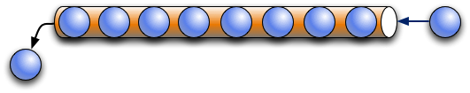
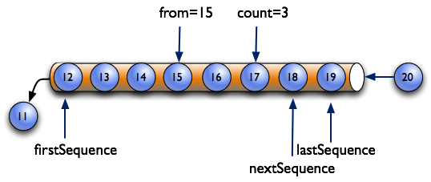
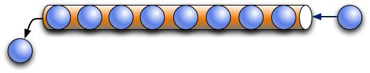

# Fundamentals

The MTConnect Standard defines the normative information model and protocol for retrieving information from manufacturing equipment. This document specifies the {{term(agent)}} behavior and protocol.

## Agent

The MTConnect Standard specifies the minimum functionality of the {{term(agent)}}. The functionality is as follows:

* Provides store and forward messaging middleware service.
* Provides key-value information storage and asset retrieval service.
* Implements the REST API for the MTConnect Standard (See {{package(REST Protocol)}}).
  * {{term(Device)}} metadata.
  * {{termplural(observation)}} collected by the agent.
  * {{termplural(asset)}} collected by the agent.

There are three types of information stored by an {{term(agent)}} that **MAY** be published in a {{term(response document)}}. These are as follows:

* {{term(equipment metadata)}} specified in {{package(Device Information Model)}}.
* {{term(streaming data)}} provides the {{termplural(observation)}} specified in {{package(Observation Information Model)}}.
* {{termplural(Asset)}} specified in {{package(Asset Information Model)}}.

### Agent Instance ID

The {{term(agent)}} **MUST** set the `instanceId` to a unique value whenever the {{term(sequence number)}} in the agent is initialized to `1`.  (see {{sect(Sequence Numbers)}} and {{sect(Persistence and Recovery)}} below). 

### Storage of Equipment Metadata

An {{term(agent)}} **MUST** be capable of publishing {{term(equipment metadata)}} for the {{term(agent)}} as specified in {{package(Device Information Model)}}.

### Storage of Streaming Data

The {{term(agent)}} **MAY** implement a {{term(buffer)}} with a fixed number of {{termplural(observation)}}. If the `bufferSize` is fixed, the {{term(agent)}} **MUST** store {{termplural(observation)}} using a first-in-first-out pattern. The {{term(agent)}} will remove the oldest {{term(observation)}} when the {{term(buffer)}} is full and a new {{term(observation)}} arrives.

{: width="0.8"}

In {{figure(first-in-first-out-buffer-management)}}, the maximum number of {{termplural(observation)}} that can be stored in the {{term(buffer)}} of the {{term(agent)}} is 8. The `bufferSize` in the header reports the maximum number of {{termplural(observation)}}. This example illustrates that when the {{term(buffer)}} fills up, the oldest piece of data falls out the other end.

{: width="0.8"}

> Note: As an implementation suggestion, the {{term(buffer)}} should be sized large enough to provide a continuous stream of {{termplural(observation)}}. The implementer should also consider the impact of a temporary loss of communications when determining the size for the {{term(buffer)}}. A larger {{term(buffer)}} will allow more time to reconnect to an {{term(agent)}} without losing data.

#### Sequence Numbers

In an {{term(agent)}}, each occurrence of an {{term(observation)}} in the {{term(buffer)}} will be assigned a monotonically increasing unsigned 64-bit integer ({{term(sequence number)}}) when it arrives. The first {{term(sequence number)}} **MUST** be `1`.

The {{term(sequence number)}} for each {{term(observation)}} **MUST** be unique for an instance of an {{term(agent)}} identified by an `instanceId`.

{{table(instanceid-and-sequence)}} illustrates the changing of the `instanceId` when an {{term(agent)}} resets the {{term(sequence number)}} to `1`.

| `instanceId` | `sequence` | 
|-------------:|-----------:|
|{{rowspan(5)}} 234556|234|
||235|
||236|
||237|
||238|
|{{span(2)}} Agent Stops and Restarts|
|{{rowspan(5)}} 234557|1|
||2|
||3|
||4|
||5|
{: caption="instanceId and sequence" label="instanceid-and-sequence" }

{{figure(identifying-the-range-of-data-with-firstsequence-and-lastsequence)}} shows two additional pieces of information defined for an {{term(agent)}}:

* `firstSequence` -- the oldest {{term(observation)}} in the {{term(buffer)}}. The {{term(agent)}} removes this {{term(observation)}} when it receives the next {{term(observation)}}

* `lastSequence` -- the newest {{term(observation)}} in the {{term(buffer)}}

`firstSequence` and `lastSequence` provide the range of values for the REST API requests.

{: width="0.75"}

The {{term(agent)}} **MUST** begin evaluating {{termplural(observation)}} with {{term(sample request)}}'s `from` parameter. Also, the {{term(agent)}}  **MUST** include a maximum number of {{termplural(observation)}} given by the `count` parameter in the {{term(response document)}}.

In {{figure(identifying-the-range-of-data-with-from-and-count)}}, the request specifies the {{termplural(observation)}} start at {{term(sequence number)}} `15` (`from`) and includes a total of three items (`count`).

{: width="0.75"}

`nextSequence` header property has the {{term(sequence number)}} of the next {{term(observation)}} in the {{term(buffer)}} for subsequent {{termplural(sample request)}} providing a contiguous set of {{termplural(observation)}}. In the example in {{figure(identifying-the-range-of-data-with-from-and-count)}}, the next {{term(sequence number)}} (`nextSequence`) will be 18.

As shown in {{figure(identifying-the-range-of-data-with-nextsequence-and-lastsequence)}}, the combination of `from` and `count` defined by the {{term(request)}} indicates a {{term(sequence number)}} for data that is beyond that which is currently in the {{term(buffer)}}. In this case, `nextSequence` is set to a value of $$ lastSequence + 1 $$.

{: width="0.75"}

#### Observation Buffer

An {{term(observation)}} has four pieces of information as follows:

1. {{term(sequence number)}} associated with each {{term(observation)}} - `sequence`.
2. The `timestamp` the {{term(observation)}} was made. .
3. A reference to the `dataitemid` from the {{package(Device Information Model)}}.
4. The value of the {{term(observation)}}.

{{table(data-storage-concept)}} is an example demonstrating the concept of how data may be stored in an {{term(agent)}}:

| `sequence` | `timestamp` | `dataItemId` | `result` |
|-----------:|------------:|-------------:|---------:|
|`101`|`2016-12-13T09:44:00.2221Z`|`AVAIL-28277`|`UNAVAILABLE`|
|`102`|`2016-12-13T09:54:00.3839Z`|`AVAIL-28277`|`AVAILABLE`|
|`103`|`2016-12-13T10:00:00.0594Z`|`POS-Y-28277`|`25.348`|
|`104`|`2016-12-13T10:00:00.0594Z`|`POS-Z-28277`|`13.23`|
|`105`|`2016-12-13T10:00:03.2839Z`|`SS-28277`|`0`|
|`106`|`2016-12-13T10:00:03.2839Z`|`POS-X-28277`|`11.195`|
|`107`|`2016-12-13T10:00:03.2839Z`|`POS-Y-28277`|`24.938`|
|`108`|`2016-12-13T10:01:37.8594Z`|`POS-Z-28277`|`1.143`|
|`109`|`2016-12-13T10:02:03.2617Z`|`SS-28277`|`1002`|
{: caption="Data Storage Concept" label="data-storage-concept" }

#### Timestamp

{{termplural(observation)}} **MUST** have a `timestamp` giving the most accurate time that the {{term(observation)}} occurred.

The timezone of the `timestamp` **MUST** be UTC (Coordinated Universal Time)  and represented using ISO 8601 format: e.g., "2010-04-01T21:22:43Z".

Applications **SHOULD** use the {{term(observation)}}'s `timestamp` for ordering as opposed to {{term(sequence number)}}.

All {{termplural(observation)}} occurring at the same time **MUST** have the same `timestamp`. 

#### Recording Occurrences of Streaming Data

The {{term(agent)}} **MUST** only place {{termplural(observation)}} in the {{term(buffer)}} if the data has changed from the previous {{term(observation)}} for the same {{block(DataItem)}}. 

The {{term(agent)}} **MUST** place every {{term(observation)}} in the {{term(buffer)}}, without checking for changes, in the following cases:

* The {{property(DataItem::discrete)}} is `true`. 
* The {{property(DataItem::representation)}} is `DISCRETE`.
* The {{property(DataItem::representation)}} is `TIME_SERIES`.

#### Maintaining Last Value for Data Entities

An {{term(agent)}} **MUST** retain the most recent {{term(observation)}} associated with each {{block(DataItem)}}, even if the {{term(observation)}} is no longer in the {{term(buffer)}}. This function supports the {{term(current request)}} functionality.

#### Unavailability of Data

An {{term(observation)}} with the value of `UNAVAILABLE` indicates the value is indeterminate.

The {{term(agent)}} **MUST** initialize every {{block(DataItem)}}, unless it has a constant value (see below), with an {{term(observation)}} with the value of `UNAVAILABLE`. Aditionally, whenever the data source is unreachable, every {{block(DataItem)}} associated with the data source must have an {{term(observation)}} with the value of `UNAVAILABLE` and `timestamp` when the connection was lost. 

An {{block(DataItem)}} that is constrained to a constant value, as defined in {{package(Device Information Model)}}, **MUST** only have an {{term(observation)}} with the constant value and **MUST NOT** be set to `UNAVAILABLE`.

#### Persistence and Recovery

The {{term(agent)}} **MAY** have a fixed size {{term(buffer)}} and the {{term(buffer)}} **MAY** be ephemeral.

If the {{term(buffer)}} is recoverable, the {{term(agent)}} **MUST NOT** change the `instanceId` and **MUST NOT** set the {{term(sequence number)}} to `1`. The {{term(sequence number)}} **MUST** be one greater than the maximum value of the recovered {{termplural(observation)}}. $$ max(sequence) + 1 $$

### Storage of MTConnect Assets

An {{term(agent)}} **MAY** only retain a limited number of {{block(Asset)}}s in the {{term(asset buffer)}}. The {{block(Asset)}}s are stored in first-in-first-out method where the oldest {{block(Asset)}} is removed when the {{term(asset buffer)}} is full and a new {{block(Asset)}} arrives.

{{figure(first-in-first-out-asset-buffer-management)}} illustrates the oldest {{block(Asset)}} being removed from the {{term(asset buffer)}} when a new {{block(Asset)}} is added and the {{term(asset buffer)}} is full:

{: width="0.6"}

{{block(Asset)}}s are indexed by {{property(Asset::assetId)}}. In the case of {{block(Asset)}}s, {{figure(relationship-between-assetid-and-stored-asset-documents)}} demonstrates the relationship between the key ({{property(Asset::assetId)}}) and the stored {{block(Asset)}}:

{: width="0.25"}

> Note: The key ({{property(Asset::assetId)}}) is independent of the order of the {{block(Asset)}} stored in the {{term(asset buffer)}}.

When the {{term(agent)}} receives a new {{block(Asset)}}, one of the following rules **MUST** apply:

* If the {{block(Asset)}} is not in the {{term(asset buffer)}}, the {{term(agent)}} **MUST** add the new {{block(Asset)}} to the front of the {{term(asset buffer)}}. If the {{term(asset buffer)}} is full, the oldest {{block(Asset)}} will be removed from the {{term(asset buffer)}}.

* If the {{block(Asset)}} is already in the {{term(asset buffer)}}, the {{term(agent)}} **MUST** replace the existing {{block(Asset)}} and move the {{block(Asset)}} to the front of the {{term(asset buffer)}}. 

The number of {{block(Asset)}} that may be stored in an {{term(agent)}} is defined by the value for {{property(Header::assetBufferSize)}}. An {{property(Header::assetBufferSize)}} of 4,294,967,296 or $$ 2^{32 } $$ **MUST** indicate unlimited storage.

The {{term(asset buffer)}} **MAY** be ephemeral and the {{block(Asset)}} entities will be lost if the {{term(agent)}} clears the {{term(asset buffer)}}. They must be recovered from the data source.

{{package(Asset Information Model)}} provides additional information on {{term(asset)}} management. 

## Response Documents

{{termplural(response document)}} are electronic documents generated by an {{term(agent)}} in response to a {{term(request)}} for data. 

The {{termplural(response document)}} defined in the MTConnect Standard are:

* {{term(MTConnectDevices Response Document)}}: Describes the composition and configuration of the {{term(Device)}} and the data that can be observed. See {{package(MTConnectDevices Response Document)}} and {{package(Device Information Model)}} for details on this information model.

* {{term(MTConnectStreams Response Document)}}: {{termplural(Observation)}} made at a point in time about related {{termplural(DataItem)}}. See {{package(MTConnectStreams Response Document)}} and {{package(Observation Information Model)}} for details on this information model.

* {{term(MTConnectAssets Response Document)}}: {{termplural(Asset)}}  related to {{termplural(Device)}}. See {{package(MTConnectAssets Response Document)}} and {{package(Asset Information Model)}} for details on this information model.

* {{term(MTConnectErrors Response Document)}}: Information in response to a failed request. See {{package(MTConnectErrors Response Document)}} for details on this information model.

## Request/Response Information Exchange

The transfer of information between an {{term(agent)}} and a client software application is based on a {{term(request and response)}} REST protocol. A client application requests specific information from an {{term(agent)}} and an {{term(agent)}} responds with a {{term(response document)}}.

There are four types of {{termplural(MTConnect Request)}}. These {{termplural(request)}} are as follows:

* {{term(probe request)}}: Requests information about one more more {{termplural(Device)}} as an {{block(MTConnectDevices)}} block.

* {{term(current request)}}: Requests the most recent, or snapshot at a {{term(sequence number)}}, {{termplural(observation)}} as an {{block(MTConnectStreams)}} block.

* {{term(sample request)}}: Requests a series of {{termplural(observation)}} as an {{block(MTConnectStreams)}} block.

* {{term(asset request)}}: Requests a set of {{termplural(asset)}} as an {{block(MTConnectAssets)}} block.

If an {{term(agent)}} is unable to respond to the request for information or the request includes invalid information, the {{term(agent)}} will publish an {{term(MTConnectErrors Response Document)}}. See {{block(MTConnectErrors)}}.

See {{package(REST Protocol)}} for the details on the normative requirements of the agent.

{{input(sections/Fundamentals.md)}}

# MTConnect Protocol

The {{term(agent)}} **MUST** support the {{package(REST Protocol)}} and produce {{term(XML)}} representations of the information models. 

All other protocols and representations are optional.

{{input(sections/MTConnectProtocol.md)}}

{{input(sections/RESTProtocol.md)}}

{{input(sections/MTConnectDevicesResponseDocument.md)}}

{{input(sections/MTConnectStreamsResponseDocument.md)}}

{{input(sections/MTConnectAssetsResponseDocument.md)}}

# Error Information Model

The {{term(Error Information Model)}} establishes the rules and terminology that describes the {{term(response document)}} returned by an {{term(agent)}} when it encounters an error while interpreting a {{term(request)}} for information from a client software application or when an {{term(agent)}} experiences an error while publishing the {{term(response)}} to a {{term(request)}} for information.      

An {{term(agent)}} provides the information regarding errors encountered when processing a {{term(request)}} for information by publishing an {{term(MTConnectErrors Response Document)}} to the client software application that made the {{term(request)}} for information.

{{input(sections/MTConnectErrorsResponseDocument.md)}}
