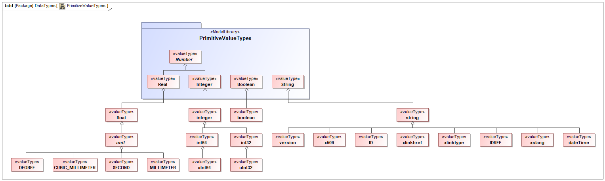

# MTConnect Specification and Material Statement

{{term(AMT)}} owns the copyright in this MTConnect Specification or Material. {{term(AMT)}} grants to you a non-exclusive, non-transferable, revocable, non-sublicensable, fully-paid-up copyright license to reproduce, copy and redistribute this MTConnect Specification or Material, provided that you may only copy or redistribute the MTConnect Specification or Material in the form in which you received it, without modifications, and with all copyright notices and other notices and disclaimers contained in the MTConnect Specification or Material.

If you intend to adopt or implement an MTConnect Specification or Material in a product, whether hardware, software or firmware, which complies with an MTConnect Specification, you shall agree to the MTConnect Specification Implementer License Agreement ("Implementer License") or to the MTConnect Intellectual Property Policy and Agreement ("IP Policy"'). The Implementer License and IP Policy each sets forth the license terms and other terms of use for MTConnect Implementers to adopt or implement the MTConnect Specifications, including certain license rights covering necessary patent claims for that purpose. These materials can be found at {{url(www.MTConnect.org)}}, or or by contacting {{url(mailto:info@MTConnect.org)}}. 

MTConnect Institute and {{term(AMT)}} have no responsibility to identify patents, patent claims or patent applications which may relate to or be required to implement a Specification, or to determine the legal validity or scope of any such patent claims brought to their attention. Each MTConnect Implementer is responsible for securing its own licenses or rights to any patent or other intellectual property rights that may be necessary for such use, and neither {{term(AMT)}} nor MTConnect Institute have any obligation to secure any such rights.

This Material and all MTConnect Specifications and Materials are provided "as is" and MTConnect Institute and {{term(AMT)}}, and each of their respective members, officers, affiliates, sponsors and agents, make no representation or warranty of any kind relating to these materials or to any implementation of the MTConnect Specifications or Materials in any product, including, without limitation, any expressed or implied warranty of noninfringement, merchantability, or fitness for particular purpose, or of the accuracy, reliability, or completeness of information contained herein. In no event shall MTConnect Institute or {{term(AMT)}} be liable to any user or implementer of MTConnect Specifications or Materials for the cost of procuring substitute goods or services, lost profits, loss of use, loss of data or any incidental, consequential, indirect, special or punitive damages or other direct damages, whether under contract, tort, warranty or otherwise, arising in any way out of access, use or inability to use the MTConnect Specification or other MTConnect Materials, whether or not they had advance notice of the possibility of such damage.

The normative XMI is located at the following URL: [`MTConnectSysMLModel.xml`](https://model.mtconnect.org/MTConnectSysMLModel.xml)

# Purpose of This Document

This document, {{package(Interface Interaction Model)}} of the MTConnect Standard, defines a structured data model used to organize information required to coordinate inter-operations between pieces of equipment.  

This data model is based on an {{term(interaction model)}} that defines the exchange of information between pieces of equipment and is organized in the MTConnect Standard by {{block(Interfaces)}}.   

{{block(Interfaces)}} is modeled as an extension to the {{term(Device Information Model)}} and {{term(Observation Information Model)}}.  {{block(Interfaces)}} leverages similar rules and terminology as those used to describe a component in the {{term(Device Information Model)}}.  {{block(Interfaces)}} also uses similar methods for reporting data to those used in the {{term(MTConnectStreams Response Document)}}.  

As defined in {{package(Device Information Model)}}, {{block(Interfaces)}} {{termplural(organize)}} the {{block(Interface)}} types (see {{figure(Interfaces in Entity Hierarchy)}}).  Each individual {{block(Interface)}} contains data associated with the corresponding {{term(interface)}}.

> Note: See {{package(Device Information Model)}} and {{package(Observation Information Model)}} of the MTConnect Standard for information on how {{block(Interfaces)}} is structured in the {{termplural(response document)}} which are returned from an {{term(agent)}} in response to a {{term(probe request)}}, {{term(sample request)}}, or {{term(current request)}}.

# Terminology and Conventions

Refer to {{package(Fundamentals)}} for a dictionary of terms, reserved language, and document conventions used in the MTConnect Standard.

{{printglossary[title=General Terms, type=general]()}}
{{printglossary[title=Information Model Terms, type=informationmodel]()}}
{{printglossary[title=Protocol Terms, type=protocol]()}}
{{printglossary[title=HTTP Terms, type=http]()}}
{{printglossary[title=XML Terms, type=xml]()}}
{{printglossary[title=MTConnect Terms, type=conceptmodel]()}}

{{printacronyms()}}

{{printbibliography[title=MTConnect References,keyword=MTC]()}}

{{printbibliography[title=Other References,notkeyword=MTC]()}}

{{glsaddall()}}

# Interface Interaction Model

In many manufacturing processes, multiple pieces of equipment must work together to perform a task.  The traditional method for coordinating the activities between individual pieces of equipment is to connect them using a series of wires to communicate equipment states and demands for action.  These interactions use simple binary ON/OFF signals to accomplished their intention.

In the MTConnect Standard, {{termplural(interface)}} provides a means to replace this traditional method for interconnecting pieces of equipment with a structured {{term(interaction model)}} that provides a rich set of information used to coordinate the actions between pieces of equipment.  Implementers may utilize the information provided by this data model to (1) realize the interaction between pieces of equipment and (2) to extend the functionality of the equipment to improve the overall performance of the manufacturing process. 

The {{term(interaction model)}} used to implement {{termplural(interface)}} provides a lightweight and efficient protocol, simplifies failure recovery scenarios, and defines a structure for implementing a Plug-And-Play relationship between pieces of equipment.  By standardizing the information exchange using this higher-level semantic information model, an implementer may more readily replace a piece of equipment in a manufacturing system with any other piece of equipment capable of providing similar {{term(interaction model)}} functions.

Two primary functions are required to implement the {{term(interaction model)}} for an {{termplural(interface)}} and manage the flow of information between pieces of equipment.  Each piece of equipment needs to have the following:

* An {{term(agent)}} which provides:
    
 - The data required to implement the {{term(interaction model)}}.
    
 - Any other data from a piece of equipment needed to implement the {{term(interface)}} – operating states of the equipment, position information, execution modes, process information, etc. 
 
* A client software application that enables the piece of equipment to acquire and interpret information from another piece of equipment. 

## Interfaces Architecture

MTConnect Standard is based on a communications method that provides no direct way for one piece of equipment to change the state of or cause an action to occur in another piece of equipment.  The {{term(interaction model)}} used to implement {{termplural(interface)}} is based on a {{term(publish and subscribe)}} type of communications as described in {{package(Fundamentals)}} and utilizes a {{term(request)}} and {{term(response)}} information exchange mechanism.  For {{termplural(interface)}}, pieces of equipment must perform both the publish ({{term(agent)}}) and subscribe (client) functions.  

> Note: The current definition of {{termplural(interface)}} addresses the interaction between two pieces of equipment.  Future releases of the MTConnect Standard may address the interaction between multiple (more than two) pieces of equipment.

{: width="0.8"}

> Note: The data flow architecture illustrated in {{figure(Data Flow Architecture for Interfaces)}} was historically referred to in the MTConnect Standard as a read-read concept.

In the implementation of the {{term(interaction model)}} for {{termplural(interface)}}, two pieces of equipment can exchange information in the following manner.  One piece of equipment indicates a {{term(request)}} for service by publishing a type of {{term(request)}} using a data item provided through an {{term(agent)}} as defined in {{package(DataItem Types for Interface)}}.  The client associated with the second piece of equipment, which is subscribing to data from the first machine, detects and interprets that {{term(request)}}.  If the second machine chooses to take any action to fulfill this {{term(request)}}, it can indicate its acceptance by publishing a {{term(response)}} using a data item provided through its {{term(agent)}}.  The client on the first piece of equipment continues to monitor information from the second piece of equipment until it detects an indication that the {{term(response)}} to the {{term(request)}} has been completed or has failed.

An example of this type of interaction between pieces of equipment can be represented by a machine tool that wants the material to be loaded by a robot.  In this example, the machine tool is the {{term(requester)}}, and the robot is the {{term(responder)}}.  On the other hand, if the robot wants the machine tool to open a door, the robot becomes the {{term(requester)}} and the machine tool the {{term(responder)}}.

## Request and Response Information Exchange

The {{block(DataItem)}} elements defined by the {{term(interaction model)}} each have a `REQUEST` and `RESPONSE` subtype.  These subtypes identify if the data item represents a {{term(request)}} or a {{term(response)}}.  Using these data items, a piece of equipment changes the state of its {{term(request)}} or {{term(response)}} to indicate information that can be read by the other piece of equipment.  To aid in understanding how the {{term(interaction model)}} functions, one can view this {{term(interaction model)}} as a simple state machine. 

The interaction between two pieces of equipment can be described as follows.  When the {{term(requester)}} wants an activity to be performed, it transitions its {{term(request)}} state from a `READY` state to an `ACTIVE` state.  In turn, when the client on the {{term(responder)}} reads this information and interprets the {{term(request)}}, the {{term(responder)}} announces that it is performing the requested task by changing its response state to `ACTIVE`.  When the action is finished, the {{term(responder)}} changes its response state to `COMPLETE`.  This pattern of {{term(request)}} and {{term(response)}} provides the basis for the coordination of actions between pieces of equipment.  These actions are implemented using `EVENT` category data items.  (See {{package(DataItem Types for Interface)}} for details on the {{block(Event)}} type data items defined for {{termplural(interface)}}.)

> Note: The implementation details of how the {{term(responder)}} piece of equipment reacts to the {{term(request)}} and then completes the requested task are up to the implementer.

{: width="0.8"}

The initial condition of both the {{term(request)}} and {{term(response)}} states on both pieces of equipment is `READY`.  The dotted lines indicate the on-going communications that occur to monitor the progress of the interactions between the pieces of equipment.

The interaction between the pieces of equipment as illustrated in {{figure(Request and Response Overview)}} progresses through the sequence listed below.

* The {{term(request)}} transitions from `READY` to `ACTIVE` signaling that a service is needed.

* The {{term(response)}} detects the transition of the {{term(request)}}.

* The {{term(response)}} transitions from `READY` to `ACTIVE` indicating that it is performing the action.

* Once the action has been performed, the {{term(response)}} transitions to `COMPLETE`.

* The {{term(request)}} detects the action is `COMPLETE`.

* The {{term(request)}} transitions back to `READY` acknowledging that the service has been performed.

* The {{term(response)}} detects the {{term(request)}} has returned to `READY`.

* In recognition of this acknowledgement, the {{term(response)}} transitions back to `READY`.

After the final action has been completed, both pieces of equipment are back in the `READY` state indicating that they are able to perform another action.

## Interface

abstract {{block(Component)}} that coordinates actions and activities between pieces of equipment.

### Commonly Observed DataItem Types for Interface

{{tbl(commonly-observed-dataitem-types-for-interface)}} lists the Commonly Observed DataItem Types for {{block(Interface)}}.

|Commonly Observed DataItem Types|Multiplicity|
|:-|:-:|
|{{block(InterfaceState)}}|1|
{: caption="Commonly Observed DataItem Types for Interface" label="table:commonly-observed-dataitem-types-for-interface"}

# Interfaces for Device and Observation Information Models

The {{term(interaction model)}} for implementing {{termplural(interface)}} is defined in the MTConnect Standard as an extension to the {{term(Device Information Model)}} and {{term(Observation Information Model)}}.

A piece of equipment **MAY** support multiple different {{termplural(interface)}}. Each piece of equipment supporting {{termplural(interface)}} **MUST** model the information associated with each {{term(interface)}} as an {{block(Interface)}} component.  {{block(Interface)}} is an abstract {{block(Component)}} and is realized by {{block(Interface)}} component types. 

The {{figure(Interfaces in Entity Hierarchy)}} illustrates where an {{block(Interface)}} is modeled in the {{term(Device Information Model)}} for a piece of equipment.

{: width="0.8"}

## Interface Types

The abstract {{block(Interface)}} is realized by the following types listed in this section. 

In order to implement the {{term(interaction model)}} for {{termplural(interface)}}, each piece of equipment associated with an {{term(interface)}} **MUST** provide the corresponding {{block(Interface)}} type. A piece of equipment **MAY** support any number of unique {{termplural(interface)}}.

### BarFeederInterface

{{block(Interface)}} that coordinates the operations between a bar feeder and another piece of equipment.

Bar feeder is a piece of equipment that pushes bar stock (i.e., long pieces of material of various shapes) into an associated piece of equipment – most typically a lathe or turning center.

### ChuckInterface

{{block(Interface)}} that coordinates the operations between two pieces of equipment, one of which controls the operation of a chuck.

The piece of equipment that is controlling the chuck **MUST** provide the data item {{block(ChuckState)}} as part of the set of information provided.

### DoorInterface

{{block(Interface)}} that coordinates the operations between two pieces of equipment, one of which controls the operation of a door.

The piece of equipment that is controlling the door **MUST** provide data item {{block(DoorState)}} as part of the set of information provided.

### MaterialHandlerInterface

{{block(Interface)}} that coordinates the operations between a piece of equipment and another associated piece of equipment used to automatically handle various types of materials or services associated with the original piece of equipment.

A material handler is a piece of equipment capable of providing any one, or more, of a variety of support services for another piece of equipment or a process like:

* Loading/unloading material or tooling
* Part inspection
* Testing
* Cleaning

A robot is a common example of a material handler.

## Data for Interface

Each {{term(interface)}} **MUST** provide the data associated with the specific {{term(interface)}} to implement the {{term(interaction model)}} and any additional data that may be needed by another piece of equipment to understand the operating states and conditions of the first piece of equipment as it applies to the {{term(interface)}}.

Details on data items specific to the {{term(interaction model)}} for each type of {{term(interface)}} are provided in {{package(DataItem Types for Interface)}}.

An implementer may choose any other data available from a piece of equipment to describe the operating states and other information needed to support an {{term(interface)}}.

### References for Interface

Some of the data items needed to support a specific {{term(interface)}} may already be defined elsewhere in the {{term(MTConnectDevices Response Document)}} for a piece of equipment.  However, the implementer may not be able to directly associate this data with the {{term(interface)}} since the MTConnect Standard does not permit multiple occurrences of a piece of data to be configured in an {{term(MTConnectDevices Response Document)}}.  {{block(References)}} provides a mechanism for associating information defined elsewhere in the {{term(information model)}} for a piece of equipment with a specific {{term(interface)}}.  

{{block(References)}} {{termplural(organize)}} {{block(Reference)}} elements.

{{block(Reference)}} is a pointer to information that is associated with another entity defined elsewhere for a piece of equipment.

{{block(References)}} is an economical syntax for providing interface specific information without directly duplicating the occurrence of the data. It provides a mechanism to include all necessary information required for interaction and deterministic information flow between pieces of equipment.

For more information on the {{block(References)}} model, see {{package(Device Information Model)}}.

## DataItem Types for Interface

Each {{block(Interface)}} contains data items which are used to communicate information required to execute the {{term(interface)}}. When these data items are read by another piece of equipment, that piece of equipment can then determine the actions that it may take based upon that data.

{{block(InterfaceState)}} is a data item specifically defined for {{termplural(interface)}}.  It defines the operational state of the {{term(interface)}}.  This is an indicator identifying whether the {{term(interface)}} is functioning or not. See {{sect(InterfaceState)}} for complete semantic details.

Some data items **MAY** be directly associated with the {{block(Interface)}} element and others will be organized by a {{block(References)}} element. It is up to an implementer to determine which additional data items are required for a particular {{term(interface)}}.

### Specific Data Items for the Interaction Model for Interface

A special set of data items have been defined to be used in conjunction with {{block(Interface)}}. They provide information from a piece of equipment to {{term(request)}} a service to be performed by another associated piece of equipment; and for the associated piece of equipment to indicate its progress in performing its {{term(response)}} to the {{term(request)}} for service.  .

Many of the data items describing the services associated with an {{term(interface)}} are paired to describe two distinct actions – one to {{term(request)}} an action to be performed and a second to reverse the action or to return to an original state.  For example, a {{block(DoorInterface)}} will have two actions {{block(OpenDoor)}} and {{block(CloseDoor)}}. An example of an implementation of this would be a robot that indicates to a machine that it would like to have a door opened so that the robot could extract a part from the machine and then asks the machine to close that door once the part has been removed. 

When these data items are used to describe a service associated with an {{term(interface)}}, they **MUST** have one of the following two `subType` elements: `REQUEST` or `RESPONSE`.  These **MUST** be specified to define whether the piece of equipment is functioning as the {{term(requester)}} or {{term(responder)}} for the service to be performed.  The {{term(requester)}} **MUST** specify the `REQUEST` `subType` for the data item and the {{term(responder)}} **MUST** specify a corresponding `RESPONSE` `subType` for the data item to enable the coordination between the two pieces of equipment.   

These data items and their associated `subType` provide the basic structure for implementing the {{term(interaction model)}} for an {{term(interface)}} and are defined in the following sections.

{{figure(Request State Machine)}} and {{figure(Response State Machine)}} show possible state transitions for a {{term(request)}} and {{term(response)}} respectively. The state machine diagrams provide the permissible values of the {{termplural(observation)}} for the {{block(DataItem)}} types listed in this section.

{: width="0.8"}

{: width="0.8"}

### CloseChuck

{{def(InterfaceEventEnum:CLOSE_CHUCK)}}

A {{property(subType)}} **MUST** always be specified.

#### Subtypes of CloseChuck

* `REQUEST`

    operating state of the {{term(request)}} to close a chuck.

    

    `RequestStateEnum` Enumeration:

    * `ACTIVE` 

        {{term(requester)}} has initiated a {{term(request)}} for a service and the service has not yet been completed by the {{term(responder)}}.

    * `FAIL` 

        {{term(requester)}} has detected a failure condition.

    * `NOT_READY` 

        {{term(requester)}} is not ready to make a {{term(request)}}.

    * `READY` 

        {{term(requester)}} is prepared to make a {{term(request)}}, but no {{term(request)}} for service is required.

* `RESPONSE`

    operating state of the {{term(response)}} to a {{term(request)}} to close a chuck.

    

    `ResponseStateEnum` Enumeration:

    * `ACTIVE` 

        {{term(responder)}} has detected and accepted a {{term(request)}} for a service and is in the process of performing the service, but the service has not yet
        been completed.

    * `COMPLETE` 

        {{term(responder)}} has completed the actions required to perform the service.

    * `FAIL` 

        {{term(responder)}} has detected a failure condition.

    * `NOT_READY` 

        {{term(responder)}} is not ready to perform a service.

    * `READY` 

        {{term(responder)}} is prepared to react to a {{term(request)}}, but no {{term(request)}} for service has been detected.

### CloseDoor

{{def(InterfaceEventEnum:CLOSE_DOOR)}}

A {{property(subType)}} **MUST** always be specified.

#### Subtypes of CloseDoor

* `REQUEST`

    operating state of the {{term(request)}} to close a door.

    

    The value of {{property(CloseDoor)}} **MUST** be one of the `RequestStateEnum` enumeration. 

* `RESPONSE`

    operating state of the {{term(response)}} to a {{term(request)}} to close a door.

    

    The value of {{property(CloseDoor)}} **MUST** be one of the `ResponseStateEnum` enumeration. 

### InterfaceState

{{def(InterfaceEventEnum:INTERFACE_STATE)}}

When the {{block(InterfaceState)}} is `DISABLED`, the state of all data items that are specific for the {{term(interaction model)}} associated with that {{block(Interface)}} **MUST** be set to `NOT_READY`.

`InterfaceStateEnum` Enumeration:

* `DISABLED` 

    {{block(Interface)}} is currently not operational.

* `ENABLED` 

    {{block(Interface)}} is currently operational and performing as expected.

### MaterialChange

{{def(InterfaceEventEnum:MATERIAL_CHANGE)}}

A {{property(subType)}} **MUST** always be specified.

#### Subtypes of MaterialChange

* `REQUEST`

    operating state of the {{term(request)}} to change the type of material or product being loaded or fed to a piece of equipment.

    

    The value of {{property(MaterialChange)}} **MUST** be one of the `RequestStateEnum` enumeration. 

* `RESPONSE`

    operating state of the {{term(response)}} to a {{term(request)}} to change the type of material or product being loaded or fed to a piece of equipment.

    

    The value of {{property(MaterialChange)}} **MUST** be one of the `ResponseStateEnum` enumeration. 

### MaterialFeed

{{def(InterfaceEventEnum:MATERIAL_FEED)}}

A {{property(subType)}} **MUST** always be specified.

#### Subtypes of MaterialFeed

* `REQUEST`

    operating state of the {{term(request)}} to advance material or feed product to a piece of equipment from a continuous or bulk source.

    

    The value of {{property(MaterialFeed)}} **MUST** be one of the `RequestStateEnum` enumeration. 

* `RESPONSE`

    operating state of the {{term(response)}} to a {{term(request)}} to advance material or feed product to a piece of equipment from a continuous or bulk source.

    

    The value of {{property(MaterialFeed)}} **MUST** be one of the `ResponseStateEnum` enumeration. 

### MaterialLoad

{{def(InterfaceEventEnum:MATERIAL_LOAD)}}

A {{property(subType)}} **MUST** always be specified.

#### Subtypes of MaterialLoad

* `REQUEST`

    operating state of the {{term(request)}} to load a piece of material or product.

    

    The value of {{property(MaterialLoad)}} **MUST** be one of the `RequestStateEnum` enumeration. 

* `RESPONSE`

    operating state of the {{term(response)}} to a {{term(request)}} to load a piece of material or product.

    

    The value of {{property(MaterialLoad)}} **MUST** be one of the `ResponseStateEnum` enumeration. 

### MaterialRetract

{{def(InterfaceEventEnum:MATERIAL_RETRACT)}}

A {{property(subType)}} **MUST** always be specified.

#### Subtypes of MaterialRetract

* `REQUEST`

    operating state of the {{term(request)}} to remove or retract material or product.

    

    The value of {{property(MaterialRetract)}} **MUST** be one of the `RequestStateEnum` enumeration. 

* `RESPONSE`

    operating state of the {{term(response)}} to a {{term(request)}} to remove or retract material or product.

    

    The value of {{property(MaterialRetract)}} **MUST** be one of the `ResponseStateEnum` enumeration. 

### MaterialUnload

{{def(InterfaceEventEnum:MATERIAL_UNLOAD)}}

A {{property(subType)}} **MUST** always be specified.

#### Subtypes of MaterialUnload

* `REQUEST`

    operating state of the {{term(request)}} to unload a piece of material or product.

    

    The value of {{property(MaterialUnload)}} **MUST** be one of the `RequestStateEnum` enumeration. 

* `RESPONSE`

    operating state of the {{term(response)}} to a {{term(request)}} to unload a piece of material or product.

    

    The value of {{property(MaterialUnload)}} **MUST** be one of the `ResponseStateEnum` enumeration. 

### OpenChuck

{{def(InterfaceEventEnum:OPEN_CHUCK)}}

A {{property(subType)}} **MUST** always be specified.

#### Subtypes of OpenChuck

* `REQUEST`

    operating state of the {{term(request)}} to open a chuck.

    

    The value of {{property(OpenChuck)}} **MUST** be one of the `RequestStateEnum` enumeration. 

* `RESPONSE`

    operating state of the {{term(response)}} to a {{term(request)}} to open a chuck.

    

    The value of {{property(OpenChuck)}} **MUST** be one of the `ResponseStateEnum` enumeration. 

### OpenDoor

{{def(InterfaceEventEnum:OPEN_DOOR)}}

A {{property(subType)}} **MUST** always be specified.

#### Subtypes of OpenDoor

* `REQUEST`

    operating state of the {{term(request)}} to open a door.

    

    The value of {{property(OpenDoor)}} **MUST** be one of the `RequestStateEnum` enumeration. 

* `RESPONSE`

    operating state of the {{term(response)}} to a {{term(request)}} to open a door.

    

    The value of {{property(OpenDoor)}} **MUST** be one of the `ResponseStateEnum` enumeration. 

### PartChange

{{def(InterfaceEventEnum:PART_CHANGE)}}

A {{property(subType)}} **MUST** always be specified.

#### Subtypes of PartChange

* `REQUEST`

    operating state of the {{term(request)}} to change the part or product associated with a piece of equipment to a different part or product.

    

    The value of {{property(PartChange)}} **MUST** be one of the `RequestStateEnum` enumeration. 

* `RESPONSE`

    operating state of the {{term(response)}} to a {{term(request)}} to change the part or product associated with a piece of equipment to a different part or product.

    

    The value of {{property(PartChange)}} **MUST** be one of the `ResponseStateEnum` enumeration. 

# Operation and Error Recovery

The {{term(request and response)}} state model implemented for {{termplural(interface)}} may also be represented by a graphical model.  The scenario in {{figure(Success Scenario)}} demonstrates the state transitions that occur during a successful {{term(request)}} for service and the resulting {{term(response)}} to fulfill that service {{term(request)}}. 

{: width="0.8"}

## Request and Response Failure Handling and Recovery

A significant feature of the {{term(request and response)}} {{term(interaction model)}} is the ability for either piece of equipment to detect a failure associated with either the {{term(request)}} or {{term(response)}} actions.  When either a failure or unexpected action occurs, the {{term(request)}} and the {{term(response)}} portion of the {{term(interaction model)}} can announce a `FAIL` state upon detecting a problem.  The following are graphical models describing multiple scenarios where either the {{term(requester)}} or {{term(responder)}} detects and reacts to a failure.  In these examples, either the {{term(requester)}} or {{term(responder)}} announces the detection of a failure by setting either the {{term(request)}} or the {{term(response)}} state to `FAIL`.  

Once a failure is detected, the {{term(interaction model)}} provides information from each piece of equipment as they attempt to recover from a failure, reset all of their functions associated with the {{term(interface)}} to their original state, and return to normal operation.

The following sections are scenarios that describe how pieces of equipment may react to different types of failures and how they indicate when they are again ready to request a service or respond to a request for service after recovering from those failures:

### Responder Fails Immediately

In this scenario, a failure is detected by the {{term(responder)}} immediately after a {{term(request)}} for service has been initiated by the {{term(requester)}}.

{: width="0.8"}

In this case, the {{term(request)}} transitions to `ACTIVE` and the {{term(responder)}} immediately detects a failure before it can transition the {{term(response)}} state to `ACTIVE`.  When this occurs, the {{term(responder)}} transitions the {{term(response)}} state to `FAIL`.

After detecting that the {{term(responder)}} has transitioned its state to `FAIL`, the {{term(requester)}} **MUST** change its state to `FAIL`.

The {{term(requester)}}, as part of clearing a failure, resets any partial actions that were initiated and attempts to return to a condition where it is again ready to request a service.  If the recovery is successful, the {{term(requester)}} changes its state from `FAIL` to `READY`.  If for some reason the {{term(requester)}} cannot return to a condition where it is again ready to request a service, it transitions its state from `FAIL` to `NOT_READY`.

The {{term(responder)}}, as part of clearing a failure, resets any partial actions that were initiated and attempts to return to a condition where it is again ready to perform a service.  If the recovery is successful, the {{term(responder)}} changes its {{term(response)}} state from `FAIL` to `READY`.  If for some reason the {{term(responder)}} is not again prepared to perform a service, it transitions its state from `FAIL` to `NOT_READY`.

### Responder Fails While Providing a Service

This is the most common failure scenario.  In this case, the {{term(responder)}} will begin the actions required to provide a service.  During these actions, the {{term(responder)}} detects a failure and transitions its {{term(response)}} state to `FAIL`.

{: width="0.8"}

When a {{term(requester)}} detects a failure of a {{term(responder)}}, it transitions it state from `ACTIVE` to `FAIL`.  

The {{term(requester)}} resets any partial actions that were initiated and attempts to return to a condition where it is again ready to request a service.  If the recovery is successful, the {{term(requester)}} changes its state from `FAIL` to `READY` if the failure has been cleared and it is again prepared to request another service.  If for some reason the {{term(requester)}} cannot return to a condition where it is again ready to request a service, it transitions its state from `FAIL` to `NOT_READY`.

The {{term(responder)}}, as part of clearing a failure, resets any partial actions that were initiated and attempts to return to a condition where it is again ready to perform a service.  If the recovery is successful, the {{term(responder)}} changes its {{term(response)}} state from `FAIL` to `READY` if it is again prepared to perform a service.  If for some reason the {{term(responder)}} is not again prepared to perform a service, it transitions its state from `FAIL` to `NOT_READY`.

### Requester Failure During a Service Request

In this scenario, the {{term(responder)}} will begin the actions required to provide a service.  During these actions, the {{term(requester)}} detects a failure and transitions its {{term(request)}} state to `FAIL`.

{: width="0.8"}

When the {{term(responder)}} detects that the {{term(requester)}} has transitioned its {{term(request)}} state to `FAIL`, the {{term(responder)}} also transitions its {{term(response)}} state to `FAIL`. 

The {{term(requester)}}, as part of clearing a failure, resets any partial actions that were initiated and attempts to return to a condition where it is again ready to request a service.  If the recovery is successful, the {{term(requester)}} changes its state from `FAIL` to `READY`.  If for some reason the {{term(requester)}} cannot return to a condition where it is again ready to request a service, it transitions its state from `FAIL` to `NOT_READY`.

The {{term(responder)}}, as part of clearing a failure, resets any partial actions that were initiated and attempts to return to a condition where it is again ready to perform a service.  If the recovery is successful, the {{term(responder)}} changes its {{term(response)}} state from `FAIL` to `READY`.  If for some reason the {{term(responder)}} is not again prepared to perform a service, it transitions its state from `FAIL` to `NOT_READY`.

### Requester Changes to an Unexpected State While Responder is Providing a Service

In some cases, a {{term(requester)}} may transition to an unexpected state after it has initiated a {{term(request)}} for service.  

As demonstrated in {{figure(Requester Makes Unexpected State Change)}}, the {{term(requester)}} has initiated a {{term(request)}} for service and its {{term(request)}} state has been changed to `ACTIVE`.  The {{term(responder)}} begins the actions required to provide the service.  During these actions, the {{term(requester)}} transitions its {{term(request)}} state back to `READY` before the {{term(responder)}} can complete its actions.  This **SHOULD** be regarded as a failure of the {{term(requester)}}.

{: width="0.8"}

In this case, the {{term(responder)}} reacts to this change of state of the {{term(requester)}} in the same way as though the {{term(requester)}} had transitioned its {{term(request)}} state to `FAIL` (i.e., the same as in Scenario 3 above).

At this point, the {{term(responder)}} then transitions its {{term(response)}} state to `FAIL`.

The {{term(responder)}} resets any partial actions that were initiated and attempts to return to its original condition where it is again ready to perform a service.  If the recovery is successful, the {{term(responder)}} changes its {{term(response)}} state from `FAIL` to `READY`.  If for some reason the {{term(responder)}} is not again prepared to perform a service, it transitions its state from `FAIL` to `NOT_READY`.

> Note: The same scenario exists if the {{term(requester)}} transitions its {{term(request)}} state to `NOT_READY`.  However, in this case, the {{term(requester)}} then transitions its {{term(request)}} state to `READY` after it resets all of its functions back to a condition where it is again prepared to make a {{term(request)}} for service.

### Responder Changes to an Unexpected State While Providing a Service

Similar to Scenario 5, a {{term(responder)}} may transition to an unexpected state while providing a service.  

As demonstrated in {{figure(Responder Makes Unexpected State Change)}}, the {{term(responder)}} is performing the actions to provide a service and the {{term(response)}} state is `ACTIVE`.  During these actions, the {{term(responder)}} transitions its state to `NOT_READY` before completing its actions.  This should be regarded as a failure of the {{term(responder)}}.

{: width="0.8"}

Upon detecting an unexpected state change of the {{term(responder)}}, the {{term(requester)}} transitions its state to `FAIL`.  

The {{term(requester)}} resets any partial actions that were initiated and attempts to return to a condition where it is again ready to request a service.  If the recovery is successful, the {{term(requester)}} changes its state from `FAIL` to `READY`.  If for some reason the {{term(requester)}} cannot return to a condition where it is again ready to request a service, it transitions its state from `FAIL` to `NOT_READY`.

Since the {{term(responder)}} has failed to an invalid state, the condition of the {{term(responder)}} is unknown.  Where possible, the {{term(responder)}} should try to reset to an initial state. 

The {{term(responder)}}, as part of clearing the cause for the change to the unexpected state, should attempt to reset any partial actions that were initiated and then return to a condition where it is again ready to perform a service.  If the recovery is successful, the {{term(responder)}} changes its {{term(response)}} state from the unexpected state to `READY`.  If for some reason the {{term(responder)}} is not again prepared to perform a service, it maintains its state as `NOT_READY`. 

### Responder or Requester Become UNAVAILABLE or Experience a Loss of Communication

In this scenario, a failure occurs in the communications connection between the {{term(responder)}} and {{term(requester)}}.  This failure may result from the {{block(InterfaceState)}} from either piece of equipment returning a value of `UNAVAILABLE` or one of the pieces of equipment does not provide a heartbeat within the desired amount of time (See {{package(Fundamentals)}} for details on heartbeat).   

{: width="0.8"}

{: width="0.8"}

When one of these situations occurs, each piece of equipment assumes that there has been a failure of the other piece of equipment.

When normal communications are re-established, neither piece of equipment should assume that the {{term(request and response)}} state of the other piece of equipment remains valid.  Both pieces of equipment should set their state to `FAIL`.

The {{term(requester)}}, as part of clearing its `FAIL` state, resets any partial actions that were initiated and attempts to return to a condition where it is again ready to request a service.  If the recovery is successful, the {{term(requester)}} changes its state from `FAIL` to `READY`.  If for some reason the {{term(requester)}} cannot return to a condition where it is again ready to request a service, it transitions its state from `FAIL` to `NOT_READY`.

The {{term(responder)}}, as part of clearing its `FAIL` state, resets any partial actions that were initiated and attempts to return to a condition where it is again ready to perform a service.  If the recovery is successful, the {{term(responder)}} changes its {{term(response)}} state from `FAIL` to `READY`.  If for some reason the {{term(responder)}} is not again prepared to perform a service, it transitions its state from `FAIL` to `NOT_READY`.

# Profile

MTConnect Profile is a {{term(profile)}} that extends the {{term(SysML)}} metamodel for the MTConnect domain using additional data types and {{termplural(stereotype)}}.

## DataTypes

### boolean

primitive type.

### ID

string that represents an {{term(ID)}}.

### string

primitive type.

### float

primitive type.

### datetime

string that represents timestamp in ISO 8601 format.

### integer

primitive type.

### xlinktype

string that represents the type of an XLink element. See {{url(https://www.w3.org/TR/xlink11/)}}.

### xslang

string that represents a language tag. See {{url(http://www.ietf.org/rfc/rfc4646.txt)}}.

### SECOND

float that represents time in seconds.

### IDREF

string that represents a reference to an `ID`.

### xlinkhref

string that represents the locator attribute of an XLink element. See {{url(https://www.w3.org/TR/xlink11/)}}.

### x509

string that represents an `x509` data block. {{cite(ISO/IEC 9594-8:2020)}}.

### int32

32-bit integer.

### int64

64-bit integer.

### version

series of four numeric values, separated by a decimal point, representing a {{term(major)}}, {{term(minor)}}, and {{term(revision)}} number of the MTConnect Standard and the revision number of a specific {{term(schema)}}.

### uint32

32-bit unsigned integer.

### uint64

64-bit unsigned integer.

## Stereotypes

### organizer

element that {{termplural(organize)}} other elements of a type.

### deprecated

element that has been deprecated.

### extensible

enumeration that can be extended.

### informative

element that is descriptive and non-normative.

### valueType

extends SysML `<<ValueType>>` to include `Class` as a value type.

### normative

element that has been added to the standard.

### observes

association in which a {{term(Component)}} makes {{termplural(Observation)}} about an observable {{term(DataItem)}}.

{{appendix()}}
{{section*{Appendices}()}}
{{addcontentsline{toc}{section}{Appendices}()}}
{{renewcommand{\thesubsection}{\Alph{subsection}}()}}

## Bibliography

Engineering Industries Association. EIA Standard - EIA-274-D, Interchangeable Variable, Block Data Format for Positioning, Contouring, and Contouring/Positioning Numerically Controlled Machines. Washington, D.C. 1979.

ISO TC 184/SC4/WG3 N1089. ISO/DIS 10303-238: Industrial automation systems and integration  Product data representation and exchange  Part 238: Application Protocols: Application interpreted model for computerized numerical controllers. Geneva, Switzerland, 2004.

International Organization for Standardization. ISO 14649: Industrial automation systems and integration – Physical device control – Data model for computerized numerical controllers – Part 10: General process data. Geneva, Switzerland, 2004.

International Organization for Standardization. ISO 14649: Industrial automation systems and integration – Physical device control – Data model for computerized numerical controllers – Part 11: Process data for milling. Geneva, Switzerland, 2000.

International Organization for Standardization. ISO 6983/1 – Numerical Control of machines – Program format and definition of address words – Part 1: Data format for positioning, line and contouring control systems. Geneva, Switzerland, 1982.

Electronic Industries Association. ANSI/EIA-494-B-1992, 32 Bit Binary CL (BCL) and 7 Bit ASCII CL (ACL) Exchange Input Format for Numerically Controlled Machines. Washington, D.C. 1992.

National Aerospace Standard. Uniform Cutting Tests - NAS Series: Metal Cutting Equipment Specifications. Washington, D.C. 1969.

International Organization for Standardization. ISO 10303-11: 1994, Industrial automation systems and integration  Product data representation and exchange  Part 11: Description methods: The EXPRESS language reference manual. Geneva, Switzerland, 1994.

International Organization for Standardization. ISO 10303-21: 1996, Industrial automation systems and integration -- Product data representation and exchange -- Part 21: Implementation methods: Clear text encoding of the exchange structure. Geneva, Switzerland, 1996.

H.L. Horton, F.D. Jones, and E. Oberg. Machinery's Handbook. Industrial Press, Inc. New York, 1984.

International Organization for Standardization. ISO 841-2001: Industrial automation systems and integration - Numerical control of machines - Coordinate systems and motion nomenclature. Geneva, Switzerland, 2001.

ASME B5.57: Methods for Performance Evaluation of Computer Numerically Controlled Lathes and Turning Centers, 1998.

ASME/ANSI B5.54: Methods for Performance Evaluation of Computer Numerically Controlled Machining Centers. 2005.

OPC Foundation. OPC Unified Architecture Specification, Part 1: Concepts Version 1.00. July 28, 2006.

IEEE STD 1451.0-2007, Standard for a Smart Transducer Interface for Sensors and Actuators – Common Functions, Communication Protocols, and Transducer Electronic Data Sheet (TEDS) Formats, IEEE Instrumentation and Measurement Society, TC-9, The Institute of Electrical and Electronics Engineers, Inc., New York, N.Y. 10016, SH99684, October 5, 2007.

IEEE STD 1451.4-1994, Standard for a Smart Transducer Interface for Sensors and Actuators – Mixed-Mode Communication Protocols and Transducer Electronic Data Sheet (TEDS) Formats, IEEE Instrumentation and Measurement Society, TC-9, The Institute of Electrical and Electronics Engineers, Inc., New York, N.Y. 10016, SH95225, December 15, 2004. 