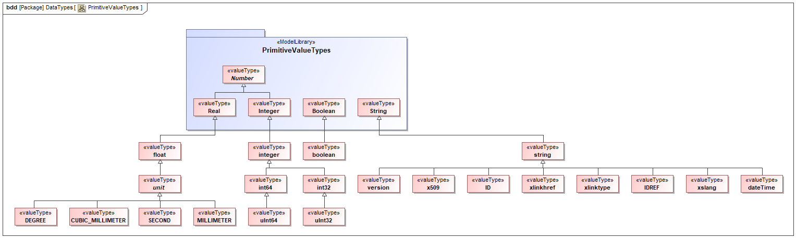

# MTConnect Specification and Material Statement

{{term(AMT)}} owns the copyright in this MTConnect Specification or Material. {{term(AMT)}} grants to you a non-exclusive, non-transferable, revocable, non-sublicensable, fully-paid-up copyright license to reproduce, copy and redistribute this MTConnect Specification or Material, provided that you may only copy or redistribute the MTConnect Specification or Material in the form in which you received it, without modifications, and with all copyright notices and other notices and disclaimers contained in the MTConnect Specification or Material.

If you intend to adopt or implement an MTConnect Specification or Material in a product, whether hardware, software or firmware, which complies with an MTConnect Specification, you shall agree to the MTConnect Specification Implementer License Agreement ("Implementer License") or to the MTConnect Intellectual Property Policy and Agreement ("IP Policy"'). The Implementer License and IP Policy each sets forth the license terms and other terms of use for MTConnect Implementers to adopt or implement the MTConnect Specifications, including certain license rights covering necessary patent claims for that purpose. These materials can be found at {{url(www.MTConnect.org)}}, or or by contacting {{url(mailto:info@MTConnect.org)}}. 

MTConnect Institute and {{term(AMT)}} have no responsibility to identify patents, patent claims or patent applications which may relate to or be required to implement a Specification, or to determine the legal validity or scope of any such patent claims brought to their attention. Each MTConnect Implementer is responsible for securing its own licenses or rights to any patent or other intellectual property rights that may be necessary for such use, and neither {{term(AMT)}} nor MTConnect Institute have any obligation to secure any such rights.

This Material and all MTConnect Specifications and Materials are provided "as is" and MTConnect Institute and {{term(AMT)}}, and each of their respective members, officers, affiliates, sponsors and agents, make no representation or warranty of any kind relating to these materials or to any implementation of the MTConnect Specifications or Materials in any product, including, without limitation, any expressed or implied warranty of noninfringement, merchantability, or fitness for particular purpose, or of the accuracy, reliability, or completeness of information contained herein. In no event shall MTConnect Institute or {{term(AMT)}} be liable to any user or implementer of MTConnect Specifications or Materials for the cost of procuring substitute goods or services, lost profits, loss of use, loss of data or any incidental, consequential, indirect, special or punitive damages or other direct damages, whether under contract, tort, warranty or otherwise, arising in any way out of access, use or inability to use the MTConnect Specification or other MTConnect Materials, whether or not they had advance notice of the possibility of such damage.

The normative XMI is located at the following URL: [`MTConnectSysMLModel.xml`](https://model.mtconnect.org/MTConnectSysMLModel.xml)

# Purpose of This Document

This document, {{package(Observation Information Model)}} of the MTConnect Standard, establishes the rules and terminology that describes the information returned by an {{term(MTConnect Agent)}} from a piece of equipment.  The {{term(Observation Information Model}} also defines, in {{package(Observation Information Model)}}, the structure for the {{termplural(response document)}} that are returned from an {{term(agent)}} in response to a {{term(sample request)}} or {{term(current request)}}.  

{{package(Observation Information Model)}} is not a stand-alone document.   This document is used in conjunction with {{package(Fundamentals)}}  which defines the fundamentals of the operation of the MTConnect Standard and {{package(Device Information Model)}} that defines the semantic model representing the information that may be returned from a piece of equipment.

> Note: {{package(Interface Interaction Model)}} provides details on extensions to the {{term(Observation Information Model)}} required to describe the interactions between pieces of equipment.

In the MTConnect Standard, equipment represents any tangible property that is used in the operation of a manufacturing facility.  Examples of equipment are machine tools, ovens, sensor units, workstations, software applications, and bar feeders.

# Terminology and Conventions

Refer to {{package(Fundamentals)}} for a dictionary of terms, reserved language, and document conventions used in the MTConnect Standard.

{{printglossary[title=General Terms, type=general]()}}
{{printglossary[title=Information Model Terms, type=informationmodel]()}}
{{printglossary[title=Protocol Terms, type=protocol]()}}
{{printglossary[title=HTTP Terms, type=http]()}}
{{printglossary[title=XML Terms, type=xml]()}}
{{printglossary[title=MTConnect Terms, type=conceptmodel]()}}

{{printacronyms()}}

{{printbibliography[title=MTConnect References,keyword=MTC]()}}

{{printbibliography[title=Other References,notkeyword=MTC]()}}

{{glsaddall()}}

# Observation Information Model

The {{term(Observation Information Model)}} provides a representation of the data reported by a piece of equipment used for a manufacturing process, or used for any other purpose.  Additional descriptive information associated with the reported data is defined by the {{block(MTConnectDevices)}} entity, which is described in {{package(Device Information Model)}}.

Information defined in the {{term(Observation Information Model)}} allows a software application to (1) determine the {{termplural(Observation)}} for {{termplural(DataItem)}} returned from a piece of equipment and (2) interpret the data associated with those {{termplural(Observation)}} with the same meaning, value, and context that it had at its original source.  To do this, the software application issues one of two HTTP requests to an {{term(agent)}} associated with a piece of equipment.  They are:

* `sample`:  Returns a designated number of time stamped {{termplural(Observation)}} from an {{term(agent)}} associated with a piece of equipment; subject to any HTTP filtering associated with the request.  See {{block(Agent)}} in {{package(Fundamentals)}} for details on the `sample` HTTP request.

* `current`:  Returns a snapshot of either the most recent values or the values at a given sequence number for all {{termplural(Observation)}} associated with a piece of equipment from an {{term(agent)}}; subject to any HTTP filtering associated with the request.  See {{block(Agent)}} in {{package(Fundamentals)}} for details on the `current` HTTP request.

An {{term(agent)}} responds to either the `sample` or `current` HTTP request with an {{term(MTConnectStreams Response Document)}}.  This document contains information describing {{termplural(Observation)}} reported by an {{term(agent)}} associated with a piece of equipment.   A client software application may correlate the information provided in the {{term(MTConnectStreams Response Document)}} with the physical and logical structure for that piece of equipment defined in the {{block(MTConnectDevices)}} entity to form a clear and unambiguous understanding of the information provided.  (See details on the structure for a piece of equipment described in {{package(Device Information Model)}}).

{{block(Streams)}} for an {{block(MTConnectStreams)}} entity contains a {{block(DeviceStream)}} entity for each piece of equipment represented in the document.  Each {{block(DeviceStream)}} is comprised of two primary types of entities – {{termplural(Component)}} and {{termplural(Observation)}}.  The contents of the {{block(DeviceStream)}} container are described in detail in this document, {{package(Observation Information Model)}} of the MTConnect Standard.

{{termplural(Component)}} are defined for both the {{block(MTConnectDevices)}} and the {{block(MTConnectStreams)}} entities.  These {{termplural(Component)}} are used to provide a logical organization of the information provided in each entity.  

* For an {{block(MTConnectDevices)}} entity: {{termplural(Component)}} organize information that represents the physical and logical parts and sub-parts of a piece of equipment.  (See {{block(Component)}} in {{package(Device Information Model)}} for more details on {{termplural(Component)}} used in the {{block(MTConnectDevices)}} entity).  

* For an {{block(MTConnectStreams)}} entity: {{termplural(Component)}} provide the structure to organize the data returned from a piece of equipment and establishes the proper context for that data.  The {{termplural(Component)}} specifically defined for {{block(MTConnectStreams)}} are {{block(DeviceStream)}} (see {{sect(DeviceStream)}}) and {{block(ComponentStream)}} (see {{sect(ComponentStream)}}).   

{{block(DeviceStream)}} and {{block(ComponentStream)}} entities have a direct correlation to each of the {{term(Component)}} defined in the {{block(MTConnectDevices)}} entity.

Within each {{block(ComponentStream)}} entity in the {{block(MTConnectStreams)}} entity, {{termplural(Observation)}} are modeled as {{block(Observation)}} entities. The three types of {{block(Observation)}} entity are {{block(Sample)}}, {{block(Event)}}, and {{block(Condition)}}.  (See {{sect(Observation Types)}} for more information on these entities.)

## DeviceStream

{{termplural(organize)}} data reported from a {{block(Device)}}.

{{block(DeviceStream)}} **MUST** be provided for each {{block(Device)}} reporting data in an {{term(MTConnectStreams Response Document)}}.

If the response to the request for data from an {{term(agent)}} does not contain any data for a specific {{block(Device)}}, an empty {{block(DeviceStream)}} entity **MAY** be created to indicate that the {{block(Device)}} exists, but there was no data available.

### Value Properties of DeviceStream

{{tbl(value-properties-of-devicestream)}} lists the Value Properties of {{block(DeviceStream)}}.

|Value Property name|Value Property type|Multiplicity|
|-|-|:-:|
|{{property(name)}}|`ID`|1|
|{{property(uuid)}}|`ID`|1|
{: caption="Value Properties of DeviceStream" label="table:value-properties-of-devicestream"}

Descriptions for Value Properties of {{block(DeviceStream)}}:

* {{property(name)}} 

    name of the {{block(Device)}}.
    
    The value reported for {{property(name,DeviceStream)}} **MUST** be the same as the value defined for the {{property(name,Device)}} attribute of the same {{block(Device)}} in the {{term(MTConnectDevices Response Document)}}.

* {{property(uuid)}} 

    uuid of the {{block(Device)}}.
    
    The value reported for {{property(uuid,DeviceStream)}} **MUST** be the same as the value defined for the {{property(uuid,Device)}} attribute of the same {{block(Device)}} in the {{term(MTConnectDevices Response Document)}}.

### Part Properties of DeviceStream

{{tbl(part-properties-of-devicestream)}} lists the Part Properties of {{block(DeviceStream)}}.

|Part Property name|Multiplicity|
|:-|:-:|
|{{block(ComponentStream)}}|1..*|
{: caption="Part Properties of DeviceStream" label="table:part-properties-of-devicestream"}

Descriptions for Part Properties of {{block(DeviceStream)}}:

* {{block(ComponentStream)}} 

    organizes the data associated with each {{block(Component)}} entity defined for a {{block(Device)}} in the associated {{term(MTConnectDevices Response Document)}}.

    See {{sect(ComponentStream)}}.

## ComponentStream

organizes the data associated with each {{block(Component)}} entity defined for a {{block(Device)}} in the associated {{term(MTConnectDevices Response Document)}}.

At least one of {{block(Sample)}}, {{block(Event)}}, or {{block(Condition)}} **MUST** be organized by a {{block(ComponentStream)}} entity.

### Value Properties of ComponentStream

{{tbl(value-properties-of-componentstream)}} lists the Value Properties of {{block(ComponentStream)}}.

|Value Property name|Value Property type|Multiplicity|
|-|-|:-:|
|{{property(component)}}|`string`|1|
|{{property(componentId)}}|`ID`|1|
|{{property(name)}}|`string`|0..1|
|{{property(nativeName)}}|`string`|0..1|
|{{property(uuid)}}|`ID`|0..1|
{: caption="Value Properties of ComponentStream" label="table:value-properties-of-componentstream"}

Descriptions for Value Properties of {{block(ComponentStream)}}:

* {{property(component)}} 

    identifies the {{block(Component)}} type associated with the {{block(ComponentStream)}}.
    
    Examples of {{property(component)}} are {{block(Device)}}, {{block(Controller)}}, {{block(Linear)}} and {{block(Loader)}}.

* {{property(componentId)}} 

    identifier of the {{block(Component)}} as defined by the {{property(id)}}
    attribute in the {{term(MTConnectDevices Response Document)}}.

* {{property(name)}} 

    name of the {{block(Component)}} associated with the {{block(ComponentStream)}}.

* {{property(nativeName)}} 

    common name of the {{block(Component)}} associated with the {{block(ComponentStream)}}.

* {{property(uuid)}} 

    uuid of the {{block(Component)}} associated with the {{block(ComponentStream)}}.

### Reference Properties of ComponentStream

{{tbl(reference-properties-of-componentstream)}} lists the Reference Properties of {{block(ComponentStream)}}.

|Reference Property name|Multiplicity|
|:-|:-:|
|{{block(Event)}} (organized by `Events`)|0..*|
|{{block(Sample)}} (organized by `Samples`)|0..*|
|{{block(Condition)}} (organized by `Conditions`)|0..*|
{: caption="Reference Properties of ComponentStream" label="table:reference-properties-of-componentstream"}

Descriptions for Reference Properties of {{block(ComponentStream)}}:

* {{block(Event)}} 

    {{block(Observation)}} that is a discrete piece of information from a piece of equipment.
    

    {{block(Events)}} groups one or more {{block(Event)}} entities. See {{sect(Event)}}.

* {{block(Sample)}} 

    {{block(Observation)}} that is continuously changing or analog data value.
    

    {{block(Samples)}} groups one or more {{block(Sample)}} entities. See {{sect(Sample)}}.

* {{block(Condition)}} 

    {{block(Observation)}} that provides the {{term(condition)}} of a piece of equipment or a {{term(Component)}}.
    
    

    {{block(Conditions)}} groups one or more {{block(Condition)}} entities. See {{sect(Condition)}}.
    
    > Note: In the {{term(XML)}} representation, {{block(Conditions)}} **MUST** appear as `Condition` element in the {{term(MTConnectStreams Response Document)}}.

## Observation

abstract entity that provides telemetry data for a {{block(DataItem)}} at a point in time.

{: width="0.8"}

> Note: See {{sect(Observations Schema Diagrams)}} for XML schema. The XML schema also shows differences in XML representation of certain MTConnect entities.

{{figure(DeviceStream Example)}} shows a complete example of {{block(DeviceStream)}} for the {{block(Device)}} shown in {{textit(Figure 2: Component Example)}} in {{package(Device Information Model)}}.

{: width="0.8"}

> Note: See {{lst(devicestream-example)}} for the {{term(XML)}} representation of the same example.

This section provides semantic information for the {{block(Observation)}} model.

> Note: See {{sect(Observations Schema Diagrams)}} for XML schema of {{block(Observation)}} types.

#### Observations made for DataItem

{{block(Component)}} {{termplural(observe)}} {{block(DataItem)}} entities and creates {{block(Observation)}} entities for the {{block(DataItem)}} entities. See {{figure(Observations)}}.

{{block(Observation)}} entities made by a {{block(Component)}} are organized by a {{block(ComponentStream)}} which is specifically created for that {{block(Component)}}.

{: width="0.8"}

> Note: See {{sect(Observations made for DataItem Example)}} for how XML representation of the same example is separated into {{term(MTConnectDevices Response Document)}} and {{term(MTConnectStreams Response Document)}}.

{{figure(Observations made for DataItem Example)}} is a subset of {{figure(DeviceStream Example)}}. It shows an example of the association between a {{block(DataItem)}} {{block(Event)}} type (`EMERGENCY_STOP`) and an {{block(Observation)}} {{block(Event)}} type (`EmergencyStop`). See {{sect(Naming Convention for Observation types)}}.

{{figure(Observations made for DataItem Example)}} also shows example of the association between a {{block(Component)}} type (`Controller`) and related {{block(ComponentStream)}}.

#### Naming Convention for Observation types

The name of an {{block(Observation)}} type **MUST** derive from the {{block(DataItem)}} property {{property(type)}} converted to Pascal-Case by removing underscores (_ ) and capitalizing each word. The conversion **MUST NOT** apply to the following abbreviated words: `PH`, `AC`, `DC` and `URI`. `MTCONNECT` **MUST** be converted to `MTConnect`. See {{figure(Observations made for DataItem Example)}} for an example.

The name of an {{block(Observation)}} type reported in the {{term(MTConnectStreams Response Document)}} is extended when the {{property(representation)}} property is used to further describe that {{block(DataItem)}} in the {{term(MTConnectDevices Response Document)}}. See {{package(Representations)}} for more details.

### Value Properties of Observation

{{tbl(value-properties-of-observation)}} lists the Value Properties of {{block(Observation)}}.

|Value Property name|Value Property type|Multiplicity|
|-|-|:-:|
|{{property(compositionId)}}|`ID`|0..1|
|{{property(dataItemId)}}|`ID`|1|
|{{property(name)}}|`string`|0..1|
|{{property(sequence)}}|`integer`|1|
|{{property(subType)}}|`DataItemSubTypeEnum`|0..1|
|{{property(timestamp)}}|`datetime`|1|
|{{property(type)}}|`DataItemTypeEnum`|1|
|{{property(units)}}|`UnitEnum`|0..1|
{: caption="Value Properties of Observation" label="table:value-properties-of-observation"}

Descriptions for Value Properties of {{block(Observation)}}:

* {{property(compositionId)}} 

    identifier of the {{block(Composition)}} entity defined in the {{term(MTConnectDevices Response Document)}} associated with the data reported for the {{block(Observation)}}.

* {{property(dataItemId)}} 

    unique identifier of the {{block(DataItem)}} associated with this {{block(Observation)}}.
    
    {{property(dataItemId)}} **MUST** match the {{property(id)}} attribute of
    the {{block(DataItem)}} defined in the {{term(MTConnectDevices Response Document)}}.

* {{property(name)}} 

    name of the {{block(DataItem)}} associated with this {{block(Observation)}}.
    
    {{property(name)}} **MUST** match the {{property(name)}} attribute of
    the {{block(DataItem)}} defined in the {{term(MTConnectDevices Response Document)}}.

* {{property(sequence)}} 

    number representing the sequential position of an occurrence of an {{term(observation)}} in the data buffer of an {{term(agent)}}.
    
    {{property(sequence)}} **MUST** have a value represented as an unsigned 64-bit value from 1 to $$ 2^{64}-1 $$.

* {{property(subType)}} 

    subtype of the {{block(DataItem)}} associated with this {{block(Observation)}}.
    
    {{property(subType)}} **MUST** match the {{property(subType)}} attribute of the {{block(DataItem)}} defined in the {{term(MTConnectDevices Response Document)}}.

    The value of {{property(subType)}} **MUST** be one of the `DataItemSubTypeEnum` enumeration. 

* {{property(timestamp)}} 

    most accurate time available to a piece of equipment that represents the point in time that the data reported was measured.

* {{property(type)}} 

    type of the {{block(DataItem)}} associated with this {{block(Observation)}}.
    
    {{property(type)}} **MUST** match the {{property(type)}} attribute of the {{block(DataItem)}} defined in the {{term(MTConnectDevices Response Document)}}.

    The value of {{property(type)}} **MUST** be one of the `DataItemTypeEnum` enumeration. 

* {{property(units)}} 

    units of the {{block(DataItem)}} associated with this {{block(Observation)}}.
    
    {{property(units)}} **MUST** match the {{property(units)}} attribute of the {{block(DataItem)}} defined in the {{term(MTConnectDevices Response Document)}}.

    The value of {{property(units)}} **MUST** be one of the `UnitEnum` enumeration. 

* {{property(result)}} 

    {{term(observation)}} of the {{block(Observation)}} entity.
    
    The default value type for {{property(result)}} is `string`.

## Sample

{{block(Observation)}} that is continuously changing or analog data value.

It provides the information and data reported from a piece of equipment for those {{block(DataItem)}} entities defined with a {{property(category,DataItem)}} property of `SAMPLE` in the {{term(MTConnectDevices Response Document)}}.

{{block(Sample)}} **MUST** always be reported in `float`.

{{figure(Sample Example)}} shows {{block(Sample)}} type examples. It also shows an example for when the {{property(result)}} is not available (`dataItemId`=`cspeed`).

{: width="0.8"}

> Note: See {{lst(sample-example)}} for the {{term(XML)}} representation of the same example.

The following {{sect(Value Properties of Sample)}} lists the additional and/or updated attributes for {{block(Sample)}}.

The value of {{property(Sample)}} **MUST** be `float`.

The {{property(units)}} for {{block(Sample)}} **MUST** always be specified.

### Value Properties of Sample

{{tbl(value-properties-of-sample)}} lists the Value Properties of {{block(Sample)}}.

|Value Property name|Value Property type|Multiplicity|
|-|-|:-:|
|{{property(duration)}}|`SECOND`|0..1|
|{{property(resetTriggered)}}|`ResetTriggeredEnum`|0..1|
|{{property(sampleRate)}}|`float`|0..1|
|{{property(statistic)}}|`StatisticEnum`|0..1|
{: caption="Value Properties of Sample" label="table:value-properties-of-sample"}

Descriptions for Value Properties of {{block(Sample)}}:

* {{property(duration)}} 

    time-period over which the data was collected.
    
    {{property(duration)}} **MUST** be provided when the {{property(statistic)}} attribute of the {{block(DataItem)}} is defined in the {{term(MTConnectDevices Response Document)}}.

* {{property(resetTriggered)}} 

    identifies when a reported value has been reset and what has caused that reset to occur for those {{block(DataItem)}} entities that may be periodically reset to an initial value.
    
    {{property(resetTriggered)}} **MUST** only be provided for the specific occurrence of a {{block(DataItem)}} reported in the {{term(MTConnectStreams Response Document)}} when the reset occurred.

    `ResetTriggeredEnum` Enumeration:

    * `ACTION_COMPLETE` 

        {{property(result)}} of the {{block(Observation)}} that is measuring an action or operation was reset upon completion of that action or operation.

    * `ANNUAL` 

        {{property(result)}} of the {{block(Observation)}} was reset at the end of a 12-month period.

    * `DAY` 

        {{property(result)}} of the {{block(Observation)}} was reset at the end of a 24-hour period.

    * `MAINTENANCE` 

        {{property(result)}} of the {{block(Observation)}} was reset upon completion of a maintenance event.

    * `MANUAL` 

        {{property(result)}} of the {{block(Observation)}} was reset based on a physical reset action.

    * `MONTH` 

        {{property(result)}} of the {{block(Observation)}} was reset at the end of a monthly period.

    * `POWER_ON` 

        {{property(result)}} of the {{block(Observation)}} was reset when power was applied to the piece of equipment after a planned or unplanned interruption of power has occurred.

    * `SHIFT` 

        {{property(result)}} of the {{block(Observation)}} was reset at the end of a work shift.

    * `WEEK` 

        {{property(result)}} of the {{block(Observation)}} was reset at the end of a 7-day period.

* {{property(sampleRate)}} 

    rate at which successive samples of the value are recorded.
    

* {{property(statistic)}} 

    type of statistical calculation defined by the {{property(statistic)}} attribute of the {{block(DataItem)}} defined in the {{term(MTConnectDevices Response Document)}}.

    The value of {{property(statistic)}} **MUST** be one of the `StatisticEnum` enumeration. 

## Event

{{block(Observation)}} that is a discrete piece of information from a piece of equipment.

It provides the information and data reported from a piece of equipment for those {{block(DataItem)}} entities defined with a {{property(category,DataItem)}} property of `EVENT` in the {{term(MTConnectDevices Response Document)}}.

{{figure(Event Example)}} shows {{block(Event)}} type examples. It also shows an example for when the {{property(result)}} is not available (`dataItemId`=`d1_asset_rem`).

{: width="0.8"}

> Note: See {{lst(event-example)}} for the {{term(XML)}} representation of the same example.

The following {{sect(Value Properties of Event)}} lists the additional and/or updated attributes for {{block(Event)}}.

### Value Properties of Event

{{tbl(value-properties-of-event)}} lists the Value Properties of {{block(Event)}}.

|Value Property name|Value Property type|Multiplicity|
|-|-|:-:|
|{{property(resetTriggered)}}|`ResetTriggeredEnum`|0..1|
{: caption="Value Properties of Event" label="table:value-properties-of-event"}

Descriptions for Value Properties of {{block(Event)}}:

* {{property(resetTriggered)}} 

    identifies when a reported value has been reset and what has caused that reset to occur for those {{block(DataItem)}} entities that may be periodically reset to an initial value.
    
    {{property(resetTriggered)}} **MUST** only be provided for the specific occurrence of a {{block(DataItem)}} reported in the {{term(MTConnectStreams Response Document)}} when the reset occurred.

    The value of {{property(resetTriggered)}} **MUST** be one of the `ResetTriggeredEnum` enumeration. 

## Condition

{{block(Observation)}} that provides the {{term(condition)}} of a piece of equipment or a {{term(Component)}}.

It provides the information and data reported from a piece of equipment for those {{block(DataItem)}} entities defined with a {{property(category,DataItem)}} property of `CONDITION` in the {{term(MTConnectDevices Response Document)}}.

{{figure(Condition Example)}} shows {{block(Condition)}} type examples for various {{property(state)}}: `Normal` (`dataItemId` = `path_system`) and `Warning` (`dataItemId` = `logic_cond`). It also shows an example for when the {{property(state)}} is not available (`dataItemId` = `cont_system`).

{: width="0.8"}

> Note: See {{lst(condition-example)}} for the {{term(XML)}} representation of the same example.

The following {{sect(Value Properties of Condition)}} lists the additional and/or updated attributes for {{block(Condition)}}.

### Value Properties of Condition

{{tbl(value-properties-of-condition)}} lists the Value Properties of {{block(Condition)}}.

|Value Property name|Value Property type|Multiplicity|
|-|-|:-:|
|{{property(nativeCode)}}|`string`|0..1|
|{{property(nativeSeverity)}}|`string`|0..1|
|{{property(qualifier)}}|`QualifierEnum`|0..1|
|{{property(statistic)}}|`StatisticEnum`|0..1|
|{{property(xs:lang)}}|`xslang`|0..1|
|{{property(state)}}|`ConditionStateEnum`|0..1|
{: caption="Value Properties of Condition" label="table:value-properties-of-condition"}

Descriptions for Value Properties of {{block(Condition)}}:

* {{property(nativeCode)}} 

    native code (usually an alpha-numeric value) generated by the controller of a piece of equipment providing a reference identifier for a {{block(Condition)}}.
    
    This is the same information an operator or maintenance personnel may see as a reference code designating a specific fault code provided by the piece of equipment.

* {{property(nativeSeverity)}} 

    severity information to a client software application if the piece of equipment designates a severity level to a fault.

* {{property(qualifier)}} 

    additional information regarding a {{term(condition state)}} associated with the measured value of a process variable.
    
    {{property(qualifier)}} defines whether the {{term(condition state)}} represented indicates a measured value that is above or below an expected value of a process variable.

    `QualifierEnum` Enumeration:

    * `HIGH` 

        measured value is greater than the expected value for a process variable.

    * `LOW` 

        measured value is less than the expected value for a process variable.

* {{property(statistic)}} 

    {{property(statistic)}} provides additional information describing the meaning of the {{block(Condition)}} element.
    
    {{property(statistic)}} **MUST** match the {{property(statistic)}} attribute of the {{block(DataItem)}} entity defined in the {{term(MTConnectDevices Response Document)}}.

    The value of {{property(statistic)}} **MUST** be one of the `StatisticEnum` enumeration. 

* {{property(xs:lang)}} 

    specifies the language of the {{property(result)}} returned for the {{block(Condition)}}. 
    
    See {{cite(IETF RFC 4646)}} (http://www.ietf.org/rfc/rfc4646.txt).

* {{property(state)}} 

    {{term(condition state)}} of the piece of equipment or {{block(Component)}}.

    `ConditionStateEnum` Enumeration:

    * `Fault` 

        {{term(condition state)}} that requires intervention to continue operation to function properly.

    * `Normal` 

        {{term(condition state)}} that indicates operation within specified limits.

    * `Warning` 

        {{term(condition state)}} that requires concern and supervision and may become hazardous if no action is taken.

# Representations

This section provides semantic information for the {{block(Representation)}} model.

{: width="0.8"}

> Note: See {{sect(Representation Schema Diagrams)}} for XML schema.

## Representation

specifies the format and structure of the {{property(result)}} for an {{block(Observation)}}. 

The {{block(Representation)}} type for an {{block(Observation)}} is defined by the associated {{block(DataItem)}}'s property {{property(representation)}} in the {{term(MTConnectDevices Response Document)}}.

{{block(Value)}} is the default {{block(Representation)}} type for all {{block(Observation)}} types.

The name of the {{block(Observation)}} type is modified for all {{block(Representation)}} types other than {{block(Value)}} by appending the pascal case of the {{block(Representation)}} type. 

Example: The name for {{block(Sample)}} {{block(Observation)}} type `Temperature`with `Representation` type of `TimeSeries` becomes `TemperatureTimeSeries`.

## Value

default {{block(Representation)}} type for all {{block(Observation)}} types where {{property(result)}} of the {{block(Observation)}} types is an MTConnect data type. See {{package(DataTypes)}}.

## TimeSeries

{{block(Representation)}} for an {{block(Observation)}} composed of a series of sampled data.

{{block(TimeSeries)}} for an {{block(Observation)}} is defined by the associated {{block(DataItem)}}'s property {{property(representation)}} as `TIME_SERIES`.

{{block(DataItem)}} with `TIME_SERIES` {{property(representation)}} **MUST** have a {{property(category)}} of `SAMPLE`.

{{figure(TemperatureTimeSeries)}} shows the model for {{block(Temperature)}} ({{block(Sample)}} type) with a {{block(Representation)}} type of {{block(TimeSeries)}}. 

{: width="0.8"}

> Note: See {{sect(Representation Schema Diagrams)}} for XML schema.

{{block(TimeSeries)}} **MUST** report multiple values at fixed intervals in a single {{block(Observation)}}. At minimum, one of {{block(DataItem)}} or {{block(Observation)}} **MUST** specify the {{property(sampleRate)}} in `Hertz`(values/second); fractional rates are permitted. When the {{block(Observation)}} and the {{block(DataItem)}} specify the {{property(sampleRate)}}, the {{block(Observation)}} {{property(sampleRate)}} supersedes the {{block(DataItem)}}.

The {{block(Observation)}} **MUST** set the {{property(timestamp)}} to the time the last value was observed. The {{property(duration)}} **MAY** indicate the time interval from the first to the last value in the series.

{{sect(Value Properties of TimeSeries)}} defines additional attributes for an {{block(Observation)}} with {{block(TimeSeries)}} {{block(Representation)}} type.

### Value Properties of TimeSeries

{{tbl(value-properties-of-timeseries)}} lists the Value Properties of {{block(TimeSeries)}}.

|Value Property name|Value Property type|Multiplicity|
|-|-|:-:|
|{{property(sampleCount)}}|`integer`|1|
{: caption="Value Properties of TimeSeries" label="table:value-properties-of-timeseries"}

Descriptions for Value Properties of {{block(TimeSeries)}}:

* {{property(sampleCount)}} 

    number of values given for the {{block(Observation)}}.

## `<<deprecated>>`Discrete

**DEPRECATED** {{block(Representation)}} for an {{block(Observation)}} where each discrete occurrence of the data may have the same value as the previous occurrence of the data.

{{block(Discrete)}} for an {{block(Observation)}} is defined by the associated {{block(DataItem)}}'s property {{property(representation)}} as `DISCRETE`.

{{block(DataItem)}} with `DISCRETE` {{property(representation)}} **MUST** have a {{property(category)}} of `EVENT`.

*MTConnect Version 1.5* replaced {{property(representation)}} `DISCRETE` with a {{property(discrete)}} property for {{block(DataItem)}}.

Each occurrence of the {{block(Observation)}} **MAY** have the same value as the previous occurrence, and **MUST NOT** suppress duplicates.

Examples of {{block(Discrete)}}: A `PartCount` reporting the completion of each part using a 1 to indicate completion of a single part, a `Message` that occurs each time a door opens. 

## DataSet

{{block(Representation)}} for an {{block(Observation)}} composed of value(s) represented as a set of {{termplural(key-value pair)}}.

{{block(DataSet)}} for an {{block(Observation)}} is defined by the associated {{block(DataItem)}}'s property {{property(representation)}} as `DATA_SET`.

{{block(DataItem)}} with `DATA_SET` {{property(representation)}} **MUST** have a {{property(category)}} of `SAMPLE` or `EVENT`.

{{figure(VariableDataSet)}} shows the model for {{block(Variable)}} ({{block(Event)}} type) with a {{block(Representation)}} type of {{block(DataSet)}}. 

{: width="0.8"}

> Note: See {{figure(DataSet Schema)}} for XML schema.

{{block(DataSet)}} reports multiple values as a set of {{term(key-value pair)}} where each {{term(key)}} **MUST** be unique. The representation of the {{term(key-value pair)}} is an {{block(Entry)}}. The value of each {{block(Entry)}} **MUST** have the same constraints and format as the {{block(Observation)}} defined for the `VALUE` {{property(representation)}} for the {{block(DataItem)}} {{property(type)}} (See {{block(Value)}}). 

The meaning of each {{block(Entry)}} **MAY** be provided as the {{block(DataItem)}} {{block(EntryDefinition)}}.

{{figure(DataSet Example)}} shows {{block(Event)}} {{block(Observation)}} type {{block(Variable)}} with a {{block(Representation)}} type of `DataSet`.

{: width="0.8"}

> Note: See {{lst(dataset-example)}} for the {{term(XML)}} representation of the same example.

#### Management of Data Set Observations

An {{term(agent)}} **MUST** maintain the current state of the {{block(DataSet)}} as described in {{package(Fundamentals)}}.

One or more {{termplural(key-value pair)}} **MAY** be added, removed, or changed in an {{block(Observation)}}. An {{term(agent)}} **MUST** publish the changes to one or more {{termplural(key-value pair)}} as a single {{block(Observation)}}. An {{term(agent)}} **MUST** indicate the removal of a {{term(key-value pair)}} from a {{block(DataSet)}} using the {{property(removed)}} attribute equal `true`.

When the {{block(DataItem)}} {{property(discrete,DataItem)}} attribute is `false` or is not present, an {{term(agent)}} in response to a {{term(sample request)}} **MUST** only publish the changed {{term(key-value pair)}} since the previous state of the {{block(DataSet)}}.

When the {{block(DataItem)}} {{property(discrete,DataItem)}} attribute is `true`, an {{term(agent)}}, in response to a {{term(sample request)}}, **MUST** report all {{termplural(key-value pair)}} ignoring the state of the {{block(DataSet)}}.

When an {{term(agent)}} responds to a {{term(current request)}}, the {{term(response document)}} **MUST** include the full set of {{termplural(key-value pair)}}. If the {{term(current request)}} includes an `at` query parameter, the {{term(agent)}} **MUST** provide the set of {{termplural(key-value pair)}} at the  {{term(sequence number)}}.

When an {{block(Observation)}} {{term(reset)}} occurs, the {{block(DataSet)}} **MUST** remove all {{termplural(key-value pair)}} making the set empty. The {{block(Observation)}} **MAY** simultaneously populate the {{block(DataSet)}} with new {{termplural(key-value pair)}}. The previous entries **MUST NOT** be included and **MUST NOT** have {{property(removed)}} attribute equal `true`.

When the {{block(Observation)}}  is `UNAVAILABLE` the {{block(DataSet)}} **MUST** remove all {{termplural(key-value pair)}} making the set empty.

### Value Properties of DataSet

{{tbl(value-properties-of-dataset)}} lists the Value Properties of {{block(DataSet)}}.

|Value Property name|Value Property type|Multiplicity|
|-|-|:-:|
|{{property(count)}}|`integer`|1|
{: caption="Value Properties of DataSet" label="table:value-properties-of-dataset"}

Descriptions for Value Properties of {{block(DataSet)}}:

* {{property(count)}} 

    number of {{block(Entry)}} elements for the {{block(Observation)}}.

### Part Properties of DataSet

{{tbl(part-properties-of-dataset)}} lists the Part Properties of {{block(DataSet)}}.

|Part Property name|Multiplicity|
|:-|:-:|
|{{block(Entry)}}|0..*|
{: caption="Part Properties of DataSet" label="table:part-properties-of-dataset"}

Descriptions for Part Properties of {{block(DataSet)}}:

* {{block(Entry)}} 

    {{term(key-value pair)}} published as part of a {{block(DataSet)}}.

    See {{sect(Entry)}}.

## Table

{{block(Representation)}} for an {{block(Observation)}} composed of two-dimensional sets of {{termplural(key-value pair)}} where the {{block(Entry)}} represents rows containing sets of {{termplural(key-value pair)}} given by {{block(Cell)}} entities. 

{{block(Table)}} for an {{block(Observation)}} is defined by the associated {{block(DataItem)}}'s property {{property(representation)}} as `TABLE`.

{{block(DataItem)}} with `TABLE` {{property(representation)}} **MUST** have a {{property(category)}} of `SAMPLE` or `EVENT`.

{{figure(WorkOffsetTable)}} shows the model for {{block(WorkOffset)}} ({{block(Event)}} type) with a {{block(Representation)}} type of {{block(Table)}}. 

{: width="0.8"}

> Note: See {{sect(Representation Schema Diagrams)}} for XML schema.

{{block(Table)}} has the same behavior as the {{block(DataSet)}} for change tracking, clearing, and history. When an {{block(Entry)}} changes, all {{block(Cell)}} entities update at the same time; they are not tracked separately like {{block(Entry)}}.

The meaning of each {{block(Entry)}} and {{block(Cell)}} **MAY** be provided as the {{block(DataItem)}} {{block(EntryDefinition)}} and {{block(CellDefinition)}}.

The {{block(Entry)}} {{property(key)}} attribute **MUST** be the unique identity of the {{block(Entry)}} within an {{block(Observation)}}. The {{block(Cell)}} {{property(key)}} attribute **MUST** be the unique identity of the {{block(Cell)}} within an {{block(Entry)}}.

{{figure(Table Example)}} shows {{block(Event)}} {{block(Observation)}} type {{block(WorkOffset)}} with a {{block(Representation)}} type of `Table`.

{: width="0.8"}

> Note: See {{lst(table-example)}} for the {{term(XML)}} representation of the same example.

### Value Properties of Table

{{tbl(value-properties-of-table)}} lists the Value Properties of {{block(Table)}}.

|Value Property name|Value Property type|Multiplicity|
|-|-|:-:|
|{{property(count)}}|`integer`|1|
{: caption="Value Properties of Table" label="table:value-properties-of-table"}

Descriptions for Value Properties of {{block(Table)}}:

* {{property(count)}} 

    number of {{termplural(key-value pair)}} represented as {{block(Entry)}} entities.

### Part Properties of Table

{{tbl(part-properties-of-table)}} lists the Part Properties of {{block(Table)}}.

|Part Property name|Multiplicity|
|:-|:-:|
|{{block(TableEntry)}}|0..*|
{: caption="Part Properties of Table" label="table:part-properties-of-table"}

Descriptions for Part Properties of {{block(Table)}}:

* {{block(TableEntry)}} 

    {{term(key-value pair)}} published as part of a {{block(Table)}}.
    
    > Note: In the {{term(XML)}} representation, {{block(TableEntry)}} **MUST** appear as {{block(Entry)}}.
    
    

    See {{sect(TableEntry)}}.

## Entry

{{term(key-value pair)}} published as part of a {{block(DataSet)}}.

#### Constraints for Entry Values

The value of each {{block(Entry)}} **MUST** have the same restrictions as the value of an {{term(observation)}} with {{property(representation)}} of `VALUE`.

An {{block(Entry)}} **MAY** be further constrained by the {{block(DataItem)}} definition (see {{package(Device Information Model)}}), for example a `VariableDataSet` having a string value **MAY** have a floating-point {{block(Temperature)}} value. A restriction **MUST NOT** be broadened or removed, for example, the value "READY" **MUST NOT** occur with a `TemperatureDataSet` constrained to floating-point numbers.

The {{package(Device Information Model)}} {{block(DataItem)}} {{block(Definition)}} **MAY** provide the {{property(type)}} and {{property(units)}} of an {{block(Entry)}} for a {{property(key)}}.

### Value Properties of Entry

{{tbl(value-properties-of-entry)}} lists the Value Properties of {{block(Entry)}}.

|Value Property name|Value Property type|Multiplicity|
|-|-|:-:|
|{{property(key)}}|`ID`|1|
|{{property(removed)}}|`boolean`|0..1|
{: caption="Value Properties of Entry" label="table:value-properties-of-entry"}

Descriptions for Value Properties of {{block(Entry)}}:

* {{property(key)}} 

    unique identifier for each {{term(key-value pair)}}.

* {{property(removed)}} 

    removal indicator of a {{term(key-value pair)}}.

## TableEntry

{{term(key-value pair)}} published as part of a {{block(Table)}}.

> Note: In the {{term(XML)}} representation, {{block(TableEntry)}} **MUST** appear as {{block(Entry)}}.

### Value Properties of TableEntry

{{tbl(value-properties-of-tableentry)}} lists the Value Properties of {{block(TableEntry)}}.

|Value Property name|Value Property type|Multiplicity|
|-|-|:-:|
|{{property(key)}}|`ID`|1|
|{{property(removed)}}|`boolean`|0..1|
{: caption="Value Properties of TableEntry" label="table:value-properties-of-tableentry"}

Descriptions for Value Properties of {{block(TableEntry)}}:

* {{property(key)}} 

    unique identifier for each {{term(key-value pair)}}.

* {{property(removed)}} 

    removal indicator of a {{term(key-value pair)}}.

### Part Properties of TableEntry

{{tbl(part-properties-of-tableentry)}} lists the Part Properties of {{block(TableEntry)}}.

|Part Property name|Multiplicity|
|:-|:-:|
|{{block(Cell)}}|0..*|
{: caption="Part Properties of TableEntry" label="table:part-properties-of-tableentry"}

Descriptions for Part Properties of {{block(TableEntry)}}:

* {{block(Cell)}} 

    {{term(key-value pair)}} published as part of a {{block(TableEntry)}}.

    See {{sect(Cell)}}.

## Cell

{{term(key-value pair)}} published as part of a {{block(TableEntry)}}.

#### Constraints for Cell Values

The value of each {{block(Cell)}} **MUST** have the same restrictions as the value of an {{term(observation)}} with {{property(representation)}} of `VALUE`.

An {{block(Cell)}} **MAY** be further constrained by the {{block(DataItem)}} definition (see {{package(Device Information Model)}}), for example a `VariableDataSet` having a string value **MAY** have a floating-point {{block(Temperature)}} value. A restriction **MUST NOT** be broadened or removed, for example, the value `READY` **MUST NOT** occur with a `TemperatureDataSet` constrained limited to floating-point numbers.

The {{package(Device Information Model)}} {{block(DataItem)}} {{block(Definition)}} **MAY** provide the {{property(type)}} and {{property(units)}} of a {{block(Cell)}} for a {{property(key)}}.

### Value Properties of Cell

{{tbl(value-properties-of-cell)}} lists the Value Properties of {{block(Cell)}}.

|Value Property name|Value Property type|Multiplicity|
|-|-|:-:|
|{{property(key)}}|`ID`|1|
{: caption="Value Properties of Cell" label="table:value-properties-of-cell"}

Descriptions for Value Properties of {{block(Cell)}}:

* {{property(key)}} 

    unique identifier for each {{term(key-value pair)}}.

# Observation Types

This section provides semantic information for the {{block(Observation)}} types.

{{block(Observation)}} entities are instantiated as {{block(Sample)}}, {{block(Event)}} or {{block(Condition)}} entities based upon the {{property(category)}} and {{property(type)}} attributes defined for the corresponding {{block(DataItem)}}.

See {{figure(DeviceStream Example)}} for examples on how the {{block(Observation)}} types are organized within {{block(ComponentStream)}}.

## Condition Types

This section provides semantic information for {{block(Condition)}} types.

{{block(Condition)}} types are reported differently from other {{block(Observation)}} types. They are reported based on the {{term(condition state)}} for each {{block(Condition)}}.

The {{property(type)}} and {{property(subType)}} (where applicable) properties for a {{block(Condition)}} **MAY** be any of the {{property(type)}} and {{property(subType)}} attributes defined for `SAMPLE` {{property(category)}} or `EVENT` {{property(category)}} {{block(DataItem)}} listed in the {{term(Device Information Model)}}.

This section lists additional {{block(Condition)}} types that have been defined to represent the health and fault status of {{termplural(Component)}}.

### Actuator

{{def(ConditionEnum:ACTUATOR)}}

### Communications

{{def(ConditionEnum:COMMUNICATIONS)}}

### DataRange

{{def(ConditionEnum:DATA_RANGE)}}

### LogicProgram

{{def(ConditionEnum:LOGIC_PROGRAM)}}

### MotionProgram

{{def(ConditionEnum:MOTION_PROGRAM)}}

### System

{{def(ConditionEnum:SYSTEM)}}

## Event Types

This section provides semantic information for {{block(Event)}} types.

### ActivationCount

{{def(EventEnum:ACTIVATION_COUNT)}}

The default {{property(subType)}} of {{property(ActivationCount)}} is `ALL`.

The value of {{property(ActivationCount)}} **MUST** be `integer`.

#### Subtypes of ActivationCount

* `ABORTED`

    accumulation of actions or activities that were attempted, but terminated before they could be completed.

    

* `ALL`

    accumulation of all actions, items, or activities being counted independent of the outcome.

    

* `BAD`

    accumulation of actions, items, or activities being counted that do not conform to specification or expectation.

    

* `COMPLETE`

    accumulation of actions, items, or activities that have been completed, independent of the outcome.

    

* `FAILED`

    accumulation of actions or activities that were attempted, but failed to complete or resulted in an unexpected or unacceptable outcome.

    

* `GOOD`

    accumulation of actions, items, or activities being counted that conform to specification or expectation.

    

* `REMAINING`

    accumulation of actions, items, or activities yet to be counted.

    

* `TARGET`

    goal of the operation or process.

    

### ActiveAxes

{{def(EventEnum:ACTIVE_AXES)}}

The value of {{property(ActiveAxes)}} **MUST** be a list of `string` of size `0..*`.

### ActuatorState

{{def(EventEnum:ACTUATOR_STATE)}}

`ActuatorStateEnum` Enumeration:

* `ACTIVE` 

    {{block(Actuator)}} is operating.

* `INACTIVE` 

    {{block(Actuator)}} is not operating.

### AdapterSoftwareVersion

{{def(EventEnum:ADAPTER_SOFTWARE_VERSION)}}

### AdapterURI

{{def(EventEnum:ADAPTER_URI)}}

### `<<deprecated>>`Alarm

{{def(EventEnum:ALARM)}}

#### Value Properties of Alarm

{{tbl(value-properties-of-alarm)}} lists the Value Properties of {{block(Alarm)}}.

|Value Property name|Value Property type|Multiplicity|
|-|-|:-:|
|`<<deprecated>>` {{property(code)}}|`AlarmCodeEnum`|1|
|`<<deprecated>>` {{property(severity)}}|`AlarmSeverityEnum`|1|
|`<<deprecated>>` {{property(nativeCode)}}|`string`|1|
|`<<deprecated>>` {{property(state)}}|`AlarmStateEnum`|1|
|`<<deprecated>>` {{property(lang)}}|`xslang`|0..1|
{: caption="Value Properties of Alarm" label="table:value-properties-of-alarm"}

Descriptions for Value Properties of {{block(Alarm)}}:

* `<<deprecated>>` {{property(code)}} 

    type of alarm.

* `<<deprecated>>` {{property(severity)}} 

    severity of the alarm.

* `<<deprecated>>` {{property(nativeCode)}} 

    native code for the piece of equipment.

* `<<deprecated>>` {{property(state)}} 

    state of the alarm.

* `<<deprecated>>` {{property(lang)}} 

    specifies the language of the alarm text.
    
    See {{cite(IETF RFC 4646)}} (http://www.ietf.org/rfc/rfc4646.txt).

### AlarmLimit

{{def(EventEnum:ALARM_LIMIT)}}

The {{block(Entry)}} {{property(key)}} **MUST** be one or more from the `AlarmLimitResult` keys.

`AlarmLimitResult` keys:

* `UPPER_LIMIT` 

    upper conformance boundary for a variable.
    
    > Note: immediate concern or action may be required.
    
    

    The value of {{property(UPPER_LIMIT)}} **MUST** be `float`.

* `UPPER_WARNING` 

    upper boundary indicating increased concern and supervision may be required.

    The value of {{property(UPPER_WARNING)}} **MUST** be `float`.

* `LOWER_WARNING` 

    lower boundary indicating increased concern and supervision may be required.

    The value of {{property(LOWER_WARNING)}} **MUST** be `float`.

* `LOWER_LIMIT` 

    lower conformance boundary for a variable.
    
    > Note: immediate concern or action may be required.
    
    

    The value of {{property(LOWER_LIMIT)}} **MUST** be `float`.

### Application

{{def(EventEnum:APPLICATION)}}

A {{property(subType)}} **MUST** always be specified.

#### Subtypes of Application

* `INSTALL_DATE`

    date the hardware or software was installed.

    

    The value of {{property(Application)}} **MUST** be `datetime`. See {{sect(datetime)}}.

    `datetime` Enumeration:

* `LICENSE`

    license code to validate or activate the hardware or software.

    

* `MANUFACTURER`

    corporate identity for the maker of the hardware or software. 
 

    

* `RELEASE_DATE`

    date the hardware or software was released for general use. 
 

    

    The value of {{property(Application)}} **MUST** be `datetime`. See {{sect(datetime)}}.

    `datetime` Enumeration:

* `VERSION`

    version of the hardware or software.

    

### AssetChanged

{{def(EventEnum:ASSET_CHANGED)}}

#### Value Properties of AssetChanged

{{tbl(value-properties-of-assetchanged)}} lists the Value Properties of {{block(AssetChanged)}}.

|Value Property name|Value Property type|Multiplicity|
|-|-|:-:|
|{{property(assetType)}}|`string`|0..1|
{: caption="Value Properties of AssetChanged" label="table:value-properties-of-assetchanged"}

Descriptions for Value Properties of {{block(AssetChanged)}}:

* {{property(assetType)}} 

    type of {{block(Asset)}} changed. See {{package(Asset Information Model)}} for details on the {{block(Asset)}} model.

### AssetCount

{{def(EventEnum:ASSET_COUNT)}}

The value of {{property(AssetCount)}} **MUST** be `integer`.

### AssetRemoved

{{def(EventEnum:ASSET_REMOVED)}}

#### Value Properties of AssetRemoved

{{tbl(value-properties-of-assetremoved)}} lists the Value Properties of {{block(AssetRemoved)}}.

|Value Property name|Value Property type|Multiplicity|
|-|-|:-:|
|{{property(assetType)}}|`string`|0..1|
{: caption="Value Properties of AssetRemoved" label="table:value-properties-of-assetremoved"}

Descriptions for Value Properties of {{block(AssetRemoved)}}:

* {{property(assetType)}} 

    type of {{block(Asset)}} removed. See {{package(Asset Information Model)}} for details on the {{block(Asset)}} model.

### Availability

{{def(EventEnum:AVAILABILITY)}}

`AvailabilityEnum` Enumeration:

* `AVAILABLE` 

    data source is active and capable of providing data.

* `UNAVAILABLE` 

    data source is either inactive or not capable of providing data.

### AxisCoupling

{{def(EventEnum:AXIS_COUPLING)}}

`AxisCouplingEnum` Enumeration:

* `MASTER` 

    axis is the master of the {{block(CoupledAxes)}}.

* `SLAVE` 

    axis is a slave to the {{block(CoupledAxes)}}.

* `SYNCHRONOUS` 

    axes are not physically connected to each other but are operating together in lockstep.

* `TANDEM` 

    axes are physically connected to each other and operate as a single unit.

### AxisFeedrateOverride

{{def(EventEnum:AXIS_FEEDRATE_OVERRIDE)}}

The value of {{property(AxisFeedrateOverride)}} **MUST** be `float`.

#### Subtypes of AxisFeedrateOverride

* `JOG`

    relating to momentary activation of a function or a movement.
    
    **DEPRECATION WARNING**: May be deprecated in the future.

    
    When the `JOG` subtype of `AxisFeedrateOverride` is applied, the resulting commanded feedrate for the axis is limited to the value of the original `JOG` subtype of the `AxisFeedrate` multiplied by the value of the `JOG` subtype of
    `AxisFeedrateOverride`.
    

* `PROGRAMMED`

    directive value without offsets and adjustments.

    

* `RAPID`

    performing an operation faster or in less time than nominal rate.

    

### AxisInterlock

{{def(EventEnum:AXIS_INTERLOCK)}}

`AxisInterlockEnum` Enumeration:

* `ACTIVE` 

    axis lockout function is activated, power has been removed from the axis, and the axis is allowed to move freely.

* `INACTIVE` 

    axis lockout function has not been activated, the axis may be powered, and the axis is capable of being controlled by another component.

### AxisState

{{def(EventEnum:AXIS_STATE)}}

`AxisStateEnum` Enumeration:

* `HOME` 

    axis is in its home position.

* `PARKED` 

    axis has been moved to a fixed position and is being maintained in that position either electrically or mechanically. 
    
    Action is required to release the axis from this position.

* `STOPPED` 

    axis is stopped.

* `TRAVEL` 

    axis is in motion.

### BatteryState

{{def(EventEnum:BATTERY_STATE)}}

`BatteryStateEnum` Enumeration:

* `CHARGED` 

    {{block(Component)}} is at it's maximum rated charge level.

* `CHARGING` 

    {{block(Component)}}'s charge is increasing.

* `DISCHARGED` 

    {{block(Component)}} is at it's minimum charge level.

* `DISCHARGING` 

    {{block(Component)}}'s charge is decreasing.

### Block

{{def(EventEnum:BLOCK)}}

### BlockCount

{{def(EventEnum:BLOCK_COUNT)}}

The value of {{property(BlockCount)}} **MUST** be `integer`.

### ChuckInterlock

{{def(EventEnum:CHUCK_INTERLOCK)}}

`ChuckInterlockEnum` Enumeration:

* `ACTIVE` 

    chuck cannot be unclamped.

* `INACTIVE` 

    chuck can be unclamped.

#### Subtypes of ChuckInterlock

* `MANUAL_UNCLAMP`

    indication of the state of an operator controlled interlock that can inhibit the ability to initiate an unclamp action of an electronically controlled chuck.
    
    When {{block(ChuckInterlockManualUnclamp)}} is `ACTIVE`, it is expected that a chuck cannot be unclamped until {{block(ChuckInterlockManualUnclamp)}} is set to `INACTIVE`. 

    

### ChuckState

{{def(EventEnum:CHUCK_STATE)}}

`ChuckStateEnum` Enumeration:

* `CLOSED` 

    {{block(Chuck)}} is closed to the point of a positive confirmation.

* `OPEN` 

    {{block(Chuck)}} is open to the point of a positive confirmation.

* `UNLATCHED` 

    {{block(Chuck)}} is not closed to the point of a positive confirmation and not open to the point of a positive confirmation. 
    
    It is in an intermediate position.

### ClockTime

{{def(EventEnum:CLOCK_TIME)}}

The value of {{property(ClockTime)}} **MUST** be `datetime`. See {{sect(datetime)}}.

### `<<deprecated>>`Code

{{def(EventEnum:CODE)}}

### CompositionState

{{def(EventEnum:COMPOSITION_STATE)}}

A {{property(subType)}} **MUST** always be specified.

#### Subtypes of CompositionState

* `ACTION`

    indication of the operating state of a mechanism.

    

    `CompositionStateActionEnum` Enumeration:

    * `ACTIVE` 

        {{block(Composition)}} is operating.

    * `INACTIVE` 

        {{block(Composition)}} is not operating.

* `LATERAL`

    indication of the position of a mechanism that may move in a lateral direction.   

    

    `CompositionStateLateralEnum` Enumeration:

    * `LEFT` 

        position of the {{block(Composition)}} is oriented to the left to the point of a positive confirmation.

    * `RIGHT` 

        position of the {{block(Composition)}} is oriented to the right to the point of a positive confirmation.

    * `TRANSITIONING` 

        position of the {{block(Composition)}} is not oriented to the right to the point of a positive confirmation and is not oriented to the left to the point of a positive confirmation. 
        
        It is in an intermediate position.

* `MOTION`

    indication of the open or closed state of a mechanism.
    

    

    `CompositionStateMotionEnum` Enumeration:

    * `CLOSED` 

        position of the {{block(Composition)}} is closed to the point of a positive confirmation.

    * `OPEN` 

        position of the {{block(Composition)}} is open to the point of a positive confirmation.

    * `UNLATCHED` 

        position of the {{block(Composition)}} is not open to the
        point of a positive confirmation and is not closed to the point of a positive confirmation. 
        
        It is in an intermediate position.

* `SWITCHED`

    indication of the activation state of a mechanism.

    

    `CompositionStateSwitchedEnum` Enumeration:

    * `OFF` 

        activation state of the {{block(Composition)}} is in an `OFF` condition, it is not operating, or it is not powered.

    * `ON` 

        activation state of the {{block(Composition)}} is in an `ON` condition, it is operating, or it is powered.

* `VERTICAL`

    indication of the position of a mechanism that may move in a vertical direction.

    

    `CompositionStateVerticalEnum` Enumeration:

    * `DOWN` 

        position of the {{block(Composition)}} element is oriented in a downward direction to the point of a positive confirmation.

    * `TRANSITIONING` 

        position of the {{block(Composition)}} element is not oriented in an upward direction to the point of a positive confirmation and is not oriented in a downward direction to the point of a positive confirmation. 
        
        It is in an intermediate position.

    * `UP` 

        position of the {{block(Composition)}} element is oriented in an upward direction to the point of a positive confirmation.

### ConnectionStatus

{{def(EventEnum:CONNECTION_STATUS)}}

`ConnectionStatusEnum` Enumeration:

* `CLOSED` 

    no connection at all.

* `ESTABLISHED` 

    open connection.
    
    The normal state for the data transfer phase of the connection.

* `LISTEN` 

    {{term(agent)}} is waiting for a connection request from an {{term(adapter)}}.

### ControlLimit

{{def(EventEnum:CONTROL_LIMIT)}}

The {{block(Entry)}} {{property(key)}} **MUST** be one or more from the `ControlLimitResult` keys.

`ControlLimitResult` keys:

* `UPPER_LIMIT` 

    upper conformance boundary for a variable.
    
    > Note: immediate concern or action may be required.
    
    

    The value of {{property(UPPER_LIMIT)}} **MUST** be `float`.

* `UPPER_WARNING` 

    upper boundary indicating increased concern and supervision may be required.

    The value of {{property(UPPER_WARNING)}} **MUST** be `float`.

* `NOMINAL` 

    ideal or desired value for a variable.

    The value of {{property(NOMINAL)}} **MUST** be `float`.

* `LOWER_WARNING` 

    lower boundary indicating increased concern and supervision may be required.

    The value of {{property(LOWER_WARNING)}} **MUST** be `float`.

* `LOWER_LIMIT` 

    lower conformance boundary for a variable.
    
    > Note: immediate concern or action may be required.
    
    

    The value of {{property(LOWER_LIMIT)}} **MUST** be `float`.

### ControllerMode

{{def(EventEnum:CONTROLLER_MODE)}}

`ControllerModeEnum` Enumeration:

* `AUTOMATIC` 

    {{block(Controller)}} is configured to automatically execute a program.

* `EDIT` 

    {{block(Controller)}} is currently functioning as a programming device and is not capable of executing an active program.

* `<<deprecated>>` `FEED_HOLD` 

    axes of the device are commanded to stop, but the spindle continues to function.

* `MANUAL` 

    {{block(Controller)}} is not executing an active program. 
    
    It is capable of receiving instructions from an external source – typically an operator. The {{block(Controller)}} executes operations based on the instructions received from the external source.

* `MANUAL_DATA_INPUT` 

    operator can enter a series of operations for the {{block(Controller)}} to perform.
    
    The {{block(Controller)}} will execute this specific series of operations and then stop.

* `SEMI_AUTOMATIC` 

    {{block(Controller)}} is operating in a mode that restricts the active program from processing its next process step without operator intervention.

### ControllerModeOverride

{{def(EventEnum:CONTROLLER_MODE_OVERRIDE)}}

`ControllerModeOverrideEnum` Enumeration:

* `OFF` 

    {{block(ControllerModeOverride)}} is in the `OFF` state and the mode override is inactive.

* `ON` 

    {{block(ControllerModeOverride)}} is in the `ON` state and the mode override is active.

A {{property(subType)}} **MUST** always be specified.

#### Subtypes of ControllerModeOverride

* `DRY_RUN`

    setting or operator selection used to execute a test mode to confirm the execution of machine functions. 
    
    When `DRY_RUN` is `ON`, the equipment performs all of its normal functions, except no part or product is produced.  If the equipment has a spindle, spindle operation is suspended.

    

* `MACHINE_AXIS_LOCK`

    setting or operator selection that changes the behavior of the controller on a piece of equipment. 
     
    When `MACHINE_AXIS_LOCK` is `ON`, program execution continues normally, but no equipment motion occurs.

    

* `OPTIONAL_STOP`

    setting or operator selection that changes the behavior of the controller on a piece of equipment. 
    
    The program execution is stopped after a specific program block is executed when `OPTIONAL_STOP` is `ON`.    
    
    In the case of a G-Code program, a program block containing a M01 code designates the command for an `OPTIONAL_STOP`. 
    
    {{block(Execution)}} **MUST** change to `OPTIONAL_STOP` after a program block specifying an optional stop is executed and the {{block(ControllerModeOverride)}} `OPTIONAL_STOP` selection is `ON`.

    

* `SINGLE_BLOCK`

    setting or operator selection that changes the behavior of the controller on a piece of equipment. 
    
    Program execution is paused after each block of code is executed when `SINGLE_BLOCK` is `ON`.   
    
    When `SINGLE_BLOCK` is `ON`, {{block(Execution)}} **MUST** change to `INTERRUPTED` after completion of each block of code. 

    

* `TOOL_CHANGE_STOP`

    setting or operator selection that changes the behavior of the controller on a piece of equipment.  
    
    Program execution is paused when a command is executed requesting a cutting tool to be changed. 
    
    {{block(Execution)}} **MUST** change to `INTERRUPTED` after completion of the command requesting a cutting tool to be changed and `TOOL_CHANGE_STOP` is `ON`.

    

### CoupledAxes

{{def(EventEnum:COUPLED_AXES)}}

The value of {{property(CoupledAxes)}} **MUST** be a list of `string` of size `0..*`.

### CycleCount

{{def(EventEnum:CYCLE_COUNT)}}

The default {{property(subType)}} of {{property(CycleCount)}} is `ALL`.

The value of {{property(CycleCount)}} **MUST** be `integer`.

#### Subtypes of CycleCount

* `ABORTED`

    accumulation of actions or activities that were attempted, but terminated before they could be completed.

    

* `ALL`

    accumulation of all actions, items, or activities being counted independent of the outcome.

    

* `BAD`

    accumulation of actions, items, or activities being counted that do not conform to specification or expectation.

    

* `COMPLETE`

    accumulation of actions, items, or activities that have been completed, independent of the outcome.

    

* `FAILED`

    accumulation of actions or activities that were attempted, but failed to complete or resulted in an unexpected or unacceptable outcome.

    

* `GOOD`

    accumulation of actions, items, or activities being counted that conform to specification or expectation.

    

* `REMAINING`

    accumulation of actions, items, or activities yet to be counted.

    

* `TARGET`

    goal of the operation or process.

    

### DateCode

{{def(EventEnum:DATE_CODE)}}

The value of {{property(DateCode)}} **MUST** be `datetime`. See {{sect(datetime)}}.

#### Subtypes of DateCode

* `EXPIRATION`

    time and date code relating to the expiration or end of useful life for a material or other physical item.

    

* `FIRST_USE`

    time and date code relating the first use of a material or other physical item.

    

* `MANUFACTURE`

    time and date code relating to the production of a material or other physical item.

    

### DeactivationCount

{{def(EventEnum:DEACTIVATION_COUNT)}}

The default {{property(subType)}} of {{property(DeactivationCount)}} is `ALL`.

The value of {{property(DeactivationCount)}} **MUST** be `integer`.

#### Subtypes of DeactivationCount

* `ABORTED`

    accumulation of actions or activities that were attempted, but terminated before they could be completed.

    

* `ALL`

    accumulation of all actions, items, or activities being counted independent of the outcome.

    

* `BAD`

    accumulation of actions, items, or activities being counted that do not conform to specification or expectation.

    

* `COMPLETE`

    accumulation of actions, items, or activities that have been completed, independent of the outcome.

    

* `FAILED`

    accumulation of actions or activities that were attempted, but failed to complete or resulted in an unexpected or unacceptable outcome.

    

* `GOOD`

    accumulation of actions, items, or activities being counted that conform to specification or expectation.

    

* `REMAINING`

    accumulation of actions, items, or activities yet to be counted.

    

* `TARGET`

    goal of the operation or process.

    

### DeviceAdded

{{def(EventEnum:DEVICE_ADDED)}}

### DeviceChanged

{{def(EventEnum:DEVICE_CHANGED)}}

### DeviceRemoved

{{def(EventEnum:DEVICE_REMOVED)}}

### DeviceUuid

{{def(EventEnum:DEVICE_UUID)}}

### Direction

{{def(EventEnum:DIRECTION)}}

`<<deprecated>>` `DirectionEnum` Enumeration:

* `<<deprecated>>` `CLOCKWISE` 

    clockwise rotation using the right-hand rule.

* `<<deprecated>>` `COUNTER_CLOCKWISE` 

    counter-clockwise rotation using the right-hand rule.

* `<<deprecated>>` `NEGATIVE` 

    

* `<<deprecated>>` `POSITIVE` 

    

A {{property(subType)}} **MUST** always be specified.

#### Subtypes of Direction

* `LINEAR`

    direction of motion of a linear motion.

    

    `DirectionLinearEnum` Enumeration:

    * `NEGATIVE` 

        linear position is decreasing.

    * `NONE` 

        no direction.

    * `POSITIVE` 

        linear position is increasing.

* `ROTARY`

    rotational direction of a rotary motion using the right hand rule convention.

    

    `DirectionRotaryEnum` Enumeration:

    * `CLOCKWISE` 

        clockwise rotation using the right-hand rule.

    * `COUNTER_CLOCKWISE` 

        counter-clockwise rotation using the right-hand rule.

    * `NONE` 

        no direction.

### DoorState

{{def(EventEnum:DOOR_STATE)}}

`DoorStateEnum` Enumeration:

* `CLOSED` 

    {{block(Door)}} is closed to the point of a positive confirmation.

* `OPEN` 

    {{block(Door)}} is open to the point of a positive confirmation.

* `UNLATCHED` 

    {{block(Door)}} is not closed to the point of a positive confirmation and not open to the point of a positive confirmation. 
    
    It is in an intermediate position.

### EmergencyStop

{{def(EventEnum:EMERGENCY_STOP)}}

`EmergencyStopEnum` Enumeration:

* `ARMED` 

    emergency stop circuit is complete and the piece of equipment, component, or composition is allowed to operate. 

* `TRIGGERED` 

    operation of the piece of equipment, component, or composition is inhibited.

### EndOfBar

{{def(EventEnum:END_OF_BAR)}}

`EndOfBarEnum` Enumeration:

* `NO` 

    {{block(EndOfBar)}} has not been reached.

* `YES` 

    {{block(EndOfBar)}} has been reached.

The default {{property(subType)}} of {{property(EndOfBar)}} is `PRIMARY`.

#### Subtypes of EndOfBar

* `AUXILIARY`

    when multiple locations on a piece of bar stock are referenced as the indication for the {{block(EndOfBar)}}, the additional location(s) **MUST** be designated as `AUXILIARY` indication(s) for the {{block(EndOfBar)}}.  

    

* `PRIMARY`

    specific applications **MAY** reference one or more locations on a piece of bar stock as the indication for the {{block(EndOfBar)}}. 
    
    The main or most important location **MUST** be designated as the {{block(PRIMARY)}} indication for the {{block(EndOfBar)}}.
    
    If no {{block(subType)}} is specified, {{block(PRIMARY)}} **MUST** be the default {{block(EndOfBar)}} indication.

    

### EquipmentMode

{{def(EventEnum:EQUIPMENT_MODE)}}

`EquipmentModeEnum` Enumeration:

* `OFF` 

    equipment is not functioning in the mode designated by the `subType`.

* `ON` 

    equipment is functioning in the mode designated by the `subType`.

A {{property(subType)}} **MUST** always be specified.

#### Subtypes of EquipmentMode

* `DELAY`

    elapsed time of a temporary halt of action.

    

* `LOADED`

    indication that the sub-parts of a piece of equipment are under load.
    
    Example: For traditional machine tools, this is an indication that the cutting tool is assumed to be engaged with the part.

    

* `OPERATING`

    indication that the major sub-parts of a piece of equipment are powered or performing any activity whether producing a part or product or not.
    
    Example: For traditional machine tools, this includes when the piece of equipment is `WORKING` or it is idle.

    

* `POWERED`

    indication that primary power is applied to the piece of equipment and, as a minimum, the controller or logic portion of the piece of equipment is powered and functioning or components that are required to remain on are
    powered.
    
    Example: Heaters for an extrusion machine that required to be powered even when the equipment is turned off.

    

* `WORKING`

    indication that a piece of equipment is performing any activity, the equipment is active and performing a function under load or not.
    
    Example: For traditional machine tools, this includes when the piece of equipment is `LOADED`, making rapid moves, executing a tool change, etc.

    

### Execution

{{def(EventEnum:EXECUTION)}}

`ExecutionEnum` Enumeration:

* `ACTIVE` 

    {{block(Component)}} is actively executing an instruction.

* `FEED_HOLD` 

    motion of the active axes are commanded to stop at their current position.

* `INTERRUPTED` 

    {{block(Component)}} suspends the execution of the program due to an external signal.
    
    Action is required to resume execution.

* `OPTIONAL_STOP` 

    command from the program has intentionally interrupted execution.
    
    The {{block(Component)}} **MAY** have another state that indicates if the execution is interrupted or the execution ignores the interrupt instruction.

* `PROGRAM_COMPLETED` 

    program completed execution.

* `PROGRAM_STOPPED` 

    command from the program has intentionally interrupted execution.
    
    Action is required to resume execution.

* `READY` 

    {{block(Component)}} is ready to execute instructions.
    
    It is currently idle.

* `STOPPED` 

    {{block(Component)}} program is not `READY` to execute.

* `WAIT` 

    {{block(Component)}} suspends execution while a secondary operation executes.
    
    Execution resumes automatically once the secondary operation completes.

### Firmware

{{def(EventEnum:FIRMWARE)}}

A {{property(subType)}} **MUST** always be specified.

#### Subtypes of Firmware

* `INSTALL_DATE`

    date the hardware or software was installed.

    

    The value of {{property(Firmware)}} **MUST** be `datetime`. See {{sect(datetime)}}.

    `datetime` Enumeration:

* `LICENSE`

    license code to validate or activate the hardware or software.

    

* `MANUFACTURER`

    corporate identity for the maker of the hardware or software. 
 

    

* `RELEASE_DATE`

    date the hardware or software was released for general use. 
 

    

    The value of {{property(Firmware)}} **MUST** be `datetime`. See {{sect(datetime)}}.

    `datetime` Enumeration:

* `VERSION`

    version of the hardware or software.

    

### FixtureId

{{def(EventEnum:FIXTURE_ID)}}

### FunctionalMode

{{def(EventEnum:FUNCTIONAL_MODE)}}

`FunctionalModeEnum` Enumeration:

* `MAINTENANCE` 

    {{block(Component)}} is not currently producing product.
    
    It is currently being repaired, waiting to be repaired, or has not yet been returned to a normal production status after maintenance has been performed.

* `PROCESS_DEVELOPMENT` 

    {{block(Component)}} is being used to prove-out a new process, testing of equipment or processes, or any other active use that does not result in the production of product.

* `PRODUCTION` 

    {{block(Component)}} is currently producing product, ready to produce product, or its current intended use is to be producing product.

* `SETUP` 

    {{block(Component)}} is not currently producing product. 
    
    It is being prepared or modified to begin production of product.

* `TEARDOWN` 

    {{block(Component)}} is not currently producing product.
    
    Typically, it has completed the production of a product and is being modified or returned to a neutral state such that it may then be prepared to begin production of a different product.

### Hardness

{{def(EventEnum:HARDNESS)}}

The value of {{property(Hardness)}} **MUST** be `float`.

A {{property(subType)}} **MUST** always be specified.

#### Subtypes of Hardness

* `BRINELL`

    scale to measure the resistance to deformation of a surface.

    

* `LEEB`

    scale to measure the elasticity of a surface.

    

* `MOHS`

    scale to measure the resistance to scratching of a surface.

    

* `ROCKWELL`

    scale to measure the resistance to deformation of a surface.

    

* `SHORE`

    scale to measure the resistance to deformation of a surface.

    

* `VICKERS`

    scale to measure the resistance to deformation of a surface.

    

### Hardware

{{def(EventEnum:HARDWARE)}}

A {{property(subType)}} **MUST** always be specified.

#### Subtypes of Hardware

* `INSTALL_DATE`

    date the hardware or software was installed.

    

    The value of {{property(Hardware)}} **MUST** be `datetime`. See {{sect(datetime)}}.

    `datetime` Enumeration:

* `LICENSE`

    license code to validate or activate the hardware or software.

    

* `MANUFACTURER`

    corporate identity for the maker of the hardware or software. 
 

    

* `RELEASE_DATE`

    date the hardware or software was released for general use. 
 

    

    The value of {{property(Hardware)}} **MUST** be `datetime`. See {{sect(datetime)}}.

    `datetime` Enumeration:

* `VERSION`

    version of the hardware or software.

    

### HostName

{{def(EventEnum:HOST_NAME)}}

### LeakDetect

{{def(EventEnum:LEAK_DETECT)}}

`LeakDetectEnum` Enumeration:

* `DETECTED` 

    leak is currently being detected.

* `NOT_DETECTED` 

    leak is currently not being detected.

### Library

{{def(EventEnum:LIBRARY)}}

A {{property(subType)}} **MUST** always be specified.

#### Subtypes of Library

* `INSTALL_DATE`

    date the hardware or software was installed.

    

    The value of {{property(Library)}} **MUST** be `datetime`. See {{sect(datetime)}}.

    `datetime` Enumeration:

* `LICENSE`

    license code to validate or activate the hardware or software.

    

* `MANUFACTURER`

    corporate identity for the maker of the hardware or software. 
 

    

* `RELEASE_DATE`

    date the hardware or software was released for general use. 
 

    

    The value of {{property(Library)}} **MUST** be `datetime`. See {{sect(datetime)}}.

    `datetime` Enumeration:

* `VERSION`

    version of the hardware or software.

    

### `<<deprecated>>`Line

{{def(EventEnum:LINE)}}

#### Subtypes of Line

* `MAXIMUM`

    maximum line number of the code being executed.

    

* `MINIMUM`

    minimum line number of the code being executed.

    

### LineLabel

{{def(EventEnum:LINE_LABEL)}}

### LineNumber

{{def(EventEnum:LINE_NUMBER)}}

The value of {{property(LineNumber)}} **MUST** be `integer`.

#### Subtypes of LineNumber

* `ABSOLUTE`

    position of a block of program code relative to the beginning of the control program.

    

* `INCREMENTAL`

    position of a block of program code relative to the occurrence of the last {{block(LineLabel)}} encountered in the control program.

    

### LoadCount

{{def(EventEnum:LOAD_COUNT)}}

The default {{property(subType)}} of {{property(LoadCount)}} is `ALL`.

The value of {{property(LoadCount)}} **MUST** be `integer`.

#### Subtypes of LoadCount

* `ABORTED`

    accumulation of actions or activities that were attempted, but terminated before they could be completed.

    

* `ALL`

    accumulation of all actions, items, or activities being counted independent of the outcome.

    

* `BAD`

    accumulation of actions, items, or activities being counted that do not conform to specification or expectation.

    

* `COMPLETE`

    accumulation of actions, items, or activities that have been completed, independent of the outcome.

    

* `FAILED`

    accumulation of actions or activities that were attempted, but failed to complete or resulted in an unexpected or unacceptable outcome.

    

* `GOOD`

    accumulation of actions, items, or activities being counted that conform to specification or expectation.

    

* `REMAINING`

    accumulation of actions, items, or activities yet to be counted.

    

* `TARGET`

    goal of the operation or process.

    

### LockState

{{def(EventEnum:LOCK_STATE)}}

`LockStateEnum` Enumeration:

* `LOCKED` 

    mechanism is engaged and preventing the associated {{block(Component)}} from being opened or operated.

* `UNLOCKED` 

    mechanism is disengaged and the associated {{block(Component)}} is able to be opened or operated.

### MTConnectVersion

{{def(EventEnum:MTCONNECT_VERSION)}}

### MaintenanceList

{{def(EventEnum:MAINTENANCE_LIST)}}

If the {{property(INTERVAL)}} {{property(key)}} is not provided, it is assumed `ABSOLUTE`.

If the {{property(DIRECTION)}} {{property(key)}} is not provided, it is assumed `UP`.

If the {{property(UNITS)}} {{property(key)}} is not provided, it is assumed to be `COUNT`.

The {{block(Entry)}} {{property(key)}} **MUST** be one or more from the `MaintenanceListResult` keys.

`MaintenanceListResult` keys:

* `VALUE` 

    current interval value of the activity.

    The value of {{property(VALUE)}} **MUST** be `float`.

* `INTERVAL` 

    interval of the value observed.

    `MaintenanceListIntervalEnum` Enumeration:

    * `ABSOLUTE` 

        

    * `INCREMENTAL` 

        

* `NEXT_SERVICE_DATE` 

    next date/time stamp that maintenance should be performed.

    The value of {{property(NEXT_SERVICE_DATE)}} **MUST** be `datetime`. See {{sect(datetime)}}.

* `RESET` 

    last date/time stamp of the {{term(observation)}} was reset.

    The value of {{property(RESET)}} **MUST** be `datetime`. See {{sect(datetime)}}.

* `SEVERITY` 

    level of severity on a scale of 1-10.

    The value of {{property(SEVERITY)}} **MUST** be `integer`.

* `DIRECTION` 

    direction of the value observed.

    `MaintenanceListDirectionEnum` Enumeration:

    * `DOWN` 

        

    * `UP` 

        

* `NAME` 

    identifier of the maintenance activity.

    The value of {{property(NAME)}} **MUST** be `string`.

* `LAST_SERVICE_DATE` 

    last date/time stamp that maintenance was performed.

    The value of {{property(LAST_SERVICE_DATE)}} **MUST** be `datetime`. See {{sect(datetime)}}.

* `UNITS` 

    same as {{block(DataItem)}} {{property(units)}}. See {{package(Device Information Model)}}.

    The value of {{property(UNITS)}} **MUST** be one of the `UnitEnum` enumeration. 

* `TARGET` 

    target value of the next maintenance.

    The value of {{property(TARGET)}} **MUST** be `float`.

### Material

{{def(EventEnum:MATERIAL)}}

### MaterialLayer

{{def(EventEnum:MATERIAL_LAYER)}}

The value of {{property(MaterialLayer)}} **MUST** be `integer`.

#### Subtypes of MaterialLayer

* `ACTUAL`

    measured or reported value of an {{term(observation)}}.

    

* `TARGET`

    goal of the operation or process.

    

### Message

{{def(EventEnum:MESSAGE)}}

#### Value Properties of Message

{{tbl(value-properties-of-message)}} lists the Value Properties of {{block(Message)}}.

|Value Property name|Value Property type|Multiplicity|
|-|-|:-:|
|{{property(nativeCode)}}|`string`|0..1|
{: caption="Value Properties of Message" label="table:value-properties-of-message"}

Descriptions for Value Properties of {{block(Message)}}:

* {{property(nativeCode)}} 

    control system local identification of the information being transferred.

### Network

{{def(EventEnum:NETWORK)}}

A {{property(subType)}} **MUST** always be specified.

#### Subtypes of Network

* `GATEWAY`

    Gateway for the component network.

    

* `IPV4_ADDRESS`

    IPV4 network address of the component.


    

* `IPV6_ADDRESS`

    IPV6 network address of the component.


    

* `MAC_ADDRESS`

    Media Access Control Address. 
    
    The unique physical address of the network hardware.


    

* `SUBNET_MASK`

    SubNet mask for the component network.


    

* `VLAN_ID`

    layer2 Virtual Local Network (VLAN) ID for the component network.

    

* `WIRELESS`

    identifies whether the connection type is wireless.

    

    `NetworkWirelessEnum` Enumeration:

    * `NO` 

        

    * `YES` 

        

### NetworkPort

{{def(EventEnum:NETWORK_PORT)}}

The value of {{property(NetworkPort)}} **MUST** be `integer`.

### OperatingMode

{{def(EventEnum:OPERATING_MODE)}}

`OperatingModeEnum` Enumeration:

* `AUTOMATIC` 

    automatically execute instructions from a recipe or program.
    
    > Note: Setpoint comes from a recipe.

* `MANUAL` 

    execute instructions from an external agent or person.
    
    > Note 1 to entry: Valve or switch is manipulated by an agent/person.
    
    > Note 2 to entry: Direct control of the PID output. % of the range: A user manually sets the % output, not the setpoint.

* `SEMI_AUTOMATIC` 

    executes a single instruction from a recipe or program.
    
    > Note 1 to entry: Setpoint is entered and fixed, but the PID is controlling.
    
    > Note 2 to entry: Still goes through the PID control system.
    
    > Note 3 to entry: Manual fixed entry from a recipe.

### OperatingSystem

{{def(EventEnum:OPERATING_SYSTEM)}}

A {{property(subType)}} **MUST** always be specified.

#### Subtypes of OperatingSystem

* `INSTALL_DATE`

    date the hardware or software was installed.

    

    The value of {{property(OperatingSystem)}} **MUST** be `datetime`. See {{sect(datetime)}}.

    `datetime` Enumeration:

* `LICENSE`

    license code to validate or activate the hardware or software.

    

* `MANUFACTURER`

    corporate identity for the maker of the hardware or software. 
 

    

* `RELEASE_DATE`

    date the hardware or software was released for general use. 
 

    

    The value of {{property(OperatingSystem)}} **MUST** be `datetime`. See {{sect(datetime)}}.

    `datetime` Enumeration:

* `VERSION`

    version of the hardware or software.

    

### OperatorId

{{def(EventEnum:OPERATOR_ID)}}

### PalletId

{{def(EventEnum:PALLET_ID)}}

### PartCount

{{def(EventEnum:PART_COUNT)}}

The value of {{property(PartCount)}} **MUST** be `integer`.

The default {{property(subType)}} of {{property(PartCount)}} is `ALL`.

#### Subtypes of PartCount

* `ABORTED`

    accumulation of actions or activities that were attempted, but terminated before they could be completed.

    

* `ALL`

    accumulation of all actions, items, or activities being counted independent of the outcome.

    

* `BAD`

    accumulation of actions, items, or activities being counted that do not conform to specification or expectation.

    

* `COMPLETE`

    accumulation of actions, items, or activities that have been completed, independent of the outcome.

    

* `FAILED`

    accumulation of actions or activities that were attempted, but failed to complete or resulted in an unexpected or unacceptable outcome.

    

* `GOOD`

    accumulation of actions, items, or activities being counted that conform to specification or expectation.

    

* `REMAINING`

    accumulation of actions, items, or activities yet to be counted.

    

* `TARGET`

    goal of the operation or process.

    

### PartCountType

{{def(EventEnum:PART_COUNT_TYPE)}}

`PartCountTypeEnum` Enumeration:

* `BATCH` 

    pre-specified group of items.

* `EACH` 

    count is of individual items.

### PartDetect

{{def(EventEnum:PART_DETECT)}}

`PartDetectEnum` Enumeration:

* `NOT_PRESENT` 

    part or work piece is not detected or is not present.

* `PRESENT` 

    part or work piece is detected or is present.

### PartGroupId

{{def(EventEnum:PART_GROUP_ID)}}

If no {{property(subType)}} is specified, `UUID` is default.

The default {{property(subType)}} of {{property(PartGroupId)}} is `UUID`.

#### Subtypes of PartGroupId

* `BATCH`

    identifier that references a group of parts produced in a batch.

    

* `HEAT_TREAT`

    identifier used to reference a material heat number.

    

* `LOT`

    identifier that references a group of parts tracked as a lot.


    

* `RAW_MATERIAL`

    material that is used to produce parts.

    

* `UUID`

    universally unique identifier as specified in ISO 11578 or RFC 4122.

    

### PartId

{{def(EventEnum:PART_ID)}}

### PartKindId

{{def(EventEnum:PART_KIND_ID)}}

If no {{property(subType)}} is specified, `UUID` is default.

The default {{property(subType)}} of {{property(PartKindId)}} is `UUID`.

#### Subtypes of PartKindId

* `PART_FAMILY`

    identifier given to a group of parts having similarities in geometry, manufacturing process, and/or functions.

    

* `PART_NAME`

    word or set of words by which a part is known, addressed, or referred to.

    

* `PART_NUMBER`

    identifier of a particular part design or model.

    

* `UUID`

    universally unique identifier as specified in ISO 11578 or RFC 4122.

    

### `<<deprecated>>`PartNumber

{{def(EventEnum:PART_NUMBER)}}

### PartProcessingState

{{def(EventEnum:PART_PROCESSING_STATE)}}

`PartProcessingStateEnum` Enumeration:

* `IN_PROCESS` 

    part occurrence is actively being processed.

* `IN_TRANSIT` 

    part occurrence is being transported to its destination.

* `NEEDS_PROCESSING` 

    part occurrence is not actively being processed, but the processing has not ended. 
    
    Processing requirements exist that have not yet been fulfilled. This is the default entry state when the part occurrence is originally received. In some cases, the part occurrence may return to this state while it waits for additional processing to be performed.

* `PROCESSING_ENDED` 

    part occurrence is no longer being processed. 
    
    A general state when the reason for termination is unknown.

* `PROCESSING_ENDED_ABORTED` 

    processing of the part occurrence has come to a premature end.

* `PROCESSING_ENDED_COMPLETE` 

    part occurrence has completed processing successfully.

* `PROCESSING_ENDED_LOST` 

    terminal state when the part occurrence has been removed from the equipment by an external entity and it no longer exists at the equipment.

* `PROCESSING_ENDED_REJECTED` 

    part occurrence has been processed completely. However, the processing may have a problem.

* `PROCESSING_ENDED_SKIPPED` 

    part occurrence has been skipped for processing on the piece of equipment.

* `PROCESSING_ENDED_STOPPED` 

    process has been stopped during the processing. 
    
    The part occurrence will require special treatment.

* `TRANSIT_COMPLETE` 

    part occurrence has been placed at its designated destination.

* `WAITING_FOR_TRANSIT` 

    part occurrence is waiting for transit.

### PartStatus

{{def(EventEnum:PART_STATUS)}}

If unique identifier is given, part status is for that individual. If group identifier is given without a unique identifier, then the status is assumed to be for the whole group.

`PartStatusEnum` Enumeration:

* `FAIL` 

    part does not conform to some given requirements.

* `PASS` 

    part conforms to given requirements.

### PartUniqueId

{{def(EventEnum:PART_UNIQUE_ID)}}

If no {{property(subType)}} is specified, `UUID` is default.

The default {{property(subType)}} of {{property(PartUniqueId)}} is `UUID`.

#### Subtypes of PartUniqueId

* `RAW_MATERIAL`

    material that is used to produce parts.

    

* `SERIAL_NUMBER`

    serial number that uniquely identifies a specific part.

    

* `UUID`

    universally unique identifier as specified in ISO 11578 or RFC 4122.

    

### PathFeedrateOverride

{{def(EventEnum:PATH_FEEDRATE_OVERRIDE)}}

The value of {{property(PathFeedrateOverride)}} **MUST** be `float`.

#### Subtypes of PathFeedrateOverride

* `JOG`

    relating to momentary activation of a function or a movement.
    
    **DEPRECATION WARNING**: May be deprecated in the future.

    

* `PROGRAMMED`

    directive value without offsets and adjustments.

    

* `RAPID`

    performing an operation faster or in less time than nominal rate.

    

### PathMode

{{def(EventEnum:PATH_MODE)}}

`PathModeEnum` Enumeration:

* `INDEPENDENT` 

    path is operating independently and without the influence of another path.

* `MASTER` 

    path provides information or state values that influences the operation of other {{block(DataItem)}} of similar type.

* `MIRROR` 

    axes associated with the path are mirroring the motion of the `MASTER` path.

* `SYNCHRONOUS` 

    physical or logical parts which are not physically connected to each other but are operating together.

### PowerState

{{def(EventEnum:POWER_STATE)}}

`PowerStateEnum` Enumeration:

* `OFF` 

    source of energy for an entity or the enabling signal providing permission for the entity to perform its function(s) is not present or is disconnected.

* `ON` 

    source of energy for an entity or the enabling signal providing permission for the entity to perform its function(s) is present and active.

#### Subtypes of PowerState

* `CONTROL`

    state of the enabling signal or control logic that enables or disables the function or operation of the entity.

    

* `LINE`

    state of the power source for the entity.

    

### `<<deprecated>>`PowerStatus

{{def(EventEnum:POWER_STATUS)}}

`<<deprecated>>` `PowerStatusEnum` Enumeration:

* `<<deprecated>>` `OFF` 

    

* `<<deprecated>>` `ON` 

    

### ProcessAggregateId

{{def(EventEnum:PROCESS_AGGREGATE_ID)}}

#### Subtypes of ProcessAggregateId

* `ORDER_NUMBER`

    identifier of the authorization of the process occurrence. Synonyms include "job id", "work order".

    

* `PROCESS_PLAN`

    identifier of the process plan that this occurrence belongs to. Synonyms include "routing id", "job id".


    

* `PROCESS_STEP`

    identifier of the step in the process plan that this occurrence corresponds to. Synonyms include "operation id".

    

### ProcessKindId

{{def(EventEnum:PROCESS_KIND_ID)}}

#### Subtypes of ProcessKindId

* `ISO_STEP_EXECUTABLE`

    reference to a ISO 10303 Executable.

    

* `PROCESS_NAME`

    word or set of words by which a process being executed (process occurrence) by the device is known, addressed, or referred to.


    

* `UUID`

    universally unique identifier as specified in ISO 11578 or RFC 4122.

    

### ProcessOccurrenceId

{{def(EventEnum:PROCESS_OCCURRENCE_ID)}}

#### Subtypes of ProcessOccurrenceId

* `ACTIVITY`

    phase or segment of a recipe or program.

    

* `OPERATION`

    step of a discrete manufacturing process.

    

* `RECIPE`

    process as part of product production; can be a subprocess of a larger process.

    

* `SEGMENT`

    phase of a recipe process.

    

### ProcessState

{{def(EventEnum:PROCESS_STATE)}}

`ProcessStateEnum` Enumeration:

* `ABORTED` 

    process occurrence has come to a premature end and cannot be resumed.

* `ACTIVE` 

    process occurrence is actively executing.

* `COMPLETE` 

    process occurrence is now finished.

* `INITIALIZING` 

    device is preparing to execute the process occurrence.

* `INTERRUPTED` 

    process occurrence has been stopped and may be resumed.

* `READY` 

    process occurrence is ready to be executed.

### ProcessTime

{{def(EventEnum:PROCESS_TIME)}}

A {{property(subType)}} **MUST** always be specified.

#### Subtypes of ProcessTime

* `COMPLETE`

    time and date associated with the completion of an activity or event.

    

* `START`

    boundary when an activity or an event commences.

    

* `TARGET_COMPLETION`

    projected time and date associated with the end or completion of an activity or event.

    

### Program

{{def(EventEnum:PROGRAM)}}

#### Subtypes of Program

* `ACTIVE`

    identity of the logic or motion program currently executing.

    

* `ACTIVITY`

    phase or segment of a recipe or program.

    

* `MAIN`

    identity of the primary logic or motion program currently being executed. 
    
    It is the starting nest level in a call structure and may contain calls to sub programs.

    

* `OPERATION`

    step of a discrete manufacturing process.

    

* `RECIPE`

    process as part of product production; can be a subprocess of a larger process.

    

* `SCHEDULE`

    identity of a control program that is used to specify the order of execution of other programs.

    

* `SEGMENT`

    phase of a recipe process.

    

### ProgramComment

{{def(EventEnum:PROGRAM_COMMENT)}}

#### Subtypes of ProgramComment

* `ACTIVE`

    identity of the logic or motion program currently executing.

    

* `MAIN`

    identity of the primary logic or motion program currently being executed. 
    
    It is the starting nest level in a call structure and may contain calls to sub programs.

    

* `SCHEDULE`

    identity of a control program that is used to specify the order of execution of other programs.

    

### ProgramEdit

{{def(EventEnum:PROGRAM_EDIT)}}

`ProgramEditEnum` Enumeration:

* `ACTIVE` 

    {{block(Controller)}} is in the program edit mode.

* `NOT_READY` 

    {{block(Controller)}} is being inhibited by a function from entering the program edit mode.

* `READY` 

    {{block(Controller)}} is capable of entering the program edit mode and no function is inhibiting a change to that mode.

### ProgramEditName

{{def(EventEnum:PROGRAM_EDIT_NAME)}}

### ProgramHeader

{{def(EventEnum:PROGRAM_HEADER)}}

The default {{property(subType)}} of {{property(ProgramHeader)}} is `MAIN`.

#### Subtypes of ProgramHeader

* `ACTIVE`

    identity of the logic or motion program currently executing.

    

* `MAIN`

    identity of the primary logic or motion program currently being executed. 
    
    It is the starting nest level in a call structure and may contain calls to sub programs.

    

* `SCHEDULE`

    identity of a control program that is used to specify the order of execution of other programs.

    

### ProgramLocation

{{def(EventEnum:PROGRAM_LOCATION)}}

#### Subtypes of ProgramLocation

* `ACTIVE`

    identity of the logic or motion program currently executing.

    

* `MAIN`

    identity of the primary logic or motion program currently being executed. 
    
    It is the starting nest level in a call structure and may contain calls to sub programs.

    

* `SCHEDULE`

    identity of a control program that is used to specify the order of execution of other programs.

    

### ProgramLocationType

{{def(EventEnum:PROGRAM_LOCATION_TYPE)}}

`ProgramLocationTypeEnum` Enumeration:

* `EXTERNAL` 

    not managed by the controller.

* `LOCAL` 

    managed by the controller.

#### Subtypes of ProgramLocationType

* `ACTIVE`

    identity of the logic or motion program currently executing.

    

* `MAIN`

    identity of the primary logic or motion program currently being executed. 
    
    It is the starting nest level in a call structure and may contain calls to sub programs.

    

* `SCHEDULE`

    identity of a control program that is used to specify the order of execution of other programs.

    

### ProgramNestLevel

{{def(EventEnum:PROGRAM_NEST_LEVEL)}}

If an initial value is not defined, the nesting level associated with the highest or initial nesting level of the program **MUST** default to zero (0).

The value of {{property(ProgramNestLevel)}} **MUST** be `integer`.

### RotaryMode

{{def(EventEnum:ROTARY_MODE)}}

`RotaryModeEnum` Enumeration:

* `CONTOUR` 

    position of the axis is being interpolated.

* `INDEX` 

    axis is configured to index.

* `SPINDLE` 

    axis is functioning as a spindle.

### RotaryVelocityOverride

{{def(EventEnum:ROTARY_VELOCITY_OVERRIDE)}}

This command represents a percentage change to the velocity calculated by a logic or motion program or set by a switch for a {{block(Rotary)}} type axis.

The value of {{property(RotaryVelocityOverride)}} **MUST** be `float`.

### Rotation

{{def(EventEnum:ROTATION)}}

The {{property(units)}} of {{property(Rotation)}} **MUST** be `DEGREE_3D`.

The value of {{property(Rotation)}} **MUST** be a list of `float` of size `0..3`.

### SensorAttachment

{{def(EventEnum:SENSOR_ATTACHMENT)}}

The {{block(Entry)}} {{property(key)}} **MUST** be one or more from the `SensorAttachmentResult` keys.

`SensorAttachmentResult` keys:

* `SENSOR_ID` 

    The identity of a sensor used to observe some measurement of an item.

    The value of {{property(SENSOR_ID)}} **MUST** be `string`.

### SerialNumber

{{def(EventEnum:SERIAL_NUMBER)}}

### SpecificationLimit

{{def(EventEnum:SPECIFICATION_LIMIT)}}

The {{block(Entry)}} {{property(key)}} **MUST** be one or more from the `SpecificationLimitResult` keys.

`SpecificationLimitResult` keys:

* `UPPER_LIMIT` 

    upper conformance boundary for a variable.
    
    > Note: immediate concern or action may be required.
    
    

    The value of {{property(UPPER_LIMIT)}} **MUST** be `float`.

* `NOMINAL` 

    ideal or desired value for a variable.

    The value of {{property(NOMINAL)}} **MUST** be `float`.

* `LOWER_LIMIT` 

    lower conformance boundary for a variable.
    
    > Note: immediate concern or action may be required.
    
    

    The value of {{property(LOWER_LIMIT)}} **MUST** be `float`.

### SpindleInterlock

{{def(EventEnum:SPINDLE_INTERLOCK)}}

`SpindleInterlockEnum` Enumeration:

* `ACTIVE` 

    power has been removed and the spindle cannot be operated.

* `INACTIVE` 

    spindle has not been deactivated.

### ToolAssetId

{{def(EventEnum:TOOL_ASSET_ID)}}

### ToolGroup

{{def(EventEnum:TOOL_GROUP)}}

### `<<deprecated>>`ToolId

{{def(EventEnum:TOOL_ID)}}

### ToolNumber

{{def(EventEnum:TOOL_NUMBER)}}

### ToolOffset

{{def(EventEnum:TOOL_OFFSET)}}

The value of {{property(ToolOffset)}} **MUST** be `float`.

A {{property(subType)}} **MUST** always be specified.

#### Subtypes of ToolOffset

* `LENGTH`

    reference to a length type tool offset variable.

    

* `RADIAL`

    reference to a radial type tool offset variable.

    

### TransferCount

{{def(EventEnum:TRANSFER_COUNT)}}

The default {{property(subType)}} of {{property(TransferCount)}} is `ALL`.

The value of {{property(TransferCount)}} **MUST** be `integer`.

#### Subtypes of TransferCount

* `ABORTED`

    accumulation of actions or activities that were attempted, but terminated before they could be completed.

    

* `ALL`

    accumulation of all actions, items, or activities being counted independent of the outcome.

    

* `BAD`

    accumulation of actions, items, or activities being counted that do not conform to specification or expectation.

    

* `COMPLETE`

    accumulation of actions, items, or activities that have been completed, independent of the outcome.

    

* `FAILED`

    accumulation of actions, items, or activities being counted that do not conform to specification or expectation.

    

* `GOOD`

    accumulation of actions, items, or activities being counted that conform to specification or expectation.

    

* `REMAINING`

    accumulation of actions, items, or activities yet to be counted.

    

* `TARGET`

    goal of the operation or process.

    

### Translation

{{def(EventEnum:TRANSLATION)}}

The {{property(units)}} of {{property(Translation)}} **MUST** be `MILLIMETER_3D`.

The value of {{property(Translation)}} **MUST** be a list of `float` of size `0..3`.

### UnloadCount

{{def(EventEnum:UNLOAD_COUNT)}}

The default {{property(subType)}} of {{property(UnloadCount)}} is `ALL`.

The value of {{property(UnloadCount)}} **MUST** be `integer`.

#### Subtypes of UnloadCount

* `ABORTED`

    accumulation of actions or activities that were attempted, but terminated before they could be completed.

    

* `ALL`

    accumulation of all actions, items, or activities being counted independent of the outcome.

    

* `BAD`

    accumulation of actions, items, or activities being counted that do not conform to specification or expectation.

    

* `COMPLETE`

    accumulation of actions, items, or activities that have been completed, independent of the outcome.

    

* `FAILED`

    accumulation of actions, items, or activities being counted that do not conform to specification or expectation.

    

* `GOOD`

    accumulation of actions, items, or activities being counted that conform to specification or expectation.

    

* `REMAINING`

    accumulation of actions, items, or activities yet to be counted.

    

* `TARGET`

    goal of the operation or process.

    

### User

{{def(EventEnum:USER)}}

A {{property(subType)}} **MUST** always be specified.

#### Subtypes of User

* `MAINTENANCE`

    identifier of the person currently responsible for performing maintenance on the piece of equipment.

    

* `OPERATOR`

    identifier of the person currently responsible for operating the piece of equipment.

    

* `SET_UP`

    identifier of the person currently responsible for preparing a piece of equipment for production or restoring the piece of equipment to a neutral state after production.

    

### ValveState

{{def(EventEnum:VALVE_STATE)}}

`ValveStateEnum` Enumeration:

* `CLOSED` 

    {{block(ValveState)}} where flow is not possible, the aperture is static, and the valve is completely shut.

* `CLOSING` 

    valve is transitioning from an `OPEN` state to a `CLOSED` state.

* `OPEN` 

    {{block(ValveState)}} where flow is allowed and the aperture is static.
    
    > Note: For a binary value, `OPEN` indicates the valve has the maximum possible aperture.

* `OPENING` 

    valve is transitioning from a `CLOSED` state to an `OPEN` state.

#### Subtypes of ValveState

* `ACTUAL`

    measured or reported value of an {{term(observation)}}.

    

* `PROGRAMMED`

    directive value without offsets and adjustments.
    
    

    

### Variable

{{def(EventEnum:VARIABLE)}}

### WaitState

{{def(EventEnum:WAIT_STATE)}}

`WaitStateEnum` Enumeration:

* `MATERIAL_LOAD` 

    execution is waiting while material is being loaded.

* `MATERIAL_UNLOAD` 

    execution is waiting while material is being unloaded.

* `PART_LOAD` 

    execution is waiting while one or more discrete workpieces are being loaded.

* `PART_UNLOAD` 

    execution is waiting while one or more discrete workpieces are being unloaded.

* `PAUSING` 

    execution is waiting while the equipment is pausing but the piece of equipment has not yet reached a fully paused state.

* `POWERING_DOWN` 

    execution is waiting while the equipment is powering down but has not fully reached a stopped state.

* `POWERING_UP` 

    execution is waiting while the equipment is powering up and is not currently available to begin producing parts or products.

* `RESUMING` 

    execution is waiting while the equipment is resuming the production cycle but has not yet resumed execution.

* `SECONDARY_PROCESS` 

    execution is waiting while another process is completed before the execution can resume.

* `TOOL_LOAD` 

    execution is waiting while a tool or tooling is being loaded.

* `TOOL_UNLOAD` 

    execution is waiting while a tool or tooling is being unloaded.

### Wire

{{def(EventEnum:WIRE)}}

### WorkOffset

{{def(EventEnum:WORK_OFFSET)}}

### WorkholdingId

{{def(EventEnum:WORKHOLDING_ID)}}

## Sample Types

This section provides semantic information for {{block(Sample)}} types.

### Acceleration

{{def(SampleEnum:ACCELERATION)}}

The {{property(units)}} of {{property(Acceleration)}} **MUST** be `MILLIMETER/SECOND^2`.

The default {{property(subType)}} of {{property(Acceleration)}} is `ACTUAL`.

#### Subtypes of Acceleration

* `ACTUAL`

    measured or reported value of an {{term(observation)}}.

    

* `COMMANDED`

    directive value including adjustments such as an offset or overrides.

    

* `PROGRAMMED`

    directive value without offsets and adjustments.

    

### AccumulatedTime

{{def(SampleEnum:ACCUMULATED_TIME)}}

The {{property(units)}} of {{property(AccumulatedTime)}} **MUST** be `SECOND`.

### `<<deprecated>>`Amperage

{{def(SampleEnum:AMPERAGE)}}

The {{property(units)}} of {{property(Amperage)}} **MUST** be `AMPERE`.

#### Subtypes of Amperage

* `ACTUAL`

    measured or reported value of an {{term(observation)}}.
    
    **DEPRECATED** in *Version 1.6*.

    

* `ALTERNATING`

    measurement of alternating voltage or current. 
    
    If not specified further in statistic, defaults to RMS voltage. 
    
    **DEPRECATED** in *Version 1.6*.

    

* `DIRECT`

    measurement of DC current or voltage.
    
    **DEPRECATED** in *Version 1.6*.

    

* `TARGET`

    goal of the operation or process.
    
    **DEPRECATED** in *Version 1.6*.

    

### AmperageAC

{{def(SampleEnum:AMPERAGE_AC)}}

The {{property(units)}} of {{property(AmperageAC)}} **MUST** be `AMPERE`.

A {{property(subType)}} **MUST** always be specified.

#### Subtypes of AmperageAC

* `ACTUAL`

    measured or reported value of an {{term(observation)}}.

    

* `COMMANDED`

    directive value including adjustments such as an offset or overrides.

    

* `PROGRAMMED`

    directive value without offsets and adjustments.

    

### AmperageDC

{{def(SampleEnum:AMPERAGE_DC)}}

The {{property(units)}} of {{property(AmperageDC)}} **MUST** be `AMPERE`.

A {{property(subType)}} **MUST** always be specified.

#### Subtypes of AmperageDC

* `ACTUAL`

    measured or reported value of an {{term(observation)}}.

    

* `COMMANDED`

    directive value including adjustments such as an offset or overrides.

    

* `PROGRAMMED`

    directive value without offsets and adjustments.

    

### Angle

{{def(SampleEnum:ANGLE)}}

The {{property(units)}} of {{property(Angle)}} **MUST** be `DEGREE`.

#### Subtypes of Angle

* `ACTUAL`

    measured or reported value of an {{term(observation)}}.

    

* `COMMANDED`

    directive value including adjustments such as an offset or overrides.

    

### AngularAcceleration

{{def(SampleEnum:ANGULAR_ACCELERATION)}}

The {{property(units)}} of {{property(AngularAcceleration)}} **MUST** be `DEGREE/SECOND^2`.

The default {{property(subType)}} of {{property(AngularAcceleration)}} is `ACTUAL`.

#### Subtypes of AngularAcceleration

* `ACTUAL`

    measured or reported value of an {{term(observation)}}.

    

* `COMMANDED`

    directive value including adjustments such as an offset or overrides.

    

* `PROGRAMMED`

    directive value without offsets and adjustments.

    

### AngularDeceleration

{{def(SampleEnum:ANGULAR_DECELERATION)}}

The {{property(units)}} of {{property(AngularDeceleration)}} **MUST** be `DEGREE/SECOND^2`.

The default {{property(subType)}} of {{property(AngularDeceleration)}} is `ACTUAL`.

#### Subtypes of AngularDeceleration

* `ACTUAL`

    measured or reported value of an {{term(observation)}}.

    

* `COMMANDED`

    directive value including adjustments such as an offset or overrides.

    

* `PROGRAMMED`

    directive value without offsets and adjustments.

    

### AngularVelocity

{{def(SampleEnum:ANGULAR_VELOCITY)}}

The {{property(units)}} of {{property(AngularVelocity)}} **MUST** be `DEGREE/SECOND`.

### AssetUpdateRate

{{def(SampleEnum:ASSET_UPDATE_RATE)}}

The {{property(units)}} of {{property(AssetUpdateRate)}} **MUST** be `COUNT/SECOND`.

### AxisFeedrate

{{def(SampleEnum:AXIS_FEEDRATE)}}

The {{property(units)}} of {{property(AxisFeedrate)}} **MUST** be `MILLIMETER/SECOND`.

#### Subtypes of AxisFeedrate

* `ACTUAL`

    measured or reported value of an {{term(observation)}}.

    

* `COMMANDED`

    directive value including adjustments such as an offset or overrides.

    

* `JOG`

    relating to momentary activation of a function or a movement.
    
    **DEPRECATION WARNING**: May be deprecated in the future.

    

* `OVERRIDE`

    operator's overridden value.

    

* `PROGRAMMED`

    directive value without offsets and adjustments.

    

* `RAPID`

    performing an operation faster or in less time than nominal rate.

    

### BatteryCapacity

{{def(SampleEnum:BATTERY_CAPACITY)}}

The {{property(units)}} of {{property(BatteryCapacity)}} **MUST** be `COULOMB`.

The default {{property(subType)}} of {{property(BatteryCapacity)}} is `ACTUAL`.

#### Subtypes of BatteryCapacity

* `ACTUAL`

    measured or reported value of an {{term(observation)}}.

    

* `TARGET`

    goal of the operation or process.

    

### BatteryCharge

{{def(SampleEnum:BATTERY_CHARGE)}}

The {{property(units)}} of {{property(BatteryCharge)}} **MUST** be `PERCENT`.

The default {{property(subType)}} of {{property(BatteryCharge)}} is `ACTUAL`.

#### Subtypes of BatteryCharge

* `ACTUAL`

    measured or reported value of an {{term(observation)}}.

    

* `TARGET`

    goal of the operation or process.

    

### CapacityFluid

{{def(SampleEnum:CAPACITY_FLUID)}}

The {{property(units)}} of {{property(CapacityFluid)}} **MUST** be `MILLILITER`.

### CapacitySpatial

{{def(SampleEnum:CAPACITY_SPATIAL)}}

The {{property(units)}} of {{property(CapacitySpatial)}} **MUST** be `CUBIC_MILLIMETER`.

### ChargeRate

{{def(SampleEnum:CHARGE_RATE)}}

The {{property(units)}} of {{property(ChargeRate)}} **MUST** be `AMPERE`.

The default {{property(subType)}} of {{property(ChargeRate)}} is `ACTUAL`.

#### Subtypes of ChargeRate

* `ACTUAL`

    measured or reported value of an {{term(observation)}}.

    

* `TARGET`

    goal of the operation or process.

    

### Concentration

{{def(SampleEnum:CONCENTRATION)}}

The {{property(units)}} of {{property(Concentration)}} **MUST** be `PERCENT`.

### Conductivity

{{def(SampleEnum:CONDUCTIVITY)}}

The {{property(units)}} of {{property(Conductivity)}} **MUST** be `SIEMENS/METER`.

### CuttingSpeed

{{def(SampleEnum:CUTTING_SPEED)}}

The {{property(units)}} of {{property(CuttingSpeed)}} **MUST** be `MILLIMETER/SECOND`.

#### Subtypes of CuttingSpeed

* `ACTUAL`

    measured or reported value of an {{term(observation)}}.

    

* `COMMANDED`

    directive value including adjustments such as an offset or overrides.

    

* `PROGRAMMED`

    directive value without offsets and adjustments.

    

### Deceleration

{{def(SampleEnum:DECELERATION)}}

The {{property(units)}} of {{property(Deceleration)}} **MUST** be `MILLIMETER/SECOND^2`.

The default {{property(subType)}} of {{property(Deceleration)}} is `ACTUAL`.

#### Subtypes of Deceleration

* `ACTUAL`

    measured or reported value of an {{term(observation)}}.

    

* `COMMANDED`

    directive value including adjustments such as an offset or overrides.

    

* `PROGRAMMED`

    directive value without offsets and adjustments.

    

### Density

{{def(SampleEnum:DENSITY)}}

The {{property(units)}} of {{property(Density)}} **MUST** be `MILLIGRAM/CUBIC_MILLIMETER`.

### DepositionAccelerationVolumetric

{{def(SampleEnum:DEPOSITION_ACCELERATION_VOLUMETRIC)}}

The {{property(units)}} of {{property(DepositionAccelerationVolumetric)}} **MUST** be `CUBIC_MILLIMETER/SECOND^2`.

#### Subtypes of DepositionAccelerationVolumetric

* `ACTUAL`

    measured or reported value of an {{term(observation)}}.

    

* `COMMANDED`

    directive value including adjustments such as an offset or overrides.

    

### DepositionDensity

{{def(SampleEnum:DEPOSITION_DENSITY)}}

The {{property(units)}} of {{property(DepositionDensity)}} **MUST** be `MILLIGRAM/CUBIC_MILLIMETER`.

#### Subtypes of DepositionDensity

* `ACTUAL`

    measured or reported value of an {{term(observation)}}.

    

* `COMMANDED`

    directive value including adjustments such as an offset or overrides.

    

### DepositionMass

{{def(SampleEnum:DEPOSITION_MASS)}}

The {{property(units)}} of {{property(DepositionMass)}} **MUST** be `MILLIGRAM`.

#### Subtypes of DepositionMass

* `ACTUAL`

    measured or reported value of an {{term(observation)}}.

    

* `COMMANDED`

    directive value including adjustments such as an offset or overrides.

    

### DepositionRateVolumetric

{{def(SampleEnum:DEPOSITION_RATE_VOLUMETRIC)}}

The {{property(units)}} of {{property(DepositionRateVolumetric)}} **MUST** be `CUBIC_MILLIMETER/SECOND`.

#### Subtypes of DepositionRateVolumetric

* `ACTUAL`

    measured or reported value of an {{term(observation)}}.

    

* `COMMANDED`

    directive value including adjustments such as an offset or overrides.

    

### DepositionVolume

{{def(SampleEnum:DEPOSITION_VOLUME)}}

The {{property(units)}} of {{property(DepositionVolume)}} **MUST** be `CUBIC_MILLIMETER`.

#### Subtypes of DepositionVolume

* `ACTUAL`

    measured or reported value of an {{term(observation)}}.

    

* `COMMANDED`

    directive value including adjustments such as an offset or overrides.

    

### DewPoint

{{def(SampleEnum:DEW_POINT)}}

The {{property(units)}} of {{property(DewPoint)}} **MUST** be `CELSIUS`.

### Diameter

{{def(SampleEnum:DIAMETER)}}

The {{property(units)}} of {{property(Diameter)}} **MUST** be `MILLIMETER`.

### DischargeRate

{{def(SampleEnum:DISCHARGE_RATE)}}

The {{property(units)}} of {{property(DischargeRate)}} **MUST** be `AMPERE`.

The default {{property(subType)}} of {{property(DischargeRate)}} is `ACTUAL`.

#### Subtypes of DischargeRate

* `ACTUAL`

    measured or reported value of an {{term(observation)}}.

    

* `TARGET`

    goal of the operation or process.

    

### Displacement

{{def(SampleEnum:DISPLACEMENT)}}

The {{property(units)}} of {{property(Displacement)}} **MUST** be `MILLIMETER`.

### DisplacementAngular

{{def(SampleEnum:DISPLACEMENT_ANGULAR)}}

> Note: The displacement vector **MAY** be defined by the motion of the owning {{block(Component)}}.

The {{property(units)}} of {{property(DisplacementAngular)}} **MUST** be `DEGREE`.

### DisplacementLinear

{{def(SampleEnum:DISPLACEMENT_LINEAR)}}

> Note: The displacement vector **MAY** be defined by the motion of the owning {{block(Component)}}.

The {{property(units)}} of {{property(DisplacementLinear)}} **MUST** be `MILLIMETER`.

### ElectricalEnergy

{{def(SampleEnum:ELECTRICAL_ENERGY)}}

The {{property(units)}} of {{property(ElectricalEnergy)}} **MUST** be `WATT_SECOND`.

### EquipmentTimer

{{def(SampleEnum:EQUIPMENT_TIMER)}}

The {{property(units)}} of {{property(EquipmentTimer)}} **MUST** be `SECOND`.

A {{property(subType)}} **MUST** always be specified.

#### Subtypes of EquipmentTimer

* `DELAY`

    elapsed time of a temporary halt of action.

    

* `LOADED`

    time that the sub-parts of a piece of equipment are under load.
    
    Example: For traditional machine tools, this is a measurement of the time that the cutting tool is assumed to be engaged with the part.

    

* `OPERATING`

    time that the major sub-parts of a piece of equipment are powered or performing any activity whether producing a part or product or not.
    
    Example: For traditional machine tools, this includes `WORKING`, plus idle time.

    

* `POWERED`

    time that primary power is applied to the piece of equipment and, as a minimum, the controller or logic portion of the piece of equipment is powered and functioning or components that are required to remain on are powered.
    
    Example: Heaters for an extrusion machine that are required to be powered even when the equipment is turned off.

    

* `WORKING`

    time that a piece of equipment is performing any activity the equipment is active and performing a function under load or not.
    
    Example: For traditional machine tools, this includes `LOADED`, plus rapid moves, tool changes, etc.

    

### FillLevel

{{def(SampleEnum:FILL_LEVEL)}}

The {{property(units)}} of {{property(FillLevel)}} **MUST** be `PERCENT`.

### Flow

{{def(SampleEnum:FLOW)}}

The {{property(units)}} of {{property(Flow)}} **MUST** be `LITER/SECOND`.

### FollowingError

{{def(SampleEnum:FOLLOWING_ERROR)}}

The {{property(units)}} of {{property(FollowingError)}} **MUST** be `COUNT`.

#### Subtypes of FollowingError

* `ACTUAL`

    measured or reported value of an {{term(observation)}}.

    

### FollowingErrorAngular

{{def(SampleEnum:FOLLOWING_ERROR_ANGULAR)}}

The {{property(units)}} of {{property(FollowingErrorAngular)}} **MUST** be `DEGREE`.

#### Subtypes of FollowingErrorAngular

* `ACTUAL`

    measured or reported value of an {{term(observation)}}.

    

### FollowingErrorLinear

{{def(SampleEnum:FOLLOWING_ERROR_LINEAR)}}

The {{property(units)}} of {{property(FollowingErrorLinear)}} **MUST** be `MILLIMETER`.

#### Subtypes of FollowingErrorLinear

* `ACTUAL`

    measured or reported value of an {{term(observation)}}.

    

### Frequency

{{def(SampleEnum:FREQUENCY)}}

The {{property(units)}} of {{property(Frequency)}} **MUST** be `HERTZ`.

### `<<deprecated>>`GlobalPosition

{{def(SampleEnum:GLOBAL_POSITION)}}

The {{property(units)}} of {{property(GlobalPosition)}} **MUST** be `MILLIMETER`.

#### Subtypes of GlobalPosition

* `ACTUAL`

    measured or reported value of an {{term(observation)}}.

    

* `COMMANDED`

    directive value including adjustments such as an offset or overrides.

    

### GravitationalAcceleration

{{def(SampleEnum:GRAVITATIONAL_ACCELERATION)}}

The {{property(units)}} of {{property(GravitationalAcceleration)}} **MUST** be `GRAVITATIONAL_ACCELERATION`.

### GravitationalForce

{{def(SampleEnum:GRAVITATIONAL_FORCE)}}

> Note: $$Mass\times GravitationalAcceleration$$

The {{property(units)}} of {{property(GravitationalForce)}} **MUST** be `GRAVITATIONAL_FORCE`.

### HumidityAbsolute

{{def(SampleEnum:HUMIDITY_ABSOLUTE)}}

The {{property(units)}} of {{property(HumidityAbsolute)}} **MUST** be `GRAM/CUBIC_METER`.

#### Subtypes of HumidityAbsolute

* `ACTUAL`

    measured or reported value of an {{term(observation)}}.

    

* `COMMANDED`

    directive value including adjustments such as an offset or overrides.

    

### HumidityRelative

{{def(SampleEnum:HUMIDITY_RELATIVE)}}

The {{property(units)}} of {{property(HumidityRelative)}} **MUST** be `PERCENT`.

#### Subtypes of HumidityRelative

* `ACTUAL`

    measured or reported value of an {{term(observation)}}.

    

* `COMMANDED`

    directive value including adjustments such as an offset or overrides.

    

### HumiditySpecific

{{def(SampleEnum:HUMIDITY_SPECIFIC)}}

The {{property(units)}} of {{property(HumiditySpecific)}} **MUST** be `PERCENT`.

#### Subtypes of HumiditySpecific

* `ACTUAL`

    measured or reported value of an {{term(observation)}}.

    

* `COMMANDED`

    directive value including adjustments such as an offset or overrides.

    

### Length

{{def(SampleEnum:LENGTH)}}

The {{property(units)}} of {{property(Length)}} **MUST** be `MILLIMETER`.

#### Subtypes of Length

* `REMAINING`

    remaining total length of an object.

    

* `STANDARD`

    standard or original length of an object.

    

* `USEABLE`

    remaining usable length of an object.

    

### `<<deprecated>>`Level

{{def(SampleEnum:LEVEL)}}

The {{property(units)}} of {{property(Level)}} **MUST** be `PERCENT`.

### LinearForce

{{def(SampleEnum:LINEAR_FORCE)}}

The {{property(units)}} of {{property(LinearForce)}} **MUST** be `NEWTON`.

### Load

{{def(SampleEnum:LOAD)}}

The {{property(units)}} of {{property(Load)}} **MUST** be `PERCENT`.

### Mass

{{def(SampleEnum:MASS)}}

The {{property(units)}} of {{property(Mass)}} **MUST** be `KILOGRAM`.

### ObservationUpdateRate

{{def(SampleEnum:OBSERVATION_UPDATE_RATE)}}

The {{property(units)}} of {{property(ObservationUpdateRate)}} **MUST** be `COUNT/SECOND`.

### Openness

{{def(SampleEnum:OPENNESS)}}

The {{property(units)}} of {{property(Openness)}} **MUST** be `PERCENT`.

### Orientation

{{def(SampleEnum:ORIENTATION)}}

The {{property(units)}} of {{property(Orientation)}} **MUST** be `DEGREE_3D`.

The value of {{property(Orientation)}} **MUST** be a list of `float` of size `0..3`.

#### Subtypes of Orientation

* `ACTUAL`

    measured or reported value of an {{term(observation)}}.

    

* `COMMANDED`

    directive value including adjustments such as an offset or overrides.

    

### PH

{{def(SampleEnum:PH)}}

The {{property(units)}} of {{property(PH)}} **MUST** be `PH`.

### PathFeedrate

{{def(SampleEnum:PATH_FEEDRATE)}}

The {{property(units)}} of {{property(PathFeedrate)}} **MUST** be `MILLIMETER/SECOND`.

#### Subtypes of PathFeedrate

* `ACTUAL`

    measured or reported value of an {{term(observation)}}.

    

* `COMMANDED`

    directive value including adjustments such as an offset or overrides.

    

* `JOG`

    relating to momentary activation of a function or a movement.
    
    **DEPRECATION WARNING**: May be deprecated in the future.

    

* `OVERRIDE`

    operator's overridden value.
    
    **DEPRECATED** in *Version 1.3*.

    

* `PROGRAMMED`

    directive value without offsets and adjustments.

    

* `RAPID`

    performing an operation faster or in less time than nominal rate.

    

### PathFeedratePerRevolution

{{def(SampleEnum:PATH_FEEDRATE_PER_REVOLUTION)}}

The {{property(units)}} of {{property(PathFeedratePerRevolution)}} **MUST** be `MILLIMETER/REVOLUTION`.

#### Subtypes of PathFeedratePerRevolution

* `ACTUAL`

    measured or reported value of an {{term(observation)}}.

    

* `COMMANDED`

    directive value including adjustments such as an offset or overrides.

    

* `PROGRAMMED`

    directive value without offsets and adjustments.

    

### PathPosition

{{def(SampleEnum:PATH_POSITION)}}

The {{property(units)}} of {{property(PathPosition)}} **MUST** be `MILLIMETER_3D`.

The value of {{property(PathPosition)}} **MUST** be a list of `float` of size `0..3`.

#### Subtypes of PathPosition

* `ACTUAL`

    measured or reported value of an {{term(observation)}}.

    

* `COMMANDED`

    directive value including adjustments such as an offset or overrides.

    

* `PROBE`

    position provided by a measurement probe.
    
    **DEPRECATION WARNING**: May be deprecated in the future.

    

* `TARGET`

    goal of the operation or process.

    

### Position

{{def(SampleEnum:POSITION)}}

The {{property(units)}} of {{property(Position)}} **MUST** be `MILLIMETER`.

#### Subtypes of Position

* `ACTUAL`

    measured or reported value of an {{term(observation)}}.

    

* `COMMANDED`

    directive value including adjustments such as an offset or overrides.

    

* `PROGRAMMED`

    directive value without offsets and adjustments.

    

* `TARGET`

    goal of the operation or process.

    

### PositionCartesian

{{def(SampleEnum:POSITION_CARTESIAN)}}

The {{property(units)}} of {{property(PositionCartesian)}} **MUST** be `MILLIMETER_3D`.

The value of {{property(PositionCartesian)}} **MUST** be a list of `float` of size `0..3`.

### PowerFactor

{{def(SampleEnum:POWER_FACTOR)}}

The {{property(units)}} of {{property(PowerFactor)}} **MUST** be `PERCENT`.

### Pressure

{{def(SampleEnum:PRESSURE)}}

The {{property(units)}} of {{property(Pressure)}} **MUST** be `PASCAL`.

### PressureAbsolute

The force per unit area measured relative to a vacuum.

The {{property(units)}} of {{property(PressureAbsolute)}} **MUST** be `PASCAL`.

### PressurizationRate

{{def(SampleEnum:PRESSURIZATION_RATE)}}

The {{property(units)}} of {{property(PressurizationRate)}} **MUST** be `PASCAL/SECOND`.

#### Subtypes of PressurizationRate

* `ACTUAL`

    measured or reported value of an {{term(observation)}}.

    

* `COMMANDED`

    directive value including adjustments such as an offset or overrides.

    

* `PROGRAMMED`

    directive value without offsets and adjustments.

    

### ProcessTimer

{{def(SampleEnum:PROCESS_TIMER)}}

The {{property(units)}} of {{property(ProcessTimer)}} **MUST** be `SECOND`.

A {{property(subType)}} **MUST** always be specified.

#### Subtypes of ProcessTimer

* `DELAY`

    elapsed time of a temporary halt of action.

    

* `PROCESS`

    time from the beginning of production of a part or product on a piece of equipment until the time that production is complete for that part or product on
    that piece of equipment.
    
    This includes the time that the piece of equipment is running, producing parts or products, or in the process of producing parts.

    

### Resistance

{{def(SampleEnum:RESISTANCE)}}

The {{property(units)}} of {{property(Resistance)}} **MUST** be `OHM`.

### RotaryVelocity

{{def(SampleEnum:ROTARY_VELOCITY)}}

The {{property(units)}} of {{property(RotaryVelocity)}} **MUST** be `REVOLUTION/MINUTE`.

#### Subtypes of RotaryVelocity

* `ACTUAL`

    measured or reported value of an {{term(observation)}}.

    

* `COMMANDED`

    directive value including adjustments such as an offset or overrides.

    

* `OVERRIDE`

    The operators overridden value.
    
    

    

* `PROGRAMMED`

    directive value without offsets and adjustments.

    

### SettlingError

{{def(SampleEnum:SETTLING_ERROR)}}

The {{property(units)}} of {{property(SettlingError)}} **MUST** be `COUNT`.

#### Subtypes of SettlingError

* `ACTUAL`

    measured or reported value of an {{term(observation)}}.

    

### SettlingErrorAngular

{{def(SampleEnum:SETTLING_ERROR_ANGULAR)}}

The {{property(units)}} of {{property(SettlingErrorAngular)}} **MUST** be `DEGREE`.

#### Subtypes of SettlingErrorAngular

* `ACTUAL`

    measured or reported value of an {{term(observation)}}.

    

### SettlingErrorLinear

{{def(SampleEnum:SETTLING_ERROR_LINEAR)}}

The {{property(units)}} of {{property(SettlingErrorLinear)}} **MUST** be `MILLIMETER`.

#### Subtypes of SettlingErrorLinear

* `ACTUAL`

    measured or reported value of an {{term(observation)}}.

    

### SoundLevel

{{def(SampleEnum:SOUND_LEVEL)}}

The {{property(units)}} of {{property(SoundLevel)}} **MUST** be `DECIBEL`.

The default {{property(subType)}} of {{property(SoundLevel)}} is `A_SCALE`.

#### Subtypes of SoundLevel

* `A_SCALE`

    A Scale weighting factor.   This is the default weighting factor if no factor is specified

    

* `B_SCALE`

    B Scale weighting factor

    

* `C_SCALE`

    C Scale weighting factor

    

* `D_SCALE`

    D Scale weighting factor

    

* `NO_SCALE`

    No weighting factor on the frequency scale

    

### `<<deprecated>>`SpindleSpeed

{{def(SampleEnum:SPINDLE_SPEED)}}

The {{property(units)}} of {{property(SpindleSpeed)}} **MUST** be `REVOLUTION/MINUTE`.

#### Subtypes of SpindleSpeed

* `ACTUAL`

    measured or reported value of an {{term(observation)}}.
    
    **DEPRECATED** in *Version 1.3*.

    

* `COMMANDED`

    directive value including adjustments such as an offset or overrides.
    
    **DEPRECATED** in *Version 1.3*.

    

* `OVERRIDE`

    operator's overridden value.
    
    **DEPRECATED** in *Version 1.3*.

    

### Strain

{{def(SampleEnum:STRAIN)}}

The {{property(units)}} of {{property(Strain)}} **MUST** be `PERCENT`.

### Temperature

{{def(SampleEnum:TEMPERATURE)}}

The {{property(units)}} of {{property(Temperature)}} **MUST** be `CELSIUS`.

### Tension

{{def(SampleEnum:TENSION)}}

The {{property(units)}} of {{property(Tension)}} **MUST** be `NEWTON`.

### Tilt

{{def(SampleEnum:TILT)}}

The {{property(units)}} of {{property(Tilt)}} **MUST** be `MICRO_RADIAN`.

### Torque

{{def(SampleEnum:TORQUE)}}

The {{property(units)}} of {{property(Torque)}} **MUST** be `NEWTON_METER`.

### Velocity

{{def(SampleEnum:VELOCITY)}}

The {{property(units)}} of {{property(Velocity)}} **MUST** be `MILLIMETER/SECOND`.

### Viscosity

{{def(SampleEnum:VISCOSITY)}}

The {{property(units)}} of {{property(Viscosity)}} **MUST** be `PASCAL_SECOND`.

### VoltAmpere

{{def(SampleEnum:VOLT_AMPERE)}}

The {{property(units)}} of {{property(VoltAmpere)}} **MUST** be `VOLT_AMPERE`.

### VoltAmpereReactive

{{def(SampleEnum:VOLT_AMPERE_REACTIVE)}}

The {{property(units)}} of {{property(VoltAmpereReactive)}} **MUST** be `VOLT_AMPERE_REACTIVE`.

### `<<deprecated>>`Voltage

{{def(SampleEnum:VOLTAGE)}}

The {{property(units)}} of {{property(Voltage)}} **MUST** be `VOLT`.

#### Subtypes of Voltage

* `ACTUAL`

    measured or reported value of an {{term(observation)}}.
    
    **DEPRECATED** in *Version 1.6*.

    

* `ALTERNATING`

    alternating voltage or current. 
    
    If not specified further in statistic, defaults to RMS voltage. 
    
    **DEPRECATED** in *Version 1.6*.

    

* `DIRECT`

    DC current or voltage.
    
    **DEPRECATED** in *Version 1.6*.

    

* `TARGET`

    goal of the operation or process.
    
    **DEPRECATED** in *Version 1.6*.

    

### VoltageAC

{{def(SampleEnum:VOLTAGE_AC)}}

The {{property(units)}} of {{property(VoltageAC)}} **MUST** be `VOLT`.

A {{property(subType)}} **MUST** always be specified.

#### Subtypes of VoltageAC

* `ACTUAL`

    measured or reported value of an {{term(observation)}}.

    

* `COMMANDED`

    directive value including adjustments such as an offset or overrides.

    

* `PROGRAMMED`

    directive value without offsets and adjustments.

    

### VoltageDC

{{def(SampleEnum:VOLTAGE_DC)}}

The {{property(units)}} of {{property(VoltageDC)}} **MUST** be `VOLT`.

A {{property(subType)}} **MUST** always be specified.

#### Subtypes of VoltageDC

* `ACTUAL`

    measured or reported value of an {{term(observation)}}.

    

* `COMMANDED`

    directive value including adjustments such as an offset or overrides.

    

* `PROGRAMMED`

    directive value without offsets and adjustments.

    

### VolumeFluid

{{def(SampleEnum:VOLUME_FLUID)}}

The {{property(units)}} of {{property(VolumeFluid)}} **MUST** be `MILLILITER`.

#### Subtypes of VolumeFluid

* `ACTUAL`

    measured or reported value of an {{term(observation)}}.

    

* `CONSUMED`

    reported or measured value of the amount used in the manufacturing process.

    

* `ENDED`

    boundary when an activity or an event terminates.

    

* `PART`

    reported or measured value of amount included in the {{term(part)}}.

    

* `START`

    boundary when an activity or an event commences.

    

* `WASTE`

    reported or measured value of the amount discarded.

    

### VolumeSpatial

{{def(SampleEnum:VOLUME_SPATIAL)}}

The {{property(units)}} of {{property(VolumeSpatial)}} **MUST** be `CUBIC_MILLIMETER`.

#### Subtypes of VolumeSpatial

* `ACTUAL`

    measured or reported value of an {{term(observation)}}.

    

* `CONSUMED`

    reported or measured value of the amount used in the manufacturing process.

    

* `ENDED`

    boundary when an activity or an event terminates.

    

* `PART`

    reported or measured value of amount included in the {{term(part)}}.

    

* `START`

    boundary when an activity or an event commences.

    

* `WASTE`

    reported or measured value of the amount discarded

    

### Wattage

{{def(SampleEnum:WATTAGE)}}

The {{property(units)}} of {{property(Wattage)}} **MUST** be `WATT`.

#### Subtypes of Wattage

* `ACTUAL`

    measured or reported value of an {{term(observation)}}.

    

* `TARGET`

    goal of the operation or process.

    

### XDimension

{{def(SampleEnum:X_DIMENSION)}}

The {{property(units)}} of {{property(XDimension)}} **MUST** be `MILLIMETER`.

### YDimension

{{def(SampleEnum:Y_DIMENSION)}}

The {{property(units)}} of {{property(YDimension)}} **MUST** be `MILLIMETER`.

### ZDimension

{{def(SampleEnum:Z_DIMENSION)}}

The {{property(units)}} of {{property(ZDimension)}} **MUST** be `MILLIMETER`.

# Profile

MTConnect Profile is a {{term(profile)}} that extends the {{term(SysML)}} metamodel for the MTConnect domain using additional data types and {{termplural(stereotype)}}.

## DataTypes

### boolean

primitive type.

### ID

string that represents an {{term(ID)}}.

### string

primitive type.

### float

primitive type.

### datetime

string that represents timestamp in ISO 8601 format.

### integer

primitive type.

### xlinktype

string that represents the type of an XLink element. See {{url(https://www.w3.org/TR/xlink11/)}}.

### xslang

string that represents a language tag. See {{url(http://www.ietf.org/rfc/rfc4646.txt)}}.

### SECOND

float that represents time in seconds.

### IDREF

string that represents a reference to an `ID`.

### xlinkhref

string that represents the locator attribute of an XLink element. See {{url(https://www.w3.org/TR/xlink11/)}}.

### x509

string that represents an `x509` data block. {{cite(ISO/IEC 9594-8:2020)}}.

### int32

32-bit integer.

### int64

64-bit integer.

### version

series of four numeric values, separated by a decimal point, representing a {{term(major)}}, {{term(minor)}}, and {{term(revision)}} number of the MTConnect Standard and the revision number of a specific {{term(schema)}}.

### uint32

32-bit unsigned integer.

### uint64

64-bit unsigned integer.

## Stereotypes

### organizer

element that {{termplural(organize)}} other elements of a type.

### deprecated

element that has been deprecated.

### extensible

enumeration that can be extended.

### informative

element that is descriptive and non-normative.

### valueType

extends SysML `<<ValueType>>` to include `Class` as a value type.

### normative

element that has been added to the standard.

### observes

association in which a {{term(Component)}} makes {{termplural(Observation)}} about an observable {{term(DataItem)}}.

{{appendix()}}
{{section*{Appendices}()}}
{{addcontentsline{toc}{section}{Appendices}()}}
{{renewcommand{\thesubsection}{\Alph{subsection}}()}}

## Bibliography

Engineering Industries Association. EIA Standard - EIA-274-D, Interchangeable Variable, Block Data Format for Positioning, Contouring, and Contouring/Positioning Numerically Controlled Machines. Washington, D.C. 1979.

ISO TC 184/SC4/WG3 N1089. ISO/DIS 10303-238: Industrial automation systems and integration  Product data representation and exchange  Part 238: Application Protocols: Application interpreted model for computerized numerical controllers. Geneva, Switzerland, 2004.

International Organization for Standardization. ISO 14649: Industrial automation systems and integration – Physical device control – Data model for computerized numerical controllers – Part 10: General process data. Geneva, Switzerland, 2004.

International Organization for Standardization. ISO 14649: Industrial automation systems and integration – Physical device control – Data model for computerized numerical controllers – Part 11: Process data for milling. Geneva, Switzerland, 2000.

International Organization for Standardization. ISO 6983/1 – Numerical Control of machines – Program format and definition of address words – Part 1: Data format for positioning, line and contouring control systems. Geneva, Switzerland, 1982.

Electronic Industries Association. ANSI/EIA-494-B-1992, 32 Bit Binary CL (BCL) and 7 Bit ASCII CL (ACL) Exchange Input Format for Numerically Controlled Machines. Washington, D.C. 1992.

National Aerospace Standard. Uniform Cutting Tests - NAS Series: Metal Cutting Equipment Specifications. Washington, D.C. 1969.

International Organization for Standardization. ISO 10303-11: 1994, Industrial automation systems and integration  Product data representation and exchange  Part 11: Description methods: The EXPRESS language reference manual. Geneva, Switzerland, 1994.

International Organization for Standardization. ISO 10303-21: 1996, Industrial automation systems and integration -- Product data representation and exchange -- Part 21: Implementation methods: Clear text encoding of the exchange structure. Geneva, Switzerland, 1996.

H.L. Horton, F.D. Jones, and E. Oberg. Machinery's Handbook. Industrial Press, Inc. New York, 1984.

International Organization for Standardization. ISO 841-2001: Industrial automation systems and integration - Numerical control of machines - Coordinate systems and motion nomenclature. Geneva, Switzerland, 2001.

ASME B5.57: Methods for Performance Evaluation of Computer Numerically Controlled Lathes and Turning Centers, 1998.

ASME/ANSI B5.54: Methods for Performance Evaluation of Computer Numerically Controlled Machining Centers. 2005.

OPC Foundation. OPC Unified Architecture Specification, Part 1: Concepts Version 1.00. July 28, 2006.

IEEE STD 1451.0-2007, Standard for a Smart Transducer Interface for Sensors and Actuators – Common Functions, Communication Protocols, and Transducer Electronic Data Sheet (TEDS) Formats, IEEE Instrumentation and Measurement Society, TC-9, The Institute of Electrical and Electronics Engineers, Inc., New York, N.Y. 10016, SH99684, October 5, 2007.

IEEE STD 1451.4-1994, Standard for a Smart Transducer Interface for Sensors and Actuators – Mixed-Mode Communication Protocols and Transducer Electronic Data Sheet (TEDS) Formats, IEEE Instrumentation and Measurement Society, TC-9, The Institute of Electrical and Electronics Engineers, Inc., New York, N.Y. 10016, SH95225, December 15, 2004. {{newpage()}} 

## XML Schema Diagrams

### Observations Schema Diagrams

See `Streams` element in `MTConnectStreams` schema.

See `DeviceStream` element in `MTConnectStreams` schema.

See `ComponentStream` element in `MTConnectStreams` schema.

See `Sample` element in `MTConnectStreams` schema.

See `Event` element in `MTConnectStreams` schema.

See `Condition` element in `MTConnectStreams` schema.

### Representation Schema Diagrams

See `AbsTimeSeries` element in `MTConnectStreams` schema.

See `PartCountDiscrete` element in `MTConnectStreams` schema.

See `VariableDataSet` element in `MTConnectStreams` schema.

See `Entry` element in `MTConnectStreams` schema.

See `WorkOffsetTable` element in `MTConnectStreams` schema.

## XML Examples

### DeviceStream Example

~~~~xml
<Streams>
  <DeviceStream name="M12346" uuid="M8010W4194N">
    <ComponentStream component="Device" name="M12346" componentId="d1">
      <Events>
        <Availability dataItemId="avail" sequence="156" timestamp="2021-10-01T14:26:38.668505Z">AVAILABLE</Availability>
        <AssetChanged assetType="CuttingTool" dataItemId="d1_asset_chg" sequence="75570" timestamp="2021-10-07T05:08:53.870206Z">M8010W4194N1.120</AssetChanged>
        <AssetRemoved assetType="CuttingTool" dataItemId="d1_asset_rem" sequence="140" timestamp="2021-10-01T11:40:08.101461Z">UNAVAILABLE</AssetRemoved>
      </Events>
    </ComponentStream>
    <ComponentStream component="Controller" name="controller" componentId="cont">
      <Events>
        <EmergencyStop dataItemId="estop" sequence="159" timestamp="2021-10-01T14:26:38.66869Z">ARMED</EmergencyStop>
      </Events>
      <Samples>
        <AccumulatedTime dataItemId="cut_time" sequence="75437" timestamp="2021-10-07T05:08:28.221704Z">1763070.0</AccumulatedTime>
      </Samples>
      <Condition>
        <Unavailable dataItemId="cont_system" sequence="72" timestamp="2021-10-11T21:04:03.251999Z" type="SYSTEM"/>
        <Warning dataItemId="cont_system" nativecode="313" nativeSeverity="50" sequence="75573" timestamp="2021-10-07T05:08:58.518317Z" type="LOGIC_PROGRAM">PALLET ARM DOWN RS. MALF.</Warning>
      </Condition>
    </ComponentStream>
    <ComponentStream component="Path" name="path" componentId="path1">
      <Events>
        <Execution dataItemId="execution" name="execution" sequence="222623" timestamp="2021-10-12T06:04:32.761198Z">INTERRUPTED</Execution>
        <VariableDataSet count="2" dataItemId="cvars" sequence="126513" timestamp="2021-10-12T03:57:31.106559Z">
          <Entry key="100">66.3314</Entry>
          <Entry key="101">167.2</Entry>
        </VariableDataSet>
        <WorkOffsetTable count="2" dataItemId="woffset" sequence="222101" timestamp="2021-10-12T06:04:11.990531Z">
          <Entry key="G53.1">
            <Cell key="X">1</Cell>
            <Cell key="Y">2</Cell>
            <Cell key="Z">3</Cell>
          </Entry>
          <Entry key="G53.2">
            <Cell key="X">4</Cell>
            <Cell key="Y">5</Cell>
            <Cell key="Z">6</Cell>
          </Entry>
        </WorkOffsetTable>
      </Events>
      <Samples>
        <CuttingSpeed dataItemId="cspeed" sequence="112" timestamp="2021-10-07T05:08:28.221704Z" subType="ACTUAL">UNAVAILABLE</CuttingSpeed>
      </Samples>
      <Condition>
        <Normal dataItemId="path_system" sequence="153" timestamp="2021-10-11T21:04:03.262845Z" type="SYSTEM"/>
      </Condition>
    </ComponentStream>
  </DeviceStream>
</Streams>
~~~~
{: caption="DeviceStream Example"}

### Observations made for DataItem Example

~~~~xml
<Components>
  <Controller id="cont" name="controller">
      <DataItems>
      <DataItem category="EVENT" id="estop" name="estop" type="EMERGENCY_STOP"/>
    </DataItems>
  </Controller>
</Components>
~~~~
{: caption="MTConnectDevices Response Document"}

~~~~xml
<ComponentStream component="Controller" name="controller" componentId="cont">
  <Events>
    <EmergencyStop dataItemId="estop" sequence="159" timestamp="2021-10-01T14:26:38.66869Z">ARMED</EmergencyStop>
  </Events>
</ComponentStream>
~~~~
{: caption="MTConnectStreams Response Document"}

### Sample Example

~~~~xml
<Samples>
  <AccumulatedTime dataItemId="cut_time" sequence="75437" timestamp="2021-10-07T05:08:28.221704Z">1763070.0</AccumulatedTime>
  <CuttingSpeed dataItemId="cspeed" sequence="112" timestamp="2021-10-07T05:08:28.221704Z" subType="ACTUAL">UNAVAILABLE</CuttingSpeed>
</Samples>
~~~~
{: caption="Sample Example"}

### Event Example

~~~~xml
<Events>
  <Availability dataItemId="avail" sequence="156" timestamp="2021-10-01T14:26:38.668505Z">AVAILABLE</Availability>
  <AssetRemoved assetType="CuttingTool" dataItemId="d1_asset_rem" sequence="140" timestamp="2021-10-01T11:40:08.101461Z">UNAVAILABLE</AssetRemoved>
</Events>
~~~~
{: caption="Event Example"}

### Condition Example

{{block(Condition)}} types are represented differently in {{term(XML)}} when compared to {{block(Sample)}} and {{block(Event)}} types. The element name is the {{term(condition state)}} of the {{block(Condition)}} type in Pascal Case. The name of the {{block(Condition)}} type is represented by the attribute `type`.

If the {{term(condition state)}} is unavailable then the element name is represented by `Unavailable`.

~~~~xml
<Condition>
  <Unavailable dataItemId="cont_system" sequence="72" timestamp="2021-10-11T21:04:03.251999Z" type="SYSTEM"/>
  <Normal dataItemId="path_system" sequence="153" timestamp="2021-10-11T21:04:03.262845Z" type="SYSTEM"/>
  <Warning dataItemId="cont_system" nativecode="313" nativeSeverity="50" sequence="75573" timestamp="2021-10-07T05:08:58.518317Z" type="LOGIC_PROGRAM">PALLET ARM DOWN RS. MALF.</Warning>
</Condition>
~~~~
{: caption="Condition Example"}

### DataSet Example

~~~~xml
<Events>
  <VariableDataSet count="2" dataItemId="cvars" sequence="126513" timestamp="2021-10-12T03:57:31.106559Z">
    <Entry key="100">66.3314</Entry>
    <Entry key="101">167.2</Entry>
  </VariableDataSet>
</Events>
~~~~
{: caption="DataSet Example"}

### Table Example

~~~~xml
<Events>
  <WorkOffsetTable count="2" dataItemId="woffset" sequence="222101" timestamp="2021-10-12T06:04:11.990531Z">
    <Entry key="G53.1">
      <Cell key="X">1</Cell>
      <Cell key="Y">2</Cell>
      <Cell key="Z">3</Cell>
    </Entry>
    <Entry key="G53.2">
      <Cell key="X">4</Cell>
      <Cell key="Y">5</Cell>
      <Cell key="Z">6</Cell>
    </Entry>
  </WorkOffsetTable>
</Events>
~~~~
{: caption="Table Example"}