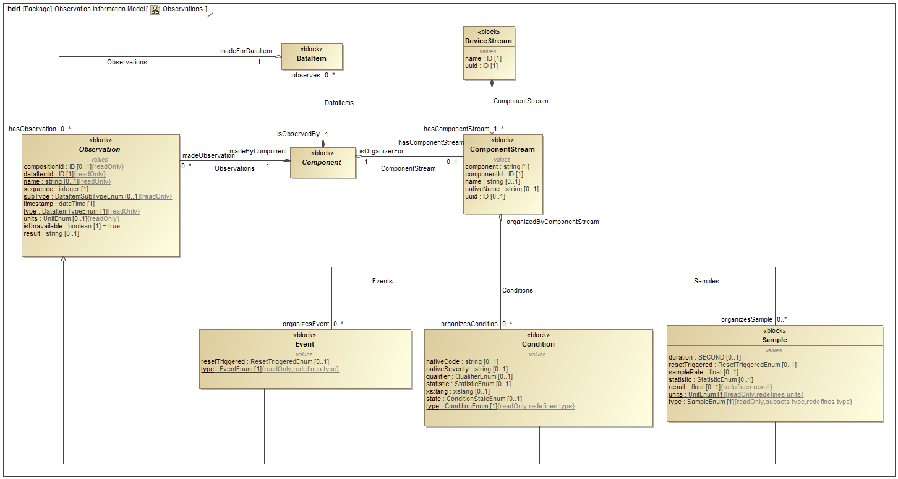

# Observations Information Model

The {{term(Observation Information Model)}} provides a representation of the data reported by a piece of equipment used for a manufacturing process, or used for any other purpose.  Additional descriptive information associated with the reported data is defined by the {{block(MTConnectDevices)}} entity, which is described in {{citetitle(MTCPart2)}}.

Information defined in the {{term(Observation Information Model)}} allows a software application to (1) determine the {{termplural(Observation)}} for {{termplural(DataItem)}} returned from a piece of equipment and (2) interpret the data associated with those {{termplural(Observation)}} with the same meaning, value, and context that it had at its original source.  To do this, the software application issues one of two HTTP requests to an {{term(agent)}} associated with a piece of equipment.  They are:

* `sample`:  Returns a designated number of time stamped {{termplural(Observation)}} from an {{term(agent)}} associated with a piece of equipment; subject to any HTTP filtering associated with the request.  See {{cite(Section 8.3.3)}} of {{citetitle(MTCPart1)}} of the MTConnect Standard for details on the `sample` HTTP request.

* `current`:  Returns a snapshot of either the most recent values or the values at a given sequence number for all {{termplural(Observation)}} associated with a piece of equipment from an {{term(agent)}}; subject to any HTTP filtering associated with the request.  See {{cite(Section 8.3.2)}} of {{citetitle(MTCPart1)}} of the MTConnect Standard for details on the `current` HTTP request.

An {{term(agent)}} responds to either the `sample` or `current` HTTP request with an {{term(MTConnectStreams Response Document)}}.  This document contains information describing {{termplural(Observation)}} reported by an {{term(agent)}} associated with a piece of equipment.   A client software application may correlate the information provided in the {{term(MTConnectStreams Response Document)}} with the physical and logical structure for that piece of equipment defined in the {{block(MTConnectDevices)}} entity to form a clear and unambiguous understanding of the information provided.  (See details on the structure for a piece of equipment described in {{citetitle(MTCPart2)}}).

{{block(Streams)}} for an {{block(MTConnectStreams)}} entity contains a {{block(DeviceStream)}} entity for each piece of equipment represented in the document.  Each {{block(DeviceStream)}} is comprised of two primary types of entities – {{termplural(Component)}} and {{termplural(Observation)}}.  The contents of the {{block(DeviceStream)}} container are described in detail in this document, {{citetitle(MTCPart3)}} of the MTConnect Standard.

{{termplural(Component)}} are defined for both the {{block(MTConnectDevices)}} and the {{block(MTConnectStreams)}} entities.  These {{termplural(Component)}} are used to provide a logical organization of the information provided in each entity.  

* For an {{block(MTConnectDevices)}} entity: {{termplural(Component)}} organize information that represents the physical and logical parts and sub-parts of a piece of equipment.  (See {{citetitle(MTCPart2)}}, Section 4 of the MTConnect Standard for more details on {{termplural(Component)}} used in the {{block(MTConnectDevices)}} entity).  

* For an {{block(MTConnectStreams)}} entity: {{termplural(Component)}} provide the structure to organize the data returned from a piece of equipment and establishes the proper context for that data.  The {{termplural(Component)}} specifically defined for {{block(MTConnectStreams)}} are {{block(DeviceStream)}} (see {{sect(DeviceStream)}}) and {{block(ComponentStream)}} (see {{sect(ComponentStream)}}).   

{{block(DeviceStream)}} and {{block(ComponentStream)}} entities have a direct correlation to each of the {{term(Component)}} defined in the {{block(MTConnectDevices)}} entity.

Within each {{block(ComponentStream)}} entity in the {{block(MTConnectStreams)}} entity, {{termplural(Observation)}} are modeled as {{block(Observation)}} entities. The three types of {{block(Observation)}} entity are {{block(Sample)}}, {{block(Event)}}, and {{block(Condition)}}.  (See {{sect(Observation Types)}} for more information on these entities.)

{{input(sections/MTConnectStreams.md)}}

# Streams Model

{{block(MTConnectStreams)}} organizes the information and data that is reported by an {{term(agent)}} for a piece of equipment.

{: width="0.8"}

> Note: See {{sect(Observations Schema Diagrams)}} for XML schema.

{{fig(DeviceStream Example)}} shows a complete example of {{block(DeviceStream)}} for the {{block(Device)}} shown in {{textit(Figure 2: Component Example)}} in {{citetitle(MTCPart2)}}.

{: width="0.8"}

> Note: See {{lst(devicestream-example)}} for the {{term(XML)}} representation of the same example.

{{input(sections/Streams.md)}}

{{input(sections/Observations.md)}}

{{input(sections/Representations.md)}}

# Observation Types

{{input(sections/ConditionStates.md)}}

{{input(sections/ConditionTypes.md)}}

{{input(sections/EventTypes.md)}}

{{input(sections/SampleTypes.md)}}
