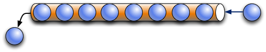

# MTConnect Specification and Material Statement

{{term(AMT)}} owns the copyright in this MTConnect Specification or Material. {{term(AMT)}} grants to you a non-exclusive, non-transferable, revocable, non-sublicensable, fully-paid-up copyright license to reproduce, copy and redistribute this MTConnect Specification or Material, provided that you may only copy or redistribute the MTConnect Specification or Material in the form in which you received it, without modifications, and with all copyright notices and other notices and disclaimers contained in the MTConnect Specification or Material.

If you intend to adopt or implement an MTConnect Specification or Material in a product, whether hardware, software or firmware, which complies with an MTConnect Specification, you shall agree to the MTConnect Specification Implementer License Agreement ("Implementer License") or to the MTConnect Intellectual Property Policy and Agreement ("IP Policy"'). The Implementer License and IP Policy each sets forth the license terms and other terms of use for MTConnect Implementers to adopt or implement the MTConnect Specifications, including certain license rights covering necessary patent claims for that purpose. These materials can be found at {{url(www.MTConnect.org)}}, or or by contacting {{url(mailto:info@MTConnect.org)}}. 

MTConnect Institute and {{term(AMT)}} have no responsibility to identify patents, patent claims or patent applications which may relate to or be required to implement a Specification, or to determine the legal validity or scope of any such patent claims brought to their attention. Each MTConnect Implementer is responsible for securing its own licenses or rights to any patent or other intellectual property rights that may be necessary for such use, and neither {{term(AMT)}} nor MTConnect Institute have any obligation to secure any such rights.

This Material and all MTConnect Specifications and Materials are provided "as is" and MTConnect Institute and {{term(AMT)}}, and each of their respective members, officers, affiliates, sponsors and agents, make no representation or warranty of any kind relating to these materials or to any implementation of the MTConnect Specifications or Materials in any product, including, without limitation, any expressed or implied warranty of noninfringement, merchantability, or fitness for particular purpose, or of the accuracy, reliability, or completeness of information contained herein. In no event shall MTConnect Institute or {{term(AMT)}} be liable to any user or implementer of MTConnect Specifications or Materials for the cost of procuring substitute goods or services, lost profits, loss of use, loss of data or any incidental, consequential, indirect, special or punitive damages or other direct damages, whether under contract, tort, warranty or otherwise, arising in any way out of access, use or inability to use the MTConnect Specification or other MTConnect Materials, whether or not they had advance notice of the possibility of such damage.

# Overview of MTConnect

MTConnect is a data and information exchange standard that is based on a {{term(data dictionary)}} of terms describing information associated with manufacturing operations.  The standard also defines a series of {{term(semantic data model)}} that provide a clear and unambiguous representation of how that information relates to a manufacturing operation.  The MTConnect Standard has been designed to enhance the data acquisition capabilities from equipment in manufacturing facilities, to expand the use of data driven decision making in manufacturing operations, and to enable software applications and manufacturing equipment to move toward a plug-and-play environment to reduce the cost of integration of manufacturing software systems.

The MTConnect standard supports two primary communications methods - {{term(request and response)}} and {{term(publish and subscribe)}} type of communications.  The {{term(request and response)}} communications structure is used throughout this document to describe the functionality provided by MTConnect.  See {{sect(Streaming Data)}} for details describing the functionality of the {{term(publish and subscribe)}} communications structure available from an {{term(agent)}}. 

Although the MTConnect Standard has been defined to specifically meet the requirements of the manufacturing industry, it can also be readily applied to other application areas as well.

The MTConnect Standard is an open, royalty free standard – meaning that it is available for anyone to download, implement, and utilize in software systems at no cost to the implementer.

The {{termplural(semantic data model)}} defined in the MTConnect Standard provide the information required to fully characterize data with both a clear and unambiguous meaning and a mechanism to directly relate that data to the manufacturing operation where the data originated.  Without a {{term(semantic data model)}}, client software applications must apply an additional layer of logic to raw data to convey this same level of meaning and relationship to manufacturing operations.  The approach provided in the MTConnect Standard for modeling and organizing data allows software applications to easily interpret data from a wide variety of data sources which reduces the complexity and effort to develop applications.

The data and information from a broad range of manufacturing equipment and systems are addressed by the MTConnect Standard.  Where the {{term(data dictionary)}} and {{termplural(semantic data model)}} are insufficient to define some information within an implementation, an implementer may extend the {{term(data dictionary)}} and {{term(semantic data model)}} to address their specific requirements.  See {{sect(Extensibility)}} for guidelines related to extensibility of the MTConnect Standard.

To assist in implementation, the MTConnect Standard is built upon the most prevalent standards in the manufacturing and software industries.  This maximizes the number of software tools available for implementation and provides the highest level of interoperability with other standards, software applications, and equipment used throughout manufacturing operations.  

Current MTConnect implementations are based on HTTP as a transport protocol and XML as a language for encoding each of the {{termplural(semantic data model)}} into electronic documents.  All software examples provided in the various MTConnect Standard documents are based on these two core technologies.  

The base functionality defined in the MTConnect Standard is the {{term(data dictionary)}} describing manufacturing information and the {{term(semantic data model)}}.  The transport protocol and the programming language used to represent or transfer the information provided by the {{termplural(semantic data model)}} are not restricted in the standard to HTTP and XML.  Therefore, other protocols and programming languages may be used to represent the semantic models and/or transport the information provided by these data models between an {{term(agent)}} (server) and a client software application as may be required by a specific implementation.

> Note: The term "document" is used with different meanings in the MTConnect Standard:

* Meaning 1:  The MTConnect Standard itself is comprised of multiple documents each addressing different aspects of the Standard.  Each document is referred to as a Part of the Standard.

* Meaning 2:  In an MTConnect implementation, the electronic documents that are published from a data source and stored by an {{term(agent)}}.     

* Meaning 3:  In an MTConnect implementation, the electronic documents generated by an {{term(agent)}} for transmission to a client software application. 

The following will be used throughout the MTConnect Standard to distinguish between these different meanings for the term "document":

* MTConnect Document(s) or Document(s) shall be used to refer to printed or electronic document(s) that represent a Part(s) of the MTConnect Standard.  

* All reference to electronic documents that are received from a data source and stored in an {{term(agent)}} shall be referred to as {{term(document)}}(s) and are typically provided with a prefix identifier; e.g. asset document.

* All references to electronic documents generated by an {{term(agent)}} and sent to a client software application shall be referred to as a {{term(response document)}}.  

When used with no additional descriptor, the form "document" shall be used to refer to any printed or electronic document.

Manufacturing software systems implemented utilizing MTConnect can be represented by a very simple structure as shown in {{fig(Basic MTConnect Implementation Structure)}}.

{: width="0.8"}

The three basic modules that comprise a software system implemented using MTConnect are:

* Equipment:  Any data source.  In the MTConnect Standard, equipment is defined as any tangible property that is used to equip the operations of a manufacturing facility.  Examples of equipment are machine tools, ovens, sensor units, workstations, software applications, and bar feeders.

* Agent:  Software that collects data published from one or more piece(s) of equipment, organizes that data in a structured manner, and responds to requests for data from client software systems by providing a structured response in the form of a {{term(response document)}} that is constructed using the {{termplural(semantic data model)}} defined in the Standard. 

> Note: The {{term(agent)}} may be fully integrated into the piece of equipment or the {{term(agent)}} may be independent of the piece of equipment.  Implementation of an {{term(agent)}} is the responsibility of the supplier of the piece of equipment and/or the implementer of the {{term(agent)}}.
    
* Client Software Application:  Software that requests data from {{termplural(agent)}} and processes that data in support of manufacturing operations. 

Based on {{fig(Basic MTConnect Implementation Structure)}}, it is important to understand that the MTConnect Standard only addresses the following functionality and behavior of an {{term(agent)}}:

* the method used by a client software application to request information from an {{term(agent)}}.

* the response that an {{term(agent)}} provides to a client software application.

* a {{term(data dictionary)}} used to provide consistency in understanding the meaning of data reported by a data source.

* the description of the {{termplural(semantic data model)}} used to structure {{termplural(response document)}} provided by an {{term(agent)}} to a client software application.

These functions are the primary building blocks that define the base functional structure of the MTConnect Standard.

There are a wide variety of data sources (equipment) and data consumption systems (client software systems) used in manufacturing operations.  There are also many different uses for the data associated with a manufacturing operation.  No single approach to implementing a data communication system can address all data exchange and data management functions typically required in the data driven manufacturing environment.  MTConnect has been uniquely designed to address this diversity of data types and data usages by providing different {{termplural(semantic data model)}} for different data application requirements:

* Data Collection: The most common use of data in manufacturing is the collection of data associated with the production of products and the operation of equipment that produces those products.  The MTConnect Standard provides comprehensive {{termplural(semantic data model)}} that represent data collected from manufacturing operations.  These {{termplural(semantic data model)}} are detailed in {{citetitle(MTCPart2)}} and {{citetitle(MTCPart3)}} of the MTConnect Standard.

* Inter-operations Between Pieces of Equipment:  The MTConnect Standard provides an {{term(interaction model)}} that structures the information required to allow multiple pieces of equipment to coordinate actions required to implement manufacturing activities.  This {{term(interaction model)}} is an implementation of a {{term(request and response)}}  messaging structure.  This {{term(interaction model)}} is called {{block(Interfaces)}} which is detailed in {{citetitle(MTCPart5)}} of the MTConnect Standard.

* Shared Data:  Certain information used in a manufacturing operation is commonly shared amongst multiple pieces of equipment and/or software applications.  This information is not typically "owned" by any one manufacturing resource.  The MTConnect Standard represents this information through a series of {{termplural(semantic data model)}} – each describing different types of information used in the manufacturing environment.  Each type of information is called an {{term(Asset)}}. {{termplural(Asset)}} are detailed in {{citetitle(MTCPart4)}}, and its sub-Parts, of the MTConnect Standard.

# Purpose of This Document

This document, {{citetitle(MTCPart1)}} of the MTConnect  Standard, addresses two major topics relating to the MTConnect Standard.  The first sections of the document define the organization of the documents used to describe the MTConnect Standard; including the terms and terminology used throughout the Standard.  The balance of the document defines the following:

* Operational concepts describing how an {{term(agent)}} should organize and structure data that has been collected from a data source.

* Definition and structure of the {{termplural(response document)}} supplied by an {{term(agent)}}.

* The protocol used by a client software application to communicate with an {{term(agent)}}.

# Terminology and Conventions

Refer to Section 3 of {{citetitle(MTCPart1)}} for a dictionary of terms, reserved language, and document conventions used in the MTConnect Standard.

{{printglossary[title=General Terms, type=general]()}}
{{printglossary[title=Information Model Terms, type=informationmodel]()}}
{{printglossary[title=Protocol Terms, type=protocol]()}}
{{printglossary[title=HTTP Terms, type=http]()}}
{{printglossary[title=XML Terms, type=xml]()}}
{{printglossary[title=MTConnect Terms, type=conceptmodel]()}}

{{printacronyms()}}

{{printbibliography[title=MTConnect References,keyword=MTC]()}}

{{printbibliography[title=Other References,notkeyword=MTC]()}}

{{glsaddall()}}

# MTConnect Fundamentals

The MTConnect Standard defines the normative informaton model and protocol for retrieving information from manufacturing equipment. The {{term(agent)}} behavior and protcol is in this document and the information models are sepecified in the other parts of the standard.

## Agent

The MTConnect Standard specifies the minimum functionality of the {{term(agent)}}. The functionality is as follows:

* Provides store and forward messaging middleware service.
* Provides key-value information storage and retrieval service.
* Implements the ReST API for the MTConnect Standard.
  * {{term(Device)}} metadata.
  * {{termplural(observation)}} collected by the agent.
  * {{termplural(asset)}} colleted by the agent.

There are three types of information stored by an {{term(agent)}} that **MAY** be published in a {{term(response document)}}.  These are as follows:

* {{term(equipment metadata)}} specified in {{cite(MTCPart2)}}.
* {{term(streaming data)}} provides the {{termplural(observation)}} specified in {{cite(MTCPart2)}} in a {{term(buffer)}}.
* {{termplural(Asset)}} specified in {{cite(MTCPart40)}}.

### Agent Instance ID

The {{term(agent)}} **MUST** initialize the {{term(sequence number)}} to `1`. When the {{term(agent)}} sets the {{term(observation)}} {{term(sequence number)}} to `1`, the MTConnect Agent **MUST** set the {{term(agent)}} `instanceId` to a unique value. 

### Storage of Equipment Metadata

An {{term(agent)}} **MUST** be capable of publishing {{term(equipment metadata)}} for the {{term(agent)}} as specified in {{cite(MTCPart2)}}.

### Storage of Streaming Data

The {{term(agent)}} **MAY** implement a {{term(buffer)}} with a fixed number of {{termplural(observation)}}. If the `bufferSize` is a fixed, the {{term(agent)}} **MUST** store {{termplural(observation)}} using a first-in-first-out pattern. The {{term(agent)}} will remove the oldest {{term(observation)}} when the {{term(buffer)}} is full and a new {{term(observation)}} arrives.

{: width="0.8"}

In {{figure(first-in-first-out-buffer-management)}}, the maximum number of {{termplural(observation)}} that can be stored in the {{term(buffer)}} of the {{term(agent)}} is 8.  The `bufferSize` in the header reports the maximum number of {{termplural(observation)}}.  This example illustrates that when the {{term(buffer)}} fills up, the oldest piece of data falls out the other end.

{: width="0.8"}

> Note: As an implementation suggestion, the {{term(buffer)}} should be sized large enough to provide a continuous stream of {{termplural(observation)}}.  The implementer should also consider the impact of a temporary loss of communications when determining the size for the {{term(buffer)}}.  A larger {{term(buffer)}} will allow more time to reconnect to an {{term(agent)}} without losing data.

#### Sequence Numbers

In an {{term(agent)}}, each occurrence of an {{term(observation)}} in the {{term(buffer)}} will be assigned a monotonically increasing unsigned 64-bit integer ({{term(sequence number)}}) when it arrives. The first {{term(sequence number)}} **MUST** be `1`.

The {{term(sequence number)}} for each {{term(observation)}} **MUST** be unique for an instance of an {{term(agent)}} identified by an `instanceId`.

Table {{table(instanceid-and-sequence)}} illustrates the changing of the `instanceId` when an {{term(agent)}} resets the {{term(sequence number)}} to `1`.

| `instanceId` | `sequence` | 
|-------------:|-----------:|
|{{rowspan(5)}} 234556|234|
||235|
||236|
||237|
||238|
|{{span(2)}} Agent Stops and Restarts|
|{{rowspan(5)}} 234556|1|
||2|
||3|
||4|
||5|
{: caption="instanceId and sequence" label="instanceid-and-sequence" }

{{figure(identifying-the-range-of-data-with-firstsequence-and-lastsequence)}} shows two additional pieces of information defined for an {{term(agent)}}:

* `firstSequence` -- the oldest piece of data contained in the {{term(buffer)}}; i.e., the next piece of data to be moved out of the {{term(buffer)}}

* `lastSequence` -- the newest data added to the {{term(buffer)}}

`firstSequence` and `lastSequence` provide the range of values for the ReST API requests.

{: width="0.75"}

The {{term(observation)}} with the {{term(sequence number)}} of the `from`) parameter of the {{term(sample request)}} **MUST** be included in the {{term(response document)}} and the total number (`count`) of {{termplural(observation)}} that **SHOULD** be included in that document.

In {{figure(identifying-the-range-of-data-with-from-and-count)}}, the request specifies the {{termplural(observation)}} start at {{term(sequence number)}} `15` (`from`) and includes a total of three items (`count`).

{: width="0.75"}

`nextSequence` header property has the {{term(sequence number)}} of the next {{term(observation)}} in the {{term(buffer)}} for a subsequent {{term(sample request)}} having a contiguous set of {{termplural(observation)}}.  In the example in {{figure(identifying-the-range-of-data-with-from-and-count)}}, the next {{term(sequence number)}} (`nextSequence`) will be 18.

As shown in {{figure(identifying-the-range-of-data-with-nextsequence-and-lastsequence)}}, the combination of `from` and `count` defined by the {{term(request)}} indicates a {{term(sequence number)}} for data that is beyond that which is currently in the {{term(buffer)}}.  In this case, `nextSequence` is set to a value of `lastSequence` + 1.

{: width="0.75"}

#### Buffer Data Structure

An {{term(observation)}} has four pieces of information as follows:

1. {{term(sequence number)}} associated with each {{term(observation)}} - `sequence`.

2. The `timestamp` the {{term(observation)}} was made. .

3. A reference to the `dataitemid` from the {{cite(MTCPart2)}} information model.

4. The value of the {{term(observation)}}.

{{fig(data-storage-concept)}} is an example demonstrating the concept of how data may be stored in an {{term(agent)}}:

{: width="0.8"}

#### Timestamp

{{termplural(observation)}} **MUST** have a `timestamp` giving the most accurate time that the {{term(observation)}} was observed.

`timestamp` **MUST** be reported in UTC (Coordinated Universal Time) timezone in ISO 8601 format: e.g., "2010-04-01T21:22:43Z".

Applications **SHOULD** use the {{term(observation)}}'s `timestamp` for ordering as opposed to {{term(sequence number)}}.

If {{termplural(observation)}} are known to have occured at the same time, they **MUST** be reported with the same `timestamp`. 

#### Recording Occurrences of Streaming Data

The {{term(agent)}} **MUST** only place {{termplural(observation)}} in the {{term(buffer)}} if the data has changed from the previous {{term(observation)}} for the same {{block(DataItem)}}. The exceptions to this rule are the following conditions:

* The {{property(discrete)}} attribute is `true` for the {{block(DataItem)}}. 
* The {{property(representation)}} is `DISCRETE`.
* The {{property(representation)}} is `TIME_SERIES`.

In the case of an exception, the {{term(agent)}} **MUST** place every  {{term(observation)}} in the {{term(buffer)}}.

#### Maintaining Last Value for Data Entities

An {{term(agent)}} **MUST** retain the most recent {{term(observation)}} associated with each {{block(DataItem)}}; even if an occurrence of that {{term(observation)}} is no longer in the {{term(buffer)}}. This function supports the {{term(current request)}} functionality.

#### Unavailability of Data

The {{term(agent)}} **MUST** initialize every {{block(DataItem)}}, unless it has a constant value (see below), with an {{term(observation)}} having a value of `UNAVAILABLE`. Aditionally, whenever the data source is unreachable, every {{block(DataItem)}} associated with the data source must have an {{term(observation)}} with a value of `UNAVAILABLE` and `timestamp` when the connection was lost. An `UNAVAILABLE` indicates the value of the {{term(observation)}} is indeterminate.

Any {{term(observation)}} that is constrained to a constant value, as defined in {{cite(MTCPart2)}}, **MUST** only have the constant value and **MUST NOT** be set to `UNAVAILABLE`.

#### Persistence and Recovery

The {{term(agent)}} **MAY** have a fixed size {{term(buffer)}} and the {{term(buffer)}} **MAY** be ephemeral.

If the {{term(buffer)}} is recoverable, the {{term(agent)}} **MUST NOT**  change the `instanceId` and **MUST NOT** set the {{term(sequence number)}} to `1`.

### Storage of MTConnect Assets

An {{term(agent)}} **MAY** only retain a limited number of {{termplural(MTConnectAssets Response Document)}} in the {{termplural(asset buffer)}}. The {{termplural(asset)}} are stored in first-in-first-out method where the oldest {{term(asset)}} is removed when the {{term(asset buffer)}} is full and a new {{term(asset)}} arrives.

{{figure(first-in-first-out-asset-buffer-management)}} illustrates the oldest {{term(MTConnectAssets Response Document)}} being removed from the {{termplural(asset buffer)}} when a new {{term(MTConnectAssets Response Document)}} is added and the {{termplural(asset buffer)}} is full:

{: width="0.6"}

{{termplural(MTConnectAssets Response Document)}} are indexed by {{property(assetId)}}.  In the case of {{termplural(Asset)}}. {{figure(relationship-between-assetid-and-stored-asset-documents)}} demonstrates the relationship between the key ({{property(assetId)}}) and the stored {{termplural(MTConnectAssets Response Document)}}:

{: width="0.25"}

> Note:  The key ({{property(assetId)}}) is independent of the order of the {{termplural(MTConnectAssets Response Document)}} stored in the {{termplural(asset buffer)}}.

When the {{term(agent)}} receives a new {{term(MTConnectAssets Response Document)}}, one of the following rules **MUST** apply:

* If the {{term(MTConnectAssets Response Document)}} represents an {{term(Asset)}} not in the {{termplural(asset buffer)}}, the {{term(agent)}} **MUST** add the new document to the front of the {{termplural(asset buffer)}}.  If the {{termplural(asset buffer)}} is full, the oldest {{term(MTConnectAssets Response Document)}} will be removed from the {{termplural(asset buffer)}}.

* If the {{term(MTConnectAssets Response Document)}} key is already in the {{termplural(asset buffer)}}, the {{term(agent)}} **MUST** replace the existing {{term(MTConnectAssets Response Document)}} move the {{term(MTConnectAssets Response Document)}} to the front of the {{termplural(asset buffer)}}.  

The number of {{termplural(MTConnectAssets Response Document)}} that may be stored in an {{term(agent)}} is defined by the value for {{property(assetBufferSize)}}. A {{property(assetBufferSize)}} of 4,294,967,296 or $2^{32}$ **MUST** indicate unlimited storage.

The {{term(asset buffer)}} **MAY** be effemeral and the {{termplural(MTConnectAssets Response Document)}} will be lost if the {{term(agent)}} clears the {{term(asset buffer)}}. They must be recovered from the data source.

{{cite(MTCPart40)}} provides additional information on {{term(asset)}} management. 

## Response Documents

{{termplural(response document)}} are electronic documents generated by an {{term(agent)}} in response to a {{term(request)}} for data. 

The {{termplural(response document)}} defined in the MTConnect Standard are:

* {{term(MTConnectDevices Response Document)}}:  An electronic document that contains the information published by an {{term(agent)}} describing the data that can be published by one or more piece(s) of equipment. The structure of the {{term(MTConnectDevices Response Document)}} document is based upon the requirements defined by the {{termplural(Device Information Model)}}.  See {{cite(MTCPart2)}} for details on this information model.

* {{term(MTConnectStreams Response Document)}}:  An electronic document that contains the information published by an {{term(agent)}} that contains the data that is published by one or more piece(s) of equipment.  The structure of the {{term(MTConnectStreams Response Document)}} document is based upon the requirements defined by the {{term(Observation Information Model)}}.  See {{cite(MTCPart3)}} for details on this information model.

* {{term(MTConnectAssets Response Document)}}:  An electronic document that contains the information published by an {{term(agent)}} that **MAY** include one or more {{termplural(MTConnectAssets Response Document)}}.  The structure of the {{term(MTConnectAssets Response Document)}} document is based upon the requirements defined by the {{termplural(Asset Information Model)}}.  See {{cite(MTCPart4)}} for details on this information model.

* {{term(MTConnectErrors Response Document)}}:  An electronic document that contains the information provided by an {{term(agent)}} when an error has occurred when trying to respond to a {{term(request)}} for data.  The structure of the {{term(MTConnectErrors Response Document)}} is based upon the requirements defined by the {{term(Error Information Model)}}.  See {{sect(Error Information Model)}} of this document for details on this information model.

{{termplural(response document)}} may be represented by any document format supported by an {{term(agent)}}.  No matter what document format is used to structure these documents, the requirements for representing the data and other information contained in those documents **MUST** adhere to the requirements defined in the {{termplural(information model)}} associated with each document.

## Request/Response Information Exchange

The transfer of information between an {{term(agent)}} and a client software application is based on a {{term(request and response)}} information exchange approach. A client software application requests specific information from an {{term(agent)}}. An {{term(agent)}} responds to the {{term(request)}} by publishing a {{term(response document)}}.

In normal operation, there are four types of {{termplural(MTConnect Request)}} that can be issued by a client software application that will result in different {{termplural(response)}} by an {{term(agent)}}.  These {{termplural(request)}} are:

* {{term(probe request)}}: A client software application requests the {{term(equipment metadata)}} for each piece of equipment that **MAY** publish information through an {{term(agent)}}.  The {{term(agent)}} publishes a {{term(MTConnectDevices Response Document)}} that contains the requested information.  A {{term(probe request)}} is represented by the term `probe` in a {{term(request)}} from a client software application.

* {{term(current request)}}: A client software application requests the current value for each of the data types that have been published from a piece(s) of equipment to an {{term(agent)}}.  The {{term(agent)}} publishes a {{term(MTConnectStreams Response Document)}} that contains the requested information.  A {{term(current request)}} is represented by the term `current` in a {{term(request)}} from a client software application.

* {{term(sample request)}} -- A client software application requests a series of data values from the {{term(buffer)}} in an {{term(agent)}} by specifying a range of {{termplural(sequence number)}} representing that data.  The {{term(agent)}} publishes a {{term(MTConnectStreams Response Document)}} that contains the requested information.  A {{term(sample request)}} is represented by the term `sample` in a {{term(request)}} from a client software application.

* {{term(asset request)}} -- A client software application requests information related to {{termplural(Asset)}} that has been published to an {{term(agent)}}.  The {{term(agent)}} publishes an {{term(MTConnectAssets Response Document)}} that contains the requested information.  An {{term(asset request)}} is represented by the term `asset` in a {{term(request)}} from a client software application.

> Note: If an {{term(agent)}} is unable to respond to the request for information or the request includes invalid information, the {{term(agent)}} will publish an {{term(MTConnectErrors Response Document)}}. See {{sect(error-information-model)}} for information regarding {{term(Error Information Model)}}

The specific format for the {{term(request)}} for information from an {{term(agent)}} will depend on the {{term(protocol)}} implemented as part of the {{term(request and response)}} information exchange mechanism deployed in a specific implementation.

Also, the specific format for the {{termplural(response document)}} may also be implementation dependent.

## Accessing Information from an Agent

See {{sect(MTConnect ReST Protocol)}}.

# MTConnect ReST Protocol

An {{term(agent)}} **MUST** perform the following tasks:

* Collect data from manufacturing equipment.
* Generate {{termplural(response document)}}.
* Provide a ReST interface using HTTP.

An {{term(agent)}} **MAY** provide additional protocols and represntations. Some representations **MAY** have companion specifications.

## ReST Interface

An {{term(agent)}} **MUST** provide a ReST API {{term(API)}} supporting HTTP version 1.0 or greater.  This interface **MUST** support HTTP (RFC7230) and use URIs (RFC3986) to identify specific information requested from an {{term(agent)}}. 

The REST API adheres to the architectural principles of a stateless service to retrieve information associated with pieces of equipment. Additionally, the API is read-only and does not produce any side effects on the data stored in an {{term(agent)}} or change the function of the {{term(agent)}} itself. ReST state management requires client has responsibility for recovery in case of error or loss of connection.

## HTTP Request

The MTConnect standard defines that an {{term(agent)}} **MUST** support the `HTTP` `GET` verb -- no other HTTP verbs are required to be supported. See IETF RFC 7230 for a complete description of the HTTP request structure. The 

The HTTP uses Uniform Resource Identifiers (URI) as outlined in IETF RFC 3986 as the *request-target*. IETF RFC 7230 specifies the http URI scheme for the *request-target* as follows:

1. `protocol`: The protocol used for the request. Must be `http` or `https`.
2. `authority`: The network domain or address of the agent with an optional port.
2. `path`: A Hierarchical Identifier following a slash (`/`) and before the optional question-mark (`?`). The `path` separates segments by a slash (`/`).
3. `query`: The portion of the HTTP request following the question-mark (`?`). The query portion of the HTTP request is composed of key-value pairs, `<key>=<value>` separated by an ampersand (`&`).

### `path` Portion of an HTTP Request

The `<Path>` portion of the *request-target* has the following segments:

* `<device name or uuid>`: optional `name` or `uuid` of the {{block(Device)}}
* `<request>`: request, must be one of the following: 
  - `probe`
  - `current`
  - `sample`
  - `asset` or `assets`
    - `asset` request has additional optional segment `<asset ids>`
  
If `name` or `uuid` segement are not specified in the {{term(HTTP Request)}}, an {{term(agent)}} **MUST** return information for all pieces of equipment. The following sections will 

Examples: 
  
* `http://localhost:5000/my_device/probe`
  
    The request only provides information about `my_device`.
  
* `http://localhost:5000/probe`

  The request provides information for all devices. 

The following section specifies the details for each request.

## MTConnect ReST API

An {{term(agent)}} **MUST** support {{termplural(probe request)}}, {{termplural(current request)}}, {{termplural(sample request)}}, and {{termplural(asset request)}}.

The following sections define how the {{term(HTTP Request)}} is structured to support each of these types of {{termplural(request)}} and the information that an {{term(agent)}} **MUST** provide in response:

### Probe Request

#### Query Portion of the Probe Request

There are no `query` required for the {{term(probe request)}}. Any parameters **MUST** be ignored by the {{term(agent)}}.

#### Response to a Probe Request

The {{term(agent)}} **MUST** respond to a successful {{term(probe request)}} with a {{term(HTTP Status Code)}} `200` (`OK`) and an {{term(MTConnectDevices Response Document)}}. If the {{term(request)}} fails, the {{term(agent)}} **MUST** respond with an an {{term(MTConnectErrors Response Document)}} a {{term(HTTP Status Code)}} other than 200.

#### HTTP Status Codes for a Probe Request

The following {{termplural(HTTP Status Code)}} **MUST** be supported as possible responses to a {{term(probe request)}}:

* Status Code: `200`, Code Name: `OK`:

  The {{term(request)}} succeeded.
  
* Status Code: `400`, Code Name: `Bad Request`:

  The {{term(request)}} was invalid. The {{term(response)}}  **MUST** have an {{term(MTConnectErrors Response Document)}}.
  
* Status Code: `404`, Code Name: `Not Found`:

  The device name or uuid could not be located. The {{term(response)}} **MUST** have an {{term(MTConnectErrors Response Document)}}.
  
* Status Code: `405`, Code Name: `Method Not Allowed`:

  The {{term(request)}} specified a method other than `GET`
  
* Status Code: `406`, Code Name: `Not Acceptable`:

  The HTTP `Accept` Header in the {{term(request)}} was not one of the supported representations.
    
* Status Code: `431`, Code Name: `Request Header Fields Too Large`:

  The fields in the {{term(HTTP Request)}} exceed the limit of the implementation of the {{term(agent)}}.
  
* Status Code: `500`, Code Name: `Internal Server Error`:

  There was an unexpected error in the {{term(agent)}} while responding to a {{term(request)}}.
  
### Current Request

#### Query Portion of a Current Request

The following optional `query` parameters **MUST** be supported for a {{term(current request)}}:

* `at`: unsigned 64-bit integer

  The {{termplural(response document)}} **MUST** include {{termplural(observation)}} consistent with a specific {{term(sequence number)}} given by the value of the `at` parameter.

  If the value is either less than the `firstSequence` or greater than the `lastSequence`, the {{term(request)}} **MUST** return a 404 {{term(HTTP Status Code)}} and the {{term(agent)}} **MUST** return an {{term(MTConnectErrors Response Document)}} with an `OUT_OF_RANGE` {{property(errorCode)}}. 
  
  The `at` parameter **MUST NOT** be used in conjunction with the `interval` parameter.

* `interval`: unsigned integer milliseconds

  The {{term(agent)}} **MUST** continuously publish {{termplural(response document)}} pausing for the number of milliseconds given as the value.

  The `interval` value **MUST** be in milliseconds, and **MUST** be a positive integer greater than zero (0). 

  The `interval` parameter **MUST NOT** be used in conjunction with the `at` parameter.

* `path`: string

  An XPath evaluated against the {{term(Device Information Model)}} that references the {{termplural(Component)}} and {{termplural(DataItem)}} to include in the {{term(MTConnectStreams Response Document)}}.
  
  When a {{block(Component)}} element is referenced by the XPath, all {{termplural(observation)}} for its {{termplural(DataItem)}} and related {{termplural(Component)}} **MUST** be included in the {{term(MTConnectStreams Response Document)}}.

#### Response to a Current Request

The {{term(agent)}} **MUST** respond to a successful {{term(current request)}} with a {{term(HTTP Status Code)}} `200` (`OK`) and an {{term(MTConnectStreams Response Document)}}. If the {{term(request)}} fails, the {{term(agent)}} **MUST** respond with an an {{term(MTConnectErrors Response Document)}} a {{term(HTTP Status Code)}} other than 200.

#### HTTP Status Codes for a Current Request

The following {{termplural(HTTP Status Code)}} **MUST** be supported as possible responses to a {{term(current request)}}:

* Status Code: `200`, Code Name: `OK`:

  The {{term(request)}} succeeded.
  
* Status Code: `400`, Code Name: `Bad Request`:

  The {{term(request)}} was invalid. The {{term(response)}}  **MUST** have an {{term(MTConnectErrors Response Document)}}.
  
* Status Code: `404`, Code Name: `Not Found`:

  One of the following conditions apply:
  
  * The device name or uuid could not be located. 
  * The `at` was `OUT_OF_RANGE` range.
  
  The {{term(response)}} **MUST** have an {{term(MTConnectErrors Response Document)}}.
  
* Status Code: `405`, Code Name: `Method Not Allowed`:

  The {{term(request)}} specified a method other than `GET`
  
* Status Code: `406`, Code Name: `Not Acceptable`:

  The HTTP `Accept` Header in the {{term(request)}} was not one of the supported representations.
    
* Status Code: `431`, Code Name: `Request Header Fields Too Large`:

  The fields in the {{term(HTTP Request)}} exceed the limit of the implementation of the {{term(agent)}}.
  
* Status Code: `500`, Code Name: `Internal Server Error`:

  There was an unexpected error in the {{term(agent)}} while responding to a {{term(request)}}.

### Sample Request

#### Query Portion of a Sample Request

The following `query` parameters **MUST** be supported in an {{term(HTTP Request Line)}} for a {{term(sample request)}}:

* `count`: signed integer

  The `count` parameter designates the maximum number of {{termplural(observation)}} the {{term(agent)}} **MUST** publish in the {{term(response document)}}. 

  The `count` **MUST NOT** be zero (0). 

  When the `count` is greater than zero (0), the `from` parameter **MUST** default to the `firstSequence`. The evaluation of {{termplural(observation)}} starts at `from` and moves forward accumulating newer {{termplural(observation)}} until the number of {{termplural(observation)}} equals the `count` or the  {{term(observation)}} at `lastSequence` is considered. 

  When the `count` is less than zero (0), the `from` parameter **MUST**  default to the `lastSequence`. The evaluation of {{termplural(observation)}} starts at `from` and moves backward accumulating older {{termplural(observation)}} until the number of {{termplural(observation)}} equals the absolute value of `count` or the {{term(observation)}} at `firstSequence` is considered. 

  `count` **MUST NOT** be less than zero (0) when an `interval` parameter is given. 

  If `count` is not provided, it **MUST** default to `100`. 

  If the absolute value of `count` is greater than the size of the {{term(buffer)}} or equal to zero (0), the {{term(agent)}} **MUST** return a `404` {{term(HTTP Status Code)}} and **MUST** publish an {{term(MTConnectErrors Response Document)}} with an `OUT_OF_RANGE`  {{property(errorCode)}}. 

  If the `count` parameter is not a numeric value, the {{term(agent)}} **MUST** return a `400` {{term(HTTP Status Code)}} and **MUST** publish an {{term(MTConnectErrors Response Document)}} with an `INVALID_REQUEST`  {{property(errorCode)}}.

* `from`: unsigned 64-bit integer
 
  The `from` parameter designates the {{term(sequence number)}} of the first {{term(observation)}} in the {{term(buffer)}} the {{term(agent)}} **MUST** consider publishing in the {{term(response document)}}. 

  If `from` is zero (0), it **MUST** be set to the `firstSequence`, the oldest {{term(observation)}} in the {{term(buffer)}}. 

  If `from` and `count` parameters are not given, `from` **MUST** default to the `firstSequence`. 

  If the `from` parameter is less than the `firstSequence` or greater than `lastSequence`, the {{term(agent)}} **MUST** return a `404` {{term(HTTP Status Code)}} and **MUST** publish an {{term(MTConnectErrors Response Document)}} with an `OUT_OF_RANGE` {{property(errorCode)}}. 

* `heartbeat`: unsigned integer milliseconds
  
  Sets the time period for the {{term(heartbeat)}} function in an {{term(agent)}}. 

  The value for `heartbeat` represents the amount of time after a {{term(response document)}} has been published until a new {{term(response document)}} **MUST** be published, even when no new data is available. 

  The value for `heartbeat` is defined in milliseconds.

  If no value is defined for `heartbeat`, the value **MUST** default to 10 seconds. 

  `heartbeat` **MUST** only be specified if `interval` is also specified.

* `interval`: unsigned integer milliseconds

  The {{term(agent)}} **MUST** continuously publish {{termplural(response document)}} when the query parameters include `interval` using the value as the minimum period between adjacent publications. 

  The `interval` value **MUST** be in milliseconds, and **MUST** be a positive integer greater than or equal to zero (0). 

  If the value for the `interval` parameter is zero (0), the {{term(agent)}} **MUST** publish  {{termplural(response document)}} when any {{termplural(observation)}} become available.

  If the period between the publication of a {{term(response document)}} and reception of {{termplural(observation)}} exceeds the `interval`, the {{term(agent)}} **MUST** wait for a maximum of `heartbeat` milliseconds for {{termplural(observation)}}. Upon the arrival of {{termplural(observation)}}, the {{term(agent)}} **MUST** immediately publish a {{term(response document)}}. When the period equals or exceeds the `heartbeat`, the {{term(agent)}} **MUST** publish an empty {{term(response document)}}.

* `path`: string
  
  An XPath evaluated against the {{term(Device Information Model)}} that references the {{termplural(Component)}} and {{termplural(DataItem)}} to include in the {{term(MTConnectStreams Response Document)}}.
  
  When a {{block(Component)}} element is referenced by the XPath, all {{termplural(observation)}} for its {{termplural(DataItem)}} and related {{termplural(Component)}} **MUST** be included in the {{term(MTConnectStreams Response Document)}}.

* `to`: unisgned 64-bit integer

  The `to` parameter specifies the {{term(sequence number)}} of the {{term(observation)}} in the {{term(buffer)}} that will be the upper bound of the {{termplural(observation)}} in the {{term(response document)}}.

  Rules for `to` are as follows:

  * The value of `to` **MUST** be an unsigned 64-bit integer.
  * The value of `to` **MUST** be greater than the `firstSequence`.
  * The value of `to` **MUST** be less than or equal to the `lastSequence`.
  * The value of `to` **MUST** be greater than `from`.
  * If `to` and `count` are given, the `count` parameter **MUST** be greater than zero.
  * If `to` and `count` are given, the maximum number of {{termplural(observation)}} published in the {{term(response document)}} **MUST NOT** be greater than the value of `count`.
  * If `to` is not given, see the `from` parameter for default behavior.
  * If the `to` parameter is less than the `firstSequence` or greater than `lastSequence`, the {{term(agent)}} **MUST** return a `404` {{term(HTTP Status Code)}} and **MUST** publish an {{term(MTConnectErrors Response Document)}} with an `OUT_OF_RANGE` `errorCode`.
  * If the `to` parameter is not a positive numeric value, the {{term(agent)}} **MUST** return a `400` {{term(HTTP Status Code)}} and **MUST** publish an {{term(MTConnectErrors Response Document)}} with an `INVALID_REQUEST` `errorCode`.
  * If the `to` parameter is less than the `from` parameter, the {{term(agent)}} **MUST** return a `400` {{term(HTTP Status Code)}} and **MUST** publish an {{term(MTConnectErrors Response Document)}} with an `INVALID_REQUEST` `errorCode`.
  * If the `to` parameter is given and the `count` parameter is less than zero, the {{term(agent)}} **MUST** return a `400` {{term(HTTP Status Code)}} and **MUST** publish an {{term(MTConnectErrors Response Document)}} with an `INVALID_REQUEST` `errorCode`.

#### Response to a Sample Request

The {{term(agent)}} **MUST** respond to a successful {{term(sample request)}} with a {{term(HTTP Status Code)}} `200` (`OK`) and an {{term(MTConnectStreams Response Document)}}. If the {{term(request)}} fails, the {{term(agent)}} **MUST** respond with an an {{term(MTConnectErrors Response Document)}} a {{term(HTTP Status Code)}} other than 200.

#### HTTP Status Codes for a Sample Request

The following {{termplural(HTTP Status Code)}} **MUST** be supported as possible responses to a {{term(current request)}}:

* Status Code: `200`, Code Name: `OK`:

  The {{term(request)}} succeeded.
  
* Status Code: `400`, Code Name: `Bad Request`:

  The {{term(request)}} was invalid. The {{term(response)}}  **MUST** have an {{term(MTConnectErrors Response Document)}}.
  
* Status Code: `404`, Code Name: `Not Found`:

  One of the following conditions apply:
  
  * The device name or UUID could not be located. 
  * One of the `asset_ids` could not be found.
  
  The {{term(response)}} **MUST** have an {{term(MTConnectErrors Response Document)}}.
  
* Status Code: `405`, Code Name: `Method Not Allowed`:

  The {{term(request)}} specified a method other than `GET`
  
* Status Code: `406`, Code Name: `Not Acceptable`:

  The HTTP `Accept` Header in the {{term(request)}} was not one of the supported representations.
    
* Status Code: `431`, Code Name: `Request Header Fields Too Large`:

  The fields in the {{term(HTTP Request)}} exceed the limit of the implementation of the {{term(agent)}}.
  
* Status Code: `500`, Code Name: `Internal Server Error`:

  There was an unexpected error in the {{term(agent)}} while responding to a {{term(request)}}.

### Asset Request

#### Path Portion of an Asset Request

The following additional segment of path **MUST** be supported in the {{term(HTTP Request Line)}} for an {{term(asset request)}}:

* `asset_ids`: 

  The `path` portion is a list of (`asset_id`) for specific {{termplural(MTConnectAssets Response Document)}}.  

  In response, the {{term(agent)}} returns an {{term(MTConnectAssets Response Document)}} that contains information for the specific {{termplural(asset)}} for each of the `asset_id` values provided in the {{term(request)}}. Each `asset_id` is separated by a ";".
  
Examples:

* `http://localhost:5000/assets/CuttingTool1;CuttingTool2`

  The {{term(MTConnectAssets Response Document)}} contains {{term(asset)}} documents for an asset with {{property(assetId)}} of `CuttingTool1` and `CuttingTool2`

#### Query Portion of an Asset Request

A query may be used to more precisely define the specific information to be included in a {{term(response document)}}.   Multiple parameters may be used in a query to further refine the information to be included.  When multiple parameters are provided, each parameter is separated by an & character and each parameter appears only once in the query.  The parameters within the query may appear in any sequence.

The following `query` parameters **MUST** be supported in an {{term(HTTP Request Line)}} for an {{term(asset request)}}:

* {{property(removed)}}: boolean `true` or `false`

  The value for {{property(removed)}} **MUST** be `true` or `false` and interpreted as follows:
  
  * `true`: {{termplural(MTConnectAssets Response Document)}} for {{termplural(asset)}} marked as removed **MUST** be included in the {{term(response document)}}. 
  * `false`: {{termplural(MTConnectAssets Response Document)}} for {{termplural(asset)}} marked as removed **MUST NOT** be included in the {{term(response document)}}. 
  
  If {{property(removed)}} is not given, the default value **MUST** be `false`. 

* `count`: unsigned integer

  Specifies the maximum number of {{termplural(MTConnectAssets Response Document)}} returned in an {{term(MTConnectAssets Response Document)}}.
  
  If `count` is not given, the default value **MUST** be `100`.

#### Response to an Asset Request

The {{term(response)}} to an {{term(asset request)}} **SHOULD** be an {{term(MTConnectAssets Response Document)}} containing information for one or more {{termplural(MTConnectAssets Response Document)}} designated by the {{term(request)}}.  
The {{term(response)}} to an {{term(asset request)}} **MUST** always provide the most recent information available to an {{term(agent)}}.

The {{termplural(MTConnectAssets Response Document)}} provided in the {{term(MTConnectAssets Response Document)}} will be limited to those specified in the combination of the `path` segment of the {{term(asset request)}} and the parameters provided in the `query` segment of that {{term(request)}}.

If the {{property(removed)}} query parameter is not provided with a value of `true`, {{termplural(MTConnectAssets Response Document)}} for {{termplural(asset)}} that have been marked as removed will not be provided in the response. 

#### HTTP Status Codes for a Asset Request

The following {{termplural(HTTP Status Code)}} **MUST** be supported as possible responses to a {{term(asset request)}}:

* Status Code: `200`, Code Name: `OK`:

  The {{term(request)}} succeeded.
  
* Status Code: `400`, Code Name: `Bad Request`:

  The {{term(request)}} was invalid. The {{term(response)}}  **MUST** have an {{term(MTConnectErrors Response Document)}}.
  
* Status Code: `404`, Code Name: `Not Found`:

  One of the following conditions apply:
  
  * The device name or uuid could not be located. 
  * The `from` or `to` was `OUT_OF_RANGE`.
  
  The {{term(response)}} **MUST** have an {{term(MTConnectErrors Response Document)}}.
  
* Status Code: `405`, Code Name: `Method Not Allowed`:

  The {{term(request)}} specified a method other than `GET`
  
* Status Code: `406`, Code Name: `Not Acceptable`:

  The HTTP `Accept` Header in the {{term(request)}} was not one of the supported representations.
    
* Status Code: `431`, Code Name: `Request Header Fields Too Large`:

  The fields in the {{term(HTTP Request)}} exceed the limit of the implementation of the {{term(agent)}}.
  
* Status Code: `500`, Code Name: `Internal Server Error`:

  There was an unexpected error in the {{term(agent)}} while responding to a {{term(request)}}.

### HTTP Errors

When an {{term(agent)}} receives an {{term(HTTP Request)}} that is incorrectly formatted or is not supported by the {{term(agent)}}, the {{term(agent)}} **MUST** publish an {{term(HTTP Error Message)}} which includes a specific status code from the tables above indicating that the {{term(request)}} could not be handled by the {{term(agent)}}.

Also, if the {{term(agent)}} experiences an internal error and is unable to provide the requested {{term(response document)}}, it **MUST** publish an {{term(HTTP Error Message)}} that includes a specific status code from the table above.

When an {{term(agent)}} encounters an error in interpreting or responding to an {{term(HTTP Request)}}, the {{term(agent)}} **MUST** also publish an {{term(MTConnectErrors Response Document)}} that provides additional details about the error.  See {{sect(Error Information Model)}} for details on the {{term(MTConnectErrors Response Document)}}.  

### Streaming Data

HTTP {{term(data streaming)}} is a method for an {{term(agent)}} to provide a continuous stream of {{termplural(observation)}} in response to a single {{term(request)}} using a {{term(publish and subscribe)}} communication pattern.

When an {{term(HTTP Request)}} includes an `interval` parameter, an {{term(agent)}} **MUST** provide data with a minimum delay in milliseconds between the end of one data transmission and the beginning of the next.  A value of zero (0) for the `interval` parameter indicates that the {{term(agent)}} should deliver data at the highest rate possible and is only relevant for {{termplural(sample request)}} .

The format of the response **MUST** use an `x-multipart-replace` encoded message with each section separated by MIME boundaries.  Each section **MUST** contain an entire {{term(MTConnectStreams Response Document)}}. 

When streaming for a {{term(current request)}}, the {{term(agent)}} produces a {{term(MTConnectStreams Response Document)}} with the most current {{termplural(observation)}} every `interval` milliseconds.

When streaming for a {{term(sample request)}}, if there are no available {{termplural(observation)}} after the `interval` time elapsed, the {{term(agent)}} **MUST** wait for either the `heartbeat` time to elapse or an {{term(observation)}} arrives. If the `heartbeat` time elapses and no {{termplural(observation)}} arrive, then an empty {{term(MTConnectStreams Response Dcoument)}} **MUST** be sent.

> Note: For more information on MIME, see IETF RFC 1521 and RFC 822.

An example of the format for a {{term(HTTP Request)}} that  includes an `interval` parameter is:

~~~~
http://localhost:5000/sample?interval=1000
~~~~
{: caption="Example for HTTP Request with interval parameter" label="example-for-http-request-with-interval-parameter"}

HTTP Response Header:

~~~~
HTTP/1.1 200 OK
Connection: close
Date: Sat, 13 Mar 2010 08:33:37 UTC
Status: 200 OK
Content-Disposition: inline
X-Runtime: 144ms
Content-Type: multipart/x-mixed-replace;boundary=
a8e12eced4fb871ac096a99bf9728425
Transfer-Encoding: chunked
~~~~
{: caption="HTTP Response header" label="http-response-header"}

Lines 1-9 in {{ref{http-response-header})}} represent a standard header for a MIME `multipart/x-mixed-replace` message.  The boundary is a separator for each section of the stream. Lines 7-8 indicate this is a multipart MIME message and the boundary between sections. 

With streaming protocols, the `Content-length` **MUST** be omitted and `Transfer-Encoding` **MUST** be set to `chunked` (line 9). See IETF RFC 7230 for a full description of the HTTP protocol and chunked encoding.

~~~~
--a8e12eced4fb871ac096a99bf9728425
Content-type: text/xml
Content-length: 887

<?xml version="1.0" ecoding="UTF-8"?>
<MTConnectStreams ...>...
~~~~
{: caption="HTTP Response header 2" label="http-response-header-2" start="last"}

Each section of the document begins with a boundary preceded by two hyphens (`--`). The `Content-type` and `Content-length` header fields **MUST** be provided for each section and **MUST** be followed by `<CR><LF><CR><LF>` (ASCII code for `<CR>` is 13 and `<LF>` 10) before the {{term(XML)}} document. The header and the `<CR><LF><CR><LF>` **MUST NOT** included in the computation of the content length.

An {{term(agent)}} **MUST** continue to stream results until the client closes the connection.  The {{term(agent)}} **MUST NOT** the streaming for any other reason other than the {{term(agent)}} process shutting down or the client application becoming unresponsive and not receiving data (as indicated by not consuming data and the write operation blocking).

#### Heartbeat

When {{term(streaming data)}} is requested from a {{term(sample request)}}, an {{term(agent)}} **MUST** support a {{term(heartbeat)}} to indicate to a client application that the HTTP connection is still viable during times when there is no new data available to be published.  The {{term(heartbeat)}} is indicated by an {{term(agent)}} by sending an MTConnect {{term(response document)}} with an empty Steams container (See {{citetitle(MTCPart3)}}, *Section 4.1 Streams* for more details on {{block(Streams)}}) to the client software application.

The {{term(heartbeat)}} **MUST** occur on a periodic basis given by the optional `heartbeat` query parameter and **MUST** default to 10 seconds.  An {{term(agent)}} **MUST** maintain a separate {{term(heartbeat)}} for each client application for which the {{term(agent)}} is responding to a {{term(data streaming)}} {{term(request)}}.

An {{term(agent)}} **MUST** begin calculating the interval for the time-period of the {{term(heartbeat)}} for each client application immediately after a {{term(response document)}} is published to that specific client application.

The {{term(heartbeat)}} remains in effect for each client software application until the {{term(data streaming)}} {{term(request)}} is terminated by either the {{term(agent)}} or the client application.

### References

A {{block(Component)}} **MAY** include a set of {{block(Reference)}} entities of the following types that **MAY** alter the content of the {{termplural(MTConnectStreams Response Document)}} published in response to a {{term(current request)}} or a {{term(sample request)}} as specified:

* A {{term(Component)}} reference ({{block(ComponentRef)}}) modifies the set of {{termplural(Observation)}}, limited by a path query parameter of a {{term(current request)}} or {{term(sample request)}}, to include the {{termplural(Observation)}} associated with the entity whose value for its `id` attribute matches the value provided for the `idRef` attribute of the {{block(ComponentRef)}} element. Additionally, {{termplural(Observation)}} defined for any {{term(lower level)}} entity(s) associated with the identified entities **MUST** also be returned. The result is equivalent to appending `//[@id=<"idRef">]` to the path query parameters of the {{term(current request)}} or {{term(sample request)}}. See {{sect(Current Request)}} for more details on path queries.

* A {{term(DataItem)}} reference ({{block(DataItemRef)}}) modifies the set of resulting {{termplural(Observation)}}, limited by a path query parameter of a {{term(current request)}} or {{term(sample request)}}, to include the {{termplural(Observation)}} whose value for its `id` attribute matches the value provided for the `idRef` attribute of the {{block(DataItemRef)}} element. The result is equivalent to appending `//[@id=<"idRef">]` to the path query parameters of the {{term(current request)}} or {{term(sample request)}}. See {{sect(Current Request)}} for more details on path queries.

# Error Information Model

The {{term(Error Information Model)}} establishes the rules and terminology that describes the {{term(response document)}} returned by an {{term(agent)}} when it encounters an error while interpreting a {{term(request)}} for information from a client software application or when an {{term(agent)}} experiences an error while publishing the {{term(response)}} to a {{term(request)}} for information.      

An {{term(agent)}} provides the information regarding errors encountered when processing a {{term(request)}} for information by publishing an {{term(MTConnectErrors Response Document)}} to the client software application that made the {{term(request)}} for information.

## MTConnectErrors

This section provides semantic information for the {{block(MTConnectErrors)}} entity.

### MTConnectError

root entity of an {{term(MTConnectErrors Response Document)}} that contains the {{term(Error Information Model)}}.

> Note: Additional properties of {{block(MTConnectError)}} **MAY** be defined for schema and namespace declaration. See {{sect(Schema and Namespace Declaration Information)}} for an {{term(XML)}} example.

#### Reference Properties of MTConnectError

{{tbl(reference-properties-of-mtconnecterror)}} lists the Reference Properties of {{block(MTConnectError)}}.

| Reference Property name | Multiplicity |
|:-------------------------------------|:-------------:|
| {{block(Header)}} | 1 |
| {{block(Error)}} (organized by {{block(Errors)}}) | 1..* |
{: caption="Reference Properties of MTConnectError"}

Descriptions for Reference Properties of {{block(MTConnectError)}}:

* {{block(Header)}} 

    provides information from an {{term(agent)}} defining version information, storage capacity, and parameters associated with the data management within the {{term(agent)}}.
    provides information from an {{term(agent)}} defining version information, storage capacity, and parameters associated with the data management within the {{term(agent)}}.

* {{block(Error)}} 

    error encountered by an {{term(agent)}} when responding to a {{term(request)}}.
    {{block(Errors)}} groups one or more {{block(Error)}} entities. See {{sect(Error)}}.
    
    > Note: When compatibility with Version 1.0.1 and earlier of the MTConnect Standard is required for an implementation, the {{term(MTConnectErrors Response Document)}} contains only a single {{block(Error)}} entity and the {{block(Errors)}} entity **MUST NOT** appear in the document.

### Header

provides information from an {{term(agent)}} defining version information, storage capacity, and parameters associated with the data management within the {{term(agent)}}.

#### Value Properties of Header

{{tbl(value-properties-of-header)}} lists the Value Properties of {{block(Header)}}.

| Value Property name | Value Property type | Multiplicity |
|---------------------|---------------------|:------------:|
| {{property(bufferSize)}} | `uInt32` | 1 |
| {{property(creationTime)}} | `dateTime` | 1 |
| {{property(sender)}} | `string` | 1 |
| {{property(testIndicator)}} | `boolean` | 0..1 |
| {{property(version)}} | `version` | 1 |
| {{property(deviceModelChangeTime)}} | `dateTime` | 1 |
| {{property(instanceId)}} | `uInt64` | 1 |
{: caption="Value Properties of Header"}

Descriptions for Value Properties of {{block(Header)}}:

* {{property(bufferSize)}} 

    maximum number of {{termplural(DataItem)}} that **MAY** be retained in the {{term(agent)}} that published the {{term(response document)}} at any point in time.
    
    > Note 1 to entry:  {{property(bufferSize)}} represents the maximum number of sequence numbers that **MAY** be stored in the {{term(agent)}}. 
    
    > Note 2 to entry: The implementer is responsible for allocating the appropriate amount of storage capacity required to accommodate the {{property(bufferSize)}}.
    

* {{property(creationTime)}} 

    timestamp that an {{term(agent)}} published the {{term(response document)}}. 

* {{property(sender)}} 

    identification defining where the {{term(agent)}} that published the {{term(response document)}} is installed or hosted.
    
    {{property(sender)}} **MUST** be either an IP Address or Hostname describing where the {{term(agent)}} is installed or the URL of the {{term(agent)}}; e.g., `http://<address>[:port]/`. 
    
    > Note:  The port number need not be specified if it is the default HTTP port 80.

* {{property(testIndicator)}} 

    indicates whether the {{term(agent)}} that published the {{term(response document)}} is operating in a test mode.
    
    If {{property(testIndicator)}} is not specified, the value for {{property(testIndicator)}} **MUST** be interpreted to be `false`.

* {{property(version)}} 

    {{term(major)}}, {{term(minor)}}, and {{term(revision)}} number of the MTConnect Standard that defines the {{term(semantic data model)}} that represents the content of the {{term(response document)}}. It also includes the revision number of the {{term(schema)}} associated with that specific {{term(semantic data model)}}.
    
    As an example, the value reported for {{property(version)}} for a {{term(response document)}} that was structured based on {{term(schema)}} revision 10 associated with Version 1.4.0 of the MTConnect Standard would be:  1.4.0.10

* {{property(deviceModelChangeTime)}} 

    timestamp of the last update of the {{block(Device)}} information for any device.

* {{property(instanceId)}} 

    identifier for a specific instantiation of the {{term(buffer)}} associated with the {{term(agent)}} that published the {{term(response document)}}.  
         
    {{property(instanceId)}} **MUST** be changed to a different unique number each time the {{term(buffer)}} is cleared and a new set of data begins to be collected.

### Error

error encountered by an {{term(agent)}} when responding to a {{term(request)}}.

The value of {{property(Error)}} **MUST** be `string`.

#### Value Properties of Error

{{tbl(value-properties-of-error)}} lists the Value Properties of {{block(Error)}}.

| Value Property name | Value Property type | Multiplicity |
|---------------------|---------------------|:------------:|
| {{property(errorCode)}} | `ErrorCodeTypes` | 1 |
{: caption="Value Properties of Error"}

Descriptions for Value Properties of {{block(Error)}}:

* {{property(errorCode)}} 

    descriptive code that indicates the type of error that was encountered by an {{term(agent)}}.

    The value of {{property(errorCode)}} **MUST** be one of the `ErrorCodeTypes` enumeration.

    `ErrorCodeTypes` Enumeration:

    * `ASSET_NOT_FOUND` 

        {{term(request)}} for information specifies an {{block(Asset)}} that is not recognized by the {{term(agent)}}.

    * `INTERNAL_ERROR` 

        {{term(agent)}} experienced an error while attempting to published the requested information.

    * `INVALID_REQUEST` 

        {{term(request)}} contains information that was not recognized by the {{term(agent)}}.

    * `INVALID_URI` 

        {{term(URI)}} provided was incorrect.

    * `INVALID_XPATH` 

        {{term(XPath)}} identified in the {{term(request)}} for information could not be parsed correctly by the {{term(agent)}}.
        
        This could be caused by an invalid syntax or the {{term(XPath)}} did not match a valid identify for any information stored in the {{term(agent)}}. 

    * `NO_DEVICE` 

        identity of the {{block(Device)}} specified in the {{term(request)}} for information is not associated with the {{term(agent)}}.

    * `OUT_OF_RANGE` 

        {{term(request)}} for information specifies {{term(streaming data)}} that includes sequence number(s) for pieces of data that are beyond the end of the {{term(buffer)}}.

    * `QUERY_ERROR` 

        {{term(agent)}} was unable to interpret the query.
        
        The query parameters do not contain valid values or include an invalid parameter.

    * `TOO_MANY` 

        {{property(count)}} parameter provided in the {{term(request)}} for information requires either of the following:
        
        * {{term(streaming data)}} that includes more pieces of data than the {{term(agent)}} is capable of organizing in an {{term(MTConnectStreams Response Document)}}. 
        
        * {{block(Assets)}} that include more {{block(Asset)}} in an {{term(MTConnectAssets Response Document)}} than the {{term(agent)}} is capable of handling. 

    * `UNAUTHORIZED` 

        {{term(requester)}} does not have sufficient permissions to access the requested information.

    * `UNSUPPORTED` 

        valid {{term(request)}} was provided, but the {{term(agent)}} does not support the feature or type of {{term(request)}}.

# MTConnect Profile

MTConnect Profile is a {{term(profile)}} that extends the {{term(SysML)}} metamodel for the MTConnect domain using additional data types and {{termplural(stereotype)}}.

## Data Types

### boolean

primitive type.

### ID

string that represents an {{term(ID)}}.

### string

primitive type.

### float

primitive type.

### dateTime

string that represents timestamp in ISO 8601 format.

### integer

primitive type.

### xlinktype

string that represents the type of an XLink element. See {{url(https://www.w3.org/TR/xlink11/)}}.

### xslang

string that represents a language tag. See {{url(http://www.ietf.org/rfc/rfc4646.txt)}}.

### IDREF

string that represents a reference to an `ID`.

### xlinkhref

string that represents the locator attribute of an XLink element. See {{url(https://www.w3.org/TR/xlink11/)}}.

### x509

string that represents an `x509` data block. {{cite(ISO/IEC 9594-8:2020)}}.

### int32

32-bit integer.

### int64

64-bit integer.

### version

series of four numeric values, separated by a decimal point, representing a {{term(major)}}, {{term(minor)}}, and {{term(revision)}} number of the MTConnect Standard and the revision number of a specific {{term(schema)}}.

### uInt32

32-bit unsigned integer.

### uInt64

64-bit unsigned integer.

## Stereotypes

### deprecated

element that has been deprecated.

### extensible

enumeration that can be extended.

### organizer

element that {{termplural(organize)}} other elements of a type.

{{appendix()}}
{{section*{Appendices}()}}
{{addcontentsline{toc}{section}{Appendices}()}}
{{renewcommand{\thesubsection}{\Alph{subsection}}()}}

## Bibliography

Engineering Industries Association. EIA Standard - EIA-274-D, Interchangeable Variable, Block Data Format for Positioning, Contouring, and Contouring/Positioning Numerically Controlled Machines. Washington, D.C. 1979.

ISO TC 184/SC4/WG3 N1089. ISO/DIS 10303-238: Industrial automation systems and integration  Product data representation and exchange  Part 238: Application Protocols: Application interpreted model for computerized numerical controllers. Geneva, Switzerland, 2004.

International Organization for Standardization. ISO 14649: Industrial automation systems and integration – Physical device control – Data model for computerized numerical controllers – Part 10: General process data. Geneva, Switzerland, 2004.

International Organization for Standardization. ISO 14649: Industrial automation systems and integration – Physical device control – Data model for computerized numerical controllers – Part 11: Process data for milling. Geneva, Switzerland, 2000.

International Organization for Standardization. ISO 6983/1 – Numerical Control of machines – Program format and definition of address words – Part 1: Data format for positioning, line and contouring control systems. Geneva, Switzerland, 1982.

Electronic Industries Association. ANSI/EIA-494-B-1992, 32 Bit Binary CL (BCL) and 7 Bit ASCII CL (ACL) Exchange Input Format for Numerically Controlled Machines. Washington, D.C. 1992.

National Aerospace Standard. Uniform Cutting Tests - NAS Series: Metal Cutting Equipment Specifications. Washington, D.C. 1969.

International Organization for Standardization. ISO 10303-11: 1994, Industrial automation systems and integration  Product data representation and exchange  Part 11: Description methods: The EXPRESS language reference manual. Geneva, Switzerland, 1994.

International Organization for Standardization. ISO 10303-21: 1996, Industrial automation systems and integration -- Product data representation and exchange -- Part 21: Implementation methods: Clear text encoding of the exchange structure. Geneva, Switzerland, 1996.

H.L. Horton, F.D. Jones, and E. Oberg. Machinery's Handbook. Industrial Press, Inc. New York, 1984.

International Organization for Standardization. ISO 841-2001: Industrial automation systems and integration - Numerical control of machines - Coordinate systems and motion nomenclature. Geneva, Switzerland, 2001.

ASME B5.57: Methods for Performance Evaluation of Computer Numerically Controlled Lathes and Turning Centers, 1998.

ASME/ANSI B5.54: Methods for Performance Evaluation of Computer Numerically Controlled Machining Centers. 2005.

OPC Foundation. OPC Unified Architecture Specification, Part 1: Concepts Version 1.00. July 28, 2006.

IEEE STD 1451.0-2007, Standard for a Smart Transducer Interface for Sensors and Actuators – Common Functions, Communication Protocols, and Transducer Electronic Data Sheet (TEDS) Formats, IEEE Instrumentation and Measurement Society, TC-9, The Institute of Electrical and Electronics Engineers, Inc., New York, N.Y. 10016, SH99684, October 5, 2007.

IEEE STD 1451.4-1994, Standard for a Smart Transducer Interface for Sensors and Actuators – Mixed-Mode Communication Protocols and Transducer Electronic Data Sheet (TEDS) Formats, IEEE Instrumentation and Measurement Society, TC-9, The Institute of Electrical and Electronics Engineers, Inc., New York, N.Y. 10016, SH95225, December 15, 2004. {{newpage()}} 

## Fundamentals of Using XML to Encode Response Documents

The MTConnect Standard specifies the structures and constructs that are used to encode {{termplural(response document)}}.  When these {{termplural(response document)}} are encoded using XML, there are additional rules defined by the XML standard that apply for creating an XML compliant document.  An implementer should refer to the W3C website for additional information on XML documentation and implementation details - http://www.w3.org/XML.

The following provides specific terms and guidelines referenced in the MTConnect Standard for forming {{termplural(response document)}} with XML:  

* `tag`:  A `tag` is an XML construct that forms the foundation for an XML expression.  It defines the scope (beginning and end) of an XML expression.  The main types of tags are: 

* `start-tag`:  Designates the beginning on an XML element; e.g., <{{term(element name)}}> 

* `end-tag`:  Designates the end on an XML element; e.g., </{{term(element name)}}>. 

> Note: If an element has no {{termplural(child element)}} or {{term(CDATA)}}, the `end-tag` may be shortened to />.

* `Element`:  An element is an XML statement that is the primary building block for a document encoded using XML.  An element begins with a `start-tag` and ends with a matching `end-tag`.  The characters between the `start-tag` and the `end-tag` are the element's content.  The content may contain attributes, {{term(CDATA)}}, and/or other elements.  If the content contains additional elements, these elements are called {{termplural(child element)}}.

An example would be:  <{{term(element name)}}>Content of the Element</{{term(element name)}}>.

* {{term(child element)}}:  An XML element that is contained within a higher-level {{term(parent element)}}.  A {{term(child element)}} is also known as a sub-element.  XML allows an unlimited hierarchy of {{term(parent element)}}-{{term(child element)}} relationships that establishes the structure that defines how the various pieces of information in the document relate to each other.  A {{term(parent element)}} may have multiple associated {{termplural(child element)}}.

* {{term(element name)}}:  A descriptive identifier contained in both the `start-tag` and `end-tag` that provides the name of an XML element.

* `Attribute`:  A construct consisting of a name–value pair that provides additional information about that XML element.  The format for an attribute is `name="value"; where the value for the attribute is enclosed in a set of quotation (“) marks.  An XML attribute **MUST** only have a single value and each attribute can appear at most once in each element.  Also, each attribute **MUST** be defined in a {{term(schema)}} to either be required or optional.   

* An example of attributes for an XML element is {{lst(example-of-attributes-for-an-element)}}:

~~~~xml
<DataItem category="SAMPLE" id="S1load"
  nativeUnits="PERCENT"  type="LOAD"
  units="PERCENT"/>
~~~~
{: caption="Example of attributes for an element"}

In this example, {{block(DataItem)}} is the {{term(element name)}}.  {{property(category)}}, {{property(id)}}, {{property(nativeUnits)}}, {{property(type)}}, and {{property(units)}} are the names of the attributes.  “`SAMPLE`", “`S1load`", “`PERCENT`", “`LOAD`", and “`PERCENT`" are the values for each of the respective attributes.

* {{term(CDATA)}}:  {{term(CDATA)}} is an XML term representing *Character Data*. *Character Data* contains a value(s) or text that is associated with an XML element.  {{term(CDATA)}} can be restricted to certain formats, patterns, or words.  

An example of {{term(CDATA)}} associated with an XML element would be {{lst(example-of-cdata-associated-with-element)}}:

~~~~xml
<Message id="M1">This is some text</Message>
~~~~
{: caption="Example of cdata associated with element"}

In this example, `Message` is the {{term(element name)}} and `This is some text` is the {{term(CDATA)}}.

* {{term(namespace)}}:  An XML {{term(namespace)}} defines a unique vocabulary for named elements and attributes in an XML document.  An XML document may contain content that is associated with multiple {{termplural(namespace)}}.  Each {{term(namespace)}} has its own unique identifier. 

Elements and attributes are associated with a specific {{term(namespace)}} by placing a prefix on the name of the element or attribute that associates that name to a specific {{term(namespace)}}; e.g., `x:MyTarget` associates the element name `MyTarget` with the {{term(namespace)}} designated by `x:` (the prefix).

{{termplural(namespace)}} are used to avoid naming conflicts within an XML document.  The naming convention used for elements and attributes may be associated with either the default {{term(namespace)}} specified in the {{term(header term)}} of an XML document or they may be associated with one or more alternate {{termplural(namespace)}}.  All elements or attributes associated with a {{term(namespace)}} that is not the default {{term(namespace)}}, must include a prefix (e.g., x:) as part of the name of the element or attribute to associate it with the proper {{term(namespace)}}.  See {{sect(Schema and Namespace Declaration Information)}} for details on the structure for XML {{termplural(header term)}}.

The names of the elements and attributes declared in a {{term(namespace)}} may be identified with a different prefix than the prefix that signifies that specific {{term(namespace)}}.  These prefixes are called {{term(namespace)}} aliases.  As an example, MTConnect Standard specific {{termplural(namespace)}} are designated as `m:` and the names of the elements and attributes defined in that {{term(namespace)}} have an alias prefix of `mt:` which designates these names as MTConnect Standard specific vocabulary; e.g., `mt:MTConnectDevices`. 

XML documents are encoded with a hierarchy of elements.  In general, XML elements may contain {{termplural(child element)}}, {{term(CDATA)}}, or both.  However, in the MTConnect Standard, an element **MUST NOT** contain mixed content; meaning it cannot contain both {{termplural(child element)}} and {{term(CDATA)}}. 

The {{term(semantic data model)}} defined for each {{term(response document)}} specifies the elements and {{termplural(child element)}} that may appear in a document.  The {{term(semantic data model)}} also defines the number of times each element and {{term(child element)}} may appear in the document.

{{lst(example-of-hierarchy-of-xml-elements)}} demonstrates the hierarchy of XML elements and {{termplural(child element)}} used to form an XML document:

~~~~xml
<Root Level>    (Parent Element)
  <First Level>  (Child Element to Root Level and 
  Parent Element to Second Level)
    <Second Level>  (Child Element to First Level
    and Parent Element to Third Level)
      <Third Level name="N1"></Third Level>  
      (Child Element to Second Level)
      <Third Level name="N2"></Third Level>  
      (Child Element to Second Level)
      <Third Level name="N3"></Third Level>  
      (Child Element to Second Level)
    </Second Level>   (end-tag for Second Level)
  </First Level>   (end-tag for First Level)
</Root Level>   (end-tag for Root Level)
~~~~
{: caption="Example of hierarchy of XML elements"}

In the {{lst(example-of-hierarchy-of-xml-elements)}}, *Root Level* and *First Level* have one {{term(child element)}} (sub-elements) each and Second Level has three {{termplural(child element)}}; each called *Third Level*.  Each *Third Level* element has a different name attribute.  Each level in the structure is an element and each lower level element is a {{term(child element)}}.

{{newpage()}}

## Schema and Namespace Declaration Information

There are four pseudo-attributes typically included in the {{term(header term)}} of a {{term(response document)}} that declare the {{term(schema)}} and {{term(namespace)}} for the document.  Each of these pseudo-attributes provides specific information for a client software application to properly interpret the content of the {{term(response document)}}.

The pseudo-attributes include:

* `xmlns:xsi` – The `xsi` portion of this attribute name stands for {{term(XML Schema)}} instance.  An {{term(XML Schema)}} instance provides information that may be used by a software application to interpret XML specific information within a document.  See the W3C website for more details on `xmlns:xsi`.

* `xmlns` – Declares the default {{term(namespace)}} associated with the content of the {{term(response document)}}.  The default {{term(namespace)}} is considered to apply to all elements and attributes whenever the name of the element or attribute does not contain a prefix identifying an alternate {{term(namespace)}}.

The value of this attribute is an URN identifying the name of the file that defines the details of the {{term(namespace)}} content.  This URN provides a unique identify for the {{term(namespace)}}.

* `xmlns:m` – Declares the MTConnect specific {{term(namespace)}} associated with the content of the {{term(response document)}}.  There may be multiple {{termplural(namespace)}} declared for an XML document.  Each may be associated to the default {{term(namespace)}} or it may be totally independent.  The `:m` designates that this is a specific MTConnect {{term(namespace)}} which is directly associated with the default {{term(namespace)}}.

 
> Note:	See {{sect(Extensibility)}} for details regarding extended {{termplural(namespace)}}.

The value associated with this attribute is an URN identifying the name of the file that defines the details of the {{term(namespace)}} content.

* `xsi:schemaLocation` -  Declares the name for the {{term(schema)}} associated with the {{term(response document)}} and the location of the file that contains the details of the {{term(schema)}} for that document.

The value associated with this attribute has two parts:

  * A URN identifying the name of the specific {{term(XML Schema)}} instance associated with the {{term(response document)}}.

  * The path to the location where the file describing the specific {{term(XML Schema)}} instance is located.  If the file is located in the same root directory where the {{term(agent)}} is installed, then the local path MAY be declared.  Otherwise, a fully qualified URL must be declared to identify the location of the file.

> Note:	In the format of the value associated with `xsi:schemaLocation`, the URN and the path to the {{term(schema)}} file **MUST** be separated by a “space”.

In {{lst(example-of-schema-and-namespace-declaration)}}, the first line is the XML declaration.  The second line is a {{term(root element)}} called `MTConnectDevices`.  The remaining four lines are the pseudo-attributes of `MTCconnectDevices` that declare the XML {{term(schema)}} and {{term(namespace)}} associated with an {{term(MTConnectDevices Response Document)}}.

~~~~xml
<?xml version="1.0" encoding="UTF-8"?>
  <MTConnectDevices
   xmlns:xsi=http://www.w3.org/2001/XMLSchema-instance
   xmlns="urn:mtconnect.org:MTConnectDevices:1.3"
   xmlns:m="urn:mtconnect.org:MTConnectDevices:1.3"
   xsi:schemaLocation="urn:mtconnect.org:
    MTConnectDevices:1.3 /schemas/MTConnectDevices\_1.3.xsd">
~~~~
{: caption="Example of schema and namespace declaration"}

The format for the values provided for each of the pseudo-attributes **MUST** reference the {{term(semantic data model)}} (e.g., `MTConnectDevices`, `MTConnectStreams`, `MTConnectAssets`, or `MTConnectError`) and the version (i.e.; `1.1`, `1.2`, `1.3`, etc.) of the MTConnect Standard that depict the {{term(schema)}} and {{term(namespace)}}(s) associated with a specific {{term(response document)}}.

When an implementer chooses to extend an MTConnect {{term(data model)}} by adding custom data types or additional {{termplural(structural element)}}, the {{term(schema)}} and {{term(namespace)}} for that {{term(data model)}} should be updated to reflect the additional content.  When this is done, the {{term(namespace)}} and {{term(schema)}} information in the {{term(header term)}} should be updated to reflect the URI for the extended {{term(namespace)}} and {{term(schema)}}. 

{{newpage()}}

## Extensibility

MTConnect is an extensible standard, which means that implementers **MAY** extend the {{termplural(data model)}} defined in the various sections of the MTConnect Standard to include information required for a specific implementation.  When these {{termplural(data model)}} are encoded using XML, the methods for extending these {{termplural(data model)}} are defined by the rules established for extending any XML schema (see the W3C website for more details on extending XML data models).

The following are typical extensions that **MAY** be considered in the MTConnect {{termplural(data model)}}:

* Additional {{property(type)}} and {{property(subtype)}} values for {{termplural(DataItem)}}.

* Additional {{termplural(structural element)}} as containers.

* Additional {{block(Composition)}} elements.

* New {{block(Asset)}} types that are sub-typed from the abstract {{block(Asset)}} type.

* {{termplural(child element)}} that may be added to specific XML elements contained within the {{termplural(mtconnect information model)}}.  These extended elements **MUST** be identified in a separate {{term(namespace)}}.

When extending an MTConnect {{term(data model)}}, there are some basic rules restricting changes to the MTConnect {{termplural(data model)}}.

When extending an MTConnect {{term(data model)}}, an implementer:

* **MUST NOT** add new value for category for {{termplural(DataItem)}},

* **MUST NOT** add new {{termplural(root element)}},

* **SHOULD NOT** add new {{term(top level)}} {{termplural(Component)}}, and

* **MUST NOT** add any new attributes or include any sub-elements to {{block(Composition)}}.

> Note:  Throughout the documents additional information is provided where extensibility may be acceptable or unacceptable to maintain compliance with the MTConnect Standard.

When a {{term(schema)}} representing a {{term(data model)}} is extended, the {{term(schema)}} and {{term(namespace)}} declaration at the beginning of the corresponding {{term(response document)}} **MUST** be updated to reflect the new {{term(schema)}} and {{term(namespace)}} so that a client software application can properly validate the {{term(response document)}}.

An XML example of a {{term(schema)}} and {{term(namespace)}} declaration, including an extended {{term(schema)}} and {{term(namespace)}}, is shown in {{lst(example-of-extended-schema-and-namespace-in-declaration)}}:

~~~~xml
<?xml version="1.0" encoding="UTF-8"?>
  <MTConnectDevices
   xmlns:xsi=http://www.w3.org/2001/XMLSchema-instance
   xmlns="urn:mtconnect.org:MTConnectDevices:1.3"
   xmlns:m="urn:mtconnect.org:MTConnectDevices:1.3"
   xmlns:x="urn:MyLocation:MyFile:MyVersion"
   xsi:schemaLocation="urn:MyLocation:MyFile:MyVersion
     /schemas/MyFileName.xsd" />
~~~~
{: caption="Example of extended schema and namespace in declaration"}

In this example:

* `xmlns:x` is added in Line 6 to identify the {{term(XML Schema)}} instance for the extended {{term(schema)}}.   {{termplural(element name)}} identified with an "`x`" prefix are associated with this specific {{term(XML Schema)}} instance.

> Note: The "`x`" prefix **MAY** be replaced with any prefix that the implementer chooses for identifying the extended {{term(schema)}} and {{term(namespace)}}.

* `xsi:schemaLocation` is modified in Line 7 to associate the {{term(namespace)}} URN with the URL specifying the location of {{term(schema)}} file.

* `MyLocation`, `MyFile`, `MyVersion`, and `MyFileName` in Lines 6 and 7 **MUST** be replaced by the actual name, version, and location of the extended {{term(schema)}}.

When an extended {{term(schema)}} is implemented, each {{term(structural element)}}, {{term(DataItem)}}, and {{term(asset)}} defined in the extended {{term(schema)}} **MUST** be identified in each respective {{term(response document)}} by adding a prefix to the XML {{term(element name)}} associated with that {{term(structural element)}}, {{term(DataItem)}}, or {{term(asset)}}.  The prefix identifies the {{term(schema)}} and {{term(namespace)}} where that XML Element is defined. 
