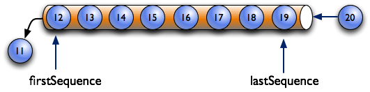
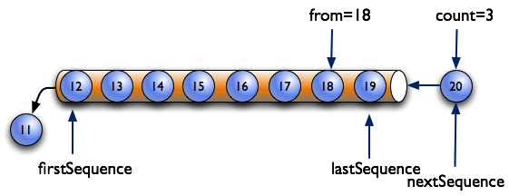
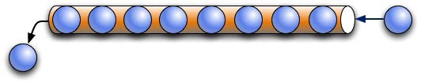

# MTConnect Fundamentals

The MTConnect Standard defines the normative informaton model and protocol for retrieving information from manufacturing equipment. The {{term(agent)}} behavior and protcol is in this document and the information models are sepecified in the other parts of the standard.

## Agent

The MTConnect Standard specifies the minimum functionality of the {{term(agent)}}. The functionality is as follows:

* Provides store and forward messaging middleware service.
* Provides key-value information storage and retrieval service.
* Implements the ReST API for the MTConnect Standard.
  * {{term(Device)}} metadata.
  * {{termplural(observation)}} collected by the agent.
  * {{termplural(asset)}} colleted by the agent.

There are three types of information stored by an {{term(agent)}} that **MAY** be published in a {{term(response document)}}.  These are as follows:

* {{term(equipment metadata)}} specified in {{cite(MTCPart2)}}.
* {{term(streaming data)}} provides the {{termplural(observation)}} specified in {{cite(MTCPart2)}} in a {{term(buffer)}}.
* {{termplural(Asset)}} specified in {{cite(MTCPart40)}}.

### Agent Instance ID

The {{term(agent)}} **MUST** initialize the {{term(sequence number)}} to `1`. When the {{term(agent)}} sets the {{term(observation)}} {{term(sequence number)}} to `1`, the MTConnect Agent **MUST** set the {{term(agent)}} `instanceId` to a unique value. 

### Storage of Equipment Metadata

An {{term(agent)}} **MUST** be capable of publishing {{term(equipment metadata)}} for the {{term(agent)}} as specified in {{cite(MTCPart2)}}.

### Storage of Streaming Data

The {{term(agent)}} **MAY** implement a {{term(buffer)}} with a fixed number of {{termplural(observation)}}. If the `bufferSize` is a fixed, the {{term(agent)}} **MUST** store {{termplural(observation)}} using a first-in-first-out pattern. The {{term(agent)}} will remove the oldest {{term(observation)}} when the {{term(buffer)}} is full and a new {{term(observation)}} arrives.

{: width="0.8"}

In {{figure(first-in-first-out-buffer-management)}}, the maximum number of {{termplural(observation)}} that can be stored in the {{term(buffer)}} of the {{term(agent)}} is 8.  The `bufferSize` in the header reports the maximum number of {{termplural(observation)}}.  This example illustrates that when the {{term(buffer)}} fills up, the oldest piece of data falls out the other end.

{: width="0.8"}

> Note: As an implementation suggestion, the {{term(buffer)}} should be sized large enough to provide a continuous stream of {{termplural(observation)}}.  The implementer should also consider the impact of a temporary loss of communications when determining the size for the {{term(buffer)}}.  A larger {{term(buffer)}} will allow more time to reconnect to an {{term(agent)}} without losing data.

#### Sequence Numbers

In an {{term(agent)}}, each occurrence of an {{term(observation)}} in the {{term(buffer)}} will be assigned a monotonically increasing unsigned 64-bit integer ({{term(sequence number)}}) when it arrives. The first {{term(sequence number)}} **MUST** be `1`.

The {{term(sequence number)}} for each {{term(observation)}} **MUST** be unique for an instance of an {{term(agent)}} identified by an `instanceId`.

Table {{table(instanceid-and-sequence)}} illustrates the changing of the `instanceId` when an {{term(agent)}} resets the {{term(sequence number)}} to `1`.

| `instanceId` | `sequence` | 
|-------------:|-----------:|
|{{rowspan(5)}} 234556|234|
||235|
||236|
||237|
||238|
|{{span(2)}} Agent Stops and Restarts|
|{{rowspan(5)}} 234556|1|
||2|
||3|
||4|
||5|
{: caption="instanceId and sequence" label="instanceid-and-sequence" }

{{figure(identifying-the-range-of-data-with-firstsequence-and-lastsequence)}} shows two additional pieces of information defined for an {{term(agent)}}:

* `firstSequence` -- the oldest piece of data contained in the {{term(buffer)}}; i.e., the next piece of data to be moved out of the {{term(buffer)}}

* `lastSequence` -- the newest data added to the {{term(buffer)}}

`firstSequence` and `lastSequence` provide the range of values for the ReST API requests.

{: width="0.75"}

The {{term(observation)}} with the {{term(sequence number)}} of the `from`) parameter of the {{term(sample request)}} **MUST** be included in the {{term(response document)}} and the total number (`count`) of {{termplural(observation)}} that **SHOULD** be included in that document.

In {{figure(identifying-the-range-of-data-with-from-and-count)}}, the request specifies the {{termplural(observation)}} start at {{term(sequence number)}} `15` (`from`) and includes a total of three items (`count`).

{: width="0.75"}

`nextSequence` header property has the {{term(sequence number)}} of the next {{term(observation)}} in the {{term(buffer)}} for a subsequent {{term(sample request)}} having a contiguous set of {{termplural(observation)}}.  In the example in {{figure(identifying-the-range-of-data-with-from-and-count)}}, the next {{term(sequence number)}} (`nextSequence`) will be 18.

As shown in {{figure(identifying-the-range-of-data-with-nextsequence-and-lastsequence)}}, the combination of `from` and `count` defined by the {{term(request)}} indicates a {{term(sequence number)}} for data that is beyond that which is currently in the {{term(buffer)}}.  In this case, `nextSequence` is set to a value of `lastSequence` + 1.

{: width="0.75"}

#### Buffer Data Structure

An {{term(observation)}} has four pieces of information as follows:

1. {{term(sequence number)}} associated with each {{term(observation)}} - `sequence`.

2. The `timestamp` the {{term(observation)}} was made. .

3. A reference to the `dataitemid` from the {{cite(MTCPart2)}} information model.

4. The value of the {{term(observation)}}.

{{fig(data-storage-concept)}} is an example demonstrating the concept of how data may be stored in an {{term(agent)}}:

{: width="0.8"}

#### Timestamp

{{termplural(observation)}} **MUST** have a `timestamp` giving the most accurate time that the {{term(observation)}} was observed.

`timestamp` **MUST** be reported in UTC (Coordinated Universal Time) timezone in ISO 8601 format: e.g., "2010-04-01T21:22:43Z".

Applications **SHOULD** use the {{term(observation)}}'s `timestamp` for ordering as opposed to {{term(sequence number)}}.

If {{termplural(observation)}} are known to have occured at the same time, they **MUST** be reported with the same `timestamp`. 

#### Recording Occurrences of Streaming Data

The {{term(agent)}} **MUST** only place {{termplural(observation)}} in the {{term(buffer)}} if the data has changed from the previous {{term(observation)}} for the same {{block(DataItem)}}. The exceptions to this rule are the following conditions:

* The {{property(discrete)}} attribute is `true` for the {{block(DataItem)}}. 
* The {{property(representation)}} is `DISCRETE`.
* The {{property(representation)}} is `TIME_SERIES`.

In the case of an exception, the {{term(agent)}} **MUST** place every  {{term(observation)}} in the {{term(buffer)}}.

#### Maintaining Last Value for Data Entities

An {{term(agent)}} **MUST** retain the most recent {{term(observation)}} associated with each {{block(DataItem)}}; even if an occurrence of that {{term(observation)}} is no longer in the {{term(buffer)}}. This function supports the {{term(current request)}} functionality.

#### Unavailability of Data

The {{term(agent)}} **MUST** initialize every {{block(DataItem)}}, unless it has a constant value (see below), with an {{term(observation)}} having a value of `UNAVAILABLE`. Aditionally, whenever the data source is unreachable, every {{block(DataItem)}} associated with the data source must have an {{term(observation)}} with a value of `UNAVAILABLE` and `timestamp` when the connection was lost. An `UNAVAILABLE` indicates the value of the {{term(observation)}} is indeterminate.

Any {{term(observation)}} that is constrained to a constant value, as defined in {{cite(MTCPart2)}}, **MUST** only have the constant value and **MUST NOT** be set to `UNAVAILABLE`.

#### Persistence and Recovery

The {{term(agent)}} **MAY** have a fixed size {{term(buffer)}} and the {{term(buffer)}} **MAY** be ephemeral.

If the {{term(buffer)}} is recoverable, the {{term(agent)}} **MUST NOT**  change the `instanceId` and **MUST NOT** set the {{term(sequence number)}} to `1`.

### Storage of MTConnect Assets

An {{term(agent)}} **MAY** only retain a limited number of {{termplural(MTConnectAssets Response Document)}} in the {{termplural(asset buffer)}}. The {{termplural(asset)}} are stored in first-in-first-out method where the oldest {{term(asset)}} is removed when the {{term(asset buffer)}} is full and a new {{term(asset)}} arrives.

{{figure(first-in-first-out-asset-buffer-management)}} illustrates the oldest {{term(MTConnectAssets Response Document)}} being removed from the {{termplural(asset buffer)}} when a new {{term(MTConnectAssets Response Document)}} is added and the {{termplural(asset buffer)}} is full:

{: width="0.6"}

{{termplural(MTConnectAssets Response Document)}} are indexed by {{property(assetId)}}.  In the case of {{termplural(Asset)}}. {{figure(relationship-between-assetid-and-stored-asset-documents)}} demonstrates the relationship between the key ({{property(assetId)}}) and the stored {{termplural(MTConnectAssets Response Document)}}:

{: width="0.25"}

> Note:  The key ({{property(assetId)}}) is independent of the order of the {{termplural(MTConnectAssets Response Document)}} stored in the {{termplural(asset buffer)}}.

When the {{term(agent)}} receives a new {{term(MTConnectAssets Response Document)}}, one of the following rules **MUST** apply:

* If the {{term(MTConnectAssets Response Document)}} represents an {{term(Asset)}} not in the {{termplural(asset buffer)}}, the {{term(agent)}} **MUST** add the new document to the front of the {{termplural(asset buffer)}}.  If the {{termplural(asset buffer)}} is full, the oldest {{term(MTConnectAssets Response Document)}} will be removed from the {{termplural(asset buffer)}}.

* If the {{term(MTConnectAssets Response Document)}} key is already in the {{termplural(asset buffer)}}, the {{term(agent)}} **MUST** replace the existing {{term(MTConnectAssets Response Document)}} move the {{term(MTConnectAssets Response Document)}} to the front of the {{termplural(asset buffer)}}.  

The number of {{termplural(MTConnectAssets Response Document)}} that may be stored in an {{term(agent)}} is defined by the value for {{property(assetBufferSize)}}. A {{property(assetBufferSize)}} of 4,294,967,296 or $2^{32}$ **MUST** indicate unlimited storage.

The {{term(asset buffer)}} **MAY** be effemeral and the {{termplural(MTConnectAssets Response Document)}} will be lost if the {{term(agent)}} clears the {{term(asset buffer)}}. They must be recovered from the data source.

{{cite(MTCPart40)}} provides additional information on {{term(asset)}} management. 

## Response Documents

{{termplural(response document)}} are electronic documents generated by an {{term(agent)}} in response to a {{term(request)}} for data. 

The {{termplural(response document)}} defined in the MTConnect Standard are:

* {{term(MTConnectDevices Response Document)}}:  An electronic document that contains the information published by an {{term(agent)}} describing the data that can be published by one or more piece(s) of equipment. The structure of the {{term(MTConnectDevices Response Document)}} document is based upon the requirements defined by the {{termplural(Device Information Model)}}.  See {{cite(MTCPart2)}} for details on this information model.

* {{term(MTConnectStreams Response Document)}}:  An electronic document that contains the information published by an {{term(agent)}} that contains the data that is published by one or more piece(s) of equipment.  The structure of the {{term(MTConnectStreams Response Document)}} document is based upon the requirements defined by the {{term(Observation Information Model)}}.  See {{cite(MTCPart3)}} for details on this information model.

* {{term(MTConnectAssets Response Document)}}:  An electronic document that contains the information published by an {{term(agent)}} that **MAY** include one or more {{termplural(MTConnectAssets Response Document)}}.  The structure of the {{term(MTConnectAssets Response Document)}} document is based upon the requirements defined by the {{termplural(Asset Information Model)}}.  See {{cite(MTCPart4)}} for details on this information model.

* {{term(MTConnectErrors Response Document)}}:  An electronic document that contains the information provided by an {{term(agent)}} when an error has occurred when trying to respond to a {{term(request)}} for data.  The structure of the {{term(MTConnectErrors Response Document)}} is based upon the requirements defined by the {{term(Error Information Model)}}.  See {{sect(Error Information Model)}} of this document for details on this information model.

{{termplural(response document)}} may be represented by any document format supported by an {{term(agent)}}.  No matter what document format is used to structure these documents, the requirements for representing the data and other information contained in those documents **MUST** adhere to the requirements defined in the {{termplural(information model)}} associated with each document.

## Request/Response Information Exchange

The transfer of information between an {{term(agent)}} and a client software application is based on a {{term(request and response)}} information exchange approach. A client software application requests specific information from an {{term(agent)}}. An {{term(agent)}} responds to the {{term(request)}} by publishing a {{term(response document)}}.

In normal operation, there are four types of {{termplural(MTConnect Request)}} that can be issued by a client software application that will result in different {{termplural(response)}} by an {{term(agent)}}.  These {{termplural(request)}} are:

* {{term(probe request)}}: A client software application requests the {{term(equipment metadata)}} for each piece of equipment that **MAY** publish information through an {{term(agent)}}.  The {{term(agent)}} publishes a {{term(MTConnectDevices Response Document)}} that contains the requested information.  A {{term(probe request)}} is represented by the term `probe` in a {{term(request)}} from a client software application.

* {{term(current request)}}: A client software application requests the current value for each of the data types that have been published from a piece(s) of equipment to an {{term(agent)}}.  The {{term(agent)}} publishes a {{term(MTConnectStreams Response Document)}} that contains the requested information.  A {{term(current request)}} is represented by the term `current` in a {{term(request)}} from a client software application.

* {{term(sample request)}} -- A client software application requests a series of data values from the {{term(buffer)}} in an {{term(agent)}} by specifying a range of {{termplural(sequence number)}} representing that data.  The {{term(agent)}} publishes a {{term(MTConnectStreams Response Document)}} that contains the requested information.  A {{term(sample request)}} is represented by the term `sample` in a {{term(request)}} from a client software application.

* {{term(asset request)}} -- A client software application requests information related to {{termplural(Asset)}} that has been published to an {{term(agent)}}.  The {{term(agent)}} publishes an {{term(MTConnectAssets Response Document)}} that contains the requested information.  An {{term(asset request)}} is represented by the term `asset` in a {{term(request)}} from a client software application.

> Note: If an {{term(agent)}} is unable to respond to the request for information or the request includes invalid information, the {{term(agent)}} will publish an {{term(MTConnectErrors Response Document)}}. See {{sect(error-information-model)}} for information regarding {{term(Error Information Model)}}

The specific format for the {{term(request)}} for information from an {{term(agent)}} will depend on the {{term(protocol)}} implemented as part of the {{term(request and response)}} information exchange mechanism deployed in a specific implementation.

Also, the specific format for the {{termplural(response document)}} may also be implementation dependent.

## Accessing Information from an Agent

See {{sect(MTConnect ReST Protocol)}}.

# MTConnect ReST Protocol

An {{term(agent)}} **MUST** perform the following tasks:

* Collect data from manufacturing equipment.
* Generate {{termplural(response document)}}.
* Provide a ReST interface using HTTP.

An {{term(agent)}} **MAY** provide additional protocols and represntations. Some representations **MAY** have companion specifications.

## ReST Interface

An {{term(agent)}} **MUST** provide a ReST API {{term(API)}} supporting HTTP version 1.0 or greater.  This interface **MUST** support HTTP (RFC7230) and use URIs (RFC3986) to identify specific information requested from an {{term(agent)}}. 

The REST API adheres to the architectural principles of a stateless service to retrieve information associated with pieces of equipment. Additionally, the API is read-only and does not produce any side effects on the data stored in an {{term(agent)}} or change the function of the {{term(agent)}} itself. ReST state management requires client has responsibility for recovery in case of error or loss of connection.

## HTTP Request

The MTConnect standard defines that an {{term(agent)}} **MUST** support the `HTTP` `GET` verb -- no other HTTP verbs are required to be supported. See IETF RFC 7230 for a complete description of the HTTP request structure. The 

The HTTP uses Uniform Resource Identifiers (URI) as outlined in IETF RFC 3986 as the *request-target*. IETF RFC 7230 specifies the http URI scheme for the *request-target* as follows:

1. `protocol`: The protocol used for the request. Must be `http` or `https`.
2. `authority`: The network domain or address of the agent with an optional port.
2. `path`: A Hierarchical Identifier following a slash (`/`) and before the optional question-mark (`?`). The `path` separates segments by a slash (`/`).
3. `query`: The portion of the HTTP request following the question-mark (`?`). The query portion of the HTTP request is composed of key-value pairs, `<key>=<value>` separated by an ampersand (`&`).

### `path` Portion of an HTTP Request

The `<Path>` portion of the *request-target* has the following segments:

* `<device name or uuid>`: optional `name` or `uuid` of the {{block(Device)}}
* `<request>`: request, must be one of the following: 
  - `probe`
  - `current`
  - `sample`
  - `asset` or `assets`
    - `asset` request has additional optional segment `<asset ids>`
  
If `name` or `uuid` segement are not specified in the {{term(HTTP Request)}}, an {{term(agent)}} **MUST** return information for all pieces of equipment. The following sections will 

Examples: 
  
* `http://localhost:5000/my_device/probe`
  
    The request only provides information about `my_device`.
  
* `http://localhost:5000/probe`

  The request provides information for all devices. 

The following section specifies the details for each request.

## MTConnect ReST API

An {{term(agent)}} **MUST** support {{termplural(probe request)}}, {{termplural(current request)}}, {{termplural(sample request)}}, and {{termplural(asset request)}}.

The following sections define how the {{term(HTTP Request)}} is structured to support each of these types of {{termplural(request)}} and the information that an {{term(agent)}} **MUST** provide in response:

### Probe Request

#### Query Portion of the Probe Request

There are no `query` required for the {{term(probe request)}}. Any parameters **MUST** be ignored by the {{term(agent)}}.

#### Response to a Probe Request

The {{term(agent)}} **MUST** respond to a successful {{term(probe request)}} with a {{term(HTTP Status Code)}} `200` (`OK`) and an {{term(MTConnectDevices Response Document)}}. If the {{term(request)}} fails, the {{term(agent)}} **MUST** respond with an an {{term(MTConnectErrors Response Document)}} a {{term(HTTP Status Code)}} other than 200.

#### HTTP Status Codes for a Probe Request

The following {{termplural(HTTP Status Code)}} **MUST** be supported as possible responses to a {{term(probe request)}}:

* Status Code: `200`, Code Name: `OK`:

  The {{term(request)}} succeeded.
  
* Status Code: `400`, Code Name: `Bad Request`:

  The {{term(request)}} was invalid. The {{term(response)}}  **MUST** have an {{term(MTConnectErrors Response Document)}}.
  
* Status Code: `404`, Code Name: `Not Found`:

  The device name or uuid could not be located. The {{term(response)}} **MUST** have an {{term(MTConnectErrors Response Document)}}.
  
* Status Code: `405`, Code Name: `Method Not Allowed`:

  The {{term(request)}} specified a method other than `GET`
  
* Status Code: `406`, Code Name: `Not Acceptable`:

  The HTTP `Accept` Header in the {{term(request)}} was not one of the supported representations.
    
* Status Code: `431`, Code Name: `Request Header Fields Too Large`:

  The fields in the {{term(HTTP Request)}} exceed the limit of the implementation of the {{term(agent)}}.
  
* Status Code: `500`, Code Name: `Internal Server Error`:

  There was an unexpected error in the {{term(agent)}} while responding to a {{term(request)}}.
  
### Current Request

#### Query Portion of a Current Request

The following optional `query` parameters **MUST** be supported for a {{term(current request)}}:

* `at`: unsigned 64-bit integer

  The {{termplural(response document)}} **MUST** include {{termplural(observation)}} consistent with a specific {{term(sequence number)}} given by the value of the `at` parameter.

  If the value is either less than the `firstSequence` or greater than the `lastSequence`, the {{term(request)}} **MUST** return a 404 {{term(HTTP Status Code)}} and the {{term(agent)}} **MUST** return an {{term(MTConnectErrors Response Document)}} with an `OUT_OF_RANGE` {{property(errorCode)}}. 
  
  The `at` parameter **MUST NOT** be used in conjunction with the `interval` parameter.

* `interval`: unsigned integer milliseconds

  The {{term(agent)}} **MUST** continuously publish {{termplural(response document)}} pausing for the number of milliseconds given as the value.

  The `interval` value **MUST** be in milliseconds, and **MUST** be a positive integer greater than zero (0). 

  The `interval` parameter **MUST NOT** be used in conjunction with the `at` parameter.

* `path`: string

  An XPath evaluated against the {{term(Device Information Model)}} that references the {{termplural(Component)}} and {{termplural(DataItem)}} to include in the {{term(MTConnectStreams Response Document)}}.
  
  When a {{block(Component)}} element is referenced by the XPath, all {{termplural(observation)}} for its {{termplural(DataItem)}} and related {{termplural(Component)}} **MUST** be included in the {{term(MTConnectStreams Response Document)}}.

#### Response to a Current Request

The {{term(agent)}} **MUST** respond to a successful {{term(current request)}} with a {{term(HTTP Status Code)}} `200` (`OK`) and an {{term(MTConnectStreams Response Document)}}. If the {{term(request)}} fails, the {{term(agent)}} **MUST** respond with an an {{term(MTConnectErrors Response Document)}} a {{term(HTTP Status Code)}} other than 200.

#### HTTP Status Codes for a Current Request

The following {{termplural(HTTP Status Code)}} **MUST** be supported as possible responses to a {{term(current request)}}:

* Status Code: `200`, Code Name: `OK`:

  The {{term(request)}} succeeded.
  
* Status Code: `400`, Code Name: `Bad Request`:

  The {{term(request)}} was invalid. The {{term(response)}}  **MUST** have an {{term(MTConnectErrors Response Document)}}.
  
* Status Code: `404`, Code Name: `Not Found`:

  One of the following conditions apply:
  
  * The device name or uuid could not be located. 
  * The `at` was `OUT_OF_RANGE` range.
  
  The {{term(response)}} **MUST** have an {{term(MTConnectErrors Response Document)}}.
  
* Status Code: `405`, Code Name: `Method Not Allowed`:

  The {{term(request)}} specified a method other than `GET`
  
* Status Code: `406`, Code Name: `Not Acceptable`:

  The HTTP `Accept` Header in the {{term(request)}} was not one of the supported representations.
    
* Status Code: `431`, Code Name: `Request Header Fields Too Large`:

  The fields in the {{term(HTTP Request)}} exceed the limit of the implementation of the {{term(agent)}}.
  
* Status Code: `500`, Code Name: `Internal Server Error`:

  There was an unexpected error in the {{term(agent)}} while responding to a {{term(request)}}.

### Sample Request

#### Query Portion of a Sample Request

The following `query` parameters **MUST** be supported in an {{term(HTTP Request Line)}} for a {{term(sample request)}}:

* `count`: signed integer

  The `count` parameter designates the maximum number of {{termplural(observation)}} the {{term(agent)}} **MUST** publish in the {{term(response document)}}. 

  The `count` **MUST NOT** be zero (0). 

  When the `count` is greater than zero (0), the `from` parameter **MUST** default to the `firstSequence`. The evaluation of {{termplural(observation)}} starts at `from` and moves forward accumulating newer {{termplural(observation)}} until the number of {{termplural(observation)}} equals the `count` or the  {{term(observation)}} at `lastSequence` is considered. 

  When the `count` is less than zero (0), the `from` parameter **MUST**  default to the `lastSequence`. The evaluation of {{termplural(observation)}} starts at `from` and moves backward accumulating older {{termplural(observation)}} until the number of {{termplural(observation)}} equals the absolute value of `count` or the {{term(observation)}} at `firstSequence` is considered. 

  `count` **MUST NOT** be less than zero (0) when an `interval` parameter is given. 

  If `count` is not provided, it **MUST** default to `100`. 

  If the absolute value of `count` is greater than the size of the {{term(buffer)}} or equal to zero (0), the {{term(agent)}} **MUST** return a `404` {{term(HTTP Status Code)}} and **MUST** publish an {{term(MTConnectErrors Response Document)}} with an `OUT_OF_RANGE`  {{property(errorCode)}}. 

  If the `count` parameter is not a numeric value, the {{term(agent)}} **MUST** return a `400` {{term(HTTP Status Code)}} and **MUST** publish an {{term(MTConnectErrors Response Document)}} with an `INVALID_REQUEST`  {{property(errorCode)}}.

* `from`: unsigned 64-bit integer
 
  The `from` parameter designates the {{term(sequence number)}} of the first {{term(observation)}} in the {{term(buffer)}} the {{term(agent)}} **MUST** consider publishing in the {{term(response document)}}. 

  If `from` is zero (0), it **MUST** be set to the `firstSequence`, the oldest {{term(observation)}} in the {{term(buffer)}}. 

  If `from` and `count` parameters are not given, `from` **MUST** default to the `firstSequence`. 

  If the `from` parameter is less than the `firstSequence` or greater than `lastSequence`, the {{term(agent)}} **MUST** return a `404` {{term(HTTP Status Code)}} and **MUST** publish an {{term(MTConnectErrors Response Document)}} with an `OUT_OF_RANGE` {{property(errorCode)}}. 

* `heartbeat`: unsigned integer milliseconds
  
  Sets the time period for the {{term(heartbeat)}} function in an {{term(agent)}}. 

  The value for `heartbeat` represents the amount of time after a {{term(response document)}} has been published until a new {{term(response document)}} **MUST** be published, even when no new data is available. 

  The value for `heartbeat` is defined in milliseconds.

  If no value is defined for `heartbeat`, the value **MUST** default to 10 seconds. 

  `heartbeat` **MUST** only be specified if `interval` is also specified.

* `interval`: unsigned integer milliseconds

  The {{term(agent)}} **MUST** continuously publish {{termplural(response document)}} when the query parameters include `interval` using the value as the minimum period between adjacent publications. 

  The `interval` value **MUST** be in milliseconds, and **MUST** be a positive integer greater than or equal to zero (0). 

  If the value for the `interval` parameter is zero (0), the {{term(agent)}} **MUST** publish  {{termplural(response document)}} when any {{termplural(observation)}} become available.

  If the period between the publication of a {{term(response document)}} and reception of {{termplural(observation)}} exceeds the `interval`, the {{term(agent)}} **MUST** wait for a maximum of `heartbeat` milliseconds for {{termplural(observation)}}. Upon the arrival of {{termplural(observation)}}, the {{term(agent)}} **MUST** immediately publish a {{term(response document)}}. When the period equals or exceeds the `heartbeat`, the {{term(agent)}} **MUST** publish an empty {{term(response document)}}.

* `path`: string
  
  An XPath evaluated against the {{term(Device Information Model)}} that references the {{termplural(Component)}} and {{termplural(DataItem)}} to include in the {{term(MTConnectStreams Response Document)}}.
  
  When a {{block(Component)}} element is referenced by the XPath, all {{termplural(observation)}} for its {{termplural(DataItem)}} and related {{termplural(Component)}} **MUST** be included in the {{term(MTConnectStreams Response Document)}}.

* `to`: unisgned 64-bit integer

  The `to` parameter specifies the {{term(sequence number)}} of the {{term(observation)}} in the {{term(buffer)}} that will be the upper bound of the {{termplural(observation)}} in the {{term(response document)}}.

  Rules for `to` are as follows:

  * The value of `to` **MUST** be an unsigned 64-bit integer.
  * The value of `to` **MUST** be greater than the `firstSequence`.
  * The value of `to` **MUST** be less than or equal to the `lastSequence`.
  * The value of `to` **MUST** be greater than `from`.
  * If `to` and `count` are given, the `count` parameter **MUST** be greater than zero.
  * If `to` and `count` are given, the maximum number of {{termplural(observation)}} published in the {{term(response document)}} **MUST NOT** be greater than the value of `count`.
  * If `to` is not given, see the `from` parameter for default behavior.
  * If the `to` parameter is less than the `firstSequence` or greater than `lastSequence`, the {{term(agent)}} **MUST** return a `404` {{term(HTTP Status Code)}} and **MUST** publish an {{term(MTConnectErrors Response Document)}} with an `OUT_OF_RANGE` `errorCode`.
  * If the `to` parameter is not a positive numeric value, the {{term(agent)}} **MUST** return a `400` {{term(HTTP Status Code)}} and **MUST** publish an {{term(MTConnectErrors Response Document)}} with an `INVALID_REQUEST` `errorCode`.
  * If the `to` parameter is less than the `from` parameter, the {{term(agent)}} **MUST** return a `400` {{term(HTTP Status Code)}} and **MUST** publish an {{term(MTConnectErrors Response Document)}} with an `INVALID_REQUEST` `errorCode`.
  * If the `to` parameter is given and the `count` parameter is less than zero, the {{term(agent)}} **MUST** return a `400` {{term(HTTP Status Code)}} and **MUST** publish an {{term(MTConnectErrors Response Document)}} with an `INVALID_REQUEST` `errorCode`.

#### Response to a Sample Request

The {{term(agent)}} **MUST** respond to a successful {{term(sample request)}} with a {{term(HTTP Status Code)}} `200` (`OK`) and an {{term(MTConnectStreams Response Document)}}. If the {{term(request)}} fails, the {{term(agent)}} **MUST** respond with an an {{term(MTConnectErrors Response Document)}} a {{term(HTTP Status Code)}} other than 200.

#### HTTP Status Codes for a Sample Request

The following {{termplural(HTTP Status Code)}} **MUST** be supported as possible responses to a {{term(current request)}}:

* Status Code: `200`, Code Name: `OK`:

  The {{term(request)}} succeeded.
  
* Status Code: `400`, Code Name: `Bad Request`:

  The {{term(request)}} was invalid. The {{term(response)}}  **MUST** have an {{term(MTConnectErrors Response Document)}}.
  
* Status Code: `404`, Code Name: `Not Found`:

  One of the following conditions apply:
  
  * The device name or UUID could not be located. 
  * One of the `asset_ids` could not be found.
  
  The {{term(response)}} **MUST** have an {{term(MTConnectErrors Response Document)}}.
  
* Status Code: `405`, Code Name: `Method Not Allowed`:

  The {{term(request)}} specified a method other than `GET`
  
* Status Code: `406`, Code Name: `Not Acceptable`:

  The HTTP `Accept` Header in the {{term(request)}} was not one of the supported representations.
    
* Status Code: `431`, Code Name: `Request Header Fields Too Large`:

  The fields in the {{term(HTTP Request)}} exceed the limit of the implementation of the {{term(agent)}}.
  
* Status Code: `500`, Code Name: `Internal Server Error`:

  There was an unexpected error in the {{term(agent)}} while responding to a {{term(request)}}.

### Asset Request

#### Path Portion of an Asset Request

The following additional segment of path **MUST** be supported in the {{term(HTTP Request Line)}} for an {{term(asset request)}}:

* `asset_ids`: 

  The `path` portion is a list of (`asset_id`) for specific {{termplural(MTConnectAssets Response Document)}}.  

  In response, the {{term(agent)}} returns an {{term(MTConnectAssets Response Document)}} that contains information for the specific {{termplural(asset)}} for each of the `asset_id` values provided in the {{term(request)}}. Each `asset_id` is separated by a ";".
  
Examples:

* `http://localhost:5000/assets/CuttingTool1;CuttingTool2`

  The {{term(MTConnectAssets Response Document)}} contains {{term(asset)}} documents for an asset with {{property(assetId)}} of `CuttingTool1` and `CuttingTool2`

#### Query Portion of an Asset Request

A query may be used to more precisely define the specific information to be included in a {{term(response document)}}.   Multiple parameters may be used in a query to further refine the information to be included.  When multiple parameters are provided, each parameter is separated by an & character and each parameter appears only once in the query.  The parameters within the query may appear in any sequence.

The following `query` parameters **MUST** be supported in an {{term(HTTP Request Line)}} for an {{term(asset request)}}:

* {{property(removed)}}: boolean `true` or `false`

  The value for {{property(removed)}} **MUST** be `true` or `false` and interpreted as follows:
  
  * `true`: {{termplural(MTConnectAssets Response Document)}} for {{termplural(asset)}} marked as removed **MUST** be included in the {{term(response document)}}. 
  * `false`: {{termplural(MTConnectAssets Response Document)}} for {{termplural(asset)}} marked as removed **MUST NOT** be included in the {{term(response document)}}. 
  
  If {{property(removed)}} is not given, the default value **MUST** be `false`. 

* `count`: unsigned integer

  Specifies the maximum number of {{termplural(MTConnectAssets Response Document)}} returned in an {{term(MTConnectAssets Response Document)}}.
  
  If `count` is not given, the default value **MUST** be `100`.

#### Response to an Asset Request

The {{term(response)}} to an {{term(asset request)}} **SHOULD** be an {{term(MTConnectAssets Response Document)}} containing information for one or more {{termplural(MTConnectAssets Response Document)}} designated by the {{term(request)}}.  
The {{term(response)}} to an {{term(asset request)}} **MUST** always provide the most recent information available to an {{term(agent)}}.

The {{termplural(MTConnectAssets Response Document)}} provided in the {{term(MTConnectAssets Response Document)}} will be limited to those specified in the combination of the `path` segment of the {{term(asset request)}} and the parameters provided in the `query` segment of that {{term(request)}}.

If the {{property(removed)}} query parameter is not provided with a value of `true`, {{termplural(MTConnectAssets Response Document)}} for {{termplural(asset)}} that have been marked as removed will not be provided in the response. 

#### HTTP Status Codes for a Asset Request

The following {{termplural(HTTP Status Code)}} **MUST** be supported as possible responses to a {{term(asset request)}}:

* Status Code: `200`, Code Name: `OK`:

  The {{term(request)}} succeeded.
  
* Status Code: `400`, Code Name: `Bad Request`:

  The {{term(request)}} was invalid. The {{term(response)}}  **MUST** have an {{term(MTConnectErrors Response Document)}}.
  
* Status Code: `404`, Code Name: `Not Found`:

  One of the following conditions apply:
  
  * The device name or uuid could not be located. 
  * The `from` or `to` was `OUT_OF_RANGE`.
  
  The {{term(response)}} **MUST** have an {{term(MTConnectErrors Response Document)}}.
  
* Status Code: `405`, Code Name: `Method Not Allowed`:

  The {{term(request)}} specified a method other than `GET`
  
* Status Code: `406`, Code Name: `Not Acceptable`:

  The HTTP `Accept` Header in the {{term(request)}} was not one of the supported representations.
    
* Status Code: `431`, Code Name: `Request Header Fields Too Large`:

  The fields in the {{term(HTTP Request)}} exceed the limit of the implementation of the {{term(agent)}}.
  
* Status Code: `500`, Code Name: `Internal Server Error`:

  There was an unexpected error in the {{term(agent)}} while responding to a {{term(request)}}.

### HTTP Errors

When an {{term(agent)}} receives an {{term(HTTP Request)}} that is incorrectly formatted or is not supported by the {{term(agent)}}, the {{term(agent)}} **MUST** publish an {{term(HTTP Error Message)}} which includes a specific status code from the tables above indicating that the {{term(request)}} could not be handled by the {{term(agent)}}.

Also, if the {{term(agent)}} experiences an internal error and is unable to provide the requested {{term(response document)}}, it **MUST** publish an {{term(HTTP Error Message)}} that includes a specific status code from the table above.

When an {{term(agent)}} encounters an error in interpreting or responding to an {{term(HTTP Request)}}, the {{term(agent)}} **MUST** also publish an {{term(MTConnectErrors Response Document)}} that provides additional details about the error.  See {{sect(Error Information Model)}} for details on the {{term(MTConnectErrors Response Document)}}.  

### Streaming Data

HTTP {{term(data streaming)}} is a method for an {{term(agent)}} to provide a continuous stream of {{termplural(observation)}} in response to a single {{term(request)}} using a {{term(publish and subscribe)}} communication pattern.

When an {{term(HTTP Request)}} includes an `interval` parameter, an {{term(agent)}} **MUST** provide data with a minimum delay in milliseconds between the end of one data transmission and the beginning of the next.  A value of zero (0) for the `interval` parameter indicates that the {{term(agent)}} should deliver data at the highest rate possible and is only relevant for {{termplural(sample request)}} .

The format of the response **MUST** use an `x-multipart-replace` encoded message with each section separated by MIME boundaries.  Each section **MUST** contain an entire {{term(MTConnectStreams Response Document)}}. 

When streaming for a {{term(current request)}}, the {{term(agent)}} produces a {{term(MTConnectStreams Response Document)}} with the most current {{termplural(observation)}} every `interval` milliseconds.

When streaming for a {{term(sample request)}}, if there are no available {{termplural(observation)}} after the `interval` time elapsed, the {{term(agent)}} **MUST** wait for either the `heartbeat` time to elapse or an {{term(observation)}} arrives. If the `heartbeat` time elapses and no {{termplural(observation)}} arrive, then an empty {{term(MTConnectStreams Response Dcoument)}} **MUST** be sent.

> Note: For more information on MIME, see IETF RFC 1521 and RFC 822.

An example of the format for a {{term(HTTP Request)}} that  includes an `interval` parameter is:

~~~~
http://localhost:5000/sample?interval=1000
~~~~
{: caption="Example for HTTP Request with interval parameter" label="example-for-http-request-with-interval-parameter"}

HTTP Response Header:

~~~~
HTTP/1.1 200 OK
Connection: close
Date: Sat, 13 Mar 2010 08:33:37 UTC
Status: 200 OK
Content-Disposition: inline
X-Runtime: 144ms
Content-Type: multipart/x-mixed-replace;boundary=
a8e12eced4fb871ac096a99bf9728425
Transfer-Encoding: chunked
~~~~
{: caption="HTTP Response header" label="http-response-header"}

Lines 1-9 in {{ref{http-response-header})}} represent a standard header for a MIME `multipart/x-mixed-replace` message.  The boundary is a separator for each section of the stream. Lines 7-8 indicate this is a multipart MIME message and the boundary between sections. 

With streaming protocols, the `Content-length` **MUST** be omitted and `Transfer-Encoding` **MUST** be set to `chunked` (line 9). See IETF RFC 7230 for a full description of the HTTP protocol and chunked encoding.

~~~~
--a8e12eced4fb871ac096a99bf9728425
Content-type: text/xml
Content-length: 887

<?xml version="1.0" ecoding="UTF-8"?>
<MTConnectStreams ...>...
~~~~
{: caption="HTTP Response header 2" label="http-response-header-2" start="last"}

Each section of the document begins with a boundary preceded by two hyphens (`--`). The `Content-type` and `Content-length` header fields **MUST** be provided for each section and **MUST** be followed by `<CR><LF><CR><LF>` (ASCII code for `<CR>` is 13 and `<LF>` 10) before the {{term(XML)}} document. The header and the `<CR><LF><CR><LF>` **MUST NOT** included in the computation of the content length.

An {{term(agent)}} **MUST** continue to stream results until the client closes the connection.  The {{term(agent)}} **MUST NOT** the streaming for any other reason other than the {{term(agent)}} process shutting down or the client application becoming unresponsive and not receiving data (as indicated by not consuming data and the write operation blocking).

#### Heartbeat

When {{term(streaming data)}} is requested from a {{term(sample request)}}, an {{term(agent)}} **MUST** support a {{term(heartbeat)}} to indicate to a client application that the HTTP connection is still viable during times when there is no new data available to be published.  The {{term(heartbeat)}} is indicated by an {{term(agent)}} by sending an MTConnect {{term(response document)}} with an empty Steams container (See {{citetitle(MTCPart3)}}, *Section 4.1 Streams* for more details on {{block(Streams)}}) to the client software application.

The {{term(heartbeat)}} **MUST** occur on a periodic basis given by the optional `heartbeat` query parameter and **MUST** default to 10 seconds.  An {{term(agent)}} **MUST** maintain a separate {{term(heartbeat)}} for each client application for which the {{term(agent)}} is responding to a {{term(data streaming)}} {{term(request)}}.

An {{term(agent)}} **MUST** begin calculating the interval for the time-period of the {{term(heartbeat)}} for each client application immediately after a {{term(response document)}} is published to that specific client application.

The {{term(heartbeat)}} remains in effect for each client software application until the {{term(data streaming)}} {{term(request)}} is terminated by either the {{term(agent)}} or the client application.

### References

A {{block(Component)}} **MAY** include a set of {{block(Reference)}} entities of the following types that **MAY** alter the content of the {{termplural(MTConnectStreams Response Document)}} published in response to a {{term(current request)}} or a {{term(sample request)}} as specified:

* A {{term(Component)}} reference ({{block(ComponentRef)}}) modifies the set of {{termplural(Observation)}}, limited by a path query parameter of a {{term(current request)}} or {{term(sample request)}}, to include the {{termplural(Observation)}} associated with the entity whose value for its `id` attribute matches the value provided for the `idRef` attribute of the {{block(ComponentRef)}} element. Additionally, {{termplural(Observation)}} defined for any {{term(lower level)}} entity(s) associated with the identified entities **MUST** also be returned. The result is equivalent to appending `//[@id=<"idRef">]` to the path query parameters of the {{term(current request)}} or {{term(sample request)}}. See {{sect(Current Request)}} for more details on path queries.

* A {{term(DataItem)}} reference ({{block(DataItemRef)}}) modifies the set of resulting {{termplural(Observation)}}, limited by a path query parameter of a {{term(current request)}} or {{term(sample request)}}, to include the {{termplural(Observation)}} whose value for its `id` attribute matches the value provided for the `idRef` attribute of the {{block(DataItemRef)}} element. The result is equivalent to appending `//[@id=<"idRef">]` to the path query parameters of the {{term(current request)}} or {{term(sample request)}}. See {{sect(Current Request)}} for more details on path queries.

# Error Information Model

The {{term(Error Information Model)}} establishes the rules and terminology that describes the {{term(response document)}} returned by an {{term(agent)}} when it encounters an error while interpreting a {{term(request)}} for information from a client software application or when an {{term(agent)}} experiences an error while publishing the {{term(response)}} to a {{term(request)}} for information.      

An {{term(agent)}} provides the information regarding errors encountered when processing a {{term(request)}} for information by publishing an {{term(MTConnectErrors Response Document)}} to the client software application that made the {{term(request)}} for information.

{{input(sections/MTConnectErrors.md)}}
