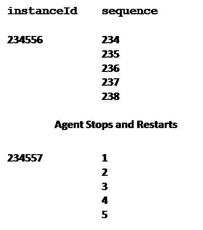
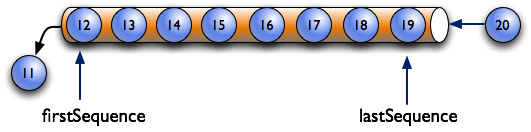
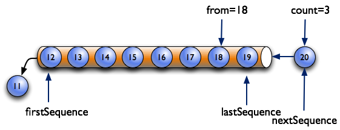

## Agent

The MTConnect Standard specifies the minimum functionality of the {{term(agent)}}. The functionality is as follows:

* Provides store and forward messaging middleware service.
* Provides a key-value information storage and retrivial service.
* Implements the ReST API for the MTConnect Standard.
  * {{term(device)}} metadata.
  * {{termplural(observation)}} collected by the agent.
  * {{termplural(asset)}} colleted by the agent.

There are three types of information stored by an {{term(agent)}} that **MAY** be published in a {{term(response document)}}.  These are as follows:

* {{term(equipment metadata)}} soecified in {{cite(MTCPart2)}}.
* {{term(streaming data)}} provides the {{termplural(observation)}} specified in {{cite(MTCPart2)}}.
* {{termplural(mtconnect asset)}} specified in {{cite(MTCPart40)}}.

### Agent Instance ID

Every time the {{term(agent)}} sets the {{term(observation)}} sequence number to `1`, the MTConnect Agent **MUST** set the {{term(agent)}} {{term(instanceid)}} to a unique value. 

### Storage of Equipment Metadata for a Piece of Equipment

An {{term(agent)}} **MUST** be capable of publishing {{term(equipment metadata)}} for the {{term(agent)}} and each piece of equipment.  {{term(equipment metadata)}} is specified in {{cite(MTCPart2)}}.

### Storage of Streaming Data

The {{term(agent)}} **MUST** assign sequence numbers of {{termplural(observation)}} on order of arival.

#### Management of Streaming Data Storage

The {{term(agent)}} **MUST**, at a minimum, store {{termplural(observation)}} using a first-in-first-out pattern. The {{term(buffer)}} will remove the oldest {{termplural(observation)}} when the buffer is full and a new {{term(observation)}} arrives.

In {{figure(first-in-first-out-buffer-management)}}, the maximum number of {{termplural(observation)}} that can be stored in the {{term(buffer)}} of the {{term(agent)}} is 8.  The {{term(bufffersize)}} in the header reports the maximum number of {{termplural(observation)}}.  This example illustrates that when the {{term(buffer)}} fills up, the oldest piece of data falls out the other end.

> Note: As an implementation suggestion, the {{term(buffer)}} should be sized large enough to provide a continuous stream of {{termplural(observations)}}.  The implementer should also consider the impact of a temporary loss of communications when determining the size for the {{term(buffer)}}.  A larger {{term(buffer)}} will allow more time to reconnect to an {{term(agent)}} without losing data.

#### Sequence Numbers

In an {{term(agent)}}, each occurrence of an {{term(observation)}} in the {{term(buffer)}} will be assigned a monotonically increasing unsigned 64-bit integer ({{term(sequence number)}}) when it arrives. The first sequence number **MUST** be `1`.

The {{term(sequence number)}} for each {{term(observation)}} **MUST** be unique for an instance of an {{term(agent)}} identified by an {{term(iinstanceid)}}.

{{figure(instanceid-and-sequence)}} illustrates the changing of the {{term(instanceid)}} when an {{term(agent)}} resets the sequence number to `1`.

{{figure(identifying-the-range-of-data-with-firstsequence-and-lastsequence)}} shows two additional pieces of information defined for an {{term(agent)}}:

* {{term(firstsequence)}} -- the oldest piece of data contained in the {{term(buffer)}}; i.e., the next piece of data to be moved out of the {{term(buffer)}}

* {{term(lastsequence)}} -- the newest data added to the {{term(buffer)}}

{{term(firstsequence)}} and {{term(lastsequence)}} provide the range of values usable in the ReST API.

The {{term(sample request)}} uses the ({{term(from query)}}) that **MUST** be included in the {{term(response document)}} and the total number ({{term(count model)}}) of pieces of data that {{latex(\SHOULD)}} be included in that document.

In {{figure(identifying-the-range-of-data-with-from-and-count)}}, the request specifies the {{termplural(observation)}} start at {{term(sequence number)}} `15` ({{term(from query)}}) and includes a total of three items ({{term(count model)}}).

{{FloatBarrier}}

Once a {{term(response)}} to a {{term(request)}} has been completed, the value of {{term(nextsequence)}} will be established.  {{term(nextsequence)}} is the {{term(sequence number)}} of the next piece of data available in the {{term(buffer)}}.  In the example in {{figure(identifying-the-range-of-data-with-from-and-count)}}, the next {{term(sequence number)}} ({{term(nextsequence)}}) will be 18.

As shown in {{figure(identifying-the-range-of-data-with-nextsequence-and-lastsequence)}}, the combination of {{term(from query)}} and {{term(count model)}} defined by the {{term(request)}} indicates a {{term(sequence number)}} for data that is beyond that which is currently in the {{term(buffer)}}.  In this case, {{term(nextsequence)}} is set to a value of {{term(lastsequence)}} + 1.

{{FloatBarrier}}

#### Buffer Data Structure

The information in the {{term(buffer)}} of an {{term(agent)}} can be thought of as a four-column table of data.  Each column in the table represents:

* The first column is the {{term(sequence number)}} associated with each {{term(data entity)}} - {{term(sequence)}}.

* The second column is the time that the data was published by a piece of equipment.  This time is defined as the {{term(timestamp)}} associated with that {{term(data entity)}}.  See {{sect(Time Stamp))}} for details on {{term(timestamp)}}.

* The third column, {{term(dataitemid)}}, refers to the identity of {{termplural(observation)}} as they will appear in the {{term(mtconnectstreams response document)}}.  See *Section 5* of {{cite(MTCPart3))}} for details on {{term(dataitemid)}} for a {{term(observation)}} and how that identify relates to the {{term(id)}} attribute of the corresponding {{term(data entity)}} in the {{termplural(device information model)}}.

* The fourth column is the value associated with each {{term(observation)}}.

{{figure(data-storage-concept)}} is an example demonstrating the concept of how data may be stored in an {{term(agent)}}:

[Data Storage Concept](figures/data-storage-concept.png "data-storage-concept")

{{FloatBarrier}}

The storage mechanism for the data, the internal representation of the data, and the implementation of the {{term(agent)}} itself is not part of the MTConnect Standard.  The implementer can choose both the amount of data to be stored in the {{term(agent)}} and the mechanism for how the data is stored.  The only requirement is that an {{term(agent)}} publish the {{termplural(response document)}} in the required format.  

#### Time Stamp

Each {{term(observation)}} **SHOULD** have a {{term(timestamp)}} from the data source when it was measured or determined.  If no {{term(timestamp)}} is given, the {{term(agent)}} **MUST** provide a {{term(timestamp) for the {{term(observation)}}.

{{term(timestamp)}} **MUST** be reported in UTC (Coordinated Universal Time) timezone in ISO 8601 format: e.g., "2010-04-01T21:22:43Z".

Applications should use the {{term(observation)}}'s {{term(timestamp)}} for ordering as opposed to {{term(sequence number)}}.

> Note: The {{term(timestamp)}} provides the best estimate of the time that the data was observed.

If two pieces of information are observed at the exact same time, they **MUST** be reported with the same value for {{term(timestamp)}}.  Likewise, all information that is recorded in the {{term(buffer)}} with the same value for {{term(timestamp)}} should be interpreted as having been recorded at the time.

#### Recording Occurrences of Streaming Data

An {{term(agent)}} **MUST** record data in the {{term(buffer)}} each time the value for that specific piece of data changes.  If a piece of equipment publishes multiple occurrences of a piece of data with the same value, the {{term(agent)}} {{latex(\MUSTNOT)}} record multiple occurrence for that {{term(data entity)}}.

> Note:	There is one exception to this rule.  Some {{termplural(data entity)}} may be defined with a {{term(representation)}} attribute value of {{term(discrete representation)}} (See *Section 7.2.2.12* of {{latex(\citetitle{MTCPart2})}} for details on {{term(representation)}}.)  In this case, each occurrence of the data represents a new and unique piece of information.  The {{term(agent)}} **MUST** then record each occurrence of the {{term(data entity)}} that is published by a piece of equipment.

The value for each piece of information reported by an {{term(agent)}} must be considered by a client software application to be valid until such a time that another occurrence of that piece of information is published by the {{term(agent)}}.

#### Maintaining Last Value for Data Entities

An {{term(agent)}} **MUST** retain a copy of the last available value associated with each {{term(data entity)}} known to the {{term(agent)}}; even if an occurrence of that {{term(data entity)}} is no longer in the {{term(buffer)}}.  This function allows an {{term(agent)}} to provide a software application a view of the last known value for each {{term(data entity)}} associated with a piece of equipment.

The {{term(agent)}} **MUST** also retain a copy of the last value associated with each {{term(data entity)}} that has flowed out of the {{term(buffer)}}.  This function allows an {{term(agent)}} to provide a software application a view of the last known value for each {{term(data entity)}} associated with a {{term(current request)}} with an {{term(at query)}} parameter in the {{term(query http request)}} portion of its {{term(http request line)}} (See {{latex(\sect{Current Request Implemented Using HTTP})}} for details on {{term(current request)}}).

{{newpage}}

#### Unavailability of Data

An {{term(agent)}} **MUST** maintain a list of {{termplural(data entity)}} that **MAY** be published by each piece of equipment providing information to the {{term(agent)}}.   This list of {{termplural(data entity)}} is derived from the {{term(equipment metadata)}} stored in the {{term(agent)}} for each piece of equipment.

Each time an {{term(agent)}} is restarted, the {{term(agent)}} **MUST** place an occurrence of every {{term(data entity)}} in the {{term(buffer)}}.  The value reported for each of these {{termplural(data entity)}} **MUST** be set to {{term(unavailable value)}} and the {{term(timestamp)}} for each **MUST** be set to the time that the last piece of data was collected by the {{term(agent)}} prior to the restart.

If at any time an {{term(agent)}} loses communications with a piece of equipment, or the {{term(agent)}} is unable to determine a valid value for all, or any portion, of the {{termplural(data entity)}} published by a piece of equipment, the {{term(agent)}} **MUST** place an occurrence of each of these {{termplural(data entity)}} in the {{term(buffer)}} with its value set to {{term(unavailable value)}}.  This signifies that the value is currently indeterminate and no assumptions of a valid value for the data is possible.

Since an {{term(agent)}} may receive information from multiple pieces of equipment, it **MUST** consider the validity of the data from each of these pieces of equipment independently.

There is one exception to the rules above.  Any {{term(data entity)}} that is constrained to a constant data value **MUST** be reported with the constant value and the {{term(agent)}} {{latex(\MUSTNOT)}} set the value of that {{term(data entity)}} to {{term(unavailable value)}}.

> Note:	The schema for the {{termplural(device information model)}} (defined in {{latex(\citetitle{MTCPart2})}}) defines how the value reported for an individual piece of data may be constrained to one or more specific values.

#### Persistence and Recovery

The implementer of an {{term(agent)}} must decide on a strategy regarding the storage of {{term(streaming data)}} in the {{term(buffer)}} of the {{term(agent)}}.

In the simplest form, an {{term(agent)}} can hold the {{term(buffer)}} information in volatile memory where no data is persisted when the {{term(agent)}} is stopped.  In this case, the {{term(agent)}} **MUST** update the value for {{term(instanceid)}} when the {{term(agent)}} restarts to indicate that the {{term(agent)}} has begun to collect a new set of data.

If the implementation of an {{term(agent)}} provides a method of persisting and restoring all or a portion of the information in the {{term(buffer)}} of the {{term(agent)}} ({{termplural(sequence number)}}, {{termplural(time stamp)}}, identify, and values), the {{term(agent)}} {{latex(\MUSTNOT)}} change the value of the {{term(instanceid)}} when the {{term(agent)}} restarts.  This will indicate to a client software application that it does not need to reset the value for {{term(nextsequence)}} when it requests the next set of data from the {{term(agent)}}.

When an implementer chooses to provide a method to persist the information in an {{term(agent)}}, they may choose to store as much data as is practical in a recoverable storage system.  Such a method may also include the ability to store historical information that has previously been pushed out of the {{term(buffer)}}.

#### Heartbeat

An {{term(agent)}} **MUST** provide a function that indicates to a client application that the HTTP connection is still viable during times when there is no new data available to report in a {{term(response document)}}.  This function is defined as {{term(heartbeat)}}.

{{term(heartbeat)}} represents the amount of time after a {{term(response document)}} has been published until a new {{term(response document)}} **MUST** be published, even when no new data is available.

See {{latex(\sect{Query Portion of the HTTP Request Line for a Sample Request})}} for more details on configuring the {{term(heartbeat)}} function.

#### Data Sets
 {#sec:Data Sets}

See {{latex(\citetitle{MTCPart3})}} *Section Part 3: DataItem with representation of DATA\textunderscore SET* for management of {{termplural(data set)}}.

### Storage of Documents for MTConnect Assets

An {{term(agent)}} also stores information associated with {{termplural(mtconnect asset)}}.

When a piece of equipment publishes a document that represents information associated with an {{term(mtconnect asset)}}, an {{term(agent)}} stores that document in a {{term(buffer)}}.  This {{term(buffer)}} is called the {{termplural(asset buffer)}}.  The document is called an {{term(asset document)}}.

The {{termplural(asset buffer)}} **MUST** be a separate {{term(buffer)}} from the one where the {{term(streaming data)}} is stored.

The {{term(asset document)}} that is published by the piece of equipment **MUST** be organized based upon one of the applicable {{termplural(asset information model)}} defined in one of the Parts 4.x of the MTConnect Standard.

An {{term(agent)}} will only retain a limited number of {{termplural(asset document)}} in the {{termplural(asset buffer)}}.  The {{termplural(asset buffer)}} functions similar to the {{term(buffer)}} for {{term(streaming data)}}; i.e., when the {{termplural(asset buffer)}} is full, the oldest {{term(asset document)}} is pushed from the {{term(buffer)}}.

{{figure(first-in-first-out-asset-buffer-management)}} demonstrates the oldest {{term(asset document)}} being pushed from the {{termplural(asset buffer)}} when a new {{term(asset document)}} is added and the {{termplural(asset buffer)}} is full:

{{FloatBarrier}}

Within an {{term(agent)}}, the management of {{termplural(asset document)}} behave like a key/value storage in a database.  In the case of {{termplural(mtconnect asset)}}, the key is an identifier for an Asset (see details on {{term(assetid)}} in {{latex(\citetitle{MTCPart40})}}) and the value is the {{term(asset document)}} that was published by the piece of equipment. 

{{figure(relationship-between-assetid-and-stored-asset-documents)}} demonstrates the relationship between the key ({{term(assetid)}}) and the stored {{termplural(asset document)}}:

{{FloatBarrier}}

> Note:  The key ({{term(assetid)}}) is independent of the order of the {{termplural(asset document)}} stored in the {{termplural(asset buffer)}}.

When an {{term(agent)}} receives a new {{term(asset document)}} representing an {{term(mtconnect asset)}}, it must determine whether this document represents an {{term(mtconnect asset)}} that is not currently represented in the {{termplural(asset buffer)}} or if the document represents new information for an {{term(mtconnect asset)}} that is already represented in the {{termplural(asset buffer)}}.  When a new {{term(asset document)}} is received, one of the following **MUST** occur:

* If the {{term(asset document)}} represents an {{term(mtconnect asset)}} that is not currently represented in the {{termplural(asset buffer)}}, the {{term(agent)}} **MUST** add the new document to the front of the {{termplural(asset buffer)}}.  If the {{termplural(asset buffer)}} is full, the oldest {{term(asset document)}} will be removed from the {{termplural(asset buffer)}}.

* If the {{term(asset document)}} represents an {{term(mtconnect asset)}} that is already represented in the {{termplural(asset buffer)}}, the {{term(agent)}} **MUST** remove the existing {{term(asset document)}} representing that {{term(mtconnect asset)}} from the {{termplural(asset buffer)}} and add the new {{term(asset document)}} to the front of the {{termplural(asset buffer)}}.  

The MTConnect Standard does not specify the maximum number of {{termplural(asset document)}} that may be stored in the {{termplural(asset buffer)}}; that limit is determined by the implementation of a specific {{term(agent)}}.  The number of {{termplural(asset document)}} that may be stored in an {{term(agent)}} is defined by the value for {{term(assetbuffersize)}} (See {{latex(\sect{Document Header})}} for more information on {{term(assetbuffersize)}}.).  A value of 4,294,967,296 or $2^{32}$ can be provided for {{term(assetbuffersize)}} to indicate unlimited storage.

There is no requirement for an {{term(agent)}} to provide persistence for the {{termplural(asset document)}} stored in the {{termplural(asset buffer)}}.  If an {{term(agent)}} should fail, all {{termplural(asset document)}} stored in the {{termplural(asset buffer)}} **MAY** be lost.  It is the responsibility of the implementer to determine if {{termplural(asset document)}} stored in an {{term(agent)}} may be restored or if those {{termplural(asset document)}} are retained by some other software application.

Additional details on how an {{term(agent)}} organizes and manages information associated with {{termplural(mtconnect asset)}} are provided in {{latex(\citetitle{MTCPart40})}}. 

