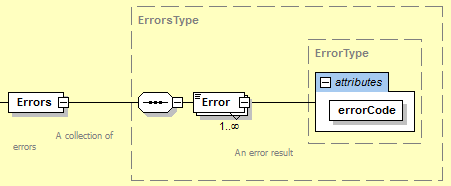

# Error Information Model
 {#sec:Error Information Model}

The {{term(error information model)}} establishes the rules and terminology that describes the {{term(response document)}} returned by an {{term(agent)}} when it encounters an error while interpreting a {{term(request)}} for information from a client software application or when an {{term(agent)}} experiences an error while publishing the {{term(response)}} to a {{term(request)}} for information.      

An {{term(agent)}} provides the information regarding errors encountered when processing a {{term(request)}} for information by publishing an {{term(mtconnecterrors response document)}} to the client software application that made the {{term(request)}} for information.

## MTConnectError Response Document

The {{term(mtconnecterrors response document)}} is comprised of two sections: {{term(header)}} and {{term(errors)}}.

The {{term(header)}} section contains information defining the creation of the document and the data storage capability of the {{term(agent)}} that generated the document.  (See {{latex(\sect{Header for MTConnectError})}})

The {{term(errors)}} section of the {{term(mtconnecterrors response document)}} is a {{term(structural element)}} that organizes {{termplural(data entity)}} describing each of the errors reported by an {{term(agent)}}.   

### Structural Element for MTConnectError

{{termplural(structural element)}} are {{term(xml)}} elements that form the logical structure for an {{term(xml)}} document.  The {{term(mtconnecterrors response document)}} has only one {{term(structural element)}}.  This {{term(structural element)}} is {{term(errors)}}.   {{term(errors)}} is an {{term(xml)}} container element that organizes the information and data associated with all errors relevant to a specific {{term(request)}} for information.

The following {{term(xml schema)}} represents the structure of the {{term(errors)}} {{term(xml)}} element.

{{latex(input

> Note:	When compatibility with Version 1.0.1 and earlier of the MTConnect Standard is required for an implementation, the {{term(mtconnecterrors response document)}} contains only a single {{term(error)}} {{term(data entity)}} and the {{term(errors)}} {{term(structural element)}} {{latex(\MUSTNOT)}} appear in the document. 

{{latex(\clearpage)}}

### Error Data Entity

When an {{term(agent)}} encounters an error when responding to a {{term(request)}} for information from a client software application, the information describing the error(s) is reported as a {{term(data entity)}} in an {{term(mtconnecterrors response document)}}.   {{termplural(data entity)}} are organized in the {{term(errors)}} {{term(xml)}} container.

There is only one type of {{term(data entity)}} defined for an {{term(mtconnecterrors response document)}}.  That {{term(data entity)}} is called {{term(error)}}.

The following is an illustration of the structure of an {{term(xml)}} document demonstrating how {{term(error)}} {{termplural(data entity)}} are reported in an {{term(mtconnecterrors response document)}}:

~~~~xml
<MTConnectError}>
  <Header/>
  <Errors>
    <Error/>
    <Error/>
    <Error/>
  </Errors>
</MTConnectError}>    
~~~~
{: caption="Example of Error in MTConnectError" label="error-in mtconnecterror" }

The {{term(errors)}} element **MUST** contain at least one {{term(data entity)}}.  Each {{term(data entity)}} describes the details for a specific error reported by an {{term(agent)}} and is represented by the {{term(xml)}} element named {{term(error)}}.

{{term(error)}} {{term(xml)}} elements **MAY** contain both attributes and {{term(cdata)}} that provide details further defining a specific error.  The {{term(cdata)}} **MAY** provide the complete text provided by an {{term(agent)}} for the specific error.  

#### XML Schema Structure for Error{{latex(\mbox)}}{}

The {{term(xml schema)}} in {{figure(error-schema-diagram)}} represents the structure of an {{term(error)}} {{term(xml)}} element showing the attributes defined for {{term(error)}}.

#### Attributes for Error{{latex(\mbox)}}{}

{{term(error)}} has one attribute.  {{latex(\tbl{attributes-for-error})}} defines this attribute that provides additional information for an {{term(error)}} {{term(xml)}} element.   

{{latex(input

#### Values for errorCode

There is a limited vocabulary defined for {{term(errorcode)}}.  The value returned for {{term(errorcode)}} **MUST** be one of the following:

{{latex(\newpage)}}

{{latex(input

#### CDATA for Error{{latex(\mbox)}}{}

The {{term(cdata)}} for {{term(error)}} contains a textual description of the error and any additional information an {{term(agent)}} is capable of providing regarding a specific error.  The {{term(valid data value)}} returned for {{term(error)}} **MAY** be any text string.

### Examples for MTConnectError

~~~~xml
<?xml version="1.0" encoding="UTF-8"?>
  <MTConnectError
  xmlns="urn:mtconnect.org:MTConnectError:1.4"
  xmlns:xsi=http://www.w3.org/2001/XMLSchema-instance
  xsi:schemaLocation="urn:mtconnect.org:MTConnectError
    :1.4/schemas/MTConnectError_1.4.xsd">
  <Header creationTime="2010-03-12T12:33:01Z"
    sender="MyAgent" version="1.4.1.10" 
    bufferSize="131000" instanceId="1383839" />
  <Errors>
    <Error errorCode="OUT_OF_RANGE" >Argument was 
      out of range</Error>
    <Error errorCode="INVALID_XPATH" >Bad 
      path</Error>
  </Errors>
</MTConnectError>
~~~~
{: caption="Example of structure for MTConnectError" label="structure-for-mtconnecterror"}

{{latex(\lst{structure-for-mtconnecterror-when-backward-compatibility-is-required})}} is an example demonstrating the structure of an {{term(mtconnecterrors response document)}} when backward compatibility with Version 1.0.1 and earlier of the MTConnect Standard is required.  In this case, the {{term(document body)}} contains only a single {{term(error)}} {{term(data entity)}} and the {{term(errors)}} {{term(structural element)}} {{latex(\MUSTNOT)}} appear in the document. 

~~~~xml
<?xml version="1.0" encoding="UTF-8"?>
<MTConnectError
  xmlns="urn:mtconnect.org:MTConnectError:1.1"
  xmlns:xsi=http://www.w3.org/2001/XMLSchema-instance
  xsi:schemaLocation="urn:mtconnect.org:MTConnectError
    :1.1/schemas/MTConnectError_1.1.xsd">
  <Header creationTime="2010-03-12T12:33:01Z"
    sender="MyAgent" version="1.1.0.10" 
    bufferSize="131000" instanceId="1383839" />
  <Error errorCode="OUT_OF_RANGE" >Argument was out 
    of range</Error>
</MTConnectError>
~~~~
{: caption="Example of structure for MTConnectError when backward compatibility is required" label="structure-for-mtconnecterror-when-backward-compatibility-is-required"}

