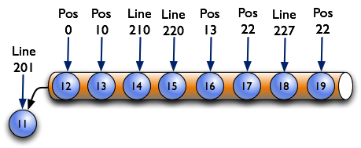
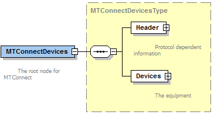
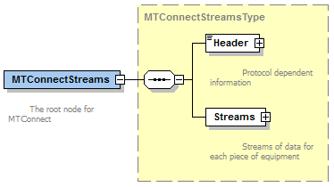
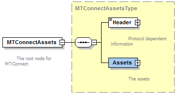

## Response Documents

> WS: We should consider removing this section. The models are defined in the other sections. This is useless.

{{termplural(response document)}} are electronic documents generated by an {{term(agent)}} in response to a {{term(request)}} for data. 

The {{termplural(response document)}} defined in the MTConnect Standard are:

* {{term(mtconnectdevices response document)}}:  An electronic document that contains the information published by an {{term(agent)}} describing the data that can be published by one or more piece(s) of equipment.  The structure of the {{term(mtconnectdevices response document)}} document is based upon the requirements defined by the {{termplural(device information model)}}.  See {{cite(MTCPart2)}} for details on this information model.

* {{term(mtconnectstreams response document)}}:  An electronic document that contains the information published by an {{term(agent)}} that contains the data that is published by one or more piece(s) of equipment.  The structure of the {{term(mtconnectstreams response document)}} document is based upon the requirements defined by the {{term(streams information model)}}.  See {{cite(MTCPart3)}} for details on this information model.

* {{term(mtconnectassets response document)}}:  An electronic document that contains the information published by an {{term(agent)}} that **MAY** include one or more {{termplural(asset document)}}.  The structure of the {{term(mtconnectassets response document)}} document is based upon the requirements defined by the {{termplural(asset information model)}}.  See {{cite(MTCPart40)}} for details on this information model.

* {{term(mtconnecterrors response document)}}:  An electronic document that contains the information provided by an {{term(agent)}} when an error has occurred when trying to respond to a {{term(request)}} for data.  The structure of the {{term(mtconnecterrors response document)}} is based upon the requirements defined by the {{term(error information model)}}.  See {{sect(Error Information Model)}} of this document for details on this information model.

{{termplural(response document)}} may be represented by any document format supported by an {{term(agent)}}.  No matter what document format is used to structure these documents, the requirements for representing the data and other information contained in those documents **MUST** adhere to the requirements defined in the {{termplural(information model)}} associated with each document.

## Semantic Data Models

> Note: This section is redundant and useless.

A {{term(semantic data model)}} is a software engineering method for representing data where the context and the meaning of the data is constrained and fully defined.

Each of the {{termplural(semantic data model)}} defined by the MTConnect Standard include:

* The types of information that may be published by a piece of equipment,

* The meaning of that information and units of measure, if applicable,

* Structural information that defines how different pieces of information relate to each other, and

* Structural information that defines how the information relates to where the information was measured or generated by the piece of equipment.

As described previously, the content of the {{termplural(response document)}} provided by an {{term(agent)}} are each defined by a specific {{term(semantic data model)}}.  The details for the {{term(semantic data model)}} used to define each of the {{termplural(response document)}} are detail as follows:

* {{term(mtconnectdevices response document)}}:  {{latex(\citetitle{MTCPart2})}}. 

* {{term(mtconnectstreams response document)}}:  {{latex(\citetitle{MTCPart3})}}.

* {{term(mtconnectassets response document)}}:  {{latex(\citetitle{MTCPart40})}} and its sub-Parts.

* {{term(mtconnecterrors response document)}}:  {{cite(MTCPart1)}}, {{sect(Error Information Model)}}.

The MTConnect {{termplural(semantic data model)}} allows the communications of information with a full definition of the meaning and context relative to the piece of equipment.

## Request/Response Information Exchange

The transfer of information between an {{term(agent)}} and a client software application is based on a {{term(requestresponse)}} information exchange approach. A client software application requests specific information from an {{term(agent)}}. An {{term(agent)}} responds to the {{term(request)}} by publishing a {{term(response document)}}.

In normal operation, there are four types of {{termplural(mtconnect request)}} that can be issued by a client software application that will result in different {{termplural(response)}} by an {{term(agent)}}.  These {{termplural(request)}} are:

* {{term(probe request)}}-- A client software application requests the {{term(equipment metadata)}} for each piece of equipment that **MAY** publish information through an {{term(agent)}}.  The {{term(agent)}} publishes a {{term(mtconnectdevices response document)}} that contains the requested information.  A {{term(probe request)}} is represented by the term {{term(probe httprequest)}} in a {{term(request)}} from a client software application.

* {{term(current request)}} -- A client software application requests the current value for each of the data types that have been published from a piece(s) of equipment to an {{term(agent)}}.  The {{term(agent)}} publishes a {{term(mtconnectstreams response document)}} that contains the requested information.  A {{term(current request)}} is represented by the term {{term(current httprequest)}} in a {{term(request)}} from a client software application.

* {{term(sample request)}} -- A client software application requests a series of data values from the {{term(buffer)}} in an {{term(agent)}} by specifying a range of {{termplural(sequence number)}} representing that data.  The {{term(agent)}} publishes a {{term(mtconnectstreams response document)}} that contains the requested information.  A {{term(sample request)}} is represented by the term {{term(sample httprequest)}} in a {{term(request)}} from a client software application.

* {{term(asset request)}} -- A client software application requests information related to {{termplural(mtconnect asset)}} that has been published to an {{term(agent)}}.  The {{term(agent)}} publishes an {{term(mtconnectassets response document)}} that contains the requested information.  An {{term(asset request)}} is represented by the term {{term(asset httprequest)}} in a {{term(request)}} from a client software application.

> Note: If an {{term(agent)}} is unable to respond to the request for information or the request includes invalid information, the {{term(agent)}} will publish an {{term(mtconnecterrors response document)}}. See {{latex(\sect{Error Information Model})}} for information regarding {{term(error information model)}}

The specific format for the {{term(request)}} for information from an {{term(agent)}} will depend on the {{term(protocol)}} implemented as part of the {{term(requestresponse)}} information exchange mechanism deployed in a specific implementation.  See {{latex(\sect{Protocol and Messaging})}}, {{term(protocol)}} for details on implementing the {{term(requestresponse)}} information exchange.

Also, the specific format for the {{termplural(response document)}} may also be implementation dependent.   See {{latex(\sect{XML Representation of Response Documents})}} for details on the format for the {{termplural(response document)}} encoded with {{term(xml)}}.

## Accessing Information from an Agent

Each of the {{termplural(request)}} defined for the {{term(requestresponse)}} information exchange requires an {{term(agent)}} to respond with a specific view of the information stored by the {{term(agent)}}.  The following describes the relationships between the information stored by an {{term(agent)}} and the contents of the {{termplural(response document)}}.

### Accessing Equipment Metadata from an Agent

The {{term(equipment metadata)}} associated with each piece of equipment that publishes information to an {{term(agent)}} is typically static information that is maintained by the {{term(agent)}}.  The MTConnect Standard does not define how the {{term(agent)}} captures or maintains that information.  The only requirement that the MTConnect Standard places on an {{term(agent)}} regarding this {{term(equipment metadata)}} is that the {{term(agent)}} properly store this information and then configure and publish a {{term(mtconnectdevices response document)}} in response to a {{term(probe request)}}.

All issues associated with the capture and maintenance of the {{term(equipment metadata)}} is the responsibility of the implementer of a specific {{term(agent)}}.

### Accessing Streaming Data from the Buffer of an Agent

There are two {{termplural(request)}} defined for the {{term(requestresponse)}} information exchange that require an {{term(agent)}} to provide different views of the information stored in the {{term(buffer)}} of the {{term(agent)}}.  These {{termplural(request)}} are {{term(current httprequest)}} and {{term(sample httprequest)}}.

The example in {{figure(example-buffer)}} demonstrates how an {{term(agent)}} interprets the information stored in the {{term(buffer)}} to provide the content that is published in different versions of the {{term(mtconnectstreams response document)}} based on the specific {{term(request)}} that is issued by a client software application.

In this example, an {{term(agent)}} with a {{term(buffer)}} that can hold up to eight (8) {{termplural(data entity)}}; i.e., the value for {{term(buffersize)}} is 8.  This {{term(agent)}} is collecting information for two pieces of data -- `Pos` representing a position and `Line` representing a line of logic or commands in a control program.  

In this {{term(buffer)}}, the value for {{term(firstsequence)}} is 12 and the value for {{term(lastsequence)}} is 19.  There are five (5) different values for `Pos` and three (3) different values for `Line`.  

{{FloatBarrier}}

If an {{term(agent)}} receives a {{term(sample request)}} from a client software application, the {{term(agent)}} **MUST** publish an {{term(mtconnectstreams response document)}} that contains a range of data values.  The range of values are defined by the {{term(from query)}} and {{term(count model)}} parameters that must be included as part of the {{term(sample request)}}.  If the value of {{term(from query)}} is 14 and the value of {{term(count model)}} is 5, the {{term(agent)}} **MUST** publish an {{term(mtconnectstreams response document)}} that includes five (5) pieces of data represented by {{termplural(sequence number)}} 14, 15, 16, 17, and 18 -- three (3) occurrences of `Line` and two (2) occurrences of `Pos`.  In this case, {{term(nextsequence)}} will also be returned with a value of 19.

Likewise, if the same {{term(agent)}} receives a {{term(current request)}} from a client software application, the {{term(agent)}} **MUST** publish an {{term(mtconnectstreams response document)}} that contains the most current information available for each of the types of data that is being published to the {{term(agent)}}.  In this case, the specific data that **MUST** be represented in the {{term(mtconnectstreams response document)}} is `Pos` with a value of 22 and a {{term(sequence number)}} of 19 and `Line` with a value of 227 and a {{term(sequence number)}} of 18.

There is also a derivation of the {{term(current request)}} that will cause an {{term(agent)}} to publish an {{term(mtconnectstreams response document)}} that contains a set of data relative to a specific sequence number.  The {{term(current request)}} **MAY** include an additional parameter called {{term(at query)}}.  When the {{term(at query)}} parameter, along with an {{term(instanceid)}}, is included as part of a {{term(current request)}}, an {{term(agent)}} **MUST** publish an {{term(mtconnectstreams response document)}} that contains the most current information available for each of the types of {{termplural(data entity)}} that are being published to the {{term(agent)}} that occur immediately at or before the {{term(sequence number)}} specified with the {{term(at query)}} parameter.

For example, if the {{term(request)}} is `current?at=15`, an {{term(agent)}} **MUST** publish a {{term(mtconnectstreams response document)}} that contains the most current information available for each of the {{termplural(data entity)}} that are stored in the {{term(buffer)}} of the {{term(agent)}} with a {{term(sequence number)}} of 15 or lower.  In this case, the specific data that **MUST** be represented in the {{term(mtconnectstreams response document)}} is `Pos` with a value of 10 and a {{term(sequence number)}} of 13 and `Line` with a value of 220 and a {{term(sequence number)}} of 15.

If a {{term(current httprequest)}} {{term(request)}} is received for a {{term(sequence number)}} of 11 or lower, an {{term(agent)}} **MUST** return an {{term(outofrange value)}} {{term(mtconnecterrors response document)}}.  The same {{term(http error message)}} **MUST** be given if a {{term(sequence number)}} is requested that is greater than the end of the {{term(buffer)}}.  See {{latex(\sect{Error Information Model})}} for more information on {{term(mtconnecterrors response document)}}.

### Accessing MTConnect Assets Information from an Agent

When an {{term(agent)}} receives an {{term(asset request)}}, the {{term(agent)}} **MUST** publish an {{term(mtconnectassets)}} document that contains information regarding the {{termplural(asset document)}} that are stored in the {{term(agent)}}.

See {{latex(\citetitle{MTCPart40})}} for details on {{termplural(mtconnect asset)}}, {{termplural(asset request)}}, and the {{term(mtconnectassets response document)}}.

# XML Representation of Response Documents

As defined in {{latex(\sect{XML Documents})}}, {{term(xml)}} is currently the only language supported by the MTConnect Standard for encoding {{termplural(response document)}}.

{{termplural(response document)}} must be valid and conform to the {{term(schema)}} defined in the {{term(semantic data model)}} defined for that document.  The {{term(schema)}} for each {{term(response document)}} **MUST** be updated to correlate to a specific version of the MTConnect Standard.  Versions, within a {{term(major)}} version, of the MTConnect Standard will be defined in such a way to best maintain backwards compatibility of the {{termplural(semantic data model)}} through all {{term(minor)}} revisions of the Standard.  However, new {{term(minor)}} versions may introduce extensions or enhancements to existing {{termplural(semantic data model)}}.

To be valid, a {{term(response document)}} must be well-formed; meaning that, amongst other things, each element has the required {{term(xml)}} *start-tag* and *end-tag* and that the document does not contain any illegal characters.  The validation of the document may also include a determination that required elements and attributes are present, they only occur in the appropriate location in the document, and they appear only the correct number of times.  If the document is not well-formed, it may be rejected by a client software application.  The {{term(semantic data model)}} defined for each {{term(response document)}} also specifies the elements and {{termplural(child element)}} that may appear in a document.  {{term(xml)}} elements may contain {{termplural(child element)}}, {{term(cdata)}}, or both.  The {{term(semantic data model)}} also defines the number of times each element and {{term(child element)}} may appear in the document.

Each {{term(response document)}} encoded using {{term(xml)}} consists of the following primary sections:

* {{term(xml)}} Declaration
* Root Element
* Schema and Namespace Declaration
* Document Header
* Document Body

The following will provide details defining how each of the {{termplural(response document)}} are encoded using {{term(xml)}}.

> Note: See {{latex(\sect{Terminology and Conventions})}} for the definition of {{term(xml)}} related terms used in the MTConnect Standard.

## Fundamentals of Using XML to Encode Response Documents

The MTConnect Standard follows industry conventions for formatting the elements and attributes included in an {{term(xml)}} document.  The general guidelines are as follows: 

* All element names **MUST** be specified in Pascal case (first letter of each word is capitalized). For example: `<PowerSupply/>`.

* The name for an attribute **MUST** be Camel case; similar to Pascal case, but the first letter will be lower case.  For example: `<MyElement nativeName="bob"/>` where `MyElement` is the {{term(element name)}} and {{term(nativename)}} is an attribute.

* All {{term(cdata)}} values that are defined with a limited or controlled vocabulary **MUST** be in upper case with an \_ (underscore) separating words.  For example: {{term(on value)}}, {{term(off value)}}, {{term(actual subtype)}}, and {{term(counterclockwise value)}}.

* The values provided for a date and/or a time **MUST** follow the W3C ISO 8601 format with an arbitrary number of decimals representing fractions of a second.  Refer to the following specification for details on the format for dates and times:  http://www.w3.org/TR/NOTE-datetime.

The format for the value describing a date and a time will be\\ YYYY-MM-DDThh:mm:ss.ffff. An example would be: 2017-01-13T13:01.213415Z.  

> Note:  Z refers to UTC/GMT time, not local time.

The accuracy and number of decimals representing fractions of a second for a {{term(timestamp)}} **MUST** be determined by the capabilities of the piece of equipment publishing information to an {{term(agent)}}.  All time values **MUST** be provided in UTC (GMT).

* {{term(xml)}} element names **MUST** be spelled out and abbreviations are not permitted.   See the exclusion below regarding the use of the suffix `Ref`.

* {{term(xml)}} attribute names {{latex(\SHOULD)}} be spelled out and abbreviations {{latex(\SHOULD)}} be avoided.  The exception to this rule is the use of {{term(id)}} when associated with an identifier.  See the exclusion below regarding the use of the suffix `Ref`.

* The abbreviation `Ref` for {{term(reference)}} is permitted as a suffix to element names of either a {{term(structural element)}} or a {{term(data entity)}} to provide an efficient method to associate information defined in another location in a {{term(data model)}} without duplicating that original data or structure.  See *Section 4.8* in {{latex(\citetitle{MTCPart2})}} for more information on {{term(reference)}}.
{{latex(\end{itemize})}}

## XML Declaration

The first section of a {{term(response document)}} encoded with {{term(xml)}} {{latex(\SHOULD)}} be the {{term(xml declaration)}}.  The declaration is a single element.

An example of an {{term(xml declaration)}} would be:  

~~~~xml
<?xml version="1.0" encoding="UTF-8"?>
~~~~
{: caption="Example of xml declaration" label="xml-declaration" start=""}

This element provides information regarding how the {{term(xml)}} document is encoded and the character type used for that encoding.  See the W3C website for more details on the {{term(xml)}} declaration. 

## Root Element

Every {{term(response document)}} **MUST** contain only one root element.  The MTConnect Standard defines {{term(mtconnectdevices)}}, {{term(mtconnectstreams)}}, {{term(mtconnectassets)}}, and {{term(mtconnecterror)}} as {{termplural(root element)}}. 

The {{term(root element)}} specifies a specific {{term(response document)}} and appears at the top of the document immediately following the {{term(xml declaration)}}.

### MTConnectDevices Root Element

{{term(mtconnectdevices)}} is the {{term(root element)}} for the {{term(mtconnectdevices response document)}}.  

{{FloatBarrier}}

{{term(mtconnectdevices)}} **MUST** contain two {{termplural(child element)}} - {{term(header)}} and {{term(devices)}}.  Details for {{term(header)}} are defined in {{latex(\sect{Document Header})}}.  

{{term(devices)}} is an {{term(xml)}} container that represents the {{term(document body)}} for an {{term(mtconnectdevices response document)}} -- see {{latex(\sect{Document Body})}}.  Details for the {{term(semantic data model)}} describing the contents for {{term(devices)}} are defined in {{latex(\citetitle{MTCPart2})}}.

{{term(mtconnectdevices)}} also has a number of attributes.  These attributes are defined in {{latex(\sect{Schema and Namespace Declaration})}}.

#### MTConnectDevices Elements

An {{term(mtconnectdevices)}} element **MUST** contain a {{term(header)}} and a {{term(devices)}} element.

| Element | Description | Occurrence |
|---------|-------------|------------|
| {{term(header)}} |An {{term(xml)}} container in an {{term(mtconnect response document)}} that provides information from an {term(agent)}} defining version information, storage capacity, and parameters associated with the data management within the {{term(agent)}}. | 1 | 
| {{term(devices)}} | The {{term(xml)}} container in an {{term(mtconnect response document)}} that provides the {{term(equipment metadata)}} for each of the pieces of equipment associated with an {{term(agent)}}. | 1 |

### MTConnectStreams Root Element

{{term(mtconnectstreams)}} is the {{term(root element)}} for the {{term(mtconnectstreams response document)}}.  

{{FloatBarrier}}

{{term(mtconnectstreams)}} **MUST** contain two {{termplural(child element)}} - {{term(header)}} and {{term(streams)}}.  

Details for {{term(header)}} are defined in {{latex(\sect{Document Header})}}.  

{{term(streams)}} is an {{term(xml)}} container that represents the {{term(document body)}} for a {{term(mtconnectstreams response document)}} -- see {{latex(\sect{Document Body})}}.  Details for the {{term(semantic data model)}} describing the contents for {{term(streams)}} are defined in {{latex(\citetitle{MTCPart3})}}.

{{term(mtconnectstreams)}} also has a number of attributes.  These attributes are defined in {{latex(\sect{Schema and Namespace Declaration})}}.

{{newpage}}

#### MTConnectStreams Elements{{latex(\mbox)}}{}

An {{term(mtconnectstreams)}} element **MUST** contain a {{term(header)}} and a {{term(streams)}} element.

> Note: Table was here

### MTConnectAssets Root Element

{{term(mtconnectassets)}} is the {{term(root element)}} for the {{term(mtconnectassets response document)}}. 

{{FloatBarrier}}

{{newpage}} 

{{term(mtconnectassets)}} **MUST** contain two {{termplural(child element)}} - {{term(header)}} and {{term(assets mtconnectassets)}}.

Details for {{term(header)}} are defined in {{latex(\sect{Document Header})}}.  

{{term(assets mtconnectassets)}} is an {{term(xml)}} container that represents the {{term(document body)}} for an {{term(mtconnectassets response document)}} -- see {{latex(\sect{Document Body})}}.  Details for the {{term(semantic data model)}} describing the contents for {{term(assets mtconnectassets)}} are defined in {{latex(\citetitle{MTCPart40})}}.

{{term(mtconnectassets)}} also has a number of attributes.  These attributes are defined in {{latex(\sect{Schema and Namespace Declaration})}}.

#### MTConnectAssets Elements{{latex(\mbox)}}{}

An {{term(mtconnectassets)}} element **MUST** contain a {{term(header)}} and an {{term(assets mtconnectassets)}} element.

> Note: Table was here

### MTConnectError Root Element

{{term(mtconnecterror)}} is the {{term(root element)}} for the {{term(mtconnecterrors response document)}}.

[MTConnectError Structure](figures/mtconnecterror-structure.png "mtconnecterror-structure")

{{FloatBarrier}}

{{term(mtconnecterror)}} **MUST** contain two {{termplural(child element)}} - {{term(header)}} and {{term(errors)}}. 

> Note:	When compatibility with *Version 1.0.1* and earlier of the MTConnect Standard is required for an implementation, the {{term(mtconnecterrors response document)}} contains only a single {{term(error)}} {{term(data entity)}} and the {{term(errors)}} {{term(child element)}} {{latex(\MUSTNOT)}} appear in the document. 

Details for {{term(header)}} are defined in {{latex(\sect{Document Header})}}.  

{{term(errors)}} is an {{term(xml)}} container that represents the {{term(document body)}} for an {{term(mtconnecterrors response document)}} -- See {{latex(\sect{Document Body})}}.  Details for the {{term(semantic data model)}} describing the contents for {{term(errors)}} are defined in {{latex(\sect{Error Information Model})}}.

{{term(mtconnecterror)}} also has a number of attributes.  These attributes are defined in {{latex(\sect{Schema and Namespace Declaration})}}.

#### MTConnectError Elements{{latex(\mbox)}}{}

An {{term(mtconnecterror)}} element **MUST** contain a {{term(header)}} and an {{term(errors)}} element.

> Table was here
